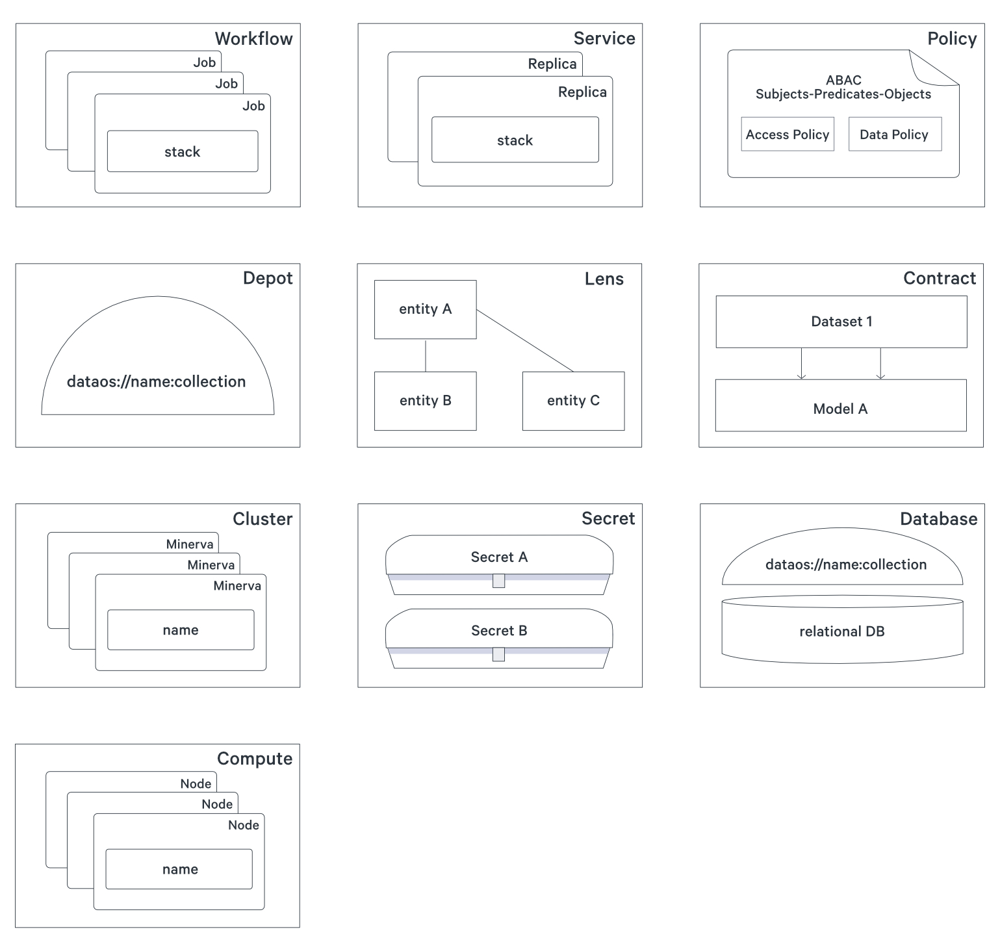

# Primitives/Resources

Primitives are atomic & logical units with their own life cycle which can be composed together, and also with other components and stacks, to act as the the building block of the system. They can be treated as artifacts which could be source controlled and managed using a version control system.

While working with DataOS, you will use these Primitives as *DataOS Resources*. In simple terms, the Primitives are created, updated or deleted by the user as *Resources*, via one of the two interfaces - CLI & GUI. The Resource manager & orchestration engine, *Poros*, will oversee and manage the entire life cycle of the resource.

Every Primitive can be conceived of as an abstraction which allows you to enumerate, in a declarative manner, specific goals and outcomes rather than go through the arduous process of defining the procedures of ‘how to reach those outcomes’.

<figcaption align = "center">Primitives of DataOS</figcaption>
 

Below, you can find the list of the Primitives currently used in DataOS, along with all their details:

## Cluster Resources

### **Policy**

Policy is a set of rules which governs the behaviour of a user(person or application/service). Broadly, you can create and manage two kinds of policies in DataOS - **Access Policy** & **Data Policy**. More info can be found on the
[Policy](Primitives%20Resources/Policy.md) page.

### **Depot**

Depots provide you with a uniform way to connect with the variety of data sources in your organisation. Depots abstract away the different protocols and complexities of the source systems to present a common taxonomy and method to address these source systems. To learn more about this primitive, you should check out the documentation on Depot and Depot Service. The
[Depot](../Integration%20&%20Ingestion/Depot.md) page elucidates the creation and use of depot and delineates the source specific details you need to declare to start working with DataOS.

If you are more interested in learning how the depots work under the hood and the philosophy behind their construction, refer to
[Depot Service [WIP]](Primitives%20Resources/Depot%20Service%20%5BWIP%5D.md).

### **Compute**

[Compute](Primitives%20Resources/Compute.md)

## Workspace Resources

### **Workflow**

Workflow is manifestation of a Directed Acyclic Graph which helps you to streamline and automate the process of working with big data. Any data ingestion or processing task in DataOS, irrespective of whether it’s batch or streaming data, is referred to as a *job*. 

Jobs are defined and executed through Workflow. To learn the details of Workflow, refer to
[Workflow](Primitives%20Resources/Workflow.md).

### **Service**

Service, as a DataOS Primitive, can be conceptualised as a long running process which is receiving or/and serving an API. For ingestion/processing of either event data or streaming data, Service should be the *primitive* of choice.

> 📖 Best Practice
>
>Streaming data could also be processed using Workflow, but you should opt for Service and therein, use the appropriate stack.

To learn how to work with Service, refer to
[Service](Primitives%20Resources/Service.md).

### **Secret**

Secrets allow you to store sensitive information such as passwords, tokens or keys. The users can leverage this information to gain access by simply using the name of the ‘Secret’ rather than having to use the sensitive information directly. This decoupling of the sensitive information from the other artifacts or components of DataOS allows the info-sec divisions to monitor and control access while minimising the risk of data leaks. To learn how you can create and use Secrets, refer to
[Secret](Primitives%20Resources/Secret.md).

### **Database**

[Database](Primitives%20Resources/Database.md)

### **Cluster**

[Cluster](Primitives%20Resources/Cluster.md)