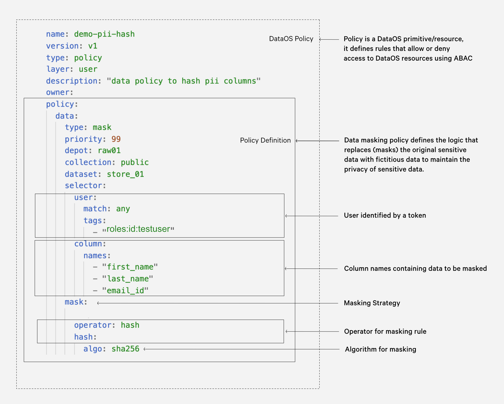

# Common Traits of DataOS Resources

While each Resource has its own specific attributes & usage, there are certain commonalities which are valid across the group. These are:

## Customizable

Some Resources also act as the extension points of the operating system. It allows developers to extend & customize the behaviour of the system to meet their domain-specific requirements. Each Resource has a pre-defined skeletal structure which allows it to interface between the user and the machine. This does not mean that Resources are rigid or immutable and do not allow for solving new use cases. Each Resource has customizations built into it. The fixed, core skeletal part of the structure of the Resource is there only to provide you with a consistent, predictable & seamless experience.

Each Resource also has its own hooks & extension limits. For instance, Stacks are the programming paradigms of DataOS, allowing you to add new libraries & functionalities without affecting the existing ones. You can read about customizability of every Resource on their respective pages.

## Composable & Interoperable

The system has been designed to be tightly integrated yet loosely coupled. Tight integration, in terms of interactions & shared data, makes the Resources interoperable and provides efficient performance. This allows you to schedule dependencies & sequencing of workloads with a seamless experience. At the same time, the API interface & contracts for the communication between Resources have been defined such that the Resources are loosely coupled, allowing them to operate and be managed autonomously. This ensures that the upgrades in one Resource do not affect the usage of another. It also makes the system modular & composable, allowing you to build data products and applications using just the Resources you need.

To illustrate the interoperability of the Resources, we have created a Secret with the name ‘s3-pos-rw’ to store the credentials for accessing an AWS S3 bucket.

```yaml
name: s3-pos-rw
version: v1
type: secret
secret:
  type: key-value-properties
  acl: rw
  data:
    accesskeyid: ${{access key id}}
    secretkey: ${{secret key}}
    awsaccesskeyid: ${{aws access key id}}
    awssecretaccesskey: ${{aws secret access key}}
```

Now this Resource can be called upon while deploying other Resources. Let’s use the above secret to create a Depot over the same S3 bucket.

```yaml
name: ${{name}}
version: v1
type: depot
tags:
 - ${{tag1}}
layer: user
depot: 
  type: S3
  description: ${{description}}
  spec:
    bucket: ${{bucket}}
    relativePath: ${{relative path}}
  external: true
# using the 'Secret' created & stored previously
  dataosSecrets:   
    - name: s3-pos-rw
      workspace: public
      keys: 
        - public_s3-pos-rw
```

Without the Secret Resource, data developer would have to fill up the credentials to the S3 bucket, or wait for the IT team to create it for them. Likewise you can refer & call both Depot & Stacks in the config files of *runnable Resources*, Workflow & Service.

Now let us take an example to illustrate the composability of the Resources. Say you want to ingest streaming data into a Lakehouse to later run OLAP use cases on top of it, or create data models after applying appropriate Governance policies. One way to do this is to compose the three Resources together: Service, Depot (Fastbase & Icebase), and Workflow.

You will learn about interoperability & composability of Resources with more extensive examples as you go through the documentation.

## Higher-level Abstraction

Each Resource acts as an abstraction that hides the underlying complexities of the system. User simply needs to mention the desired state without going into implementation details & procedural protocols. For instance, to apply a masking policy over a specific dataset, you can declaratively fill up the sections marked in the YAML given below.



<center><i>Data policy to mask personal identification information</i></center>

## Consistent Management

The configuration files for all Resources are written in the form of declarative YAMLs as key-value pairs. The CRUD operations & deployments are performed using interfaces with consistent developer experience for all Resources. You can understand this point in detail by going through the section on [CRUD operations & config files](../resources.md#crud-operations-on-dataos-resources).

### **Attributes of Resources**

In the below YAML, you can see the identifiers which are common across all Resources.

```yaml
name:     # name the Resource
version:  # Resource version
owner:    # id of the user creating the Resource
type:     # type of Resource (Depot, Secret, Workflow, and so on)
tags:     # provide tags in an array for easy discoverability & semantic enrichment
	- tag1
	- tag2
layer:    # user or system
description: # short description for the Resource you are creating
<resource-type>: 
# this is where the Resource specific properties begin
```

You can learn more about these attributes on the page: [Attributes of Resource section.](./resource_attributes.md)

### **Automation & Orchestration**

The DataOS orchestrator, Poros, along with a set of automation tools, automates various aspects of deployment, scaling & resource management for all DataOS Resources. Custom controllers built on the concept of Operator pattern allow the operating system to extend the default capabilities of clusters and automate new types of workloads.

## Lifespan

Different Resources are characterized by different life cycle. For example, a Workflow can be a single-time run job or a scheduled job which runs at a regular interval, while a Service can be a never-ending processing of streaming data. The lifespan of a Resource can extend beyond the duration of a single session or program execution. They are designed to persist across different instances of an application & session. They are stored as a ‘record of intent’ - once created, the underlying system will constantly work to ensure that the Resource exists and try to reconcile the current & desired states.

As an example, you can create a bucketing (masking) policy just once and keep using it throughout all applications, for all users, forever.

```yaml
name: test-phi-bucket-date
version: v1
type: policy
layer: user
description: "Data policy for dates"
owner: 
policy:
  data:
    type: mask
    priority: 40
    isArchived: false
    selector:
      user:
        match: any
        tags:
          - "roles:id:healthcaredatauser"
      column:
        tags:
          - "PHI.date"
    mask:
        operator: bucket_date
        bucket_date:
            precision : "quarter"
```

Whenever you need to use the same policy over a column of any other dataset, simply apply the tag `PHI.date` using the Metis UI (data catalog). The system stores the policy, and keeps it as a ‘record of intent’. So irrespective of how many times you login & logout, or which application you are using to access the data, the record persists and the policy gets applied.