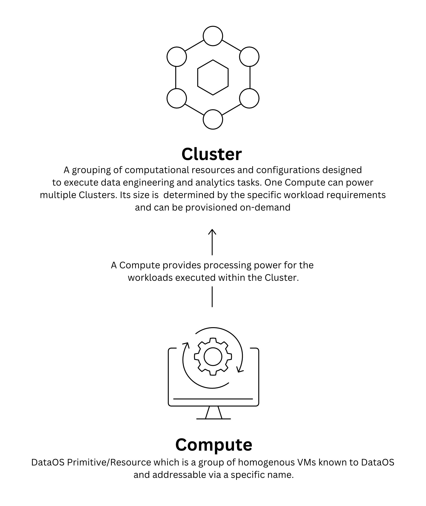
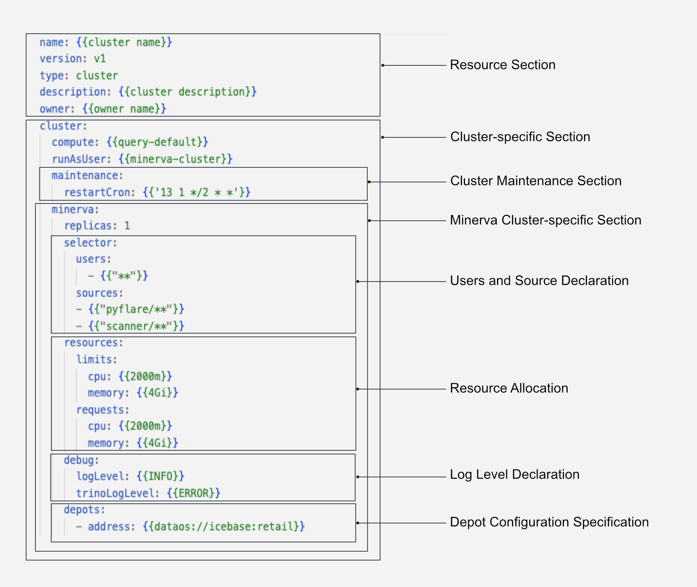
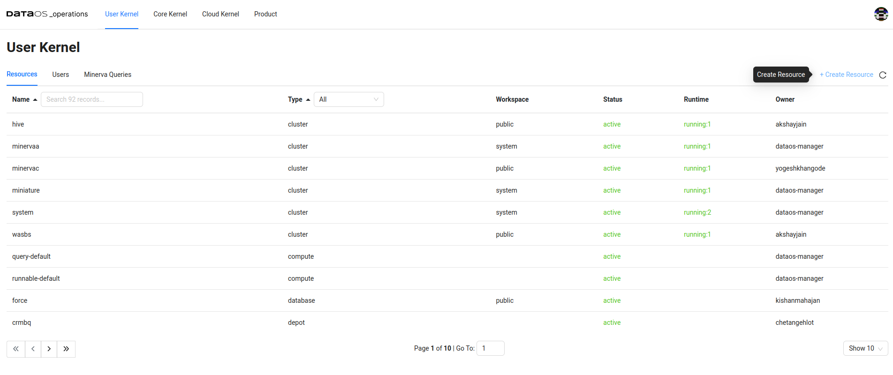
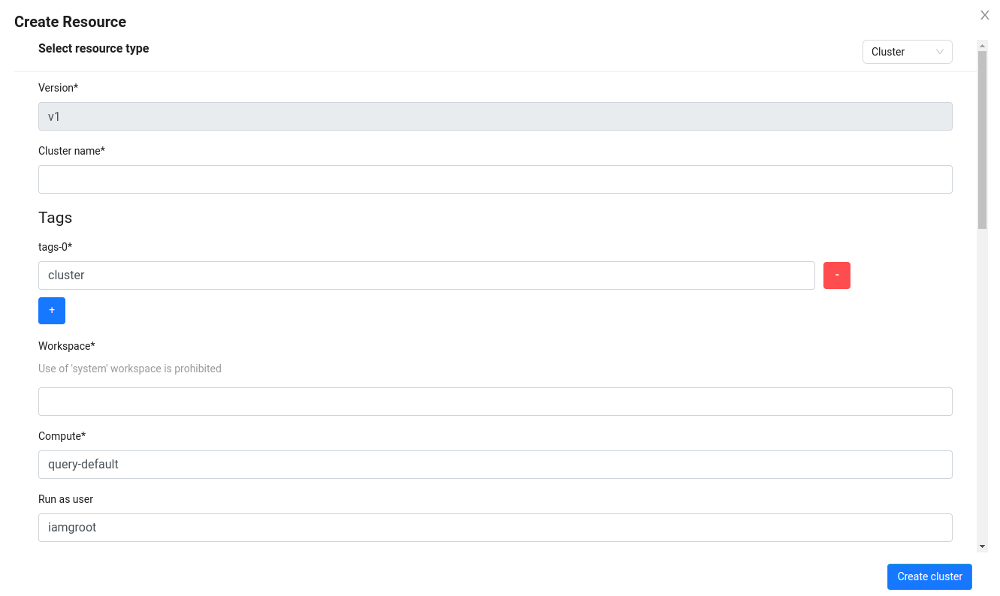
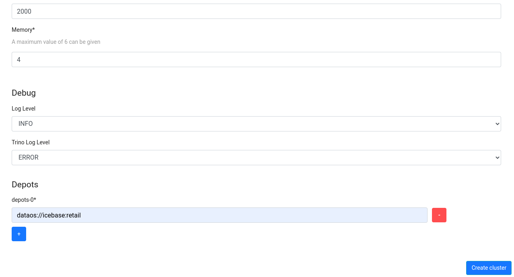
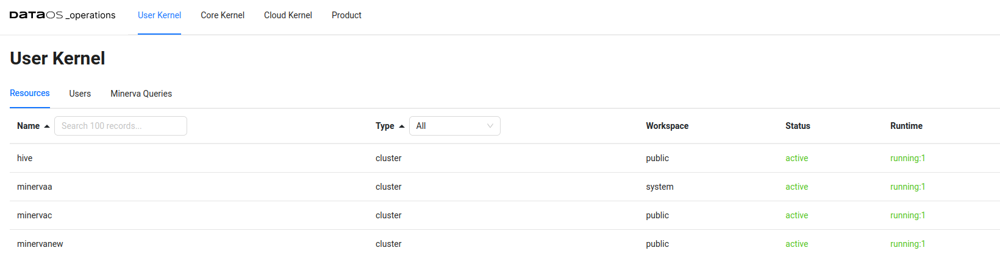

# Cluster

The Cluster Resource in DataOS is a fundamental [Resource](../resources.md) that encompasses a set of computational resources and configurations necessary for executing data engineering and analytics tasks. It relies on the [Compute](./compute.md) Resource, which provides the required processing power for the workloads executed within the Cluster. 

A Cluster Resource can be provisioned [on-demand](./cluster/on_demand_computing.md), allowing for efficient allocation of resources based on workload-specific requirements. This decoupling of computation and storage, facilitates flexibility, cost-efficiency and scalability.

<aside class="callout">
🗣️ To establish a Cluster, it is mandatory to possess the `roles:id:operator` tag. If this tag is not present, contact the DataOS Operator within your organization to assign you the specific use-case or the requisite tag to obtain the required access.

</aside>



<center><i>Diagrammatic representation of a Cluster Resource</i></center>

## Query Engines on Clusters

Within a Cluster, the provisioned group of machines work together to process queries submitted to a query engine. DataOS supports a single type of query engine known as *Minerva*. Minerva Clusters are specifically designed to cater to exploratory, querying, and ad-hoc analytics workloads. These Clusters can be created and connected to the desired Compute Resource. In cases where a single Minerva Cluster proves insufficient, multiple Clusters can be effortlessly created to cater to the distinct demands of different workloads. This workload distribution across clusters guarantees optimal performance and resource utilization.

### **Minerva**

Minerva is an interactive query engine, based on Trino, meticulously crafted to efficiently execute analytical and exploratory workloads. It empowers data developers to effortlessly query diverse data sources using a unified, high-performance SQL interface. With Minerva, data analysis of substantial data volumes becomes simpler, eliminating the need to handle intricate underlying configurations and data formats. 

To maximize performance, organizations can establish Minerva query engine clusters capable of effortlessly handling heavy workloads. These clusters enable the concurrent execution of memory-intensive, I/O-intensive, long-running, and CPU-intensive queries, ensuring efficient processing of diverse data scenarios. 

#### **Querying Diverse Data Sources**

Minerva supports an extensive range of data sources, encompassing both traditional relational databases such as Oracle, PostgreSQL, MySQL, and Redshift, non-relational sources like Kafka and Cassandra, as well as object storages like Amazon S3, and Google Cloud Storage. This broad compatibility ensures seamless access to various data sources, enabling comprehensive and integrated analyses. To know more about the various data sources supported by Minerva, click [here.](./cluster/connectors_configuration.md)

#### **Query Execution Process**

When initiating a SQL query from sources such as Workbench, Atlas, Minerva-CLI, JDBC, or Lens App UI, the query is seamlessly directed to the Minerva Gateway Service. The Gateway Service conducts a thorough analysis of the query and the associated tables, forwarding it to the Minerva Clusters for execution. Furthermore, the Gateway Service facilitates data policy decisions, including Masking and Filtering policies. Once the analysis is completed, the query is seamlessly passed on to the Minerva Cluster for execution.

#### **Managing Data Access Policies and Cluster Resources**

Minerva assumes the crucial role of executing access policies based on user tags, proficiently managing Cluster access, and providing users with comprehensive reports in case of query rejections or encountered exceptions during execution. By seamlessly handling these aspects, Minerva offers a robust and reliable environment for executing complex data queries while adhering to data governance and security protocols.

## Structure of a Cluster YAML

<center>



</center>
<center><i>Structure of a Cluster YAML configuration </i></center>


Within DataOS, a Cluster Resource can either be created either by applying the YAML using the DataOS Command Line Interface (CLI), or by using the Operations App's Graphical User Interface (GUI).

## How to create a Cluster Resource?

As Cluster is a Resource-type within DataOS. An instance of the Cluster can be created by configuring the Cluster Resource YAML and applying it via CLI.

### **Create a Cluster Resource YAML** 

To create a Cluster Resource, you need to configure the YAML file with the appropriate attributes. The following sections explain the necessary configurations.

#### **Configuring the Resource Section**
A Cluster is a Resource-type in DataOS. Below is the YAML configuration for the Resource Section:

```yaml
name: {{minervac}}
version: v1 
type: cluster 
tags: 
  - {{dataos:type:cluster}}
  - {{dataos:type:workspace-resource}}
description: {{this is a sample cluster configuration}}
owner: {{iamgroot}}
cluster: 
```

<center><i>Resource Section configuration for a Cluster Resource-type</i></center>

For detailed customization options and additional details, refer to the [Resource Grammar.](../resources/resource_grammar.md)

#### **Configuring the Cluster-specific Section**

The Cluster-specific Section contains configurations specific to the Cluster Resource-type. The YAML syntax is provided below:

```yaml
cluster: 
  compute: {{query-default}} 
  runAsUser: {{minerva-cluster}} 
  maintenance: 
    restartCron: {{'13 1 */2 * *'}} 
    scalingCrons: 
    - cron: {{'5/10 * * * *'}} 
      replicas: {{3}} 
      resources: 
        limits: 
          cpu: {{1000m}} 
          memory: {{2Gi}} 
        requests: 
          cpu: {{800m}} 
          memory: {{1Gi}}
```
<center><i>Cluster-specific Section Configuration</i></center>

| Field | Data Type | Default Value | Possible Value | Requirement |
| --- | --- | --- | --- | --- |
| [`cluster`](./cluster/cluster_specific_section_grammar.md#cluster) | object | none | none | mandatory |
| [`compute`](./cluster/cluster_specific_section_grammar.md#compute) | string | none | query-default or any other query type custom Compute Resource | mandatory |
| [`runAsUser`](./cluster/cluster_specific_section_grammar.md#runasuser) | string | none | userid of the use case assignee | optional |
| [`maintenance`](./cluster/cluster_specific_section_grammar.md#maintenance) | object | none | none | optional |
| [`restartCrons`](./cluster/cluster_specific_section_grammar.md#restartcron) | string | none | any valid cron expression | optional |
| [`scalingCrons`](./cluster/cluster_specific_section_grammar.md#scalingcrons) | object | none | none | optional |
| [`cron`](./cluster/cluster_specific_section_grammar.md#cron) | string | none | any valid cron expression | optional |
| [`replicas`](./cluster/cluster_specific_section_grammar.md#replicas) | integer | 1 | positive integer | optional |
| [`resources`](./cluster/cluster_specific_section_grammar.md#resources) | object | none | none | optional |
| [`limits`](./cluster/cluster_specific_section_grammar.md#limits) | object | none | none | optional |
| [`cpu`](./cluster/cluster_specific_section_grammar.md#cpu) | string | requests: 100m, limits: 400m | number of cpu units in milliCPU(m) or cpu Core| optional |
| [`memory`](./cluster/cluster_specific_section_grammar.md#memory) | string | requests: 100Mi, limits: 400Mi | memory in Mebibytes(Mi) or Gibibytes(Gi) | optional |
| [`requests`](./cluster/cluster_specific_section_grammar.md#requests) | object | none | none | optional |

For additional information about attributes within the Cluster-specific Section, refer to the [link.](./cluster/cluster_specific_section_grammar.md)

#### **Configuring the Minerva-specific Section**

The Minerva-specific Section contains configurations specific to the Minerva Cluster. The YAML syntax is provided below:

```yaml
minerva: 
  selector: 
    users: 
      - {{"**"}}
    sources: 
    - {{scanner/**}}
    - {{flare/**}}
  replicas: {{2}} 
  match: '' 
  priority: {{'10'}} 
  runAsApiKey: {{dataos api key}} 
  runAsUser: {{iamgroot}} 
  resources: 
    limits: 
      cpu: {{4000m}} 
      memory: {{8Gi}} 
    requests: 
      cpu: {{1200m}} 
      memory: {{2Gi}} 
  debug: 
    logLevel: {{INFO}} 
    trinoLogLevel: {{ERROR}} 
  depots: 
    - address: {{dataos://icebase:default}} 
      properties: 
        iceberg.file-format: {{PARQUET}} 
        iceberg.compression-codec: {{GZIP}} 
        hive.config.resources: {{"/usr/trino/etc/catalog/core-site.xml"}} 
    - address: {{dataos://yakdevbq:default}} 
  catalogs: 
    - name: {{cache}} 
      type: {{memory}} 
      properties: 
        memory.max-data-per-node: {{"128MB"}} 

```

| Field | Data Type | Default Value | Possible Value | Requirement |
| --- | --- | --- | --- | --- |
| [`minerva`](./cluster/cluster_specific_section_grammar.md#minerva) | object | none | none | mandatory |
| [`selector`](./cluster/cluster_specific_section_grammar.md#selector) | object | none | none | mandatory |
| [`users`](./cluster/cluster_specific_section_grammar.md#users) | list of strings | none | a valid subset of all available users within DataOS or regex pattern | mandatory |
| [`tags`](./cluster/cluster_specific_section_grammar.md#tags) | list of strings | none | any valid tag or regex pattern | optional |
| [`sources`](./cluster/cluster_specific_section_grammar.md#sources) | list of strings | none | list of strings representing source or regex pattern | mandatory |
| [`replicas`](./cluster/cluster_specific_section_grammar.md#replicas) | integer | 1 | 1-4 | mandatory |
| [`match`](./cluster/cluster_specific_section_grammar.md#match) | string | none | any/all | mandatory |
| [`priority`](./cluster/cluster_specific_section_grammar.md#priority) | integer | 10 | 1-5000 | mandatory |
| [`runAsApiKey`](./cluster/cluster_specific_section_grammar.md#runasapikey) | string | users dataos api key | any valid dataos api key | mandatory |
| [`runAsUser`](./cluster/cluster_specific_section_grammar.md#runasuser) | string | none | userid of the use case assignee | optional |
| [`resources`](./cluster/cluster_specific_section_grammar.md#resources) | object | none | none | optional |
| [`limits`](./cluster/cluster_specific_section_grammar.md#limits) | object | none | none | optional |
| [`cpu`](./cluster/cluster_specific_section_grammar.md#cpu) | string | requests: 100m, limits: 400m | number of cpu units in milliCPU(m) or cpu Core| optional |
| [`memory`](./cluster/cluster_specific_section_grammar.md#memory) | string | requests: 100Mi, limits: 400Mi | memory in Mebibytes(Mi) or Gibibytes(Gi) | optional |
| [`requests`](./cluster/cluster_specific_section_grammar.md#requests) | object | none | none | optional |
| [`debug`](./cluster/cluster_specific_section_grammar.md#debug) | object | none | none | mandatory |
| [`logLevel`](./cluster/cluster_specific_section_grammar.md#loglevel) | object | none | none | optional |
| [`logLevel`](./cluster/cluster_specific_section_grammar.md#loglevel) | object | INFO | INFO/DEBUG/ERROR | optional |
| [`trinoLogLevel`](./cluster/cluster_specific_section_grammar.md#trinologlevel) | object | INFO | INFO/DEBUG/ERROR | optional |
| [`depots`](./cluster/cluster_specific_section_grammar.md#depots) | list of objects | none | none | optional |
| [`address`](./cluster/cluster_specific_section_grammar.md#address) | string | none | valid depot udl address | optional |
| [`properties`](./cluster/cluster_specific_section_grammar.md#properties) | object | none | none | optional |
| [`catalogs`](./cluster/cluster_specific_section_grammar.md#catalogs) | list of objects | none | none | optional |
| [`name`](./cluster/cluster_specific_section_grammar.md#name) | string | none | any valid string | optional |
| [`type`](./cluster/cluster_specific_section_grammar.md#type) | string | none | oracle/memory/wrangler/redshift | mandatory |
| [`properties`](./cluster/cluster_specific_section_grammar.md#properties-1) | object | none | valid connector properties | optional |

For additional information about attributes within the Minerva-specific Section, refer to the [link.](./cluster/cluster_specific_section_grammar.md)


### **Apply the Cluster YAML**

To create a Cluster Resource, you need to use the apply command on the CLI. The apply command for Cluster is given below:

```shell
dataos-ctl apply -f {{cluster-yaml-file-path}} -w {{workspace}}
```

## Creating a Cluster Using Operations App

The Operations App UI provides a convenient way to create a Cluster in DataOS. 

> This functionality is available in versions above DataOS® centaurus-1.8.72.

To create a cluster using the Operations App UI, follow these steps:

### **Open the Operations App**

Open the Operations App by either accessing the DataOS graphical user interface (GUI) or using the command-line interface (CLI) with the following command:

```bash
dataos-ctl view -a operations
```



<center><i>Operations App UI</i></center>

### **Navigate to the ‘Create Resource’ Section**

In the Operations App, click the '+ Create Resource' button. This action will open a window with various fields, as shown below:



<center><i>Create Resource Section</i></center>

### **Fill in the Required Fields**

Provide the necessary details in the required properties fields and click 'Create Cluster'. For more information on these properties, refer to the documentation [here.](./cluster/cluster_specific_section_grammar.md)



<center><i>Fill in the required fields</i></center>

### **View the Created Cluster in the Operations App**

After clicking 'Create Cluster', a Cluster Resource will be created. You can observe the created cluster in the User Kernel section of the DataOS Operations App.



<center><i>Created Cluster in Operations App</i></center>

## Interacting with Minerva

Minerva offers multiple methods for interacting with its features and functionalities. The available options are provided below.

### **Minerva CLI**
The Minerva CLI is a command-line-based interactive interface that enables users to run queries effectively. To learn more about how to setup Minerva CLI, click [here](./cluster/minerva_client.md)

### **Workbench**

Workbench is a user interface (UI)-based query interface designed for data manipulation and exploration. Learn more about Workbench [here](../interfaces/workbench.md)

### **Connect via Tableau, SPSS and Power BI**

Users can leverage popular BI analytics platforms like Tableau, SPSS and Power BI to access data from DataOS via Minerva URL. To learn more about integration with Tableau, Power BI and SPSS, click [here](../interfaces/atlas/bi_tools.md#integrations-with-external-applications).

## Query Execution Optimization

To achieve enhanced performance and cost efficiency when working with analytical workloads in DataOS, it is crucial to optimize your query execution on Minerva Clusters. The following considerations can assist you in accelerating your queries. For detailed information and guidance, please refer to the provided link: [Query Optimization](./cluster/query_optimization.md)


## Performance Tuning

The Performance Tuning section is dedicated to enhancing the execution efficiency of queries within Minerva Clusters. It provides data developers with the means to attain optimal performance for analytical and exploratory workloads. By employing proven techniques for performance tuning, developers can streamline query execution, minimize resource consumption, and expedite data analysis. For more information, consult our [Performance Tuning](./cluster/performance_tuning.md) page.

The [Recommend Cluster Configuration](./cluster/configuration_recommendations.md) contains recommendations specifically curated to maximize the efficiency and effectiveness of Minerva Cluster for specific scenarios.


## Connectors Configuration

The Minerva query engine supports a wide range of connectors, including MySQL, PostgreSQL, Oracle, and Redshift. These connectors are configured in a YAML file, where they are mounted as catalogs. The catalogs store schemas and enable referencing of data sources through the respective connectors.

By utilizing these connectors, you can perform data analyses directly on the data sources without the need to transfer the data to DataOS. This approach allows for efficient querying and exploration of data, minimizing data movement. To know more, click [here.](./cluster/connectors_configuration.md)


## Case Scenarios

Refer to the Cluster Resource [Case Scenarios](./cluster/case_scenarios.md) documentation for a comprehensive understanding of how Cluster can be utilized. It provides detailed examples and practical implementations to help data developers leverage the Cluster Resource efficiently.