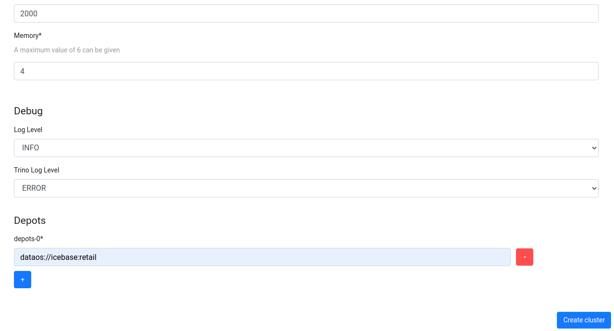
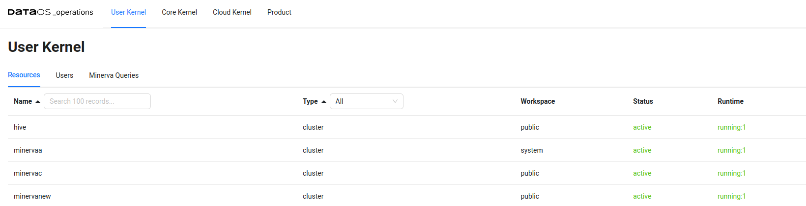

# Creating Cluster Using Operations App UI

You can also create a Cluster via the Operations App UI.

> This functionality is available in versions above DataOS® centaurus-1.8.72
> 

To get started, follow the below steps:

## Open the Operations App

To get started, open the Operations App either via the GUI or directly using the CLI by the command

```bash
dataos-ctl view -a operations
```


## Navigate to the ‘Create Resource’ Section

On the Operations App, click the ‘+ Create Resource’ button. Once you click it a window will open up with various fields as showcased below


## Fill up the required fields

Fill up all the required properties and click Create Cluster. To know more about these properties, click here




## Step 4: Check out the Created Cluster in Operations App

Once you click Create Cluster, a Cluster Resource will be created which can observed in the DataOS Operations App in the User Kernel Section

