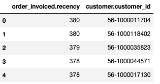

# Minerva Python Client 

## Overview
The Minerva Python client provides Python developers with a convenient way to interact with Minerva clusters, execute SQL queries, and retrieve data for analysis and exploration. It abstracts the underlying communication details and provides a user-friendly interface for sending queries and receiving query results.

The Trino DBAPI and SQLAlchemy libraries can be used to querying minerva clusters.

## Prerequisites

- Python version >= 3.7
- Required libraries: `trino` (client library), `DBAPI` and `sqlalchemy` (for database interaction).
- Gather specific connection details:
    host: DataOS URL (TCP endpoint).
    port: default port for Minerva(presumably 7432).
    username: Your DataOS username.
    password: Your DataOS API key.
    http_scheme: Optional; the HTTP scheme to use (default: https).


## Installation:

- Install the required libraries using `pip` package manager:

```bash
   pip install trino
   pip install dbapi //in case of DBAPI
   pip install sqlalchemy //in case of sqlalchemy
```


 
### **DBAPI**
The Python Database API Specification (DBAPI) defines a standard way for Python clients to access databases. 
    
**Connecting via DBAPI interface**

The DBAPI implementation in `trino.dbapi`provides methods to retrieve fewer rows for example `Cursor.fetchone()`or `Cursor.fetchmany()`. By default `Cursor.fetchmany()` fetches one row. Please set `trino.dbapi.Cursor.arraysize`accordingly.
    
The `BasicAuthentication`class can be used to connect to a Trino cluster configured with the Password. 

**Code Sample:**

The code snippet shows how to use the trino.dbapi.connect() function with provided connection details to run a query on a Minerva cluster with the default port 7432. This example uses username and password credentials for authentication and is appropriate for establishing a connection to any cluster that relies on basic authentication.
    
It creates a cursor to execute SQL statements.

    
```python
from trino.dbapi import connect
from trino.auth import BasicAuthentication

conn = connect(host="tcp.<env_url>", # eg: tcp.something.dataos.io
                port="7432",
                auth=BasicAuthentication("<username>", "<password>"),
                http_scheme="https",
                http_headers={"cluster-name": "<clustername>"} # Optional (Select Default Cluster)
                )
cur = conn.cursor()
cur.execute("<sql statement>")

```
**Example- Running Minerva query** 
Provides a detailed example of using the DBAPI interface to connect to Minerva and execute a sample SQL query. You can provide the Minerva cluster name, if not provided, default cluster will be used to execute the query.   
***sample.py***

user_id is DataOS user ID and user_token is API token that can be created in DataOS. To learn more about generating an API key/token, refer to [Create API Key](https://dataos.info/interfaces/create_token/).

```python
from trino.dbapi import connect
from trino.auth import BasicAuthentication
import pandas as pd
conn = connect(host="tcp.<env_url>",
                port="7432",
                auth=BasicAuthentication("<dataos_user_id>","<user_token>"),
-
                http_scheme="https",
                http_headers={"cluster-name": "<clustername>"}  # eg:minervaa
                )
cur = conn.cursor()
cur.execute("select city_id,zip_code from <catalog>.<schema>.<table> limit 10")

rows = cur.fetchall()
df = pd.DataFrame(rows,columns=["city_id","zip_code"])

print(df)
# for val in rows:
#     print(val)
```

**Output:**

```python
testdbapi.py
    city_id zip_code
0   CITY1    36091
1   CITY2    36758
2   CITY3    36006
3   CITY4    36067
4   CITY5    36701
5   CITY6    36003
6   CITY7    36008
7   CITY8    36068
8   CITY9    36022
9  CITY10    36703

Process finished with exit code 0
```
**Example- Running Lens query**
```python
import warnings
warnings.filterwarnings("ignore")
from trino.dbapi import connect
from trino.auth import BasicAuthentication
import pandas as pd
conn = connect(host="tcp.<ENVURL>",   
               port="7432",
               auth=BasicAuthentication("USERNAME","APITOKEN"),
               http_scheme="https",
               http_headers={"cluster-name": "miniature"}  # eg:minervaa and if not pass this parameter it'll connect to default cluster
               )
q = """
SELECT
  *
FROM
  LENS (
    SELECT
      "order_invoiced.recency",
      "customer.customer_id"
    FROM
      c360
limit 5
  )
"""
res = pd.read_sql(q, conn)
res
```
**Output:**


### **SQLAlchemy**

SQLAlchemy is a toolkit whose core component provides a SQL abstraction layer over many DBAPI implementations. It is another Python library for interacting with databases. The code includes importing necessary libraries (trino, trino.auth, pandas), establishing a connection, executing a query, and processing the fetched data using a Pandas DataFrame.

**Connecting via SQLAlchemy**

To connect to Minerva, use the connection string (URL). The URL contains information about the user, API key, host, port, catalog, and schema. It uses the default Minerva cluster to execute the query


```python
trino://<username>:<password>@<host>:<port>/<catalog>/<schema>
eg:
trino://<userid>:<apikey>@tcp.<envurl>:<port>/<catalog>/<schema>

<host>: tcp.something.dataos.io
```

<aside class="callout">`password`and `schema`are optional </aside>

**Example: sample.py***

This code snippet provides an example of connecting to Minerva using SQLAlchemy and executing a query. Similar to the DBAPI sample code, it imports libraries (sqlalchemy, pandas), creates an engine, establishes a connection, and fetches data.
  

```python
from sqlalchemy import create_engine
from sqlalchemy.sql.expression import  text
import pandas as pd
engine = create_engine('trino://<dataosuserid>:<user_apikey>@tcp.<env_url>.app:7432/<catalog>')
connection = engine.connect()

rows = connection.execute(text("SELECT * FROM <schema>.<table> limit 10")).fetchall()
df = pd.DataFrame(rows)
print(df.columns)
# for val in rows:
#     print(val)
```

**Output:**

```python
>>testsqlalchemy.py
Index(['__metadata', 'city_id', 'zip_code', 'city_name', 'county_name',
        'state_code', 'state_name', '__key', '__topic', '__messageid',
        '__publishtime', '__eventtime', '__messageproperties'],
        dtype='object')

Process finished with exit code 0
```


