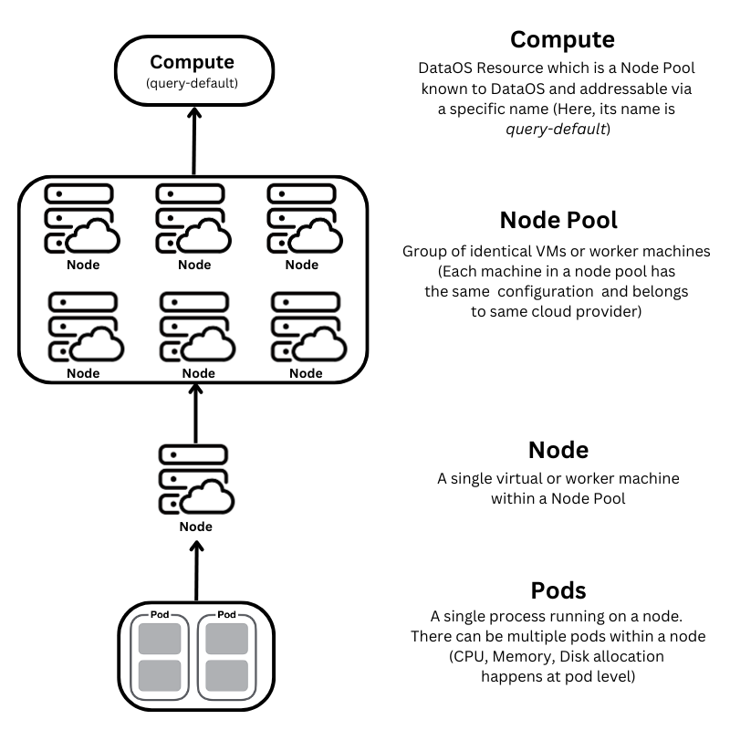
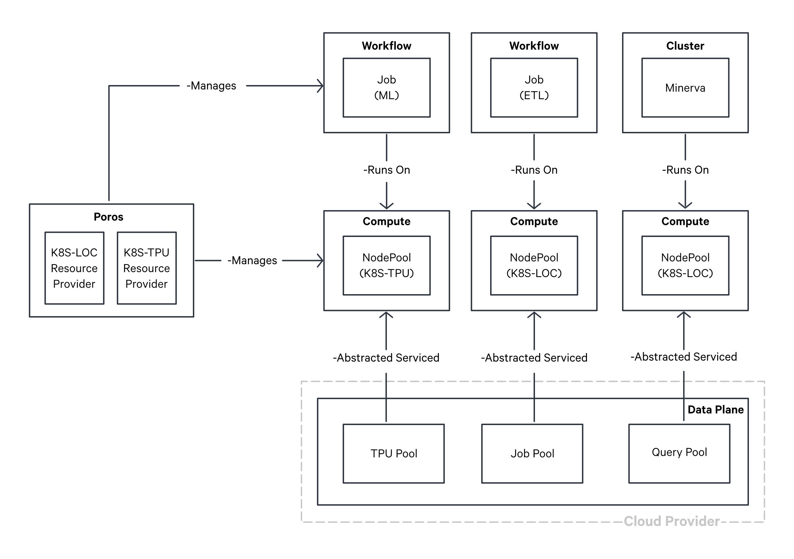

# Compute

Compute is a DataOS [Resource](../resources.md), designed to streamline the allocation of processing power for data-centric tasks such as data procesing, querying and machine learning workloads. It acts as an abstraction on top of **node pools**, which represent a group of virtual machines (VMs) characterized by congruent configurations. These configurations encompass CPU specifications, RAM capacity, network protocol, and storage drive types. These homogenous groupings are seamlessly accessible through a unique, identifiable name within DataOS and available to DataOS as a Compute Resource. This abstraction eliminates the necessity for developers to individually specify and provision VMs, thus optimizing resource allocation and streamlining the computational workflow.

<center>



</center>

<center>
<i>Illustration depicting hierarchy of Compute Resource</i></center>

During the initial setup of DataOS, Compute is one of the primary Resource created as it provides computational power for the functioning of various other components and Resources within the system. A Compute Resource encompasses node pools procured from diverse cloud providers, including Amazon EC2, Azure VM, and Google Cloud Engine. Distinct instances of Compute Resources are tailored to specific purposes and are subsequently referenced by other Resources to fulfill their computational requirements.

For example, Compute Resources of the `query` type are designated to empower Minerva Clusters with computation power, thereby enabling efficient data querying. Conversely, Compute Resources classified as `runnable` type facilitate the execution of runnable Resources, such as Workflows and Services, by providing the necessary computational capacity.

<aside class="callout">

🗣️  The creation of a Compute Resource requires the setup of node pools. Only users with access to provision node pools, specifically <b>Kubernetes Administrators</b> within the organization, can perform this task.
</aside>

## Structure of a Compute Resource YAML

The Compute Resource is defined using a YAML configuration file. The following example illustrates the syntax for defining a Compute:


<center><i>Structure of Compute Resource YAML</i></center>

## Types of Compute

Various computational requirements arise depending on different workloads, necessitating specific levels of processing power and specialized Compute configurations. For instance, Machine Learning workloads often demand GPUs or TPUs, while querying extensive datasets calls for specific Node pool specifications.

The following categories of Compute Resources can be provisioned, each serving distinct purposes within the system:

### **Runnable Compute**

The `runnable` Compute-type is designed to handle data processing workloads and is primarily utilized for executing Workflows and Services. By default, the `runnable-default` Compute-instance is provisioned during the initial installation of DataOS. However, it is possible to modify the [configurations](./compute/compute_templates.md#runnable-compute) of the default instance or create additional Compute-instances according to specific requirements.

### **Query Compute**

The `query` Compute-type is specifically optimized for Minerva Clusters, enabling efficient data querying operations. During the installation of DataOS, the `query-default` Compute-instance is provisioned by default. Similar to the runnable Compute, the [configurations](./compute/compute_templates.md#query-compute) of the query Compute can be customized or additional Compute-instances can be created as needed.

### **GPU Compute**

The `gpu` Compute-type is dedicated to meeting the computational demands of Machine Learning workloads. Unlike the default Compute-instances, the `gpu` Compute-instance is not provisioned during the initial installation of DataOS. However, organizations have the flexibility to provision this [type](./compute/compute_templates.md#gpu-compute) of Compute based on their specific requirements. 

The diagram presented below illustrates the underlying mechanism for provisioning diverse workloads on top of Compute Resource.



<center>

<i>Provisioning diverse workloads on top of Compute Resource</i>

</center>

## How to create a Compute Resource?

To meet the diverse requirements of data processing, machine learning, and query workloads, DataOS offers the flexibility to create customized Compute Resources. This section outlines the structure of a Compute YAML file, the available configuration options, and the process of creating a Compute Resource by applying the YAML.

### **Prerequisites**

DataOS leverages Kubernetes for cluster and container management, enabling the creation and management of VM groups known as node pools. These node pools are defined by specific CPU, memory, and disk capacity configuration. Before proceeding with Compute Resource creation, it is necessary to provision a node pool and register it with Kubernetes.

<aside class="callout">
🗣️ Please get in touch with the <b>Kubernetes Administrator</b> in your organization to create a node pool.

</aside>

### **Compute YAML Configuration**
Once the node pool is established, you can associate it with DataOS by configuring a Compute Resource using a YAML file. The YAML file must include the relevant attributes and fields to successfully create the Compute [Resource.](../resources.md) The following sections provide detailed insights into the required configurations.

#### **Configuring the Resource Section**

In DataOS, a Compute is classified as a Resource-type. Below is the YAML configuration for the Resource Section:
```yaml
name: {{my-workflow}}
version: v1 
type: workflow 
tags: 
  - {{dataos:type:resource}}
description: {{This is a sample workflow YAML configuration}}
owner: {{iamgroot}}
```
<center><i>Resource Section configuration</i></center>

For detailed customization options and additional attributes within the Resource Section, refer to the [Attributes of Resource Section](../resources/resource_grammar.md).

#### **Configuring the Compute-specific Section**

The Compute-specific Section contains attributes specific to the Compute Resource. The YAML configuration for the Compute-specific section is as follows:

```yaml
compute:
  dataplane: {{hub}}
  purpose: {{runnable}}
  nodePool:
    nodeSelector:
      {{"dataos.io/purpose": "runnable"}}
    tolerations:
      - key: {{"dedicated"}}
        operator: {{"Equal"}}
        value: {{"runnable"}}
        effect: {{"NoSchedule"}}
```
<center><i>Compute-specific Section configuration</i></center>


The table below presents an overview of attributes within a the Compute-specfic Section of YAML.

<center>

| Attribute | Data Type | Default Value | Possible Value | Requirement |
| --- | --- | --- | --- | --- |
| [`compute`](./compute/yaml_configuration_attributes.md#compute) | object | none | none | mandatory |
| [`dataplane`](./compute/yaml_configuration_attributes.md#dataplane) | string | none | hub | mandatory |
| [`purpose`](./compute/yaml_configuration_attributes.md#purpose) | string | none | runnable/query/gpu | mandatory |
| [`nodePool`](./compute/yaml_configuration_attributes.md#nodepool) | object | none | none | mandatory  |
| [`nodeSelector`](./compute/yaml_configuration_attributes.md#nodeselector) | object | none | none | mandatory |
| [`tolerations`](./compute/yaml_configuration_attributes.md#tolerations) | object | none | none | mandatory |
| [`key`](./compute/yaml_configuration_attributes.md#key) | string | none | any valid string | mandatory |
| [`operator`](./compute/yaml_configuration_attributes.md#operator) | string | none | Equal/Exists | mandatory  |
| [`value`](./compute/yaml_configuration_attributes.md#value) | string | none | query/runnable/gpu | mandatory |
| [`effect`](./compute/yaml_configuration_attributes.md#effect) | string | none | NoSchedule/PreferNoSchedule/<br>NoExecute | mandatory |

</center>

For more details about various attributes, refer to the [Attributes of Compute YAML.](./compute/yaml_configuration_attributes.md)

Additionally, if you are looking for pre-configured Compute templates tailored for specific workloads such as ETL, Machine Learning, and Query, refer to [Compute Templates.](./compute/compute_templates.md)

### **Applying the YAML**

Once the Compute YAML file is prepared, the [`apply`](../interfaces/cli/command_reference.md#apply) command can be utilized to create a Compute Resource within the DataOS environment.

```shell
dataos-ctl apply -f {{path/file-name}}
```

Upon successful creation of a Compute Resource, [CRUD operations](../resources.md#crud-operations-on-dataos-resources) can be performed on top of it, as well as it can be referenced in Minerva Clusters for query workloads and incorporated into other Resources, such as [Workflow](./workflow.md), [Depot](./depot.md), and [Service](./service.md), using the `compute` attribute.


## Compute Templates

In this section, a collection of pre-configured Compute Resource Templates is provided, tailored to meet the requirements of diverse Workload scenarios. To know more navigate to the [Compute Templates](./compute/compute_templates.md) page.
