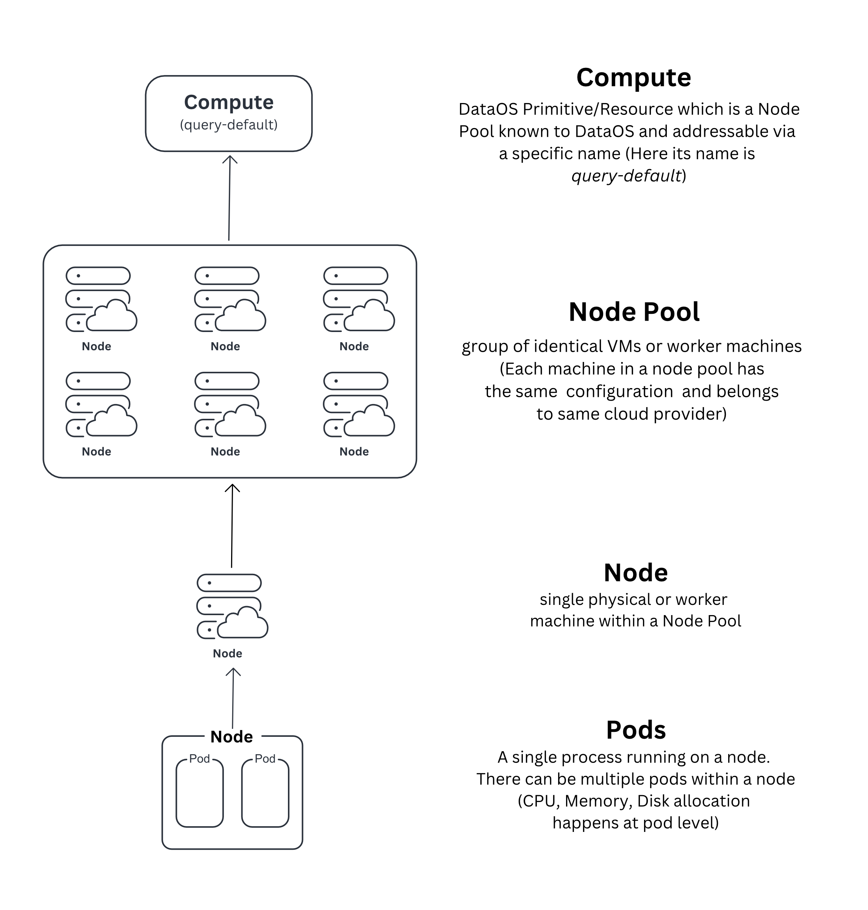
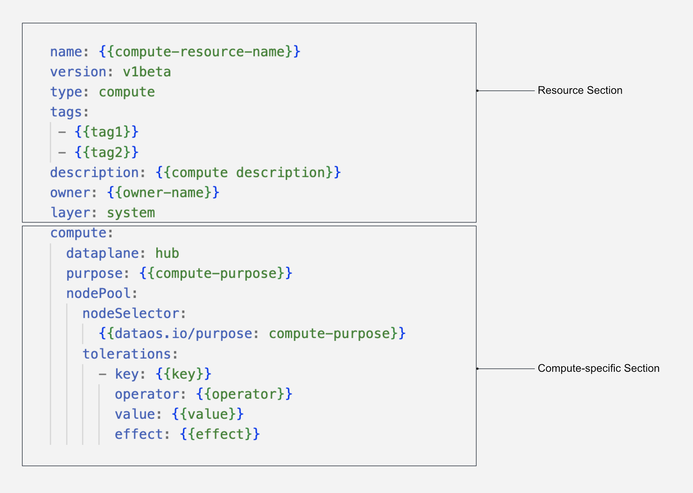
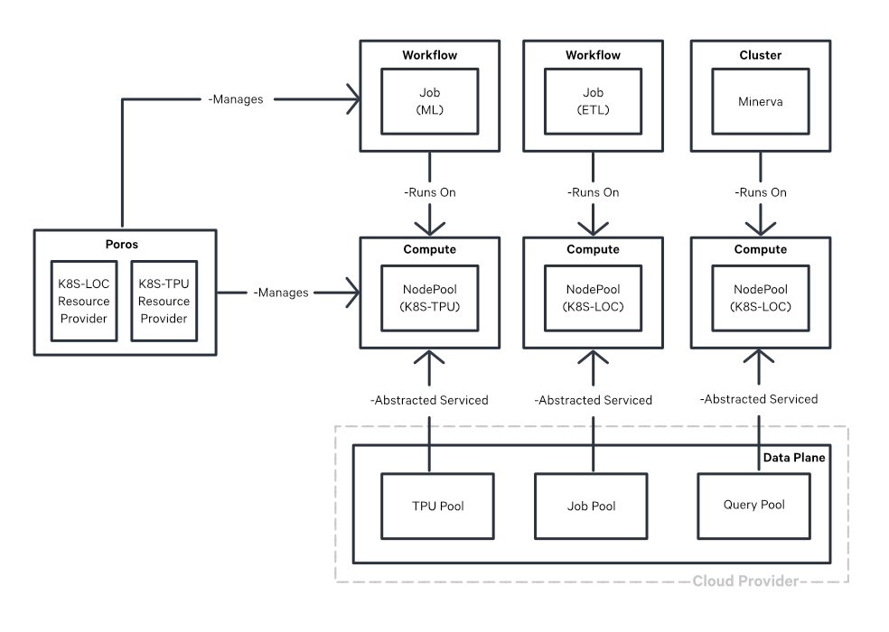

# Compute

Compute is a fundamental resource in the DataOS ecosystem that enables the allocation of processing power for data processing, querying and machine learning workloads. It facilitates the creation of node pools, which are groups of virtual machines (VMs) with similar configurations, and makes them available to DataOS as a compute resource, accessible through unique names within DataOS. By defining a Compute, the need for manually specifying individual VMs for provisioning is eliminated, streamlining resource management.

<i>Illustration depicting Compute resource in DataOS</i>

During the initial setup of DataOS, Compute is one of the primary resources created as it serves as the foundation for other components. Compute represents pure processing power without any specific application identity associated with it. At its core, Compute consists of essential server components, including CPUs and RAM (or VMs). It can be composed of node pools from various cloud providers such as Amazon EC2, Azure VM, or Google Cloud Instances. These Compute resources are subsequently referenced within Minerva Clusters for efficient data querying and execution of runnables such as Workflows/Services within DataOS.

<aside style="padding:15px; border-radius:5px;">

🗣️  The creation of a compute requires the setup of node pools, which is a task typically performed by system administrators within the organization.
</aside>

## Syntax of Compute

The Compute resource is defined using a YAML configuration file. The following example illustrates the syntax for defining a compute:

<i>YAML Syntax of a Compute Resource</i>

## Types of Compute

Various computational requirements arise depending on different workloads, necessitating specific levels of processing power and specialized Compute configurations. For instance, Machine Learning workloads often demand GPUs or TPUs, while querying extensive datasets calls for specific Node pool specifications.

When setting up DataOS, the following categories of Compute resources can be provisioned, each serving distinct purposes within the system:

- **runnable**: This Compute is optimized for data processing workloads, including the execution of Workflows and Services. The runnable-default compute is provisioned by default during the installation of DataOS, but you can alter the configurations or create new compue later on.

- **query**: Designed specifically for Minerva Clusters, this Compute type supports efficient data querying operations. The query-default compute is provisioned by default during the installation of DataOS, but you can alter the configurations or create new compue later on.

- **gpu**: This Compute is specifically designated for Machine Learning Workloads. It is not present by default but can be provisioned based on the organization's requirements.

The diagram presented below illustrates the underlying mechanism for provisioning diverse workloads on top of Cloud Providers.

<i>Different Types of Compute on top of Cloud Providers</i>

## Creating a Compute

DataOS offers the capability to create customized Computes designed specifically for diverse data processing, machine learning, and query workloads. For comprehensive instructions and guidelines on how to create a Compute, please consult the [Creating a Compute](./compute/creating_a_compute.md) documentation.

## Compute YAML Configuration Fields

The table below presents a comprehensive list of key-value properties and their descriptions within a Compute YAML file:

| Field | Data Type | Default Value | Possible Value | Requirement |
| --- | --- | --- | --- | --- |
| `compute` | object | None | None | Mandatory |
| `dataplane` | string | None | hub | Mandatory |
| `purpose` | string | None | runnable/query/gpu | Mandatory |
| `nodePool` | object | None | None | Mandatory  |
| `nodeSelector` | object | None | None | Mandatory |
| `dataos.io/purpose` | string | None | runnable/query/gpu | Mandatory |
| `tolerations` | object | None | None | Mandatory |
| `key` | string | None | Any string (e.g. dedicated) | Mandatory |
| `operator` | string | None | Equal/Exists | Mandatory  |
| `value` | string | None | query/runnable/gpu | Mandatory |
| `effect` | string | None | NoSchedule/PreferNoSchedule/NoExecute | Mandatory |

For a detailed explanation of each field, consult the [Compute YAML Field Reference](./compute/compute_yaml_field_reference.md)

## Compute Templates

In this section, a collection of pre-configured Compute Resource Templates is provided, tailored to meet the requirements of different types of available Compute resources for diverse Workload scenarios. The Compute templates are categorized based on the specific types of Workloads they support.

[Compute Templates](./compute/compute_templates.md)
