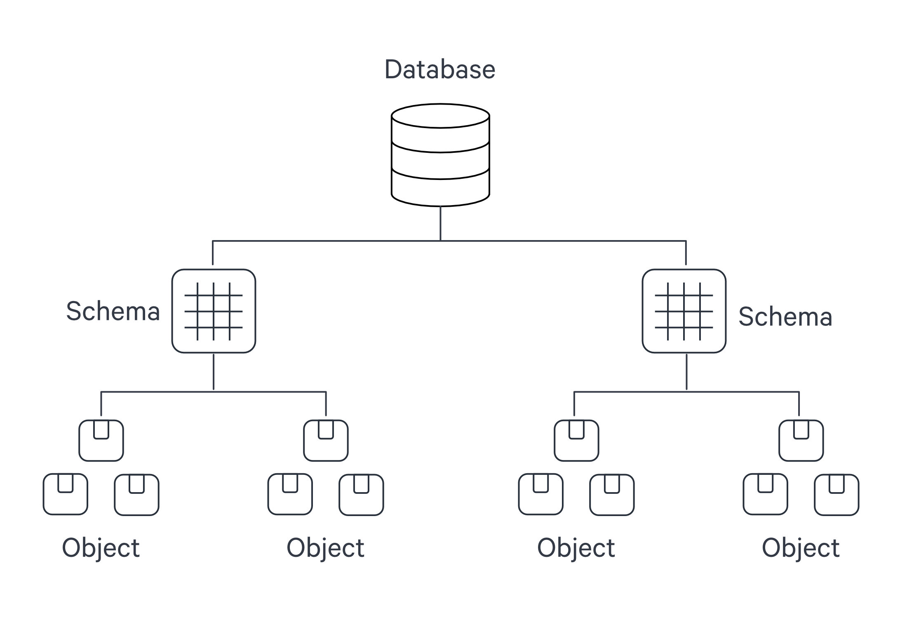
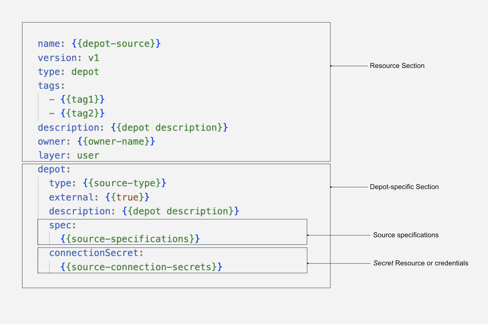
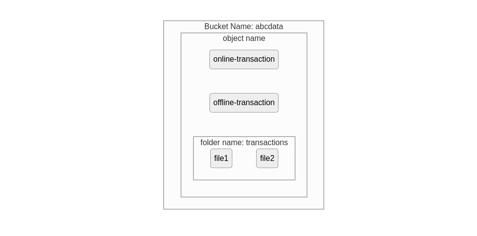
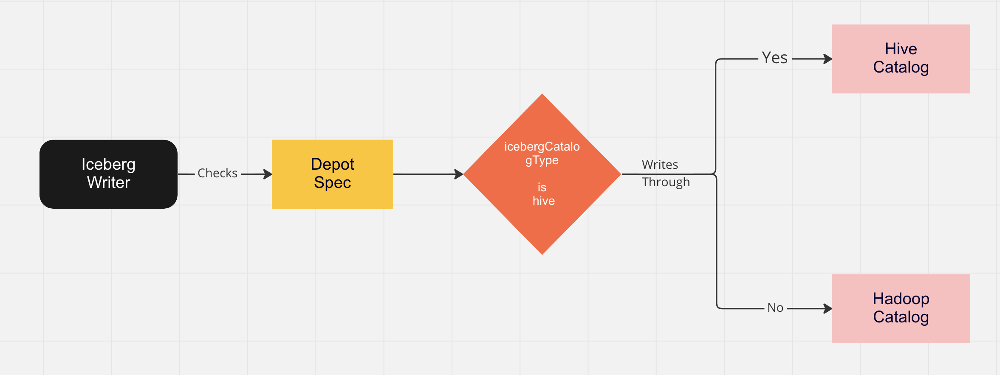

# Depot

Depot in DataOS is a [Resource](../resources.md) that acts as an intermediary, facilitating connectivity to diverse data sources by abstracting the complexities associated with the underlying source system (including protocols, credentials, and connection schemas). It enables users to establish connections and retrieve data from various data sources, such as file systems (e.g., [AWS S3](./depot/depot_config_templates/amazon_s3.md), [Google GCS](./depot/depot_config_templates/google_gcs.md), [Azure Blob Storage](./depot/depot_config_templates/azure_abfss.md)), data lake systems (e.g., Icebase), database systems (e.g., [Redshift](./depot/depot_config_templates/amazon_redshift.md), [SnowflakeDB](./depot/depot_config_templates/snowflake.md), [Bigquery](./depot/depot_config_templates/google_bigquery.md), [Postgres](./depot/depot_config_templates/postgresql.md)), and event systems (e.g., [Kafka](./depot/depot_config_templates/kafka.md), [Pulsar](./depot/depot_config_templates/apache_pulsar.md)).

The Depot serves as the registration of data locations to be made accessible to DataOS. Through the [Depot Service](#depot-service), each source system is assigned a unique address, referred to as a **Uniform Data Link (UDL)**. The UDL grants convenient access and manipulation of data within the source system, eliminating the need for repetitive credential entry. The UDL follows this format:

<center><b><span style="font-size: 20px;"><code>dataos://[depot]:[collection]/[dataset]</code></span></b></center>

Leveraging the UDL enables access to datasets and seamless execution of various operations, including data transformation using various [Stacks](./stacks.md) and [Policy](./policy.md) assignment.

Regardless of the source system's internal naming conventions and structure, the UDL ensures consistency in referencing data. Within DataOS, the hierarchical structure of a data source is represented as follows:


<center><i>Hierarchical Structure of a Data Source within DataOS</i></center>

Once this mapping is established, [Depot Service](#depot-service) automatically generates the Uniform Data Link (UDL) that can be used throughout DataOS to access the data. As a reminder, the UDL has the format: `dataos://[depot]:[collection]/[dataset]`.

For simple file storage system, "Collection" can be analogous to "Folder," and "Dataset" can be equated to "File." The Depot's strength lies in its capacity to establish uniformity, eliminating concerns about varying source system terminologies.

Once a Depot is created, all members of an organization gain secure access to datasets within the associated source system. The Depot not only facilitates data access but also assigns **default** [Access Policies](./policy.md#access-policy) to ensure data security. Moreover, users have the flexibility to define and utilize custom [Access Policies](./policy.md#access-policy) for the depot and [Data Policies](./policy.md#data-policy) for specific datasets within the Depot.

<aside class="callout">

🗣️ Depot provides 'access' to data, meaning that data remains within the source system and is neither moved nor duplicated. However, DataOS offers multiple <a href="/resources/stacks/">Stacks</a> such as <a href="/resources/stacks/flare/">Flare</a>, <a href="/resources/stacks/benthos/">Benthos</a>, etc. to perform ingestion, syndication, copying if the need arises.
</aside>

## Structure of a Depot YAML



<center><i>Structure of a Depot YAML</i></center>

To know more about the attributes of Depot YAML Configuration, refer to the link: [Attributes of Depot YAML](./depot/depot_yaml_configuration_attributes.md)

## Depot Service

Depot Service is a DataOS Service that manages the Depot Resource. It facilitates in-depth introspection of depots and their associated storage engines. Once a Depot is created, users can obtain comprehensive information about the datasets contained within, including details such as constraints, partition, indexing, etc. 

## How to create a Depot?

To establish a Depot in DataOS, simply compose a YAML configuration file for a Depot and apply it using the DataOS [Command Line Interface (CLI)](../interfaces/cli.md).

### **Prerequisites**

Before proceeding with Depot creation, it is essential to ensure that you possess the required authorization. To confirm your eligibility, execute the following commands in the CLI:

```shell
dataos-ctl user get

# Expected Output
INFO[0000] 😃 user get...                                                       
INFO[0000] 😃 user get...complete                        

       NAME      |      ID       |  TYPE  |         EMAIL          |              TAGS               
-----------------|---------------|--------|------------------------|---------------------------------
  IamGroot       | iamgroot      | person | iamgroot@tmdc.io       | roles:id:data-dev,              
                 |               |        |                        | roles:id:operator,              
                 |               |        |                        | roles:id:system-dev,            
                 |               |        |                        | roles:id:user,                  
                 |               |        |                        | users:id:iamgroot          

```

To create Depots, ensure that you possess the following tags: `roles:id:user`, `roles:id:data-dev`, and `roles:id:system-dev`.


<aside class="callout">
🗣️ If you don not possess these tags, contact the DataOS Operator or Administrator within your organization to assign you the necessary tag or the use case for the creation of the depot.
</aside>

The creation of a Depot involves three simple steps:

- Create a YAML configuration file.
- Apply the file using the DataOS CLI.
- Verify the successful creation of the Depot.


### **Create a YAML File**

The YAML configuration file for a Depot can be divided into four main sections: [Resource section](#configure-resource-section), [Depot-specific section](#configure-depot-specific-section), [Connection Secrets section](#configure-connection-secrets), and [Specifications section](#configuration-specifications-section). Each section serves a distinct purpose and contains specific attributes.


#### **Configure Resource Section**

The Resource section of the YAML configuration file consists of attributes that are common across all resource-types. The following YAML snippet demonstrates the key-value properties that need to be declared in this section:

```yaml
name: ${{mydepot}}
version: v1 
type: depot 
tags: 
  - ${{dataos:type:resource}}
description: ${{This is a sample depot YAML configuration}} 
owner: ${{iamgroot}}
layer: user
```
<center><i>Resource section YAML configuration</i></center>

For more details regarding attributes in the Resource section, refer to the link: [Attributes of Resource Section.](./resource_attributes.md)

#### **Configure Depot-specific Section**

The Depot-specific section of the YAML configuration file includes key-value properties specific to the Depot-type being created. Each Depot-type represents a Depot created for a particular data source. Multiple Depots can be established for the same data source, and they will be considered as a single Depot-type. The following YAML snippet illustrates the key-values to be declared in this section:

```yaml
depot:   
  type: ${{BIGQUERY}}                  
  description: ${{description}}
  external: ${{true}}                  
  source: ${{bigquerymetadata}} 
  compute: ${{runnable-default}}
  connectionSecrets:
    {}
  specs:
    {}
```
<center><i>Depot-specific section YAML configuration</i></center>

<center>

The table below elucidates the various attributes in the Depot-specific section:

| Attribute | Data Type | Default Value | Possible Value | Requirement |
| --- | --- | --- | --- | --- |
| [`depot`](./depot/depot_yaml_configuration_attributes.md#depot) | object | none | none | mandatory |
| [`type`](./depot/depot_yaml_configuration_attributes.md#type) | string | none | ABFSS, WASBS, REDSHIFT,<br> S3, ELASTICSEARCH, EVENTHUB, PULSAR, BIGQUERY, GCS, JDBC, MSSQL, MYSQL, OPENSEARCH, ORACLE, POSTGRES, SNOWFLAKE | mandatory |
| [`description`](./depot/depot_yaml_configuration_attributes.md#description) | string | none | any string | mandatory |
| [`external`](./depot/depot_yaml_configuration_attributes.md#external) | boolean | false | true/false | mandatory |
| [`connectionSecret`](./depot/depot_yaml_configuration_attributes.md#connectionSecret) | object | none | varies between data sources | optional |
| [`spec`](./depot/depot_yaml_configuration_attributes.md#spec) | object | none | varies between data sources | mandatory |
| [`compute`](./depot/depot_yaml_configuration_attributes.md#compute) | string | runnable-default | any custom Compute Resource | optional |
| [`source`](./depot/depot_yaml_configuration_attributes.md#source) | string | depot name | any string which is a valid depot name | optional |

</center>


#### **Configure Connection Secrets Section**

The configuration of connection secrets is specific to each Depot-type and depends on the underlying data source. The details for these connection secrets, such as credentials and authentication information, should be obtained from your enterprise or data source provider. For commonly used data sources, we have compiled the connection secrets [here.](./depot/depot_config_templates.md) Please refer to these templates for guidance on how to configure the connection secrets for your specific data source.

<aside class="callout">
🗣️ The credentials you use here need to have access to the schemas in the configured database.
</aside>

**Examples**

Here are examples demonstrating how the key-value properties can be defined for different depot-types:

For [BigQuery](./depot/depot_config_templates/google_bigquery.md), the `connectionSecret` section of the configuration file would appear as follows:

```yaml
#Properties depend on the underlying data source
connectionSecret:                    
  - acl: rw                        
    type: key-value-properties
    data:
      projectid: ${{project-name}}
      email: ${{email-id}}
    files:
      json_keyfile: ${{secrets/gcp-demo-sa.json}} #JSON file containing the credentials to read-write    
  - acl: r                        
    type: key-value-properties
    files:
      json_keyfile: ${{secrets/gcp-demo-sa.json}} #JSON file containing the credentials to read-only
```

This is how you can declare connection secrets to create a Depot for [AWS S3](./depot/depot_config_templates/amazon_s3.md) storage:

```yaml
connectionSecret:                     
  - acl: rw                         
    type: key-value-properties
    data:                           #credentials required to access aws
      awsaccesskeyid: ${{AWS_ACCESS_KEY_ID}}
      awsbucketname: ${{bucket-name}}
      awssecretaccesskey: ${{AWS_SECRET_ACCESS_KEY}}
```

For accessing [JDBC](./depot/depot_config_templates/jdbc.md), all you need is a username and password. Check it out below:

```yaml
connectionSecret:
  - acl: rw
    type: key-value-properties
    data:                            #for JDBC, the credentials you get from the data source should have permission to read/write schemas of the database being accessed 
      username: ${{username}}
      password: ${{password}}
```

The basic attributes filled in this section are provided in the table below:

<center>

| Attribute | Data Type | Default Value | Possible Value | Requirement |
| --- | --- | --- | --- | --- |
| [`acl`](./depot/depot_yaml_configuration_attributes.md#acl) | string | none | r/rw | mandatory |
| [`type`](./depot/depot_yaml_configuration_attributes.md#type) | string | none | key-value properties | mandatory |
| [`data`](./depot/depot_yaml_configuration_attributes.md#data) | object | none | fields within data varies between data sources | mandatory |
| [`files`](./depot/depot_yaml_configuration_attributes.md#files) | string | none | valid file path | optional |

</center>

**Alternative Approach: Using Secrets**

[Secret](./secret.md) is also a [Resource](../resources.md) in DataOS that allows users to securely store sensitive piece of information such as username, password, etc. Using Secrets in conjunction with [Depots](#depot), [Stacks](./stacks.md) allows for decoupling of sensitive information from Depot and Stack YAMLs. For more clarity, let’s take the example of MySQL data source to understand how you can use Secret Resource for Depot creation:

- Create a YAML file with the details on the connection secret:

  ```yaml
  name: ${{mysql-secret}}
  version: v1      
  type: secret
  secret:
    type: key-value-properties
    acl: rw
    data:
      connection-user: ${{user}}
      connection-password: ${{password}}
  ```

- Apply this YAML file on DataOS CLI

  ```shell
  dataos-ctl apply -f ${{path/secret.yaml}} -w ${{name of the workspace}}
  ```

If you have created this [Secret](./secret.md) in a public Workspace, any user within your enterprise can refer to the Secret by its name, "mysql-secret".

For example, if a user wishes to create a MySQL Depot, they can define a Depot configuration file as follows:

<details>
<summary>YAML Configuration File</summary>

```yaml

name: mysql05
version: v1
type: depot
tags:
  - dropzone
  - mysql
layer: user
depot:
  type: MYSQL
  description: "MYSQL Sample data"
  spec:
    host: ${{host}}
    port: ${{port}}
  external: true
  data:
    connectionSecret:
      name: "mysql-secret"     #secret name containing credential details

```

By referencing the name of the Secret, "mysql-secret," users can easily incorporate the specified credentials into their Depot configuration. This approach ensures the secure handling and sharing of sensitive information.

</details>

To learn more about Secrets as a Resource and their usage, refer to the documentation [here](./secret.md)

#### **Configure Spec Section**

The `spec` section in the YAML configuration file plays a crucial role in directing the Depot to the precise location of your data and providing it with the hierarchical structure of the data source. By defining the specification parameters, you establish a mapping between the data and the hierarchy followed within DataOS.

Let's understand this hierarchy through real-world examples:

In the case of BigQuery, the data is structured as "Projects" containing "Datasets" that, in turn, contain "Tables". In DataOS terminology, the "Project" corresponds to the "Depot", the "Dataset" corresponds to the "Collection", and the "Table" corresponds to the "Dataset".

Consider the following structure in [BigQuery](./depot/depot_config_templates/google_bigquery.md):

- Project name: `bigquery-public-data` (Depot)
- Dataset name: `covid19_usa` (Collection)
- Table name: `datafile_01` (Dataset)

The UDL for accessing this data would be `dataos://bigquery-public-data:covid19_usa/datafile_01`.

In the YAML example below, the necessary values are filled in to create a [BigQuery](./depot/depot_config_templates/google_bigquery.md) Depot:

<details>
<summary> Bigquery Depot YAML Configuration </summary>

```yaml
name: covidbq
version: v1
type: depot
tags:
  - bigquery
layer: user
depot:
  type: BIGQUERY
  description: "Covid public data in Google Cloud BigQuery"
  external: true
  spec:
    project: bigquery-public-data
```
</details>

In this example, the Depot is named "covidbq" and references the project "bigquery-public-data" within Google Cloud. As a result, all the datasets and tables within this project can be accessed using the UDL `dataos://covidbq:<collection name>/<dataset name>`.

By appropriately configuring the specifications, you ensure that the Depot is accurately linked to the data source's structure, enabling seamless access and manipulation of datasets within DataOS.

Depot provides flexibility in mapping the hierarchy for file storage systems. Let's consider the example of an [Amazon S3](./depot/depot_config_templates/amazon_s3.md) bucket, which has a flat structure consisting of buckets, folders, and objects. By understanding the hierarchy and utilizing the appropriate configurations, you can effectively map the structure to DataOS components.


<center><i>Amazon S3 Bucket Structure</i></center>

Here's an example of creating a depot named 's3depot' that maps the following structure:

- Bucket: `abcdata` (Depot)
- Folder: `transactions` (Collection)
- Objects: `file1` and `file2` (Datasets)

In the YAML configuration, specify the bucket name and the relative path to the folder. The YAML example below demonstrates how this can be achieved:

```yaml
name: s3depot
version: v1
type: depot
tags:
  - S3
layer: user
depot:
  type: S3
  description: "AWS S3 Bucket for dummy data"
  external: true
  spec:
    bucket: "abcdata"
    relativePath:
```

If you omit the `relativePath` in the YAML configuration, the bucket itself becomes the depot in DataOS. In this case, the following UDLs can be used to read the data:

- `dataos://s3depot:transactions/file1`
- `dataos://s3depot:transactions/file2`

Additionally, if there are objects present in the bucket outside the folder, you can use the following UDLs to read them:

- `dataos://s3depot:none/online-transaction`
- `dataos://s3depot:none/offline-transaction`

<aside class="callout">
🗣️ The name 'none' is used for the collection in this case since there is no three-level ordinal hierarchy. The objects 'online-transaction' and 'offline-transaction' are directly accessed as datasets in the S3 bucket.
</aside>

However, if you prefer to treat the 'transactions' folder itself as another object within the bucket rather than a folder, you can modify the UDLs as follows:

- `dataos://s3depot:none/transactions/file1`
- `dataos://s3depot:none/transactions/file2`

In this case, the interpretation is that there is no collection in the bucket, and 'file1' and 'file2' are directly accessed as objects with the path '/transactions/file1' and '/transactions/file2'.

When configuring the YAML for S3, if you include the `relativePath` as shown below, the 'transactions' folder is positioned as the depot:

```yaml
name: s3depot
version: v1
type: depot
tags:
  - S3
layer: user
depot:
  type: S3
  description: "AWS S3 Bucket for dummy data"
  external: true
  spec:
    bucket: "abcdata"
    relativePath: "/transactions"
```

Since the folder ‘transactions’ in the bucket has now been positioned as the depot, two things happen.

First, you cannot read the object files online-transaction and offline-transaction using this depot.

Secondly with this setup, you can read the files within the 'transactions' folder using the following UDLs:

- `dataos://s3depot:none/file1`
- `dataos://s3depot:none/file2`

<aside class="callout">

🗣️ When writing data to a source system, names like 'none' or 'system' cannot be used for the collection. Therefore, the output of a Flare job cannot have an address like <code>dataos://${{depot name}}:none/${{dataset name}}</code> or <code>dataos://${{depot name}}:system/${{dataset name}}</code>.
</aside>

For accessing data from [Kafka](./depot/depot_config_templates/kafka.md), where the structure consists of a broker list and topics, the `spec` section in the YAML configuration will point the depot to the broker list, and the datasets will map to the topic list. The format of the YAML will be as follows:

```yaml
depot:
  type: KAFKA
  description: ${{description}}
  external: true
  spec:
    brokers:
      - ${{broker1}}
      - ${{broker2}}
```


### **Apply Depot YAML**

Once you have the YAML file ready in your code editor, simply copy the path of the YAML file and apply it through the DataOS CLI, using the command given below:

```shell
dataos-ctl apply -f ${{yamlfilepath}}
```

### **Verify Depot Creation**

To ensure that your depot has been successfully created, you can verify it in two ways:

- Check the name of the newly created depot in the list of depots where you are named as the owner:

  ```shell
  dataos-ctl get -t depot
  ```

- Alternatively, retrieve the list of all depots created in your organization:

  ```shell
  dataos-ctl get -t depot -a
  ```

You can also access the details of any created Depot through the DataOS GUI in the [Operations App](../interfaces/operations.md) and [Metis UI](../interfaces/metis.md#metis-ui).

### **Delete Depot**

<aside class="best-practice">
📖 Best Practice: <br>As part of best practices, it is recommended to regularly delete Resources that are no longer in use. This practice offers several benefits, including saving time and reducing costs.
</aside>

If you need to delete a depot, use the following command in the DataOS CLI:

```shell
dataos-ctl delete -t depot -n ${{name of depot}}
```

By executing the above command, the specified depot will be deleted from your DataOS environment.

## Supported Storage Architectures in DataOS

DataOS Depots facilitate seamless connectivity with diverse storage systems while eliminating the need for data relocation. This resolves challenges pertaining to accessibility across heterogeneous data sources. However, the escalating intricacy of pipelines and the exponential growth of data pose potential issues, resulting in cumbersome, expensive, and unattainable storage solutions. In order to address this critical concern, DataOS introduces support for two distinct and specialized storage architectures - [Icebase](./depot/icebase.md) Depot, the Unified Lakehouse designed for OLAP data, and [Fastbase](./depot/fastbase.md) Depot, the Unified Streaming solution tailored for handling streaming data.


### **Icebase**

Icebase-type depots are designed to store data suitable for OLAP processes. It offers built-in functionalities such as [schema evolution](./depot/icebase.md#schema-evolution), [upsert commands](./depot/icebase.md#creating-and-getting-datasets), and [time-travel capabilities](./depot/icebase.md#maintenance-snapshot-modelling-and-metadata-listing) for datasets. With Icebase, you can conveniently perform these actions directly through the DataOS CLI, eliminating the need for additional Stacks like [Flare](./stacks/flare.md). Moreover, queries executed on data stored in Icebase exhibit enhanced performance. For detailed information, refer to the Icebase [page.](./depot/icebase.md)

### **Fastbase**

Fastbase type-depots are optimized for handling streaming data workloads. It provides features such as [creating](./depot/fastbase.md#create-dataset) and [listing topics](./depot/fastbase.md#list-topics), which can be executed effortlessly using the DataOS CLI. To explore Fastbase further, consult the [link.](./depot/fastbase.md)


## How to utilize Depots?

Once a Depot is created, you can leverage its Uniform Data Links (UDLs) to access data without physically moving it. The UDLs play a crucial role in various scenarios within DataOS.

### **Work with Stacks**

Depots are compatible with different Stacks in DataOS. [Stacks](./stacks.md) provide distinct approaches to interact with the system and enable various programming paradigms in DataOS. Several Stacks are available that can be utilized with depots, including [Scanner](./stacks/scanner.md) for introspecting depots, [Flare](./stacks/flare.md) for data ingestion, transformation, syndication, etc., [Benthos](./stacks/benthos.md) for stream processing and [Data Toolbox](./stacks/data_toolbox.md) for managing [Icebase](./depot/icebase.md) DDL and DML. 

[Flare](./stacks/flare.md) and [Scanner](./stacks/scanner.md) Stacks are supported by all Depots, while [Benthos](./stacks/benthos.md), the stream-processing Stack, is compatible with read/write operations from streaming depots like [Fastbase](./depot/fastbase.md) and Kafka Depots.

The UDL references are used as addresses for your input and output datasets within the YAML configuration file.

<details>
<summary>Referencing Depots within Stack YAML Configuration</summary>

<b>Flare YAML Input/Output UDL</b>

```yaml
# A section of the complete YAML file for Flare
inputs:                                               
  - name: customer_connect
    dataset: dataos://crmbq:demo/customer_profiles # Example of input UDL
outputs:
  - name: output01
    depot: dataos://filebase:raw01 # Example of output UDL
```

<b>Benthos YAML Output UDL</b>

```yaml
# A section of the complete YAML file for Benthos Output
output: # Example of Output UDL
  - broker:
      pattern: fan_out
      outputs:
      - plugin:
          address: dataos://fastbase:default/test08
```

<b>Data Toolbox Stack YAML UDL</b>

```yaml
toolbox: 
  dataset: dataos://icebase:sample/city?acl=rw  #UDL
  action: 
    name: set_version
    value: latest
```

</details>

### **Limit Data Source's File Format**

Another important function that a Depot can play is to limit the file type which you can read from and write to a particular data source. In the `spec` section of YAML config file, simply mention the `format` of the files you want to allow access for.

```yaml
depot:
  type: S3
  description: ${{description}}
  external: true
  spec:
    scheme: ${{s3a}}
    bucket: ${{bucket-name}}
    relativePath: "raw" 
    format: ${{format}}  # mention the file format, such as JSON, to only allow that file type
```

For File based systems, if you define the format as ‘Iceberg’, you can choose the meta-store catalog between Hadoop and Hive. This is how you do it:

```yaml
depot:
  type: ABFSS
  description: "ABFSS Iceberg depot for sanity"
  compute: runnable-default
  spec:
    account: 
    container: 
    relativePath:
    format: ICEBERG
    endpointSuffix:
    icebergCatalogType: Hive

```

If you do not mention the catalog name as Hive, it will use Hadoop as the default catalog for Iceberg format.


<center> <i>Flow when Hive is chosen as the catalog type</i></center>

Hive, automatically keeps the pointer updated to the latest metadata version. If you use Hadoop, you have to manually do this by running the set metadata command as described on this page: [Set Metadata](./depot/icebase.md#set-metadata)

### **Scan and Catalog Metadata**

By running the [Scanner](./stacks/scanner.md), you can scan the metadata from a source system via the Depot interface. Once the metadata is scanned, you can utilize [Metis](../interfaces/metis.md) to catalog and explore the metadata in a structured manner. This allows for efficient management and organization of data resources.

### **Add Depot to Cluster Sources to Query the Data**

To enable the [Minerva](./cluster.md#minerva) Query Engine to access a specific source system, you can add the Depot to the list of sources in the [Cluster](./cluster.md). This allows you to query the data and create dashboards using the DataOS [Workbench](../interfaces/workbench.md) and [Atlas](../interfaces/atlas.md). 

### **Create Policies upon Depots to Govern the Data**

[Access](./policy.md#access-policy) and [Data Policies](./policy.md#data-policy) can be created upon Depots to govern the data. This helps in reducing data breach risks and simplifying compliance with regulatory requirements. Access Policies can restrict access to specific depots, collections, or datasets, while Data Policies allow you to control the visibility and usage of data.

### **Building Data Models**

You can use Lens to create Data Models on top of Depots and explore them using the [Lens App UI.](../interfaces/lens.md)


## Depot Configuration Templates

To facilitate the creation of depots accessing commonly used data sources, we have compiled a collection of pre-defined YAML configuration templates. These templates serve as a starting point, allowing you to quickly set up depots for popular data sources. You can access the list of these templates by visiting the following page: [Depot Config Templates](./depot/depot_config_templates.md)

## Data Integration - Supported Connectors in DataOS

The catalogue of data sources accessible by one or more components within DataOS is provided on the following page: [Supported Connectors in DataOS](./depot/list_of_connectors.md)