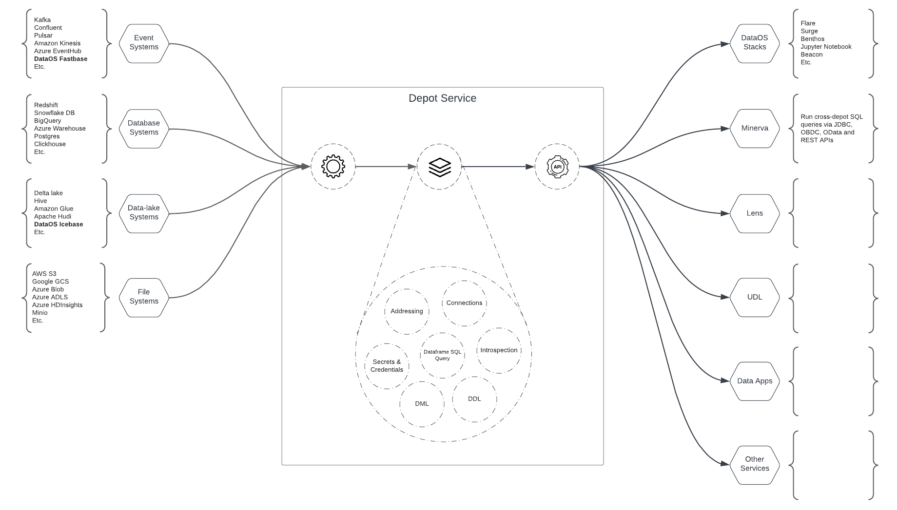

# Depot Service

Depot Service is a DataOS Service that manages the Depot resource. Depots are a way to abstract and manage various data systems such as data warehouses, databases, object stores, and more. They provide a unified interface and set of APIs to work with different data sources, simplifying the work of data engineers.

<i>Diagrammatic Representation of Depot Service</i>

## Source Systems

Depot can handle four broad types of data sources, categorized as either managed or unmanaged:

- File systems: Unmanaged object storage that contains files in formats such as CSV, Parquet, and Avro.

- Data-lake systems: Managed object storage with files arranged in a specific structure and format. These systems are often managed by a metadata system, examples include Delta Lake, Apache Hudi, Apache Hive, DataOS Icebase, etc.

- Database systems: Any database or data warehouse accessible via JDBC APIs. These systems have an in-built metadata system to manage the data.

- Event systems: Messaging queues like Kafka, Confluent Kafka, Pulsar, and Apache Kinesis. Some of these systems have their own metadata systems in place.

## Features

### **Address**

Depot creates a consistent address for each source system it connects with. The address format is: dataos://[depot]:[collection]/[dataset]. The term "collection" refers to how a database organizes its tables. For example:

- In PostgreSQL, a collection is called a "schema," which is a namespace that contains tables, views, functions, and other database objects.
- In MySQL, a collection is called a "database," which is a container for tables and other database objects.
- In Pulsar, a collection is called a "tenant," which represents an isolated namespace within the messaging system.
- In MongoDB, a collection refers to a group of documents stored in a database.

### **Connection**

Depot abstracts the connection details for the source systems. All communication regarding depot connection details is done using the DataOS UDL address.

### **Secrets & Credentials**

Depot securely manages sensitive information using pluggable secret management systems like Heimdall, Kubernetes Secret Store, or HashiCorp Vault. Secrets and credentials are stored behind the DataOS address, and access to them can be controlled using ACLs (Access Control Lists). E.g. 

`dataos://[depot]:[collection]/[dataset]?acl=r`

or 

`dataos://[depot]:[collection]/[dataset]?acl=rw`

### **Introspection**

Depot Service provides the ability to obtain basic details about a depot or the storage engine it points to. This includes information about the datasets within the depot, dictionary, partition information, indexes, and constraints.

### **Query**

Depot Service offers a scalable API and JDBC-based query interface for querying data. It allows executing SQL queries on-demand using DataFrame-based SQLs.

### **DDL (Data Definition Language)**

Depot Service supports DDL interfaces for creating and managing depots. This includes adding/removing columns, managing partitions, and other operations specific to the depot type. The capabilities and features of Depot can vary depending on the type of depot. For managed depots like Icebase and Fastbase offer a wide range of operations and functionalities within Depot, while unmanaged depots provide a more basic level of support that is dependent on the capabilities of the connected source system.

### **DML (Data Manipulation Language)**

Depot Service provides DML interfaces for dataset-based tooling. This includes tasks like compacting datasets, managing metadata files, and managing dataset snapshots. These APIs are supported for certain managed depots.

## Feature Matrix

The table below summarizes the supported features for each source system type:

| Source System Type | Metadata Management | Connection, secrets & credentials | Introspection | Dataframe SQL Query | DDL | DML |
| --- | --- | --- | --- | --- | --- | --- |
| Files | NO | YES | NO | PARTIAL | NO | NO |
| Data-lake | YES | YES | YES | YES | YES | YES |
| Database | YES | YES | YES | YES | YES | YES |
| Event | YES | YES | YES | YES | YES | NO |
| Event | NO | YES | NO | NO | NO | NO |

<blockquote style="color: black;">
If the source doesn’t have a Metadata System in place, Depot can *only* manage connection, secrets, and credentials abstraction.
</blockquote>

## Popular Sources Matrix

| Source System Type | Name | Metadata Management |
| --- | --- | --- |
| Files | AWS S3 | NO |
| Files | Azure Blob, ADLS | NO |
| Files | GCS | NO |
| Data-lake | DataOS Icebase | YES |
| Data-lake | Databricks Delta Lake | YES |
| Data-lake | Apache Hudi | YES |
| Data-lake | Apache Hive | YES |
| Data-lake | Apache Iceberg | YES |
| Data-lake | AWS Glue | YES |
| Database | Snowflake DB | YES |
| Database | Redshift | YES |
| Database | Greenplum | YES |
| Database | Trino | YES |
| Database | Athena | YES |
| Database | Presto | YES |
| Database | Azure SQL Warehouse | YES |
| Database | Big Query | YES |
| Database | Clickhouse | YES |
| Database | Oracle | YES |
| Database | Postgres | YES |
| Database | Mysql | YES |
| Event | Kafka | NO |
| Event | Confluent Kafka | YES |
| Event | Pulsar | YES |
| Event | DataOS Fastbase | YES |
| Event | Azure EventHub | NO |
| Event | Amazon Kinesis | YES |

