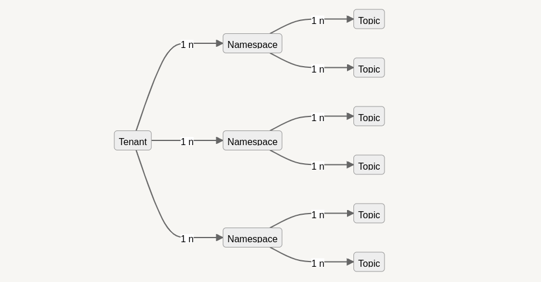

# Fastbase


Fastbase is a managed depot type within the DataOS that supports Apache Pulsar format for streaming workloads. Pulsar offers a “unified messaging model”  that combines the best features of traditional messaging systems like RabbitMQ and pub-sub (publish-subscribe) event streaming platforms like Apache Kafka. Users can leverage Fastbase depotsfor their streaming and real-time data workloads. 

## Commands in DataOS

DataOS allows users to manage Fastbase depots effortlessly using CLI. This functionality is made possible by the powerful API capabilities of Depot-Service.

<style>
    blockquote {
        background-color: #F6F3F8;
    }
</style>

<blockquote style="color: black;">

The primary command for interacting with the Fastbase Depot in DataOS is `dataos-ctl fastbase <sub-command>`. Using this command, you can perform various operations related to Fastbase.
</blockquote>


<aside style="background-color:#FAF3DD; padding:15px; border-radius:5px;">

🗣️  Bringing uniformity by getting rid of complex terminologies
To bring uniformity within DataOS, we have replaced specific terminologies related to underlying tech with their analogous DataOS counterpart. For example, topics in Pulsar are the named channels for transmitting messages from producers to consumers. They are streaming logs that are analogous to the dataset. Within DataOS, instead of a topic, we use the term dataset. 
Taking this into account, any Fastbase UDL (Universal Data Link) within the DataOS is referenced as 
```dataos://fastbase:<schema|none>/<dataset>```
E.g., dataos://fastbase:default/my_data is one such UDL where we use the default schema and use the my_data dataset (my_data is a Pulsar topic, but within the DataOS, the term topic is replaced by dataset while referencing UDL)

</aside>

<blockquote style="color: black;">
To execute Fastbase commands, it is necessary to have the `pulsar-admin` tag. You can check if you have the tag by running dataos-ctl user get in the terminal and verifying the presence of the dataos:u:pulsar:admin tag in the tags column.
</blockquote>

### **Create Dataset**

By creating and applying a YAML given below, you can create a dataset in Fastbase.


**Sample YAML**

```yaml
# example-manifest.yaml
schema: # <optional>
  type: "avro"
  avro: '<avro-schema>'
pulsar: # <optional>
  type: "partitioned" or "non-partitioned" #(choose one)
  partitions: 2 # <optional - use in case the type is: partitioned>dataos-ctl dataset create -a dataos://<pulsar-depot>:default/<topic-name> \ -f path/to/example-manifest.yaml+

```

**Command**

```shell
dataos-ctl dataset create -a <udl-address> -f <yaml-file-path>
```

<details><summary> Click on the toggle to see sample manifests</summary>

```yaml
pulsar: # <optional>
  type: "partitioned" or "non-partitioned" #(chose one)
  partitions: 2 # <optional - use in case the type is: partitioned>
```

This manifest creates a dataset with two partitions and without schema. In this case, the schema will be associated during write.

```yaml
schema:
  type: "avro"
  avro: '{"type":"record","name":"defaultName","fields":[{"name":"__metadata","type":{"type":"map","values":"string","key-id":10,"value-id":11},"field-id":1},{"name":"city_id","type":["null","string"],"default":null,"field-id":2},{"name":"zip_code","type":["null","int"],"default":null,"field-id":3},{"name":"city_name","type":["null","string"],"default":null,"field-id":4},{"name":"county_name","type":["null","string"],"default":null,"field-id":5},{"name":"state_code","type":["null","string"],"default":null,"field-id":6},{"name":"state_name","type":["null","string"],"default":null,"field-id":7},{"name":"version","type":"string","field-id":8},{"name":"ts_city","type":{"type":"long","logicalType":"timestamp-micros","adjust-to-utc":true},"field-id":9}]}'
pulsar: # <optional>
  type: "partitioned" or "non-partitioned" #(chose one)
  partitions: 2 # <optional - use in case the type is: partitioned>
```

This manifest creates a dataset with two partitions with ******the “Avro” ******schema.
</details>

**Note**: 

- Pulsar supports quantifiable distribution while partitioning the data. The value of the partitions key is in the `int` form, and it doesn’t support categorical partition.
- The minimum partition value should be 2.
- Pulsar is based on the number of distributions, while iceberg is based on the type of distributions you need.

---

### **Fetch Dataset**

With the help of the get command, we can gather or fetch all the information on the existing topic in Pulsar’s depot.

```bash
dataos-ctl dataset -a dataos://<pulsar-depot>:default/<topic-name>  get
```

---

## Tenant, Namespace, and Topic

Messages in Pulsar are published to topics and organized in a three-level hierarchy structure.



<center><i>Three Level Hierarchy Structure in Pulsar</i></center>

- One `tenant` **represents a specific business unit or a product line. Topics created under a `tenant` share the same business context that is distinct from others.
- Within one `tenant`, topics having similar behavioral characteristics can be further grouped into a smaller administrative unit called a `namespace`. Different policies such as message retention or expiry policy, can be set either at the `namespace` level or at an individual `topic` level. Policies set at the `namespace` level will apply to all topics under the `namespace`.

The below commands need to be executed in the above hierarchical order.

---

### **Tenants**

#### **List tenants**

The command `tenant list` displays the tenants in the DataOS Fastbase.

The tenant is a first-class citizen in Pulsar. Pulsar was created from the ground up as a multi-tenant system. To support multi-tenancy, Pulsar has a concept of tenants. Tenants can be spread across clusters and can each have their own authentication and authorization scheme applied to them. Multi-tenancy with Apache Pulsar deployments refers to authorized namespaces assigned to elastic cluster sets in support of software applications in the cloud data processing.

**Command**

```bash
dataos-ctl fastbase tenant list
```

Output

```bash
INFO[0000] 🔍 list...                            
INFO[0001] 🔍 list...complete

  TENANT
----------
  public
  pulsar
  system
```

---

### **Namespaces**

Namespaces are logical grouping of topics. After creating a tenant, you can create one or more namespaces ******for the tenant.

#### **List namespaces**

The command `namespace list` interacts with namespaces in the DataOS Fastbase and also lists the namespaces.

```bash
dataos-ctl fastbase namespace -t <tenant_name> list
```

**Command**

```bash
dataos-ctl fastbase namespace -t public list
```

Output

```bash
INFO[0000] 🔍 list...                            
INFO[0001] 🔍 list...complete

    NAMESPACE
-----------------
  public/default
```

---

### **Topics**

Topic in Pulsar is referred to as a dataset in DataOS. Topics are the endpoints for publishing and consuming messages. Producers send the data to pulsar topics, and consumers read them from the same pulsar topic. 

We currently support the creation of partitioned and non-partitioned `topics`, aka `datasets` with or without `schema`. The schema format that is currently supported by it is Avro.

#### **List topics**

The topics are listed with the help of `the topic list` command.

```bash
dataos-ctl fastbase topic -n <tenant_name>/<namespace_name> list
```

**Command**

```bash
dataos-ctl fastbase topic -n public/default list
```

Output

```bash
INFO[0000] 🔍 list...                            
INFO[0001] 🔍 list...complete

                TOPIC               | PARTITIONED    
------------------------------------|----------------
 persistent://public/default/public | N
 persistent://public/default/user   | N
```

In Pulsar, the name of a `topic` reflects the following structure:

```bash
{persistent|non-persistent}://<tenant_name>/<namespace_name>/<topic_name>
```

Pulsar has persistent and non-persistent topics. 

A persistent topic is a logical endpoint for publishing and consuming messages. The topic name structure for persistent topics is:

```bash
persistent://tenant/namespace/topic
```

Non-persistent topics are used in applications that only consume real-time published messages and do not need persistent guarantees. This way, it reduces message-publish latency by removing the overhead of persisting messages. The topic name structure for non-persistent topics is:

```bash
non-persistent://tenant/namespace/topic
```

---

#### **Topic consume**

This command consumes messages from a topic. Also, the consumer and subscription details are displayed with the help of this command. 

```bash
dataos-ctl fastbase topic consume [flags]
Flags:
  -h, --help                  help for consume
  -l, --logMessage            Log message (default true)
  -p, --logPayload            Log payload with message
  -s, --startAtFirstMessage   Start at the first message in the topic
  -t, --topic string          FastBase topic to consume messages from
```

**Command (-p, -s, -t flags)**

```bash
dataos-ctl fastbase topic consume -p -s -t persistent://public/default/random_users_02
```

<details>

<summary>Output</summary>

```bash
INFO[0000] 🔍 consume...                                 
WARN[0003] code: 404 reason: Subscription not found     
INFO[0006] [Connecting to broker]                        remote_addr="pulsar+ssl://tcp.above-dragon.dataos.app:6651"
INFO[0007] [TCP connection established]                  local_addr="192.168.68.62:50854" remote_addr="pulsar+ssl://tcp.above-dragon.dataos.app:6651"
INFO[0007] [Connection is ready]                         local_addr="192.168.68.62:50854" remote_addr="pulsar+ssl://tcp.above-dragon.dataos.app:6651"
INFO[0008] [Connecting to broker]                        remote_addr="pulsar+ssl://tcp.above-dragon.dataos.app:6651"
INFO[0009] [TCP connection established]                  local_addr="192.168.68.62:50856" remote_addr="pulsar+ssl://tcp.above-dragon.dataos.app:6651"
INFO[0010] [Connection is ready]                         local_addr="192.168.68.62:50856" remote_addr="pulsar+ssl://tcp.above-dragon.dataos.app:6651"
INFO[0010] [Connected consumer]                          consumerID=1 name=kipsy subscription=023bd9ba506abcf0e3701c5faa22cf4c8b545bf40fcb607a435fbbcb59be9408 topic="persistent://public/default/random_users_02"
INFO[0010] [Created consumer]                            consumerID=1 name=kipsy subscription=023bd9ba506abcf0e3701c5faa22cf4c8b545bf40fcb607a435fbbcb59be9408 topic="persistent://public/default/random_users_02"
{"id":"CKoKEAAYACAA","string_id":"1322:0:0","payload":{"age":"","city":"Nova Iguaçu","country":"Brazil","email":"ivone.rezende@example.com","first_name":"Ivone","gender":"female","id":"f87624d4-d04e-47b2-aa1a-81a5a887bc7a","last_name":"","phone":"(76) 7285-1917","postcode":"87183","state":"Mato Grosso","title":"Ms"},"publish_time":"2022-06-22T12:10:12.581+05:30","event_time":"2022-06-22T12:10:12.581+05:30","producer_name":"pulsar-4-623","topic":"persistent://public/default/random_users_02"}
{"id":"CKoKEAEYACAA","string_id":"1322:1:0","payload":{"age":"","city":"Shannon","country":"Ireland","email":"kathleen.richards@example.com","first_name":"Kathleen","gender":"female","id":"9efe2757-f81d-4ec7-9940-14c9a34d1c5c","last_name":"","phone":"051-256-6998","postcode":"55659","state":"Leitrim","title":"Mrs"},"publish_time":"2022-06-22T12:10:12.6+05:30","event_time":"2022-06-22T12:10:12.6+05:30","producer_name":"pulsar-4-623","topic":"persistent://public/default/random_users_02"}
{"id":"CKoKEAIYACAA","string_id":"1322:2:0","payload":{"age":"","city":"Limeira","country":"Brazil","email":"silnior.nogueira@example.com","first_name":"Sílnior","gender":"female","id":"d399586e-d54d-4a92-84fd-b30b4b320012","last_name":"","phone":"(92) 6422-7741","postcode":"74804","state":"Alagoas","title":"Miss"},"publish_time":"2022-06-22T12:10:12.616+05:30","event_time":"2022-06-22T12:10:12.616+05:30","producer_name":"pulsar-4-623","topic":"persistent://public/default/random_users_02"}
{"id":"CKoKEAMYACAA","string_id":"1322:3:0","payload":{"age":"","city":"Weimar","country":"Germany","email":"brigitta.godecke@example.com","first_name":"Brigitta","gender":"female","id":"ffca87ba-72c2-4f40-996e-5aaf233dbd03","last_name":"","phone":"0446-7765109","postcode":"46669","state":"Nordrhein-Westfalen","title":"Mrs"},"publish_time":"2022-06-22T12:10:12.63+05:30","event_time":"2022-06-22T12:10:12.63+05:30","producer_name":"pulsar-4-623","topic":"persistent://public/default/random_users_02"}
{"id":"CKoKEAQYACAA","string_id":"1322:4:0","payload":{"age":"","city":"Ryslinge","country":"Denmark","email":"alberte.mortensen@example.com","first_name":"Alberte","gender":"female","id":"6b3cebd5-b41a-474b-9d5e-4209b29b5097","last_name":"","phone":"15539760","postcode":"70648","state":"Danmark","title":"Ms"},"publish_time":"2022-06-22T12:10:12.727+05:30","event_time":"2022-06-22T12:10:12.727+05:30","producer_name":"pulsar-4-623","topic":"persistent://public/default/random_users_02"}
```

</details>

---

**Command (-p,-s,-t,-l flags)**

```bash
dataos-ctl fastbase topic consume -p -s -t persistent://public/default/usaflogs -l false
```

<details><summary>Output</summary>
    
```bash
ERRO[0008] [Failed to get last message id from broker]   error="connection closed" topic="persistent://public/default/usaflogs"
ERRO[0008] [Failed to get last message id]               consumerID=1 error="connection closed" name=023bd9ba506abcf0e3701c5faa22cf4c8b545bf40fcb607a435fbbcb59be9408 subscription=reader-flbtz topic="persistent://public/default/usaflogs"
ERRO[0008] [Failed to get last message id from broker]   error="connection closed" topic="persistent://public/default/usaflogs"
ERRO[0008] [Failed to get last message id]               consumerID=1 error="connection closed" name=023bd9ba506abcf0e3701c5faa22cf4c8b545bf40fcb607a435fbbcb59be9408 subscription=reader-flbtz topic="persistent://public/default/usaflogs"
ERRO[0008] [Failed to get last message id from broker]   error="connection closed" topic="persistent://public/default/usaflogs"
ERRO[0008] [Failed to get last message id]               consumerID=1 error="connection closed" name=023bd9ba506abcf0e3701c5faa22cf4c8b545bf40fcb607a435fbbcb59be9408 subscription=reader-flbtz topic="persistent://public/default/usaflogs"
ERRO[0008] [Failed to get last message id from broker]   error="connection closed" topic="persistent://public/default/usaflogs"
ERRO[0008] [Failed to get last message id]               consumerID=1 error="connection closed" name=023bd9ba506abcf0e3701c5faa22cf4c8b545bf40fcb607a435fbbcb59be9408 subscription=reader-flbtz topic="persistent://public/default/usaflogs"
ERRO[0008] [Failed to get last message id from broker]   error="connection closed" topic="persistent://public/default/usaflogs"
ERRO[0008] [Failed to get last message id]               consumerID=1 error="connection closed" name=023bd9ba506abcf0e3701c5faa22cf4c8b545bf40fcb607a435fbbcb59be9408 subscription=reader-flbtz topic="persistent://public/default/usaflogs"
INFO[0008] [Connected consumer]                          consumerID=1 name=023bd9ba506abcf0e3701c5faa22cf4c8b545bf40fcb607a435fbbcb59be9408 subscription=reader-flbtz topic="persistent://public/default/usaflogs"
INFO[0008] [Reconnected consumer to broker]              consumerID=1 name=023bd9ba506abcf0e3701c5faa22cf4c8b545bf40fcb607a435fbbcb59be9408 subscription=reader-flbtz topic="persistent://public/default/usaflogs"
ERRO[0008] [Failed to get last message id from broker]   error="connection closed" topic="persistent://public/default/usaflogs"
INFO[0008] no more messages to read...exiting           
INFO[0008] Closing consumer=1                            consumerID=1 name=023bd9ba506abcf0e3701c5faa22cf4c8b545bf40fcb607a435fbbcb59be9408 subscription=reader-flbtz topic="persistent://public/default/usaflogs"
{"id":"CNkBEMYcGAAgAA==","string_id":"217:3654:0","payload":"JjIwMjItMDgtMzFUMTI6MDc6NDNINGNiMTAyNTItNjcwOC00NzgwLWJhOTMtYzg3N2E5NDc0NDgzFEZ1ZWxJbmdlc3QGODc3DGxpdHJlcw==","publish_time":"2022-08-31T17:37:43.841+05:30","event_time":"2022-08-31T17:37:43.841+05:30","producer_name":"pulsar-2-4","topic":"persistent://public/default/usaflogs"}
{"id":"CNkBEMccGAAgAA==","string_id":"217:3655:0","payload":"JjIwMjItMDgtMzFUMTI6MDc6NDdINGNiMTAyNTItNjcwOC00NzgwLWJhOTMtYzg3N2E5NDc0NDgzFEZ1ZWxJbmdlc3QGMTEwDGxpdHJlcw==","publish_time":"2022-08-31T17:37:47.659+05:30","event_time":"2022-08-31T17:37:47.659+05:30","producer_name":"pulsar-2-4","topic":"persistent://public/default/usaflogs"}
INFO[0009] [Closed consumer]                             consumerID=1 name=023bd9ba506abcf0e3701c5faa22cf4c8b545bf40fcb607a435fbbcb59be9408 subscription=reader-flbtz topic="persistent://public/default/usaflogs"
INFO[0009] [close consumer, exit reconnect]              consumerID=1 name=023bd9ba506abcf0e3701c5faa22cf4c8b545bf40fcb607a435fbbcb59be9408 subscription=reader-flbtz topic="persistent://public/default/usaflogs"
INFO[0009] 🔍 read...complete
```
</details> 

---

#### **Topic read**

The command helps to read the topic, additional flags are given below

```bash
dataos-ctl fastbase topic read [flags]

Flags:
  -d, --duration string    FastBase duration to seek in the past
  -h, --help               help for read
  -l, --logMessage         Log message (default true)
  -p, --logPayload         Log payload with message
  -m, --messageId string   FastBase message id to start reading from
  -t, --topic string       FastBase topic to read message from
```

**Command (-p,-t flags)**

```bash
dataos-ctl fastbase topic read -p -t persistent://public/default/random_users_02
```

<details> <summary> Output </summary>
    
```bash
INFO[0000] 🔍 read...                                   
INFO[0006] [Connecting to broker]                        remote_addr="pulsar+ssl://tcp.above-dragon.dataos.app:6651"
INFO[0007] [TCP connection established]                  local_addr="192.168.68.62:50854" remote_addr="pulsar+ssl://tcp.above-dragon.dataos.app:6651"
INFO[0007] [Connection is ready]                         local_addr="192.168.68.62:50854" remote_addr="pulsar+ssl://tcp.above-dragon.dataos.app:6651"
INFO[0008] [Connecting to broker]                        remote_addr="pulsar+ssl://tcp.above-dragon.dataos.app:6651"
INFO[0009] [TCP connection established]                  local_addr="192.168.68.62:50856" remote_addr="pulsar+ssl://tcp.above-dragon.dataos.app:6651"
INFO[0010] [Connection is ready]                         local_addr="192.168.68.62:50856" remote_addr="pulsar+ssl://tcp.above-dragon.dataos.app:6651"
INFO[0010] [Connected consumer]                          consumerID=1 name=kipsy subscription=023bd9ba506abcf0e3701c5faa22cf4c8b545bf40fcb607a435fbbcb59be9408 topic="persistent://public/default/random_users_02"
INFO[0010] [Created consumer]                            consumerID=1 name=kipsy subscription=023bd9ba506abcf0e3701c5faa22cf4c8b545bf40fcb607a435fbbcb59be9408 topic="persistent://public/default/random_users_02"
{"id":"CKoKEAAYACAA","string_id":"1322:0:0","payload":{"age":"","city":"Nova Iguaçu","country":"Brazil","email":"ivone.rezende@example.com","first_name":"Ivone","gender":"female","id":"f87624d4-d04e-47b2-aa1a-81a5a887bc7a","last_name":"","phone":"(76) 7285-1917","postcode":"87183","state":"Mato Grosso","title":"Ms"},"publish_time":"2022-06-22T12:10:12.581+05:30","event_time":"2022-06-22T12:10:12.581+05:30","producer_name":"pulsar-4-623","topic":"persistent://public/default/random_users_02"}
{"id":"CKoKEAEYACAA","string_id":"1322:1:0","payload":{"age":"","city":"Shannon","country":"Ireland","email":"kathleen.richards@example.com","first_name":"Kathleen","gender":"female","id":"9efe2757-f81d-4ec7-9940-14c9a34d1c5c","last_name":"","phone":"051-256-6998","postcode":"55659","state":"Leitrim","title":"Mrs"},"publish_time":"2022-06-22T12:10:12.6+05:30","event_time":"2022-06-22T12:10:12.6+05:30","producer_name":"pulsar-4-623","topic":"persistent://public/default/random_users_02"}
{"id":"CKoKEAIYACAA","string_id":"1322:2:0","payload":{"age":"","city":"Limeira","country":"Brazil","email":"silnior.nogueira@example.com","first_name":"Sílnior","gender":"female","id":"d399586e-d54d-4a92-84fd-b30b4b320012","last_name":"","phone":"(92) 6422-7741","postcode":"74804","state":"Alagoas","title":"Miss"},"publish_time":"2022-06-22T12:10:12.616+05:30","event_time":"2022-06-22T12:10:12.616+05:30","producer_name":"pulsar-4-623","topic":"persistent://public/default/random_users_02"}
{"id":"CKoKEAMYACAA","string_id":"1322:3:0","payload":{"age":"","city":"Weimar","country":"Germany","email":"brigitta.godecke@example.com","first_name":"Brigitta","gender":"female","id":"ffca87ba-72c2-4f40-996e-5aaf233dbd03","last_name":"","phone":"0446-7765109","postcode":"46669","state":"Nordrhein-Westfalen","title":"Mrs"},"publish_time":"2022-06-22T12:10:12.63+05:30","event_time":"2022-06-22T12:10:12.63+05:30","producer_name":"pulsar-4-623","topic":"persistent://public/default/random_users_02"}
{"id":"CKoKEAQYACAA","string_id":"1322:4:0","payload":{"age":"","city":"Ryslinge","country":"Denmark","email":"alberte.mortensen@example.com","first_name":"Alberte","gender":"female","id":"6b3cebd5-b41a-474b-9d5e-4209b29b5097","last_name":"","phone":"15539760","postcode":"70648","state":"Danmark","title":"Ms"},"publish_time":"2022-06-22T12:10:12.727+05:30","event_time":"2022-06-22T12:10:12.727+05:30","producer_name":"pulsar-4-623","topic":"persistent://public/default/random_users_02"}
```

</details>
    

**Command (-p,-t,-m flags)**

```bash
dataos-ctl fastbase topic read -p -t persistent://public/default/usaflogs -d 5s
```

<details><summary>Output</summary>
    
```bash
INFO[0000] 🔍 read...                                   
INFO[0006] [Connecting to broker]                        remote_addr="pulsar+ssl://tcp.above-dragon.dataos.app:6651"
INFO[0007] [TCP connection established]                  local_addr="192.168.68.62:50854" remote_addr="pulsar+ssl://tcp.above-dragon.dataos.app:6651"
INFO[0007] [Connection is ready]                         local_addr="192.168.68.62:50854" remote_addr="pulsar+ssl://tcp.above-dragon.dataos.app:6651"
INFO[0008] [Connecting to broker]                        remote_addr="pulsar+ssl://tcp.above-dragon.dataos.app:6651"
INFO[0009] [TCP connection established]                  local_addr="192.168.68.62:50856" remote_addr="pulsar+ssl://tcp.above-dragon.dataos.app:6651"
INFO[0010] [Connection is ready]                         local_addr="192.168.68.62:50856" remote_addr="pulsar+ssl://tcp.above-dragon.dataos.app:6651"
INFO[0010] [Connected consumer]                          consumerID=1 name=kipsy subscription=023bd9ba506abcf0e3701c5faa22cf4c8b545bf40fcb607a435fbbcb59be9408 topic="persistent://public/default/random_users_02"
INFO[0010] [Created consumer]                            
ERRO[0013] [Failed to get last message id]               consumerID=1 error="connection closed" name=023bd9ba506abcf0e3701c5faa22cf4c8b545bf40fcb607a435fbbcb59be9408 subscription=reader-nevot topic="persistent://public/default/usaflogs"
ERRO[0013] [Failed to get last message id from broker]   error="connection closed" topic="persistent://public/default/usaflogs"
INFO[0013] [Connected consumer]                          consumerID=1 name=023bd9ba506abcf0e3701c5faa22cf4c8b545bf40fcb607a435fbbcb59be9408 subscription=reader-nevot topic="persistent://public/default/usaflogs"
INFO[0013] [Reconnected consumer to broker]              consumerID=1 name=023bd9ba506abcf0e3701c5faa22cf4c8b545bf40fcb607a435fbbcb59be9408 subscription=reader-nevot topic="persistent://public/default/usaflogs"
{"id":"CNkBEIsdGAAgAA==","string_id":"217:3723:0","payload":"JjIwMjItMDgtMzFUMTI6MTE6NDBINGNiMTAyNTItNjcwOC00NzgwLWJhOTMtYzg3N2E5NDc0NDgzEkZ1ZWxTcGVudAgyNDQ4DGxpdHJlcw==","publish_time":"2022-08-31T17:41:40.27+05:30","event_time":"2022-08-31T17:41:40.27+05:30","producer_name":"pulsar-2-4","topic":"persistent://public/default/usaflogs"}
{"id":"CNkBEIwdGAAgAA==","string_id":"217:3724:0","payload":"JjIwMjItMDgtMzFUMTI6MTE6NDJIOGVkMGQ5OGUtNmUwNS00NDhhLWEzNTgtNzQ0MzRlYWVkMjg0EkZ1ZWxTcGVudAY2NzkOZ2FsbG9ucw==","publish_time":"2022-08-31T17:41:42.254+05:30","event_time":"2022-08-31T17:41:42.254+05:30","producer_name":"pulsar-2-4","topic":"persistent://public/default/usaflogs"}
{"id":"CNkBEI0dGAAgAA==","string_id":"217:3725:0","payload":"JjIwMjItMDgtMzFUMTI6MTE6NDRINGNiMTAyNTItNjcwOC00NzgwLWJhOTMtYzg3N2E5NDc0NDgzFEZ1ZWxJbmdlc3QGODQ4DGxpdHJlcw==","publish_time":"2022-08-31T17:41:44.256+05:30","event_time":"2022-08-31T17:41:44.256+05:30","producer_name":"pulsar-2-4","topic":"persistent://public/default/usaflogs"}
{"id":"CNkBEI4dGAAgAA==","string_id":"217:3726:0","payload":"JjIwMjItMDgtMzFUMTI6MTE6NDZIOGVkMGQ5OGUtNmUwNS00NDhhLWEzNTgtNzQ0MzRlYWVkMjg0FEZ1ZWxJbmdlc3QGNDEwDmdhbGxvbnM=","publish_time":"2022-08-31T17:41:46.234+05:30","event_time":"2022-08-31T17:41:46.233+05:30","producer_name":"pulsar-2-4","topic":"persistent://public/default/usaflogs"}
{"id":"CNkBEI8dGAAgAA==","string_id":"217:3727:0","payload":"JjIwMjItMDgtMzFUMTI6MTE6NDhINGNiMTAyNTItNjcwOC00NzgwLWJhOTMtYzg3N2E5NDc0NDgzFEZ1ZWxJbmdlc3QGODMyDGxpdHJlcw==","publish_time":"2022-08-31T17:41:48.137+05:30","event_time":"2022-08-31T17:41:48.137+05:30","producer_name":"pulsar-2-4","topic":"persistent://public/default/usaflogs"}
{"id":"CNkBEJAdGAAgAA==","string_id":"217:3728:0","payload":"JjIwMjItMDgtMzFUMTI6MTE6NDlINGNiMTAyNTItNjcwOC00NzgwLWJhOTMtYzg3N2E5NDc0NDgzEkZ1ZWxTcGVudAY2NzkMbGl0cmVz","publish_time":"2022-08-31T17:41:50.021+05:30","event_time":"2022-08-31T17:41:50.021+05:30","producer_name":"pulsar-2-4","topic":"persistent://public/default/usaflogs"}
```
</details>
    

**Command (-p, -t, -m flags)**

```bash
dataos-ctl fastbase topic read -p -t persistent://public/default/usaflogs -m CNkBEMccGAAgAA==
```
<details>
<summary>Output</summary>
    
```bash
ERRO[0014] [Failed to get last message id from broker]   error="connection closed" topic="persistent://public/default/usaflogs"
ERRO[0014] [Failed to get last message id]               consumerID=1 error="connection closed" name=023bd9ba506abcf0e3701c5faa22cf4c8b545bf40fcb607a435fbbcb59be9408 subscription=reader-bodoo topic="persistent://public/default/usaflogs"
ERRO[0014] [Failed to get last message id from broker]   error="connection closed" topic="persistent://public/default/usaflogs"
ERRO[0014] [Failed to get last message id]               consumerID=1 error="connection closed" name=023bd9ba506abcf0e3701c5faa22cf4c8b545bf40fcb607a435fbbcb59be9408 subscription=reader-bodoo topic="persistent://public/default/usaflogs"
ERRO[0014] [Failed to get last message id from broker]   error="connection closed" topic="persistent://public/default/usaflogs"
ERRO[0014] [Failed to get last message id]               consumerID=1 error="connection closed" name=023bd9ba506abcf0e3701c5faa22cf4c8b545bf40fcb607a435fbbcb59be9408 subscription=reader-bodoo topic="persistent://public/default/usaflogs"
ERRO[0014] [Failed to get last message id from broker]   error="connection closed" topic="persistent://public/default/usaflogs"
ERRO[0014] [Failed to get last message id]               consumerID=1 error="connection closed" name=023bd9ba506abcf0e3701c5faa22cf4c8b545bf40fcb607a435fbbcb59be9408 subscription=reader-bodoo topic="persistent://public/default/usaflogs"
ERRO[0014] [Failed to get last message id from broker]   error="connection closed" topic="persistent://public/default/usaflogs"
INFO[0014] [Connected consumer]                          consumerID=1 name=023bd9ba506abcf0e3701c5faa22cf4c8b545bf40fcb607a435fbbcb59be9408 subscription=reader-bodoo topic="persistent://public/default/usaflogs"
INFO[0014] [Reconnected consumer to broker]              consumerID=1 name=023bd9ba506abcf0e3701c5faa22cf4c8b545bf40fcb607a435fbbcb59be9408 subscription=reader-bodoo topic="persistent://public/default/usaflogs"
{"id":"CNkBEMccGAAgAA==","string_id":"217:3655:0","payload":"JjIwMjItMDgtMzFUMTI6MDc6NDdINGNiMTAyNTItNjcwOC00NzgwLWJhOTMtYzg3N2E5NDc0NDgzFEZ1ZWxJbmdlc3QGMTEwDGxpdHJlcw==","publish_time":"2022-08-31T17:37:47.659+05:30","event_time":"2022-08-31T17:37:47.659+05:30","producer_name":"pulsar-2-4","topic":"persistent://public/default/usaflogs"}
{"id":"CNkBEMgcGAAgAA==","string_id":"217:3656:0","payload":"JjIwMjItMDgtMzFUMTI6MDc6NTFINGNiMTAyNTItNjcwOC00NzgwLWJhOTMtYzg3N2E5NDc0NDgzEkZ1ZWxTcGVudAY3NjcMbGl0cmVz","publish_time":"2022-08-31T17:37:51.643+05:30","event_time":"2022-08-31T17:37:51.643+05:30","producer_name":"pulsar-2-4","topic":"persistent://public/default/usaflogs"}
{"id":"CNkBEMkcGAAgAA==","string_id":"217:3657:0","payload":"JjIwMjItMDgtMzFUMTI6MDc6NTZIOGVkMGQ5OGUtNmUwNS00NDhhLWEzNTgtNzQ0MzRlYWVkMjg0EkZ1ZWxTcGVudAQxMA5nYWxsb25z","publish_time":"2022-08-31T17:37:56.769+05:30","event_time":"2022-08-31T17:37:56.769+05:30","producer_name":"pulsar-2-4","topic":"persistent://public/default/usaflogs"}
{"id":"CNkBEMocGAAgAA==","string_id":"217:3658:0","payload":"JjIwMjItMDgtMzFUMTI6MDg6MDFIOGVkMGQ5OGUtNmUwNS00NDhhLWEzNTgtNzQ0MzRlYWVkMjg0FEZ1ZWxJbmdlc3QGMTMwDmdhbGxvbnM=","publish_time":"2022-08-31T17:38:01.823+05:30","event_time":"2022-08-31T17:38:01.823+05:30","producer_name":"pulsar-2-4","topic":"persistent://public/default/usaflogs"}
{"id":"CNkBEMscGAAgAA==","string_id":"217:3659:0","payload":"JjIwMjItMDgtMzFUMTI6MDg6MDZIOGVkMGQ5OGUtNmUwNS00NDhhLWEzNTgtNzQ0MzRlYWVkMjg0FEZ1ZWxJbmdlc3QGMzkyDmdhbGxvbnM=","publish_time":"2022-08-31T17:38:06.941+05:30","event_time":"2022-08-31T17:38:06.941+05:30","producer_name":"pulsar-2-4","topic":"persistent://public/default/usaflogs"}
{"id":"CNkBEMwcGAAgAA==","string_id":"217:3660:0","payload":"JjIwMjItMDgtMzFUMTI6MDg6MTBIOGVkMGQ5OGUtNmUwNS00NDhhLWEzNTgtNzQ0MzRlYWVkMjg0FEZ1ZWxJbmdlc3QGNzk3DmdhbGxvbnM=","publish_time":"2022-08-31T17:38:10.958+05:30","event_time":"2022-08-31T17:38:10.958+05:30","producer_name":"pulsar-2-4","topic":"persistent://public/default/usaflogs"}
{"id":"CNkBEM0cGAAgAA==","string_id":"217:3661:0","payload":"JjIwMjItMDgtMzFUMTI6MDg6MTVIOGVkMGQ5OGUtNmUwNS00NDhhLWEzNTgtNzQ0MzRlYWVkMjg0FEZ1ZWxJbmdlc3QGMTg3DmdhbGxvbnM=","publish_time":"2022-08-31T17:38:15.945+05:30","event_time":"2022-08-31T17:38:15.945+05:30","producer_name":"pulsar-2-4","topic":"persistent://public/default/usaflogs"}
{"id":"CNkBEM4cGAAgAA==","string_id":"217:3662:0","payload":"JjIwMjItMDgtMzFUMTI6MDg6MTlIOGVkMGQ5OGUtNmUwNS00NDhhLWEzNTgtNzQ0MzRlYWVkMjg0EkZ1ZWxTcGVudAYzMzUOZ2FsbG9ucw==","publish_time":"2022-08-31T17:38:19.847+05:30","event_time":"2022-08-31T17:38:19.846+05:30","producer_name":"pulsar-2-4","topic":"persistent://public/default/usaflogs"}
{"id":"CNkBEM8cGAAgAA==","string_id":"217:3663:0","payload":"JjIwMjItMDgtMzFUMTI6MDg6MjNINGNiMTAyNTItNjcwOC00NzgwLWJhOTMtYzg3N2E5NDc0NDgzEkZ1ZWxTcGVudAY0MDAMbGl0cmVz","publish_time":"2022-08-31T17:38:23.936+05:30","event_time":"2022-08-31T17:38:23.936+05:30","producer_name":"pulsar-2-4","topic":"persistent://public/default/usaflogs"}
{"id":"CNkBENAcGAAgAA==","string_id":"217:3664:0","payload":"JjIwMjItMDgtMzFUMTI6MDg6MzZINGNiMTAyNTItNjcwOC00NzgwLWJhOTMtYzg3N2E5NDc0NDgzFEZ1ZWxJbmdlc3QGNDk3DGxpdHJlcw==","publish_time":"2022-08-31T17:38:36.621+05:30","event_time":"2022-08-31T17:38:36.621+05:30","producer_name":"pulsar-2-4","topic":"persistent://public/default/usaflogs"}
{"id":"CNkBENEcGAAgAA==","string_id":"217:3665:0","payload":"JjIwMjItMDgtMzFUMTI6MDg6NDBIOGVkMGQ5OGUtNmUwNS00NDhhLWEzNTgtNzQ0MzRlYWVkMjg0EkZ1ZWxTcGVudAY0NzEOZ2FsbG9ucw==","publish_time":"2022-08-31T17:38:40.433+05:30","event_time":"2022-08-31T17:38:40.433+05:30","producer_name":"pulsar-2-4","topic":"persistent://public/default/usaflogs"}
{"id":"CNkBENIcGAAgAA==","string_id":"217:3666:0","payload":"JjIwMjItMDgtMzFUMTI6MDg6NTBIOGVkMGQ5OGUtNmUwNS00NDhhLWEzNTgtNzQ0MzRlYWVkMjg0FEZ1ZWxJbmdlc3QGMTk1DmdhbGxvbnM=","publish_time":"2022-08-31T17:38:50.739+05:30","event_time":"2022-08-31T17:38:50.739+05:30","producer_name":"pulsar-2-4","topic":"persistent://public/default/usaflogs"}
{"id":"CNkBENMcGAAgAA==","string_id":"217:3667:0","payload":"JjIwMjItMDgtMzFUMTI6MDg6NTRIOGVkMGQ5OGUtNmUwNS00NDhhLWEzNTgtNzQ0MzRlYWVkMjg0FEZ1ZWxJbmdlc3QGMjgyDmdhbGxvbnM=","publish_time":"2022-08-31T17:38:54.638+05:30","event_time":"2022-08-31T17:38:54.637+05:30","producer_name":"pulsar-2-4","topic":"persistent://public/default/usaflogs"}
{"id":"CNkBENQcGAAgAA==","string_id":"217:3668:0","payload":"JjIwMjItMDgtMzFUMTI6MDg6NThINGNiMTAyNTItNjcwOC00NzgwLWJhOTMtYzg3N2E5NDc0NDgzFEZ1ZWxJbmdlc3QGMzk0DGxpdHJlcw==","publish_time":"2022-08-31T17:38:58.526+05:30","event_time":"2022-08-31T17:38:58.526+05:30","producer_name":"pulsar-2-4","topic":"persistent://public/default/usaflogs"}
{"id":"CNkBENUcGAAgAA==","string_id":"217:3669:0","payload":"JjIwMjItMDgtMzFUMTI6MDk6MDBINGNiMTAyNTItNjcwOC00NzgwLWJhOTMtYzg3N2E5NDc0NDgzEkZ1ZWxTcGVudAQ1OAxsaXRyZXM=","publish_time":"2022-08-31T17:39:00.344+05:30","event_time":"2022-08-31T17:39:00.344+05:30","producer_name":"pulsar-2-4","topic":"persistent://public/default/usaflogs"}
{"id":"CNkBENYcGAAgAA==","string_id":"217:3670:0","payload":"JjIwMjItMDgtMzFUMTI6MDk6MDJIOGVkMGQ5OGUtNmUwNS00NDhhLWEzNTgtNzQ0MzRlYWVkMjg0EkZ1ZWxTcGVudAYxMDQOZ2FsbG9ucw==","publish_time":"2022-08-31T17:39:02.353+05:30","event_time":"2022-08-31T17:39:02.353+05:30","producer_name":"pulsar-2-4","topic":"persistent://public/default/usaflogs"}
{"id":"CNkBENccGAAgAA==","string_id":"217:3671:0","payload":"JjIwMjItMDgtMzFUMTI6MDk6MDVIOGVkMGQ5OGUtNmUwNS00NDhhLWEzNTgtNzQ0MzRlYWVkMjg0EkZ1ZWxTcGVudAgxMDI3DmdhbGxvbnM=","publish_time":"2022-08-31T17:39:05.236+05:30","event_time":"2022-08-31T17:39:05.236+05:30","producer_name":"pulsar-2-4","topic":"persistent://public/default/usaflogs"}
{"id":"CNkBENgcGAAgAA==","string_id":"217:3672:0","payload":"JjIwMjItMDgtMzFUMTI6MDk6MDdIOGVkMGQ5OGUtNmUwNS00NDhhLWEzNTgtNzQ0MzRlYWVkMjg0EkZ1ZWxTcGVudAQyMg5nYWxsb25z","publish_time":"2022-08-31T17:39:07.232+05:30","event_time":"2022-08-31T17:39:07.232+05:30","producer_name":"pulsar-2-4","topic":"persistent://public/default/usaflogs"}
{"id":"CNkBENkcGAAgAA==","string_id":"217:3673:0","payload":"JjIwMjItMDgtMzFUMTI6MDk6MTJIOGVkMGQ5OGUtNmUwNS00NDhhLWEzNTgtNzQ0MzRlYWVkMjg0FEZ1ZWxJbmdlc3QGNzY3DmdhbGxvbnM=","publish_time":"2022-08-31T17:39:12.939+05:30","event_time":"2022-08-31T17:39:12.939+05:30","producer_name":"pulsar-2-4","topic":"persistent://public/default/usaflogs"}
INFO[0016] no more messages to read...exiting           
INFO[0016] Closing consumer=1                            consumerID=1 name=023bd9ba506abcf0e3701c5faa22cf4c8b545bf40fcb607a435fbbcb59be9408 subscription=reader-bodoo topic="persistent://public/default/usaflogs"
INFO[0016] [Closed consumer]                             consumerID=1 name=023bd9ba506abcf0e3701c5faa22cf4c8b545bf40fcb607a435fbbcb59be9408 subscription=reader-bodoo topic="persistent://public/default/usaflogs"
INFO[0016] [close consumer, exit reconnect]              consumerID=1 name=023bd9ba506abcf0e3701c5faa22cf4c8b545bf40fcb607a435fbbcb59be9408 subscription=reader-bodoo topic="persistent://public/default/usaflogs"
INFO[0016] 🔍 read...complete
```
</details>
    

---

**Command (-p,-t,-l flags)**

```bash
dataos-ctl fastbase topic read -p -t persistent://public/default/usaflogs -l false
```
<details><summary>Output</summary>
    
```bash
ERRO[0008] [Failed to get last message id from broker]   error="connection closed" topic="persistent://public/default/usaflogs"
ERRO[0008] [Failed to get last message id]               consumerID=1 error="connection closed" name=023bd9ba506abcf0e3701c5faa22cf4c8b545bf40fcb607a435fbbcb59be9408 subscription=reader-flbtz topic="persistent://public/default/usaflogs"
ERRO[0008] [Failed to get last message id from broker]   error="connection closed" topic="persistent://public/default/usaflogs"
ERRO[0008] [Failed to get last message id]               consumerID=1 error="connection closed" name=023bd9ba506abcf0e3701c5faa22cf4c8b545bf40fcb607a435fbbcb59be9408 subscription=reader-flbtz topic="persistent://public/default/usaflogs"
ERRO[0008] [Failed to get last message id from broker]   error="connection closed" topic="persistent://public/default/usaflogs"
ERRO[0008] [Failed to get last message id]               consumerID=1 error="connection closed" name=023bd9ba506abcf0e3701c5faa22cf4c8b545bf40fcb607a435fbbcb59be9408 subscription=reader-flbtz topic="persistent://public/default/usaflogs"
ERRO[0008] [Failed to get last message id from broker]   error="connection closed" topic="persistent://public/default/usaflogs"
ERRO[0008] [Failed to get last message id]               consumerID=1 error="connection closed" name=023bd9ba506abcf0e3701c5faa22cf4c8b545bf40fcb607a435fbbcb59be9408 subscription=reader-flbtz topic="persistent://public/default/usaflogs"
ERRO[0008] [Failed to get last message id from broker]   error="connection closed" topic="persistent://public/default/usaflogs"
ERRO[0008] [Failed to get last message id]               consumerID=1 error="connection closed" name=023bd9ba506abcf0e3701c5faa22cf4c8b545bf40fcb607a435fbbcb59be9408 subscription=reader-flbtz topic="persistent://public/default/usaflogs"
INFO[0008] [Connected consumer]                          consumerID=1 name=023bd9ba506abcf0e3701c5faa22cf4c8b545bf40fcb607a435fbbcb59be9408 subscription=reader-flbtz topic="persistent://public/default/usaflogs"
INFO[0008] [Reconnected consumer to broker]              consumerID=1 name=023bd9ba506abcf0e3701c5faa22cf4c8b545bf40fcb607a435fbbcb59be9408 subscription=reader-flbtz topic="persistent://public/default/usaflogs"
ERRO[0008] [Failed to get last message id from broker]   error="connection closed" topic="persistent://public/default/usaflogs"
INFO[0008] no more messages to read...exiting           
INFO[0008] Closing consumer=1                            consumerID=1 name=023bd9ba506abcf0e3701c5faa22cf4c8b545bf40fcb607a435fbbcb59be9408 subscription=reader-flbtz topic="persistent://public/default/usaflogs"
{"id":"CNkBEMYcGAAgAA==","string_id":"217:3654:0","payload":"JjIwMjItMDgtMzFUMTI6MDc6NDNINGNiMTAyNTItNjcwOC00NzgwLWJhOTMtYzg3N2E5NDc0NDgzFEZ1ZWxJbmdlc3QGODc3DGxpdHJlcw==","publish_time":"2022-08-31T17:37:43.841+05:30","event_time":"2022-08-31T17:37:43.841+05:30","producer_name":"pulsar-2-4","topic":"persistent://public/default/usaflogs"}
{"id":"CNkBEMccGAAgAA==","string_id":"217:3655:0","payload":"JjIwMjItMDgtMzFUMTI6MDc6NDdINGNiMTAyNTItNjcwOC00NzgwLWJhOTMtYzg3N2E5NDc0NDgzFEZ1ZWxJbmdlc3QGMTEwDGxpdHJlcw==","publish_time":"2022-08-31T17:37:47.659+05:30","event_time":"2022-08-31T17:37:47.659+05:30","producer_name":"pulsar-2-4","topic":"persistent://public/default/usaflogs"}
INFO[0009] [Closed consumer]                             consumerID=1 name=023bd9ba506abcf0e3701c5faa22cf4c8b545bf40fcb607a435fbbcb59be9408 subscription=reader-flbtz topic="persistent://public/default/usaflogs"
INFO[0009] [close consumer, exit reconnect]              consumerID=1 name=023bd9ba506abcf0e3701c5faa22cf4c8b545bf40fcb607a435fbbcb59be9408 subscription=reader-flbtz topic="persistent://public/default/usaflogs"
INFO[0009] 🔍 read...complete
```
</details>