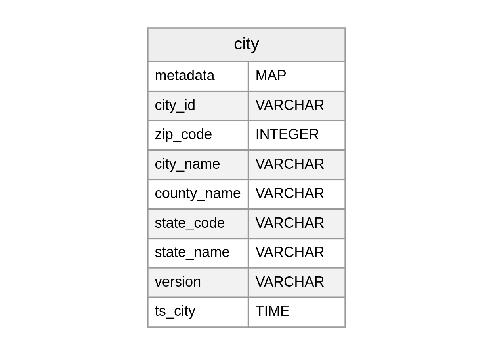
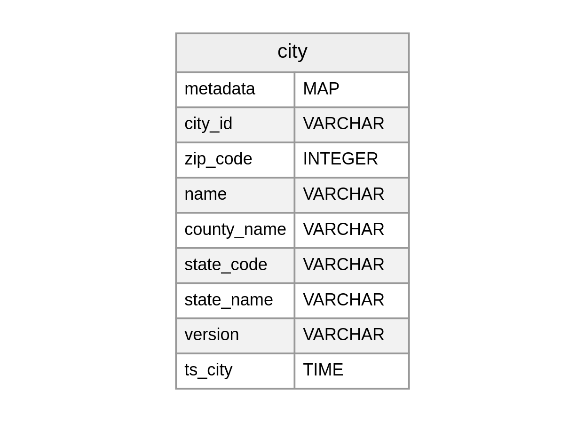

# Case Scenario: Schema Evolution

## Procedure

- Apply the command which you want to execute
- To observe the changes within the Workbench, execute the below command

```shell
dataos-ctl dataset -a ${{udl}} set-metadata \
-v latest
```

**Dataset** - `dataos://icebase:retail/city`

## Add Field/Column

The following command can be used to add a column to the table or a nested struct.

```shell
dataos-ctl dataset -a dataos://icebase:retail/city add-field \
-n ${{column-name}} \
-t ${{column-datatype}}
```

Only the following column data types are supported

| Data type | Description | Requirements |
| --- | --- | --- |
| boolean | True or false |  |
| int | 32-bit signed integers | Can promote to long |
| long | 32-bit signed integers |  |
| float | 32-bit IEEE 754 floating point | Can promote to double |
| double | 64-bit IEEE 754 floating point |  |
| decimal | Fixed-point decimal; precision P, scale S | Scale is fixed, [1], precision must be 38 or less |
| date | Calendar date without timezone or time |  |
| time | Time of day without date, timezone | Microsecond precision  |
| timestamp | Timestamp without timezone | Microsecond precision [2] |
| timestamptz | Timestamp with timezone | Stored as UTC [2] |
| string | Arbitrary-length character sequences | Encoded with UTF-8 [3] |
| uuid | Universally unique identifiers | Should use 16-byte fixed |
| fixed(L) | Fixed-length byte array of length L |  |
| binary | Arbitrary-length byte array |  |

Initial Schema observed in Workbench

<div style="text-align: center;">
  
</div>

<!--  -->

Let's add a new column called `new1` into the city dataset with a type `string`. Execute the following code in the terminal.

```shell
dataos-ctl dataset -a dataos://icebase:retail/city add-field \
-n new1 \
-t string
```

Output (on successful execution of code)

```shell
INFO[0000] 📂 add field...                               
INFO[0001] 📂 add field...completed
```

To observe the changes made to the initial dataset, execute the following code

```shell
dataos-ctl dataset -a dataos://icebase:retail/city set-metadata \
-v latest
```

Output (on successful execution)

```shell
INFO[0000] 📂 set metadata...                            
INFO[0001] 📂 set metadata...completed
```

Observe the change in the workbench; a new field by the name `new1` is added

<div style="text-align: center;">
  
</div>

## Drop Field/Column

To remove an existing column from the table or a nested struct, the following command can be executed

```shell
dataos-ctl dataset -a dataos://icebase:retail/city drop-field \
-n ${{column-name}}
```

<div style="text-align: center;">
  
</div>

<!--  -->

Let’s remove column `new1` from the city dataset. Execute the following code in the terminal

```shell
dataos-ctl dataset -a dataos://icebase:retail/city drop-field \
-n new1
```

Output (on successful execution of code)

```shell
INFO[0000] 📂 remove field...                            
INFO[0001] 📂 remove field...completed
```

To observe the changes made to the initial dataset, execute the following code

```shell
dataos-ctl dataset -a dataos://icebase:retail/city set-metadata \
-v latest
```

Output (on successful execution)

```shell
INFO[0000] 📂 set metadata...                            
INFO[0001] 📂 set metadata...completed
```

Observe the change in the workbench; the `new1` column is removed

<div style="text-align: center;">
  
</div>

<!--  -->

## Rename Field/Column

To rename an existing column or field in a nested struct, execute the below code

```shell
dataos-ctl dataset -a dataos://icebase:retail/city rename-field \
-n ${{column-name}} \
-m ${{column-new-name}}
```

Let’s rename the column `city_name` in the city dataset to `name`. For this following code needs to be executed -

<div style="text-align: center;">
  
</div>

<!--  -->

```shell
dataos-ctl dataset -a dataos://icebase:retail/city rename-field \
-n city_name \
-m name
```

Output (on successful code execution)

```shell
INFO[0000] 📂 rename field...                            
INFO[0001] 📂 rename field...completed
```

To observe the renamed column in the workbench, run the set-metadata command

```shell
dataos-ctl dataset -a dataos://icebase:retail/city set-metadata \
-v latest
```

Output (on successful execution)

```shell
INFO[0000] 📂 set metadata...                            
INFO[0001] 📂 set metadata...completed
```

The `city_name` column is renamed to `name`. As observed below

<div style="text-align: center;">
  
</div>

<!--  -->

## Update Field/Column

To widen the type of a column, struct field, map key, map value, or list element, the below command can be executed

```shell
dataos-ctl dataset -a dataos://icebase:retail/city update-field \
-n ${{column-name}} \
-t ${{column-datatype}}
```

>
🗣 Updating column [type](./case_scenario_schema_evolution.md) is limited to only certain data types for any particular type 
- `integer` to `long`
- `float` to `double`
- Increasing the precision of `decimal` type
>

<div style="text-align: center;">
  
</div>

<!--  -->

Let’s update the `zip_code` column type from `INTEGER (integer)` to `BIGINT (long)`. The code is as follows -

```shell
dataos-ctl dataset -a dataos://icebase:retail/city update-field \
-n zip_code \
-t long
```

Output(successful execution)

```shell
INFO[0000] 📂 update field datatype...                   
INFO[0001] 📂 update field datatype...completed
```

To observe the changes in the workbench, execute the set-metadata command as follows -

```shell
dataos-ctl dataset -a dataos://icebase:retail/city set-metadata \
-v latest
```

Output (on successful execution)

```shell
INFO[0000] 📂 set metadata...                            
INFO[0001] 📂 set metadata...completed
```

The type of `zip_code` is changed from `INTEGER (integer)` to `BIGINT (long)`

<div style="text-align: center;">
  
</div>

<!--  -->