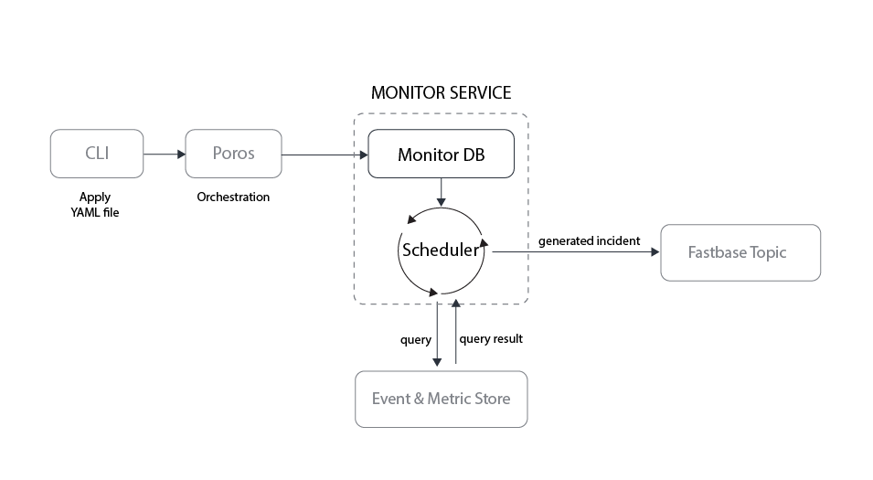
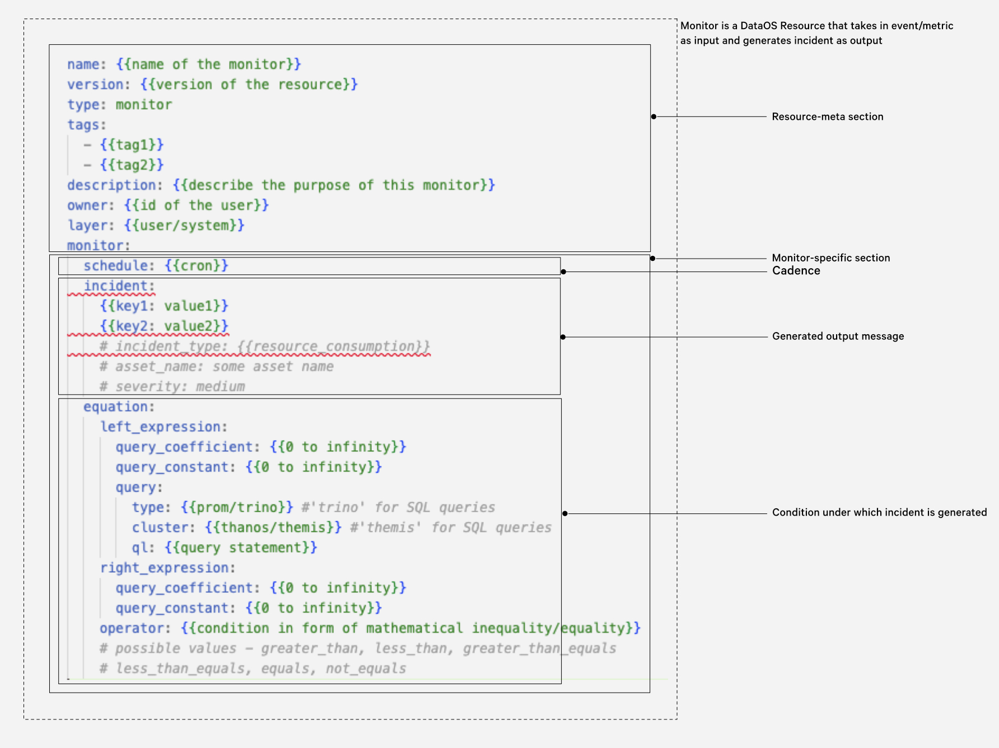

# :resources-monitor: Monitor

The Monitor [Resource](../resources.md) is an integral part of DataOS's Observability System, designed to trigger incidents based on specific [events](#key-concepts-of-monitor) or [metrics](#key-concepts-of-monitor). By leveraging the Monitor Resource alongside the [Pager](./pager.md) Resource, DataOS users can achieve comprehensive observability and proactive incident management, ensuring high system reliability and performance.


<div class="grid cards" markdown>

-   :material-card-bulleted-settings-outline:{ .lg .middle } **How to create and manage a Monitor Resource?**

    ---

    Learn how to create and manage a Monitor in DataOS.

    [:octicons-arrow-right-24: Create and manage a Monitor](#how-to-create-and-manage-a-monitor)


-   :material-list-box-outline:{ .lg .middle } **How to configure a Monitor manifest file?**

    ---

    Discover how to configure a Monitor manifest file by adjusting its attributes.

    [:octicons-arrow-right-24: Monitor attributes](/resources/monitor/manifest_attributes/)

-   :material-network-pos:{ .lg .middle } **How does a Monitor work?**

    ---

    Understand the inner workings of a Monitor within DataOS.
    
    [:octicons-arrow-right-24: Working of a Monitor](#how-does-a-monitor-work)

-   :material-content-duplicate:{ .lg .middle } **Monitor usage examples**

    ---

    Explore examples showcasing the usage of Monitor in various scenarios.

    [:octicons-arrow-right-24:  Monitor usage examples](#monitor-usage-examples)

</div>


## Key Concepts of Monitor 

**Metric**

A quantifiable occurrence used to track and assess the status or performance of specific aspects of a system, process, or business function. These are objective, numerical data points that are collected and analyzed to identify trends, patterns, or deviations from expected norms. For example,

- Average CPU Utilization: Average percentage of CPU usage over a day/month/year.
- Customer Churn Rate: Percentage of customers lost in the past year.

**Event**

A qualifiable occurrence within a system or process that reflects a specific change, action, anomaly, etc. Unlike metrics, which are quantitative measures, events are discrete and qualitative. They can range from system-generated alerts, such as errors or status changes, to user-initiated actions, like deployments or configuration changes. For example,

- Data Pipeline Failure: A data processing pipeline encounters an error, halting data flow.
- Schema Change in Data Source: A modification is detected in the schema of a source database.

**Condition**

A user-defined criterion or a set of criteria that must be satisfied by a metric or event for an incident to be generated. For example, 

- Average CPU Utilization (*metric*) exceeds 85% (*condition*). <li>IoT device reports (*event*) connectivity 'loss' (*condition*).

**Incident**

Output generated by the Monitor when a predefined *condition*, based on *metrics* or *events*, is met. For example, 

- Output generated when either the *Average CPU Utilization* (metric) exceeds the predefined condition or an *Error 500* occurs (event), indicating a performance issue or critical failure, respectively.


| Concept | Definition | Example |
| --- | --- | --- |
| *Metric* |  | <ul><li> <li> 
| *Event* |  | <ul><li><li> |
| *Condition* |  | <ul><li>| 
| *Incident* |  | <ul><li>|

<!-- ## markdown.markdown(text [, **kwargs]) { #markdown data-toc-label='markdown.markdown' } -->


## How does a Monitor work?

A Monitor in DataOS takes Metrics and Events as input and generates Incidents as output. 

**Process**

1. **Observation:** Monitor observes metrics or events at a specific cadence.
2. **Evaluation:** Each observed metric or event is assessed to determine if it matches a predefined condition for triggering an incident.
3. **Incident Generation:** If a metric or event satisfies the condition, the Monitor generates an incident and sends it to the Incident stream.

Following incident publication, users can configure alerts based on these incidents. This enables targeted notification through the creation of [Pager](./pager.md) Resource instances, facilitating prompt response to incidents detected by the Monitor.

## Monitor Service Architecture

The Monitor Service has two major components - Monitor DB and Scheduler. Monitor DB stores the manifest file of each instance of Monitor in its database. The Scheduler reads from this manifest file to query the Metric & Event store. This Metric/Event store is a proxy for any storage system, such as an SQL database, Prometheus DB, a streaming DB or a queryable source of choice.

Montior Service is responsible for cross-checking the *condition* declared by the user with an Event/Metric generated in the system. If the condition is fulfilled, it publishes the information mentioned in the manifest file as an *incident* to a Fastbase topic. This Fastbase topic is a store based on the Pulsar DB system.

<center>



<i>Working of a Monitor Service</i>
</center>

## How to create and manage a Monitor?

In DataOS, users have the capability to instantiate Monitor Resources by creating manifest files (YAML configuration files) and applying them via the DataOS CLI.

### **Create a Monitor Resource manifest**


<center>


<i>Monitor Resource YAML</i>
</center>


The structure of a Monitor Resource manifest encompasses the following sections:

- [Resource Meta Section](#resource-meta-section)
- [Monitor-specific Section](#monitor-specific-section)

#### **Resource Meta Section**

The Resource meta section is a standardized component across all DataOS Resource manifests, detailing essential metadata attributes necessary for Resource identification, classification, and management. This metadata is organized within the Poros Database. 

Below is a comprehensive table outlining the attributes encompassed within the Resource meta section:

| Attribute&nbsp;&nbsp;&nbsp;&nbsp;&nbsp;&nbsp;&nbsp;&nbsp; | Data Type | Default Value | Possible Value | Requirement |
| --- | --- | --- | --- | --- |
| [`name`](/resources/resource_attributes/#name) | string | none | <ul><li>alpha numeric values with the RegEx <br>`[a-z0-9]([-a-z0-9]*[a-z0-9])`; a hyphen/dash is allowed as a special character</li>  <li>total length of the string should be less than or equal to 48 characters</li>| mandatory</ul> |
| [`version`](/resources/resource_attributes/#version) | string | none | v1alpha, v1beta | mandatory |
| [`type`](/resources/resource_attributes/#type) | string | none | monitor | mandatory |
| [`tags`](/resources/resource_attributes/#tags) | string | none | any string; special characters are allowed | optional |
| [`description`](/resources/resource_attributes/#description) | string | none | any string |optional |
| [`owner`](/resources/resource_attributes/#owner) | string | user-id of<br> the user who<br> applys the<br> Monitor | any valid dataos user id | optional |
| [`layer`](/resources/resource_attributes/#layer) | string | user | user/system | optional |
| [`monitor`](/resources/monitor/manifest_attributes/#monitor) | mapping | none | valid Monitor Resource-specific attributes | mandatory |

For further details on each attribute, refer to the provided links within the table. Additional insights into Resource-specific section attributes are accessible via the linked documentation: [Attributes of Resource-specific section](/resources/resource_attributes/).

#### **Monitor-specific Section**

The Monitor-specific section of a manifest file, comprises attributes specific to the Monitor Resource. This section is subdivided into:

- [Schedule](#schedule)
- [Incident](#incident)
- [Type](#type)

##### **Schedule**

The [`schedule`](/resources/monitor/manifest_attributes/#schedule) attribute determines the frequency with which the Monitor Service queries the metric/event store to detect specified events or metrics. It utilizes a cron expression to specify this cadence. 

<aside class="callout">
🗣 Defining a schedule for the monitor is mandatory. Failure to specify a schedule results in an <b>Invalid Parameter</b> error.
</aside>

A a typical declaration within the manifest file to configure the Monitor Service to perform its check every 4 minutes might look like this:

```yaml
monitor:
  schedule: '* /4 * * * *'
  # ...other Monitor-specific attributes
```

##### **Incident**

The [`incident`](/resources/monitor/manifest_attributes/#incident) attribute within the Monitor-specific section details the data to be disseminated to a designated [Fastbase topic](./depot/fastbase.md#topics) upon detecting the specified event or metric within the system. This attribute is a mapping, allowing for the inclusion of various key-value pairs to afford users the flexibility to embed any pertinent information tailored to specific use cases. 

<aside class="callout">
🗣 Using data types other than strings for key-value pairs under incidents triggers an <b>Invalid Parameter</b> error.
</aside>

The code block provided below shows a sample declaration:

```yaml
monitor:
  incident:
    incident_type: field_profiling
    asset: output_1
    column: column_2
    severity: critical
    # ... other key-value pairs
  # ...other Monitor-specific attributes
```

<aside class="best-practice">
📖 <b>Best Practice:</b> This section allows for the inclusion of any key-value pair, however it is considered a best practice to incorporate at least these three essential key-value pairs:

<ul>
    <li><b>Incident type:</b> Identifies th nature of the incident. <br>For example, <code>incident_type: certificate_expiry</code></li>
    <li><b>Name:</b> Names the affected asset or resource. <br>For example, <code>name: CertificateExpiryData</code>
        </li>
    <li><b>Severity:</b> Indicates the inciden'ts urgency or impact level. <br>For example, <code>severity: high</code></li></ul>
</aside>


##### **Monitor Type**

Monitors within the DataOS are categorized into three distinct types, differentiated by the data source format they interrogate and the data type they assess. This classification ensures that users can select the most appropriate monitor type for their specific requirements. The following table provides a clear breakdown of these monitor types along with their corresponding data source types, data types, and condition definitions.

<center>

| Data Source Type    | Data Type | Condition Definition       | Monitor Type      | Type Attribute Value&nbsp;&nbsp;&nbsp;&nbsp;&nbsp;&nbsp;&nbsp;&nbsp;&nbsp;&nbsp;&nbsp;&nbsp;&nbsp;&nbsp;&nbsp;&nbsp;&nbsp;&nbsp;&nbsp;&nbsp;&nbsp;&nbsp;&nbsp;&nbsp; |
|---------------------|-----------|----------------------------|-------------------| -------|
| Icebase, Prometheus | Numeric   | SQL Query, PROM Query      | <a href="/resources/monitor/#equation-monitor">Equation Monitor</a>  | <code>type: equation_monitor</code> |
| APIs                | String    | JQ Filtering and value matching | <a href="/resources/monitor/#report-monitor">Report Monitor</a>    | <code>type: report_monitor</code> |

</center>

###### **Equation Monitor**

<p>This monitor type is suitable when the metric/event you want to observe is in either Icebase-type depot, or Prometheus. Apart from the attributes provided above following attributes are required to be declared within the Equation Monitor manifest file.</p>

<details>
<summary>Equation Monitor specification</summary>


<p>The YAML below shows a sample Equation Monitor manifest file.</p>

```yaml
# Resource meta section
name: ${{certificateexpirymonitornew}} # Resource name
version: v1alpha
type: monitor
tags:
  - ${{dataos:type:resource}} # Tags
description: ${{SSL certificate is about to expire less then 24 hrs}} # Resource description
layer: user
runAsUser: ${{iamgroot}} # User ID of User (or use case assignee)
monitor:

# Monitor-specific section
  schedule: ${{'*/2 * * * *'}} # Monitor schedule
  incident: # Incident
    name: ${{CertificateExpirydata}}
    severity: ${{high}}
    incidentType: ${{certificate_expiry}}

# Equation monitor specification
  type: equation_monitor # Monitor type
  equation: 
    # LHS
    leftExpression:
      queryCoefficient: ${{1}}
      queryConstant: ${{0}}
      query:
        type: ${{prom}}
        cluster: ${{thanos}}
        ql: ${{certmanager_certificate_expiration_timestamp_seconds{...} - time()}}
    # RHS
    rightExpression:
      queryConstant: ${{7766092}}
    # Operator
    operator: ${{less_than}}
```

<h3><b><code>equation</code></b></h3>

<p>The <code>equation</code> attribute defines the <em>condition</em> or the criterion triggering an incident based on specific events or metrics. For example, a condition to generate an incident whenever the total expenditure exceeds a threshold value.</p>

<p>It is articulated as a mathematical equation within the manifest file and consists of the following components:</p>

<ul>
<li><strong>Left-Hand Side (LHS):</strong> The left-hand side (LHS) of the equation represents the current state or specific data the user intends to monitor. It is specified using the <code>leftHandExpression</code> attribute.</li>
<li><strong>Right-Hand Side (RHS):</strong> The right-hand side (RHS) of the equation represents the benchmark or the threshold value for comparison. It is specified using the <code>rightHandExpression</code> attribute</li>
<li><strong>Operator:</strong> The relationship between LHS and RHS is established through an <code>operator</code> attribute whose value signifies one of six possible conditions: equals (=), greater_than (>), less_than (<), greater_than_equals (≥), less_than_equals (≤), or not_equals (≠).</li>
</ul>


<p>Values for LHS and RHS can be dynamic, sourced from queries, or static. A dynamic value may be adjusted by a coefficient, while a static value acts as a constant.</p>

<p><strong>Example: Monitoring a Metric</strong></p>

<p><strong>Scenario:</strong> Triggering an alert when a customer's total expenditure surpasses 25% of their spending limit.</p>

<p><strong>LHS Calculation:</strong> A query retrieves the total expenditure, applying a coefficient of 1 and a constant of 0.<br>
<strong>RHS Calculation:</strong> A query determines the spending limit, using a coefficient of 0.25 (25%) and a constant of 0.</p>

<p><strong>Operator:</strong> The condition employs a "greater than or equal to" (≥) operator for evaluation.</p>


<p>The table below summarizes the various attributes in Equation Monitor manifest.</p>

<table>
<tr>
<th>Attribute&nbsp;&nbsp;&nbsp;&nbsp;&nbsp;&nbsp;&nbsp;&nbsp;&nbsp;&nbsp;&nbsp;&nbsp;&nbsp;&nbsp;&nbsp;&nbsp;&nbsp;&nbsp;&nbsp;</th>
<th>Data Type</th>
<th>Default Value</th>
<th>Possible Value</th>
<th>Requirement</th>
</tr>
<tr>
<td><a href="/resources/monitor/manifest_attributes/#equation"><code>equation</code></a></td>
<td>mapping</td>
<td>none</td>
<td>none</td>
<td>mandatory</td>
</tr>
<tr>
<td><a href="/resources/monitor/manifest_attributes/#leftexpression"><code>leftExpression</code></td>
<td>mapping</td>
<td>none</td>
<td>none</td>
<td>mandatory</td>
</tr>
<tr>
<td><a href="/resources/monitor/manifest_attributes/#rightexpression"><code>rightExpression</code></td>
<td>mapping</td>
<td>none</td>
<td>none</td>
<td>mandatory</td>
</tr>
<tr>
<td><a href="/resources/monitor/manifest_attributes/#querycoefficient"><code>queryCoefficient</code></td>
<td>number</td>
<td>none</td>
<td>any number</td>
<td>mandatory</td>
</tr>
<tr>
<td><a href="/resources/monitor/manifest_attributes/#queryconstant"><code>queryConstant</code></td>
<td>number</td>
<td>none</td>
<td>any number</td>
<td>mandatory</td>
</tr>
<tr>
<td><a href="/resources/monitor/manifest_attributes/#query"><code>query</code></td>
<td>mapping</td>
<td>none</td>
<td>valid query attributes</td>
<td>mandatory</td>
</tr>
<tr>
<td><a href="/resources/monitor/manifest_attributes/#type-2"><code>type</code></td>
<td>string</td>
<td>none</td>
<td>prom, trino</td>
<td>mandatory</td>
</tr>
<tr>
<td><a href="/resources/monitor/manifest_attributes/#cluster"><code>cluster</code></td>
<td>string</td>
<td>none</td>
<td>minerva, thanos, themis</td>
<td>mandatory</td>
</tr>
<tr>
<td><a href="/resources/monitor/manifest_attributes/#operator"><code>operator</code></td>
<td>string</td>
<td>none</td>
<td>equals, greater_than, less_than, not_equals, greater_than_equals, less_than_equals</td>
<td>mandatory</td>
</tr>
</table>

<p>For more information regarding the various attributes, refer to the link: <a href="/resources/monitor/manifest_attributes/#equation">Attributes of Monitor manifest</a>.</p>

</details>

###### **Report Monitor**

<p>The Report Monitor is suitable for scenarios where the target metric or event is identified by string values, such as the status or runtime status of a DataOS Resource.</p>

<details>
<summary>Report Monitor specification</summary>

<p>Below is an example of a Report Monitor configuration defined in a YAML manifest:</p>

```yaml
# Resource meta section
name: ${{runtimemonitorcamelspec}}
version: v1alpha
type: monitor
tags:
  - ${{dataos:type:resource}}
  - ${{dataos:layer:user}}
description: ${{Attention! workflow run failed.}}
layer: user
monitor:

# Monitor-specific section
  runAsUser: ${{iamgroot}}
  schedule: ${{'*/2 * * * *'}}
  incident:
    name: workflowrunfailed
    severity: high
    incidentType: workflowruntimefailure
  type: report_monitor
# Report Monitor specification
  report:
    source:
      dataOsInstance:
         path: ${{/collated/api/v1/reports/resources/runtime?id=workflow:v1:snowflakescannerdepotis:public}}
    conditions:
    - valueComparison:
        observationType: ${{runtime}}
        valueJqFilter: ${{'.value'}}
        operator: ${{equals}}
        value: ${{running}}
    - valueComparison:
        observationType: ${{workflow-runs}}
        valueJqFilter: ${{'.value[] | select (.started | fromdateiso8601 > (now-113600)) | .phase'}}
        operator: ${{equals}}
        value: ${{succeeded}}
```

<h3><b><code>report</code></b></h3>

<p>The <code>report</code> specifies the data source and conditions for evaluation, indicating the Monitor's reliance on report data.</p>

<h4><b><code>source</code></b></h4>

The > attribute specifies the source of the report. Within the <code>source</code> mapping, the  attribute incorporate the environment domain in which you are implementing the Monitor and prefix the value in the provided . This way you don't have to worry about specifying the environment name.

The <code>source</code> attribute defines the report's origin. It includes a <code>dataOsInstance</code> attribute, which simplifies environment specification by incorporating the environment domain into the provided <code>path</code>.

```yaml
monitor:
  report:
    source:
      dataOsInstance:
         path: ${{/collated/api/v1/reports/resources/runtime?id=workflow:v1:snowflakescannerdepotis:public}}
```

<h4><code>conditions</code></h4>

<p>This attribute outlines the criteria for incident activation. Multiple conditions can be defined; an incident is triggered only if all conditions are met.</p>

```yaml
monitor:
  conditions: # mandatory
    - valueComparison:
        observationType: runtime # mandatory
        valueJqFilter: '.value' # mandatory
        operator: equals # mandatory
        value: running # mandatory
      durationComparison: 
        observationType: runtime # mandatory
        selectorJqFilter: # mandatory
        startedJqFilter: # mandatory
        completedJqFilter: # mandatory
        operator: # mandatory
        value: # mandatory
```

<ul>
    <li><code>valueComparison</code>: Specifies a condition based on value matching.
        <ul>
            <li><code>observationType</code>: Defines the type of data under observation (e.g., "runtime", "workflow-runs").</li>
            <li><code>valueJqFilter</code>: A JQ filter expression for extracting specific values from data. For details on JQ filters, visit the following <a href="https://jqlang.github.io/jq/manual/#basic-filters">link</a>.</li>
            <li><code>operator</code>: The comparison operator (e.g., "equals") used to compare extracted and expected values.</li>
            <li><code>value</code>: The reference value for comparison, determining the condition's truth.</li>
        </ul>
    </li>
</ul>

<p>The table below summarizes the various attributes in Resource Monitor manifest.</p>

<table>
<tr>
<th>Attribute&nbsp;&nbsp;&nbsp;&nbsp;&nbsp;&nbsp;&nbsp;&nbsp;&nbsp;&nbsp;&nbsp;&nbsp;&nbsp;&nbsp;&nbsp;&nbsp;&nbsp;&nbsp;&nbsp;</th>
<th>Data Type</th>
<th>Default Value</th>
<th>Possible Value</th>
<th>Requirement</th>
</tr>
<tr>
<td><a href="/resources/monitor/manifest_attributes/#report"><code>report</code></a></td>
<td>mapping</td>
<td>none</td>
<td>none</td>
<td>optional</td>
</tr>
<tr>
<td><a href="/resources/monitor/manifest_attributes/#source"><code>source</code></td>
<td>mapping</td>
<td>none</td>
<td>none</td>
<td>mandatory</td>
</tr>
<tr>
<td><a href="/resources/monitor/manifest_attributes/#dataosinstance"><code>dataOsInstance</code></td>
<td>mapping</td>
<td>none</td>
<td>none</td>
<td>mandatory</td>
</tr>
<tr>
<td><a href="/resources/monitor/manifest_attributes/#path"><code>path</code></td>
<td>string</td>
<td>none</td>
<td>any valid API endpoint paths</td>
<td>mandatory</td>
</tr>
<tr>
<td><a href="/resources/monitor/manifest_attributes/#conditions"><code>conditions</code></td>
<td>list of mappings</td>
<td>none</td>
<td>none</td>
<td>mandatory</td>
</tr>
<tr>
<td><a href="/resources/monitor/manifest_attributes/#valuecomparison"><code>valueComparison</code></td>
<td>mapping</td>
<td>none</td>
<td>valid query attributes</td>
<td>mandatory</td>
</tr>
<tr>
<td><a href="/resources/monitor/manifest_attributes/#durationcomparison"><code>durationComparison</code></td>
<td>mapping</td>
<td>none</td>
<td>valid query attributes</td>
<td>mandatory</td>
</tr>
<tr>
<td><a href="/resources/monitor/manifest_attributes/#operator"><code>operator</code></td>
<td>string</td>
<td>none</td>
<td>equals, greater_than, less_than, not_equals, greater_than_equals, less_than_equals</td>
<td>mandatory</td>
</tr>
<tr>
<td><a href="/resources/monitor/manifest_attributes/#value"><code>value</code></td>
<td>string</td>
<td>none</td>
<td>any valid string</td>
<td>mandatory</td>
</tr>
</table>

<p>For more information regarding the various attributes, refer to the link: <a href="/resources/monitor/manifest_attributes/#report">Attributes of Report manifest</a>.</p>

</details>


### **Apply the Monitor manifest through CLI**

After creating the Monitor manifest file, it's time to apply it to instantiate the Resource-instance in the DataOS environment. To apply the Monitor manifest file, utilize the  `resource apply`  command.

```shell
dataos-ctl resource apply -f ${{manifest-file-path}} -w ${{workspace-name}}

# Sample
dataos-ctl resource apply -f /home/Desktop/my-monitor.yaml -w curriculum

# Expected Output
INFO[0000] 🔍 apply...                                     
INFO[0001] 🔍 applying(curriculum) cpu-usage-spike:v1alpha:monitor...
INFO[0002] 🔍 applying(curriculum) cpu-usage-spike:v1alpha:monitor...created                                     
INFO[0003] 🔍 apply...complete                             
```

### **Verify Monitor Status**

Use the below command to get all the existing monitors for all owners. 

```shell
dataos-ctl resource get -t monitor -w ${{workspace name}} -a

dataos-ctl resource get -t monitor -w curriculum -a

# Expected Output
INFO[0000] 🔍 get...                                     
INFO[0000] 🔍 get...complete                             

       NAME     | VERSION |  TYPE   | WORKSPACE  | STATUS | RUNTIME | OWNER      
----------------|---------|---------|------------|--------|---------|----------------
    my-monitor  | v1alpha | monitor | curriculum | active |         | iamgroot 
    monitor101  | v1alpha | monitor | curriculum | active |         | thor
```

You can also access the details of any created Monitor through the DataOS GUI in the [Operations App](../interfaces/operations.md).

### **Check for Incident Messages**

- To review incident messages dispatched by the Monitor, access the specified topic (`persistent://public/default/monitor-incident-new`) where these notifications are published. Execute the following command in the terminal:

  ```shell
  dataos-ctl fastbase topic consume -p -s -t persistent://system/monitor/monitor-incident-new
  ```

  <details><summary>Sample output</summary>

  ```shell
  dataos-ctl fastbase topic read -p -t persistent://public/default/monitor-incident
  INFO[0000] 🔍 read...                                    
  INFO[0000] Connecting to broker                          remote_addr="pulsar+ssl://tcp.sunny-prawn.dataos.app:6651"
  INFO[0000] TCP connection established                    local_addr="192.168.1.81:51405" remote_addr="pulsar+ssl://tcp.sunny-prawn.dataos.app:6651"
  INFO[0001] Connection is ready                           local_addr="192.168.1.81:51405" remote_addr="pulsar+ssl://tcp.sunny-prawn.dataos.app:6651"
  INFO[0003] Connecting to broker                          remote_addr="pulsar+ssl://tcp.sunny-prawn.dataos.app:6651"
  INFO[0003] TCP connection established                    local_addr="192.168.1.81:51406" remote_addr="pulsar+ssl://tcp.sunny-prawn.dataos.app:6651"
  INFO[0005] Connection is ready                           local_addr="192.168.1.81:51406" remote_addr="pulsar+ssl://tcp.sunny-prawn.dataos.app:6651"
  INFO[0006] Connected consumer                            consumerID=1 name=54a144e1c26be58b2ed28354513c581f37419ffad71c5e7d964d524bfd8d7077 subscription=reader-zvyoa topic="persistent://public/default/monitor-incident"
  INFO[0006] Created consumer                              consumerID=1 name=54a144e1c26be58b2ed28354513c581f37419ffad71c5e7d964d524bfd8d7077 subscription=reader-zvyoa topic="persistent://public/default/monitor-incident"
  INFO[0006] Broker notification of Closed consumer: 1     local_addr="192.168.1.81:51406" remote_addr="pulsar+ssl://tcp.sunny-prawn.dataos.app:6651"
  INFO[0006] Reconnecting to broker in 101.592638ms        consumerID=1 name=54a144e1c26be58b2ed28354513c581f37419ffad71c5e7d964d524bfd8d7077 subscription=reader-zvyoa topic="persistent://public/default/monitor-incident"
  INFO[0006] Connected consumer                            consumerID=1 name=54a144e1c26be58b2ed28354513c581f37419ffad71c5e7d964d524bfd8d7077 subscription=reader-zvyoa topic="persistent://public/default/monitor-incident"
  INFO[0006] Reconnected consumer to broker                consumerID=1 name=54a144e1c26be58b2ed28354513c581f37419ffad71c5e7d964d524bfd8d7077 subscription=reader-zvyoa topic="persistent://public/default/monitor-incident"
  {"id":"CMAYEA0YACAA","string_id":"3136:13:0","payload":"eyJtb25pdG9yIjp7Im5hbWUiOiJ0YWJsZXJvd2NvdW50IiwiZGVzY3JpcHRpb24iOiJ0YWJsZSByb3cgY291bnQgdGhyZXNob2xkIiwicHJvcGVydGllcyI6e30sInNjaGVkdWxlIjoiMSAqLzQgKiA/ICogKiIsImluY2lkZW50Ijp7InR5cGUiOiJwdWxzYXIiLCJuYW1lIjoibW9uaXRvci1pbmNpZGVudCIsInN1bW1hcnkiOiJzb21lIHN1bW1hcnkiLCJjYXRlZ29yeSI6InRlc3QifSwiZXF1YXRpb24iOnsibGVmdF9leHByZXNzaW9uIjp7InF1ZXJ5X2NvZWZmaWNpZW50IjoxLCJxdWVyeV9jb25zdGFudCI6MCwicXVlcnkiOnsidHlwZSI6InRyaW5vIiwiY2x1c3RlciI6InRoYW5vcyIsInFsIjoic2VsZWN0IGNvdW50KCopIGZyb20gaWNlYmFzZS5yZXRhaWwuY2l0eTsifX0sInJpZ2h0X2V4cHJlc3Npb24iOnsicXVlcnlfY29lZmZpY2llbnQiOjEsInF1ZXJ5X2NvbnN0YW50IjoxMDAwMDAsInF1ZXJ5IjpudWxsfSwib3BlcmF0b3IiOiJncmVhdGVyX3RoYW4ifX0sImxlZnRfZXhwcmVzc2lvbl92YWx1ZSI6MTA2NzUwLCJyaWdodF9leHByZXNzaW9uX3ZhbHVlIjoxMDAwMDB9","publish_time":"2023-10-09T14:34:28.684+05:30","event_time":"1970-01-01T05:30:00+05:30","producer_name":"pulsar-52-31","topic":"persistent://public/default/monitor-incident"}
  INFO[0008] no more messages to read...exiting           
  INFO[0008] Closing consumer=1                            consumerID=1 name=54a144e1c26be58b2ed28354513c581f37419ffad71c5e7d964d524bfd8d7077 subscription=reader-zvyoa topic="persistent://public/default/monitor-incident"
  INFO[0008] Closed consumer                               consumerID=1 name=54a144e1c26be58b2ed28354513c581f37419ffad71c5e7d964d524bfd8d7077 subscription=reader-zvyoa topic="persistent://public/default/monitor-incident"
  INFO[0008] close consumer, exit reconnect                consumerID=1 name=54a144e1c26be58b2ed28354513c581f37419ffad71c5e7d964d524bfd8d7077 subscription=reader-zvyoa topic="persistent://public/default/monitor-incident"
  INFO[0008] 🔍 read...complete
  ```
  </details>

- Save the entire message in a new JSON file and use the following command to decrypt it through base64 decoder.

```shell
dataos-ctl jq -f ${{json file path}} --filter '.payload' | base64 --decode | jq . 
```


<details><summary>Sample Output</summary>


<h3><b>Retrieving and Processing Incident Messages</b></h3>

<section>
    <h4>Storing the JSON Message</h4>
    <p>Initially, save the JSON message by creating a new file. This is essential for data preservation for subsequent analysis. Example JSON structure:</p>
```json
{"id":"CMAYEA0YACAA","string_id":"3136:13:0","payload":"eyJtb25pdG9yIjp7Im5hbWUiOiJ0YWJsZXJvd2NvdW50IiwiZGVzY3JpcHRpb24iOiJ0YWJsZSByb3cgY291bnQgdGhyZXNob2xkIiwicHJvcGVydGllcyI6e30sInNjaGVkdWxlIjoiMSAqLzQgKiA/ICogKiIsImluY2lkZW50Ijp7InR5cGUiOiJwdWxzYXIiLCJuYW1lIjoibW9uaXRvci1pbmNpZGVudCIsInN1bW1hcnkiOiJzb21lIHN1bW1hcnkiLCJjYXRlZ29yeSI6InRlc3QifSwiZXF1YXRpb24iOnsibGVmdF9leHByZXNzaW9uIjp7InF1ZXJ5X2NvZWZmaWNpZW50IjoxLCJxdWVyeV9jb25zdGFudCI6MCwicXVlcnkiOnsidHlwZSI6InRyaW5vIiwiY2x1c3RlciI6InRoYW5vcyIsInFsIjoic2VsZWN0IGNvdW50KCopIGZyb20gaWNlYmFzZS5yZXRhaWwuY2l0eTsifX0sInJpZ2h0X2V4cHJlc3Npb24iOnsicXVlcnlfY29lZmZpY2llbnQiOjEsInF1ZXJ5X2NvbnN0YW50IjoxMDAwMDAsInF1ZXJ5IjpudWxsfSwib3BlcmF0b3IiOiJncmVhdGVyX3RoYW4ifX0sImxlZnRfZXhwcmVzc2lvbl92YWx1ZSI6MTA2NzUwLCJyaWdodF9leHByZXNzaW9uX3ZhbHVlIjoxMDAwMDB9","publish_time":"2023-10-09T14:34:28.684+05:30","event_time":"1970-01-01T05:30:00+05:30","producer_name":"pulsar-52-31","topic":"persistent://public/default/monitor-incident"}
```
</section>

<section>
    <h4><b>Processing the Payload</b></h4>
    <p>For payload processing, utilize the <code>jq</code> command with a base64 decoder. The <code>jq</code> command facilitates JSON parsing and filtering:</p>
    <ul>
        <li><b>Decoding and Formatting the Payload:</b>
            <pre><code>dataos-ctl jq -f new.json --filter '.payload' | base64 --decode | jq '.'</code></pre>
        </li>
        <li><b>Extracting and Validating Specific Data:</b>
            <pre><code>dataos-ctl jq -f new.json --filter '.payload' | base64 --decode | jq -r '.monitor.equation.left_expression.query.type' | grep -q 'trino' && echo "OK"</code></pre>
        </li>
    </ul>
</section>

<section>
    <h4><b>Sample Processed Output</b></h4>
    <p>Below is the structured JSON after processing. It concisely presents the monitor's details, including name, description, scheduling, incident configuration, and the condition-triggering equation:</p>
```json
{
  "monitor": {
    "name": "tablerowcount",
    "description": "table row count threshold",
    "properties": {},
    "schedule": "1 */4 * ? * *",
    "incident": {
      "type": "pulsar",
      "name": "monitor-incident",
      "summary": "some summary",
      "category": "test"
    },
    "equation": {
      "left_expression": {
        "query_coefficient": 1,
        "query_constant": 0,
        "query": {
          "type": "trino",
          "cluster": "thanos",
          "ql": "select count(*) from icebase.retail.city;"
        }
      },
      "right_expression": {
        "query_coefficient": 1,
        "query_constant": 100000,
        "query": null
      },
      "operator": "greater_than"
    }
  },
  "left_expression_value": 106750,
  "right_expression_value": 100000
}
```
</section>

The last two key-value pairs are of particular importance here, which return the threshold (<code>left_expression_value</code>) and observed value (<code>right_expression_value</code>).

</details>


This step ensures that your monitor is publishing incidents. Another way is to check is by creating a Pager and receiving alerts.

### **Get alert using Pager**

After an incident is published, users can set up alerts based on these incidents. This is achieved by creating [Pager Resource](./pager.md) instances, which allow for targeted notifications. This process ensures timely responses to incidents identified by the Monitor.

### **Updating a Monitor**

If you have to make changes to an existing Monitor which you have previously created. Make changes to the configuration file of the Monitor Resource, and either use `resource apply` or use `resource update`. In both cases the Monitor gets updated: 

```shell
dataos-ctl resource update -t monitor -w curriculum -n my-monitor
```

### **Get details of a specific Monitor**

To retrieve the status of a specific Monitor including details in the result, use the following command:

```shell
dataos-ctl resource get -t monitor -w curriculum -n ${{monitor name}} -d
```

### **Deleting a Monitor** 

Before deleting a Monitor, you must delete all Resources that are dependent on it like Pagers. This step ensures that there are no dependencies left that could cause issues during deletion. Once it's done, use the `resource delete` command to remove the specific Bundle Resource-instance from the DataOS environment:

```shell
# METHOD 1
dataos-ctl resource delete -t monitor -w ${{workspace-name}} -n ${{name-of-monitor}}
# Sample
dataos-ctl resource delete -t monitor -w curriculum -n my-monitor

# METHOD 2
dataos-ctl resource delete -i "${{identifier string for a Resource: format NAME:VERSION:TYPE:WORKSPACE(optional:default-public)}}"
# Sample 
dataos-ctl resource delete -i "my-monitor | v1alpha | monitor |  curriculum    "
```


## Monitor Errors

- When applying a monitor configuration with a name that does not comply with the required pattern, an error is returned. Monitor names must adhere to a specific regex pattern and be within a character limit.

    ```shell
    dataos-ctl resource apply -f monitor/accuracy_monitor.yml -l
    INFO[0000] 🛠 apply...                                   
    INFO[0000] 🔧 applying(public) failed_row-accuracy-monitor:v1alpha:monitor... 
    WARN[0001] 🔧 applying(public) failed_row-accuracy-monitor:v1alpha:monitor...error 
    ⚠️ Invalid Parameter - failure validating resource : name is invalid 'failed_row-accuracy-monitor', must be less than '48' chars and conform to the following regex: '[a-z0-9]([-a-z0-9]*[a-z0-9])?'
    WARN[0001] 🛠 apply...error                              
    ERRO[0001] failure applying resources 
    ```

- The `owner` field in the manifest file must match the user ID for automatic information population in Metis. Specifying an incorrect ID or a different string results in the `resource get` command failing to retrieve the Resource. To ensure successful retrieval, either correctly specify the user ID in the `owner` field or omit it for automatic assignment.

- The monitor name `schema_monitor` is reserved and cannot be used for monitor configurations.

- An `Invalid Parameter` error occurs when specified schemas or tables in the query do not exist in the targeted Database/Cluster.

    ```yaml
    status:
      aggregateStatus: error
      cloudKernelResources:
        - name: testmonitor3-tags-monitor-pe8z
          namespace: curriculum
          version: v1
          kind: Secret
          resource: secrets
          dataplane: hub
          status: created
      webServiceResources:
        - id: testmonitor3_curriculum
          service: monitor
          type: monitor
          self: /monitors/testmonitor3_curriculum
          status: error
          error: Invalid Parameter
      builderState:
        stage: building
        numberOfWantedResources: "2"
        numberOfProcessedResources: "2"
        info: builder encountered an error
    ```

## Monitor Usage Examples