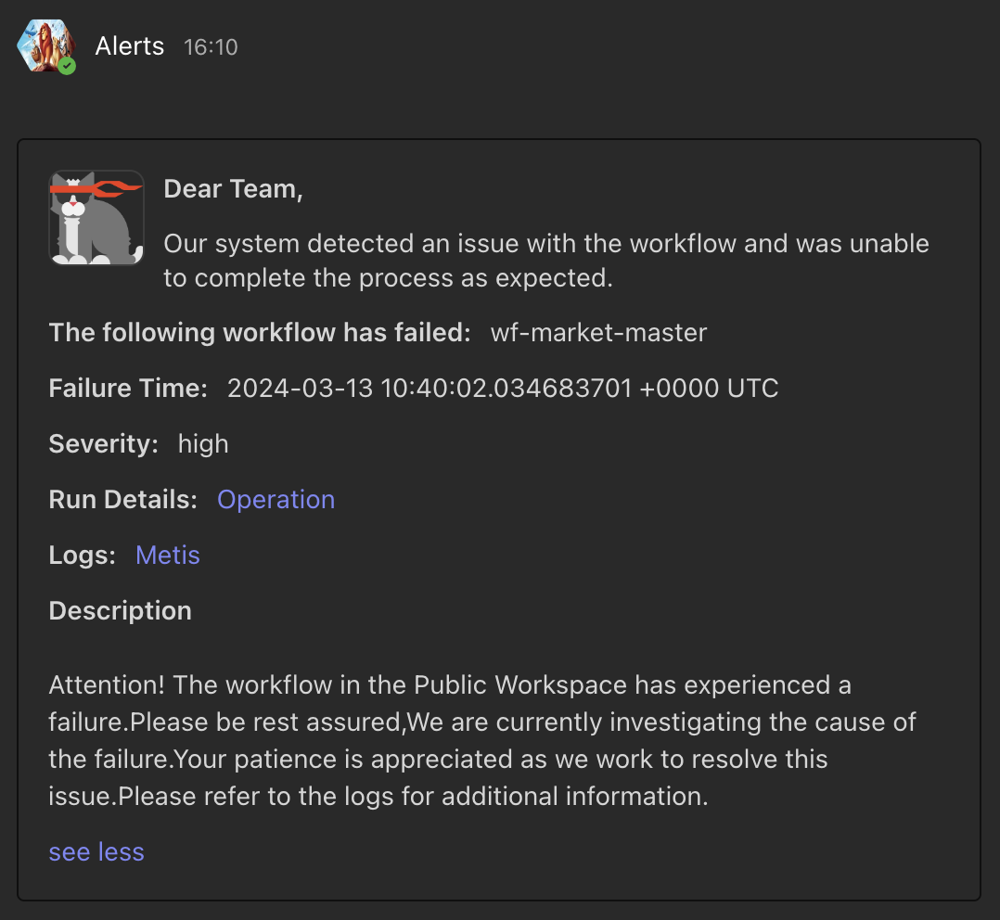

# How to create a custom body template for Pager for MS Team notification?

## Code Snippet

```yaml
name: workflow-failed-pager
version: v1alpha
type: pager
tags:
  - dataos:type:resource
  - workflow-failed-pager
description: This is for sending Alerts on Microsoft Teams Channel.
workspace: public
pager:
  conditions:
    - valueJqFilter: .properties.name
      operator: equals
      value: workflow-failed
    - valueJqFilter: .properties.incident_type
      operator: equals
      value: workflow-runtime-failure
  output:
    webHook:
      url: ${webhook-url}
      verb: post
      headers:
        'content-type': 'application/json'
      bodyTemplate: |
          {
            "@type": "MessageCard",
            "summary": "Workflow has Failed",
            "themeColor": "0076D7",
            "sections": [
              {
                "activityTitle": "Dear Team,",
                "activitySubtitle": "Our system detected an issue with the workflow and was unable to complete the process as expected.",
                "activityImage": "https://adaptivecards.io/content/cats/3.png",
                "facts": [
                  {
                    "name": "The following workflow has failed:",
                    "value": "{{ index (splitn ":" 4 .ReportContext.ResourceId) "_2" }}"
                  },
                  {
                    "name": "Failure Time:",
                    "value": "{{ .CreateTime }}"
                  },
                  {
                    "name": "Severity:",
                    "value": "{{ .Properties.severity }}"
                  },
                  {
                    "name": "Run Details:",
                    "value": "<a href=\"https://${dataos-fqdn}/operations/user-space/resources/resource-runtime?name={{ index (splitn ":" 4 .ReportContext.ResourceId) "_2" }}&type=workflow&workspace=public\">Operation</a>"
                  },
                  {
                    "name": "Logs:",
                    "value": "<a href=\"https://${dataos-fqdn}/metis/resources/workflow/dataos.public.{{ index (splitn ":" 4 .ReportContext.ResourceId) "_2" }}/run_history\">Metis</a>"
                  }
                ]
              },
              {
                "title": "Disclaimer",
                "text": "{{ .Monitor.Description }}"
              }
            ]
          }
```

## Output

<center>

<i>MS Team notification output</i>
</center>