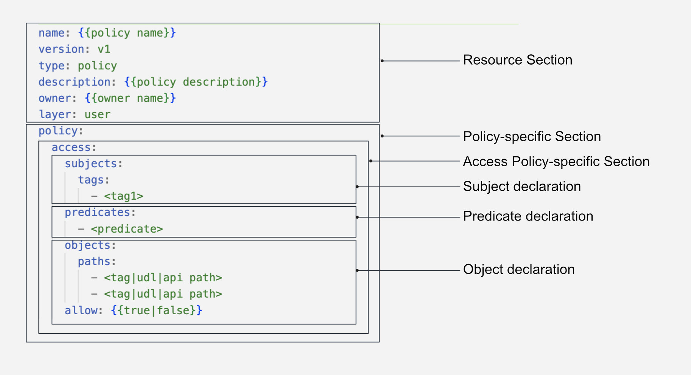

# Policy

Policy is a fundamental Resource in DataOS that defines a set of rules or guardrails governing the behavior of users, be it individuals or applications/services. Within DataOS, Policies are enforced using Attribute Based Access Control (ABAC) and define what predicates a user (a subject) can perform on a dataset, API Path, or a Resource (an object), thus defining the constraints of the relationship between the subject and object.

In DataOS, policies are expressed as a distinct Resource in a declarative YAML format. This approach allows for the separation of policies from application code, promoting modularity, easy maintenance, and reducing the need for extensive redeployment. Additionally, DataOS distinguishes between the Policy Decision Point (PDP) and the Policy Enforcement Point (PEP). The PDP makes policy decisions based on predefined rules and attributes, while the PEP enforces these decisions, ensuring access control and compliance. This clear separation of concerns simplifies policy management, fostering scalability, extensibility, and maintainability in the DataOS ecosystem.

[Understanding ABAC, PDP and PEP](./policy/understanding_abac_pdp_and_pep.md)

## Types of Policies

DataOS offers two primary categories of policies: **Access Policy** and **Data Policy**. These policies play essential roles in governing user access, actions, and data management within the DataOS system.

### **Access Policy**

Access Policies serve as the initial layer of defense, overseeing user access and actions within the system. They establish a set of well-defined rules that determine whether a user, known as the subject, is authorized to perform a specific action, referred to as a predicate, on a given dataset, API path, or other resources, known as objects. These policies serve as regulatory mechanisms, effectively governing user interactions and ensuring that access to specific actions is either granted or denied. This decision is based on the evaluation of attributes associated with the subjects and objects involved in the access request.



### **Data Policy**

In contrast, Data Policy operates as a secondary layer of control, regulating the visibility and interaction with specific data once access has been granted. It involves the implementation of techniques such as data masking or filtering to obscure or restrict the visibility of sensitive or restricted data based on predefined rules or conditions.

For example, when working with a dataset that includes a column labeled `credit_card_number`, it is crucial to protect the sensitive information it contains from unintended exposure. Employing data masking policies or applying data anonymization methods becomes essential to secure the contents of this specific column.


Within Data Policy, we have two separate types one is the Data Filtering Policy, and another is the Data Masking Policy. 

#### **Data Masking Policy**

Data masking policies are designed to protect sensitive information by replacing original data with fictitious yet structurally similar data. This ensures that the privacy of sensitive data is maintained while keeping the data useful for purposes such as testing and development. 

Data masking is particularly beneficial for Personally Identifiable Information (PII), where original data can be represented through masking, replacement with a placeholder (such as "####"), or obfuscation through a hash function.


Upon the application of a data masking policy, the original data is transformed, as illustrated in the table below:

| Data Category | Original Value | Masked Value |
| --- | --- | --- |
| Email ID | john.smith\@gmail.com | bkfgohrnrtseqq85\@bkgiplpsrhsll16.com |
| Social Security Number (SSN) | 987654321 | 867-92-3415 |
| Credit Card Number | 8671 9211 3415 4546 | #### #### #### #### |

Such a policy ensures the protection of sensitive details, including but not limited to names, titles, addresses, etc.

You can apply the Mask policy, say to mask the column with ‘customer name’ in it, directly from the Metis UI via policy tags or via DataOS CLI. 

#### **Data Filtering Policy**

Data filtering policies establish parameters for determining which data elements should be accessible to various users or systems. Proper implementation of data filtering policies ensures that only authorized individuals can access specific data segments.

## Configuration of Policy

In DataOS, both access and data policies are configured via the singular Policy resource. However, the two different policies Access and Data Policy has its own YAML syntax.The image represents general configuration for the Policy resource.

### **Configuring Access Policy**


The table below summarizes varioues attributes within the access policy YAML.

| Field | Data Type | Default Value | Possible Value | Requirement |
| --- | --- | --- | --- | --- |
| policy | object | none | none | mandatory |
| access | object | none | none | mandatory |
| subjects | object | none | none | mandatory |
| tags | list of strings | none | a valid DataOS tag | mandatory |
| predicates | list of strings | none | get, put, post, delete, read, write, update, options | mandatory |
| objects | object | none | none | mandatory |
| paths | list of strings | none | api paths, udl paths | mandatory |
| allow | boolean | false | true/false | optional |

### **Configuring Data Policy**


The table below summarizes the various attributes within a data policy YAML.

| Field | Data Type | Default Value | Possible Value | Requirement |
| --- | --- | --- | --- | --- |
| policy | object | none | none | mandatory |
| data | object | none | none | mandatory |
| depot | string | none | any depot name | optional |
| collection | string | none | any collection name | optional |
| dataset | string | none | any dataset name | optional |
| priority | number | none | 0-100 | mandatory |
| selector | object | none | none | mandatory |
| user |  |  |  |  |
| column | boolean | none | true/false | mandatory |
| type |  |  |  |  |

Though the Policy resource is singular, each policy-type has a different underlying implementation. Hence, the Policy-specific Grammar for each type varies which are elucidated on this link.

[Policy Section-specific Grammar](./policy/policy_section_specific_grammar.md)

## Creating a Policy

### **YAML Configuration File**

#### **Resource Section Configuration**

To create a Policy in DataOS, the initial step involves configuring the Resource Section in a YAML file. This section defines various properties of the Policy resource. The following is an example YAML configuration for the Resource Section:

```yaml
name: {{my-policy}}
version: v1 
type: policy 
tags: 
  - {{dataos:type:resource}}
  - {{dataos:type:cluster-resource}}
description: {{This is a sample policy YAML configuration}} 
owner: {{iamgroot}}
layer: {{user}}
```

The `layer` field can have value either user/system in case of Policy. 

For policies that govern authorization for system level resources such as API Paths, layer is system, while for user layer authorization such as access to UDL addresses it is user

Additionally, the Resource section offers various configurable fields, which can be explored further on the **RESOURCE SECTION** page.

#### **Policy-specific Section Configuration**

The Policy Section focuses on the configurations specific to the Policy resource. DataOS supports two distinct types of Policies: **Access Policy** and **Data Policy**. Each Policy Resource type has its own YAML syntax.

##### **Access Policy Syntax**

Access policies are defined using a subject-predicate-object triad. The YAML syntax for an Access Policy is as follows:

```yaml
policy:
  access:
    subjects:
        {}
    predicates:
        {}
    objects:
        {}
    allow: true
```

Here, the `subject` represents the user, the `object` denotes the target (such as an API path or resource) that the user interacts with, and the `predicate` represents the action performed. The `allow` field determines whether the policy grants or restricts access for the user to perform the specified action on the designated object. Refer to the [resource](./policy/policy_section_specific_grammar.md) for more details on configuring subjects, predicates, and objects.

##### **Data Policy Syntax**

```yaml
policy:
  data:
    dataset: sample_driver
    collection: data_uber
    depot: icebase
    priority: 90
    selector:
      user:
        {}
      column:
        {}
    type: {filter/mask}
    {filter/mask}:
```

For detailed information on configuring the YAML file for a Data Policy, refer to the [resource](./policy/policy_section_specific_grammar.md).

### **Applying the YAML File**

After creating the YAML configuration file for the Policy resource, it's time to apply it to instantiate the resource in the DataOS environment. To apply the Policy YAML file, utilize the `apply` command.

```shell
dataos-ctl apply -f <yaml-file-path>
```

## Policy Implementation Mechanism

In the DataOS ecosystem, the **Heimdall** governance engine operates as the Policy Decision Point (PDP) for Access Policies, while the **Minerva Gateway** serves as the PDP for Data Policies. Both these elements jointly supervise the enforcement of policies across a range of Policy Enforcement Points (PEP), distributed throughout the DataOS ecosystem. 

[Implementation of Data and Access Policy](./policy/implementation_of_data_and_access_policy.md)

## Policy Configuration Templates

[Policy Configuration Templates](./policy/policy_configuration_templates.md)

## Case Scenarios

Refer to the Policy Resource Case Scenarios documentation for a comprehensive understanding of how Policy resources can be utilized. It provides detailed examples and practical implementations to help data developers leverage the Policy resource efficiently.

[Case Scenarios](./policy/case_scenarios.md)