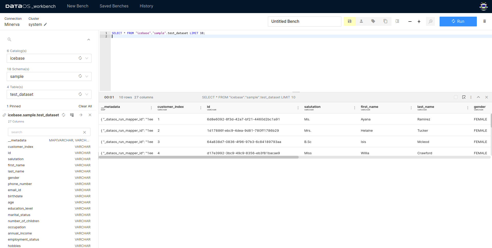
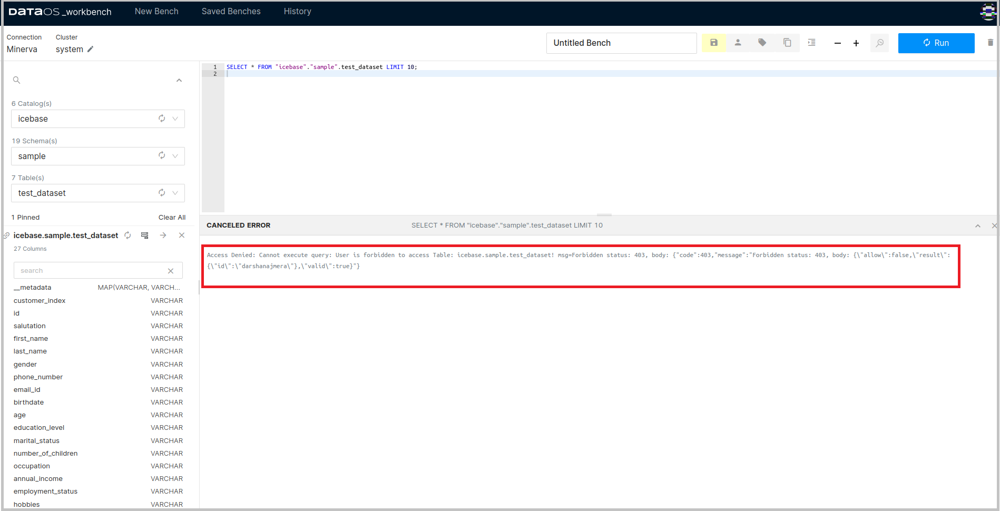
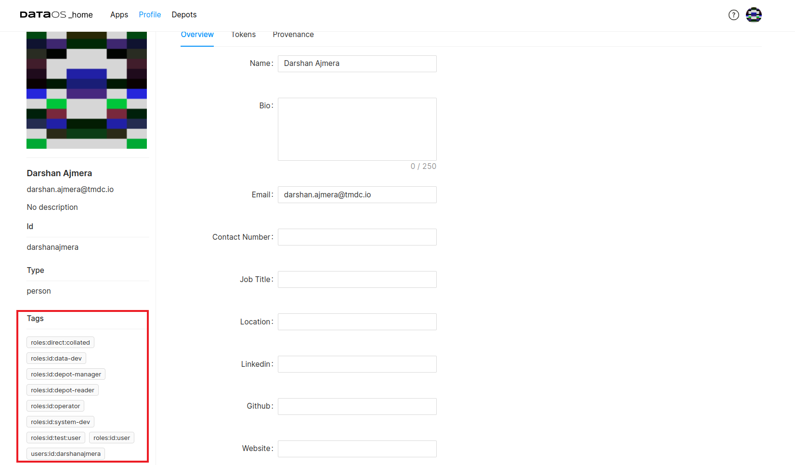
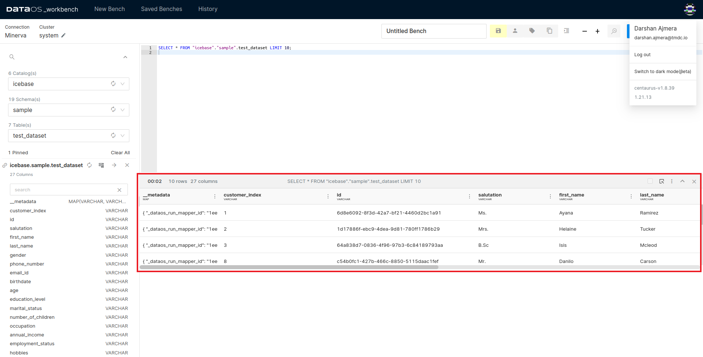

# Implementing Access Policy

As DataOS uses a declarative YAML paradigm, the policy is applied as a code that the user can apply from the User Interface.

Are you excited to create your first access policy for DataOS

## Building a Policy YAML

### **Resource Section**

- A Policy is a resource in DataOS, so while creating a policy the first and foremost step is to take into account the resource section in the policy

```yaml
name: sample-access-policy
version: v1
type: policy
tags:
  - dataos:type:resource
  - dataos:type:cluster-resource
  - dataos:resource:policy
  - dataos:layer:user
description: This is just a sample policy
owner: iamgroot
layer: user
policy: 
	{}
```

For more information about the various configuration fields in the resource section of a YAML, click here.

### **Policy Section**

Once we have configured policy for the Resource, now its time to go dirty with the Policy. The Policy section incorporates various configuration fields for a Policy. The below code block provides a general structure for the same. Within a Policy we have two separate types of Policy: Data and Access Policy.

For Access Policy, the YAML Configuration is as follows:

```yaml
policy:
	access:
		{}
		subjects: 
			{}
		predicates: 
			{}
		objects: 
```

For Data Policy, the YAML Configuraiton is as follows:

```yaml
policy:
  data:
    description: Dummy rule for demonstration
    name: test-phi-bucket-age
    priority: 40
    type: mask
		{mask-type}
			{}
    mask:
      bucket_number:
        buckets:
          - 20
          - 40
          - 60
          - 80
      operator: bucket_number
    selector:
      column:
        tags:
          - PHI.age
      user:
        match: any
        tags:
          - roles:id:system-dev
          - roles:id:data-dev
```

```yaml
	access:
		subjects: 
			{}
		predicates: 
			{}
		objects: 
```

```yaml
policy:
  access:
    subjects:
      tags:
        - - roles:id:**
        - - users:id:**
    predicates:
      - create
      - read
      - write
      - put
      - update
      - delete
      - post
    objects:
      paths:
        - dataos://icebase:spend_analysis/**
    allow: false
    description: policy allowing users to read from demo depots
    name: user-access-schema-spend-analysis
```

- Prerequisites
    - CLI
    - Operator Tag to add custom tags and apply policies
    - Sample dataset is ingested
- Sample Dataset
    - icebase:sample/ dataset
        
        
        
        Sample dataset
        
    - You are able to query it on Workbench because the DataOS default policy applied at the time of installation allows all DataOS users to access the ingested datasets.
- Access Policy Implementation
    - For demonstration purposes, we will create a policy to deny access to all users to this dataset
        
        ```yaml
        version: v1
        name: test-policy-usecase-denying-access
        type: policy
        layer: user
        description: "policy denying users"
        policy:
          access:
            subjects:
              tags:
                - "roles:id:*"                  # default tag for DataOS users
                
            predicates:
              - "read"
            objects:
              paths:                            # resource, a sample dataset
                - "dataos://icebase:sample/test_dataset"
            allow: false                        # to restrict access
        ```
        
    - Open the DataOS CLI. Use the apply command to create this policy in the DataOS environment.
        
        ```bash
        dataos-ctl apply -f access_policy_denying.yaml
        ```
        
    - As a result of this policy implementation, you can not access the sample dataset anymore.
        
        
        
        Dataset not accessible
        
    - Create a new policy to allow access to the resource (sample dataset in the example) for all the users having this custom tag.
    - Here is the policy YAML to allow access for the user having a custom tag - roles:id:test:user
    
    ```yaml
        version: v1
        name: test-policy-usecase-allowing-access
        type: policy
        layer: user
        description: "policy implementation to allow users having custom tag 'roles:id:test:user'"
        policy:
          access:
            subjects:
              tags:
                - "roles:id:test:user"          # Custom tag
            predicates:
              - "read"
            objects:
              paths:                            # resource, a sample dataset
                - "dataos://icebase:sample/test_dataset"
            allow: true
    ```
    
- Now we will add this custom tag to allow a user to access the sample dataset using the following CLI command. You can see the custom tag listed in the output for the user.
    
    ```bash
    dataos-ctl user tag add -i 'iamgroot' -t 'roles:id:test:user'
    
    INFO[0000] 🏷 user tag add...                            
    INFO[0000] new tags: roles:id:test:user                 
    INFO[0003] 🏷 user tag add...complete                    
    
           ID       |              TAGS               
    ----------------|---------------------------------
        iamgroot    | roles:direct:collated,          
                    | roles:id:data-dev,              
                    | roles:id:depot-manager,         
                    | roles:id:depot-reader,          
                    | roles:id:operator,              
                    | roles:id:system-dev,            
                    | roles:id:test:user,             
                    | roles:id:user,                  
                    | users:id:iamgroot
    ```
    
- These tags can also be seen in the user’s profile on DataOS UI.
    
    
    
    Tags on user’s profile page
    
- The user iamgroot is able to access and query the sample dataset due to the access policy implemented with a custom tag.
- The following screenshot displays the query result on the DataOS Workbench.
    
    
    
    Dataset accessible after adding a custom tag