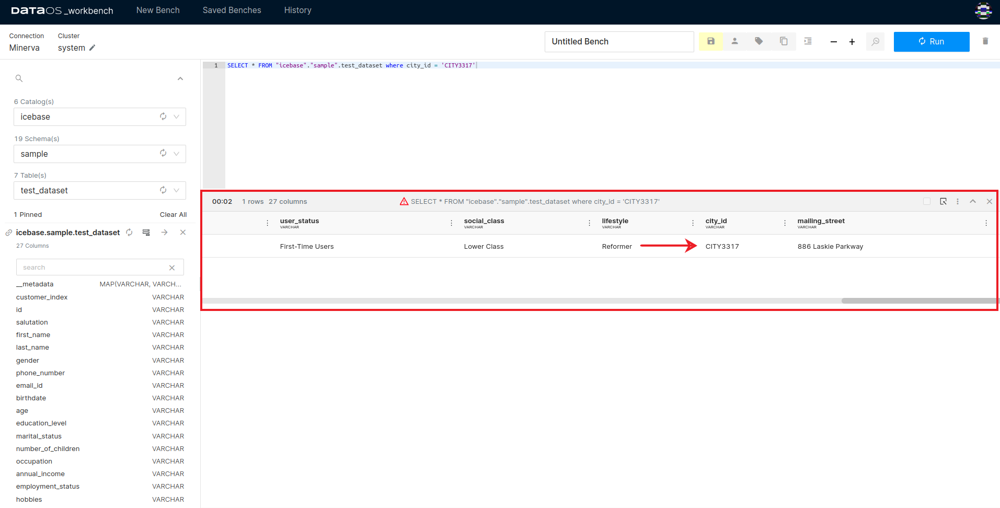
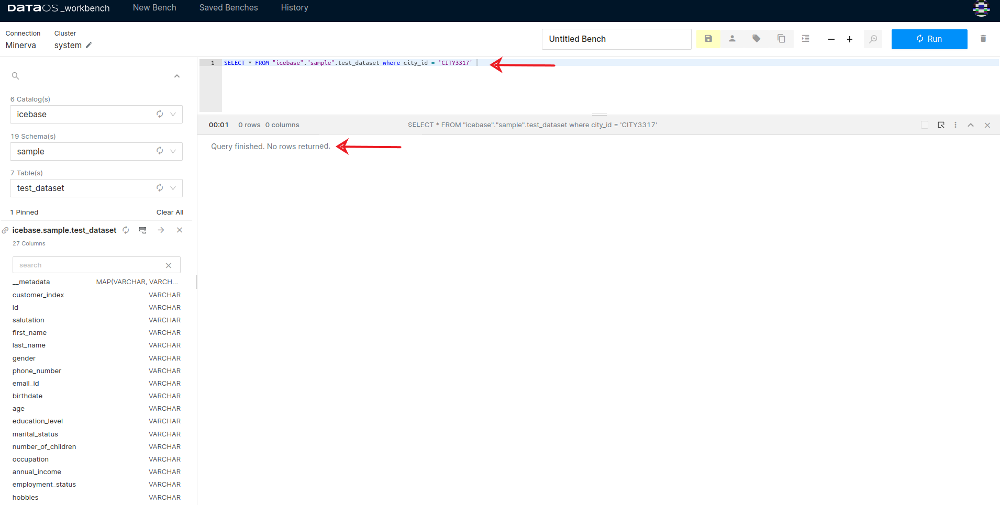
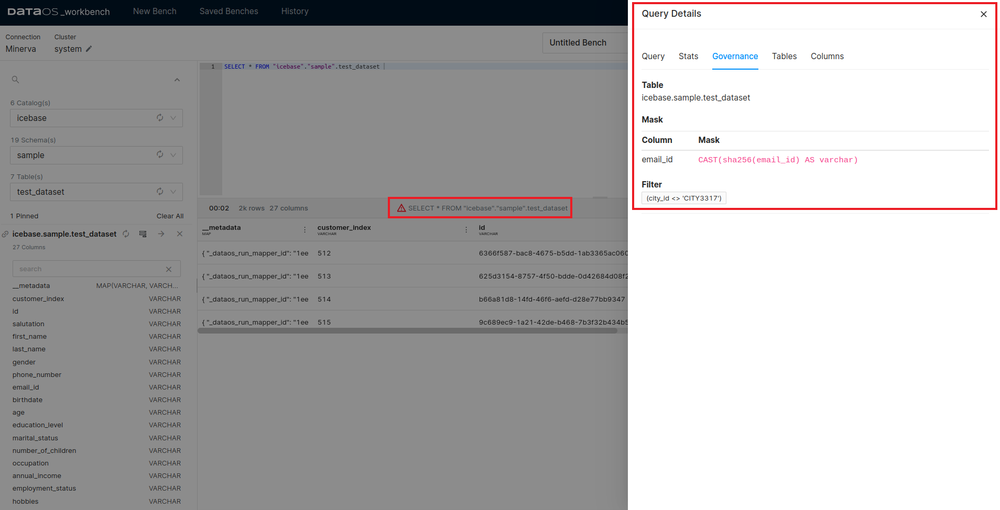

# Implementing Data Filtering Policy

DataOS allows you to curate the output of your queries through the application of data filter policies. By constructing a filter policy, you can exclude records from the dataset based on specified filtering criteria. The procedure to implement a data filtering policy is outlined below.

## Step 1: Create a Filter Policy

Define a policy that is applicable to all users associated with the specified tag `dataos:u:test:policy`. An example of a policy is provided below in YAML format:

```yaml
version: v1
name: test-policy-usecase-filter-to-city
type: policy
layer: user
description: "data policy to filter just CITY3317 data"
owner:
policy:
  data:
    type: filter
    priority: 80
    selector:
      user:
        match: any
        tags:
          - "roles:id:test:user"
    filters:
      - column: city_id
        operator: not_equals
        value: CITY3317
    depot: icebase
    collection: sample
    dataset: test_dataset
```

## Step 2: Apply the Policy

Use the DataOS Command Line Interface (CLI) to apply the policy as follows:

```bash
dataos-ctl apply -f filter-to-city.yaml
# Expected Output
INFO[0000] 🛠 apply...
INFO[0000] 🔧 applying test-policy-usecase-filter-to-city:v1beta1:policy...
INFO[0001] 🔧 applying test-policy-usecase-filter-to-city:v1:policy...created
INFO[0001] 🛠 apply...complete
```

## Step 3: **Assess the Impact of the Policy**

### **Before Policy Implementation**

Prior to the implementation of the filter policy, data associated with the city_id ‘CITY3317’ is visible in the query output.



Data visible for the specific city_id 

### **After Policy Implementation**

Post-policy implementation, the data corresponding to the city_id ‘CITY3317’ will no longer be visible in the query output.



Data not visible for the specific city_id after the filter policy implemented

## Step 4: **Viewing the Applied Policy Information**

If you wish to inspect the policy applied, run the query on the workbench to display records from the dataset. Upon implementation of a policy, a red information icon will appear above the query result. Clicking on this icon will reveal information about all the policies currently applied to the dataset.



Policies applied to the dataset