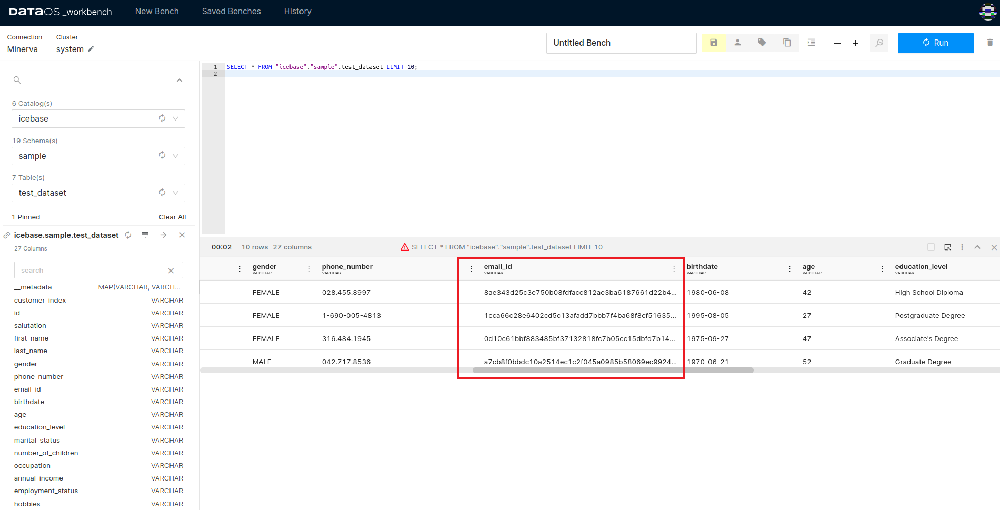
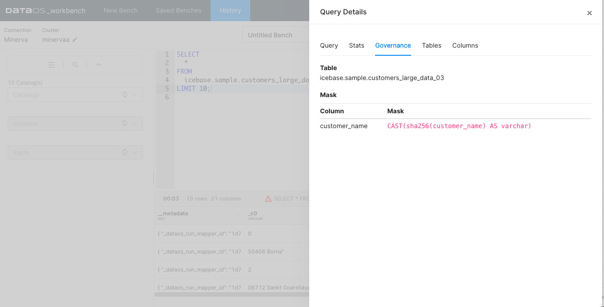

# Implementing Data Masking Policy

Once you understand the configurations of a masking policy, the next step is to successfully create one. Formulating a robust data masking policy requires a good grasp of your data, understanding its structure, and determining which data elements are sensitive. The subsequent section guides you through the process of crafting a data masking policy tailored to your specific needs.

## Step 1: Establish a Data Policy

The first step entails creating a data policy. This policy is designed to mask the content in the `email_id` column of a sample dataset. It achieves this by utilizing a hashing technique, specifically targeting users who possess the custom tag `roles:id:test:user`.

```yaml
version: v1
name: test-policy-usecase-pii-hash
type: policy
layer: user
description: "data policy to hash pii column - email_id"
owner:
policy:
  data:
    type: mask
    priority: 90
    depot: icebase
    collection: sample
    dataset: test_dataset
    selector:
      user:
        match: any
        tags:
          - "roles:id:test:user"
      column:
        names:
          - "email_id"
    mask:
      operator: hash
      hash:
        algo: sha256
```

## Step 2: Apply the Policy

Following policy creation, you'll need to `apply` the policy using the DataOS CLI. This can be achieved using the following command:

```bash
dataos-ctl apply -f email_id_mask_hash.yml
# Expected Output
INFO[0000] 🛠 apply...
INFO[0000] 🔧 applying test-policy-usecase-pii-hash:v1:policy...
INFO[0001] 🔧 applying test-policy-usecase-pii-hash:v1:policy...created
INFO[0001] 🛠 apply...complete
```

### Step 3: **Verify the Policy Application**

Once the policy has been applied, run a query on the DataOS Workbench and check the column in the output data. This will confirm whether the `email_id` column values have been successfully hashed.



Column values hashed after the data policy implemented

This image shows how the `email_id` column values appear after the data policy has been implemented, indicating a successful hash operation.

Upon querying a dataset, the interface displays all the policies applied to it. If a governance policy has been implemented on the queried table, a cautionary triangle symbol will appear in the result bar of the result pane, signaling the presence of such a policy.



The red cautionary triangle indicates you have limited permission to query this Table