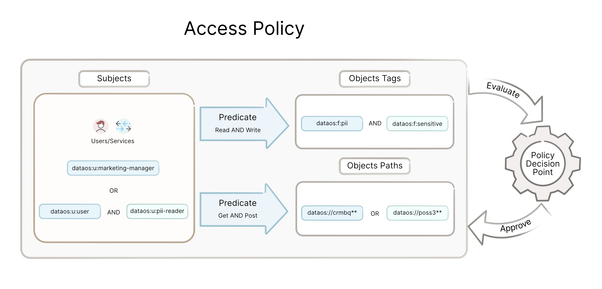
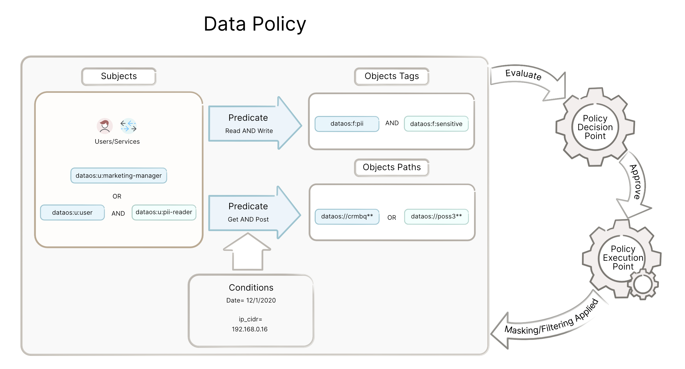

# PDP and PEP

The pattern of interaction can be better understood by understanding PDP and PEP.

Policy Decision Point (**PDP**) is the service that evaluates a specific subject-predicate-object-metadata request against the current policies to determine if access to the DataOS resource/ environment is allowed or denied.

A policy enforcement point (**PEP**) is the service responsible for executing the decision returned from PDP. At the point of access, it calls the PDP with the requisite information to authorize the current context. Based on the response from the PDP, it lets the user/system perform the respective action or otherwise denies it. Example: Nginx proxy during ingress validates that specific API paths are allowed or denied and does not proxy the request if the PDP returns denied.

The following diagrams explain how the policies are evaluated and executed.

Heimdall acts as the PDP for **access policies**, and all the other services in the system act as a PEP and then communicate with Heimdall for all authorization purposes.

To learn more, click [here](../../philosophy/architecture.md)

For **data policies**, the Gateway service acts as the PDP, and accordingly, filtering and masking are applied to the requested data. Data Policies are stored with Poros. 

To learn more, click [here](../../philosophy/architecture.md)