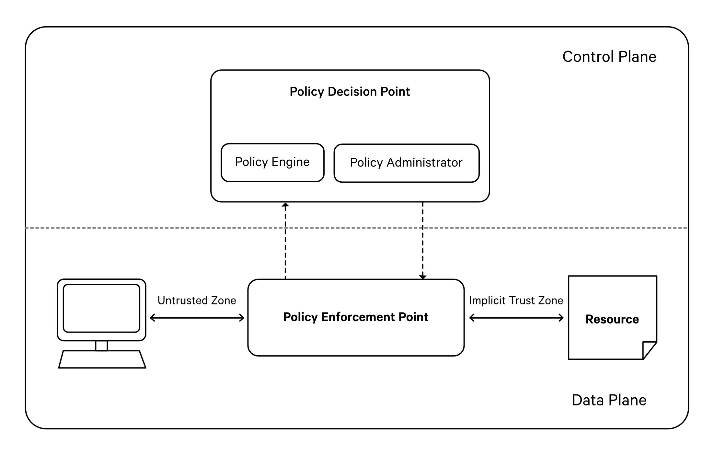

# Understanding ABAC, PDP and PEP

## Attribute Based Access Control (ABAC)

DataOS leverages Attribute-Based Access Control (ABAC) to facilitate fine-grained access control and authorization. ABAC policies in DataOS are guided by the evaluation of attributes, also known as "tags," associated with the user making the request, the requested resource, and the intended action.

To achieve this, DataOS relies on the subject-predicate-object triad:

**Subject**: Users or applications/services identified by sets of tags that initiate resource requests.

**Object**: Resources that can be exposed by the system itself or applications/services running on top of DataOS. Objects are identified using UDL addresses, API paths, or sets of tags.

**Predicate**: The specific action or operation a user desires to perform, such as a read or write operation on a path, or an HTTP operation on an API path.

Policy decisions in DataOS are made by evaluating the attributes or tags associated with subjects and objects. These tags are matched against a set of policies to determine whether a particular predicate should be allowed or denied for a given subject and object combination.

## PDP and PEP

Whenever a user attempts to perform a predicate on a resource, this interaction pattern can be better comprehended through an understanding of Policy Decision Points (PDP) and Policy Enforcement Points (PEP).

### **Policy Decision Point (PDP)**

True to its name, the Policy Decision Point (PDP) is responsible for making policy decisions. It maintains a data structure comprising all the policies and provides an API that receives a user token (to ascertain the subject), the predicate being requested, and the target object. Based on existing policies, it responds by either granting or refusing permission.

### **Policy Enforcement Point (PEP)**

A Policy Enforcement Point (PEP) signifies the service at the point of access. Upon being accessed, it interacts with the Policy Decision Point (PDP), providing it with the necessary information to authorize the current context. Depending on the response received from the PDP, the PEP either permits or denies the user's intended action. For instance, during ingress, the Nginx proxy validates whether specific API paths are permissible or restricted and refrains from proxying the request if the PDP indicates denial.

In this context, **Heimdall** serves as the PDP for access policies, while **Minerva Gateway** fulfills the role of the PDP for Data Policies. The rest of the system's services function as PEPs, liaising with Heimdall and Gateway for all authorization-related matters.