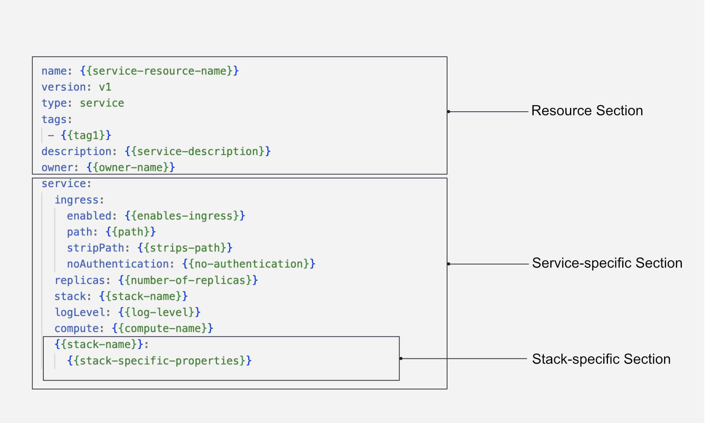

# Service

A Service represents a long-running process that acts as a receiver and/or provider of APIs. It serves as a fundamental [Resource](../resources.md) in the DataOS ecosystem, catering to various scenarios involving continuous real-time and streaming data flow. Whether it's event processing, streaming IoT data, log processing for network devices, real-time stock trade analysis, or dynamic user interfaces (UIs), the Service Resource enables data developers to gather, process, and analyze real-time/streaming data flow, enabling timely insights and swift response to the latest information.

While resembling a [Workflow](./workflow.md) in some aspects, a Service differentiates itself by not employing [Directed Acyclic Graphs (DAGs)](./workflow.md#workflows-and-directed-acyclic-graphs-dags). Instead, a Service is provisioned as a runnable entity, albeit limited to utilizing a single [Stack](./stacks.md) at a time. This contrasts with a Workflow, which can accommodate multiple [jobs](./workflow.md#workflows-and-directed-acyclic-graphs-dags) being executed upon separate Stacks.

## Core Concepts

### **Ports and Sockets**

The Service Resource is equipped with a port and a socket, for data reception and transmission. By listening on a specific URL port, the Service facilitates the posting or retrieval of data. The presence or absence of these ports and sockets depends on the specific use case requirements and objectives.

### **Ingress**

In DataOS, Ingress exposes HTTP and HTTPS routes from outside the DataOS context to services within the DataOS environment. It configures the incoming port for the Service Resource, enabling access to DataOS resources from external links. Ingress plays a crucial role in facilitating communication between DataOS and external systems or users.

### **Replicas**

To achieve robust scalability, the Service Resource introduces the concept of replicas. Replicas ensure a stable set of identical Kubernetes Pods that run the Service concurrently. This mechanism guarantees availability by maintaining a specified number of Pods, enabling the Service to effortlessly handle heavy workloads without succumbing to failure.


## Structure of a Service YAML

The Service Resource is configured using a YAML file, consisting of several rooted sections. The structure for a Service YAML is given below:

<center>



</center>


<center>

<i>Service Resource YAML configuration structure</i>

</center>

## How to create a Service?

To understand how a Service works, let’s take a case scenario where a user wants to bring the data from a web app using Google Tag Manager to draw up insights in real-time. This would involve sending all the captured data by Google Tag Manager to an API, applying some transformations, and writing it to, let’s say, a streaming source, Kafka. This would require a Service that would keep listening to the Google Tag Manager API and sync all the data to Kafka in real time.


### **Service YAML Configuration**

To create a Service resource, you need to configure the YAML file with the appropriate attributes/fields. The following sections explain the necessary configurations.

#### **Configuring the Resource Section**

A Service is a type of resource in DataOS. Below is the YAML configuration for the Resource Section:
```yaml
name: {{my-workflow}}
version: v1 
type: service 
tags: 
  - {{dataos:type:resource}}
  - {{dataos:type:workspace-resource}}
description: {{This is a sample service YAML configuration}}
owner: {{iamgroot}}
```
<center><i>Resource Section Configuration for a Service</i></center>

For detailed customization options and additional fields within the Resource Section, refer to the [Resource Configuration](../resources/resource_grammar.md).

#### **Configuring the Service-specific Section**

The Service-specific Section contains configurations specific to the Service resource. The YAML syntax is provided below:

```yaml
service: 
    title: {{"Hit Collector Service"}}
    replicas: {{1}}
    autoScaling: 
        enabled: {{true}}
        minReplicas: {{2}}
        maxReplicas: {{4}}
        targetMemoryUtilizationPercentage: {{80}}
        targetCPUUtilizationPercentage: {{80}}
    ingress: 
        enabled: {{true}}
        stripPath: {{false}}
        path: {{/hit-collector}}
        noAuthentication: {{true}}
    stack: {{stack}} # Specify stack here
    logLevel: {{INFO}}
    dryRun: {{true}}
    servicePort: {{8099}}
    {{Stack-specific-section}}
```
<center><i>Service-specific Section Configuration</i></center>

#### **Configuring the Stack-specific Section**

The Stack-specific Section allows you to specify the desired stack for executing your service. Depending on your requirements, you can choose from the following supported stacks:

- [Benthos Stack](./stacks/benthos.md): The Benthos stack provides advanced capabilities for stream data processing and analysis.

- [Alpha Stack](./stacks/alpha.md): The Alpha stack offers a powerful environment for hosting web-appliation, and custom Docker images atop DataOS.

- [Beacon Stack](./stacks/beacon.md): The Beacon stack provides a comprehensive set of tools and utilities for managing PostsgreSQL Database.

To configure the Stack-specific Section, refer to the appropriate stack documentation for detailed instructions on setting up and customizing the stack according to your needs. Each stack has its unique features and configurations that can enhance the functionality of your workflow. A sample is provided below.

<details>
<summary>
Click here to view a sample service
</summary>

The sample service ingests product data from the thirdparty01 depot and store it in the icebase depot. This workflow leverages the Flare stack to efficiently execute the necessary data ingestion tasks. The provided YAML code snippet outlines the configuration and specifications of this workflow.


<br>

<b>Code Snippet</b>

```yaml
name: my-workflow
version: v1 
type: service 
tags: 
  - dataos:type:resource
  - dataos:type:workspace-resource
description: This is a sample service YAML configuration
owner: iamgroot
service: 
    title: "Hit Collector Service" 
    replicas: 1 
    autoScaling: 
        enabled: true
        minReplicas: 2
        maxReplicas: 4
        targetMemoryUtilizationPercentage: 80
        targetCPUUtilizationPercentage: 80
    ingress: 
        enabled: true
        stripPath: false
        path: /hit-collector
        noAuthentication: true
    stack: benthos 
    logLevel: INFO
    compute: runnable-default
    dryRun: true
    servicePort: 8099
    benthos:
        # Input (From Google Tag Manager API)
        input:
            http_server:
            address: 0.0.0.0:8099
            path: /hit-collector
            allowed_verbs:
                - POST
            timeout: 5s
            processors:
            - log:
                level: INFO
                message: hit collector - received hit...

        # Pipeline (Processing)
        pipeline:
            processors:
            - log:
                level: DEBUG
                message: processing message...
            - log:
                level: DEBUG
                message: ${! meta() }
            - bloblang: meta status_code = 200
            - for_each:
            - conditional:
                condition:
                    type: processor_failed
                processors:
                - log:
                    level: ERROR
                    message: 'Schema validation failed due to: ${!error()}'
                - bloblang: meta status_code = 400
                - log:
                    level: DEBUG
                    message: ${! meta() }
                - bloblang: |
                    root.payload = this.string().encode("base64").string()
                    root.received_at = timestamp("2006-01-02T15:04:05.000Z")
                    root.metadata = meta()
                    root.id = uuid_v4()
            - log:
                level: DEBUG
                message: processing message...complete
            threads: 1

        # Output (Into Kafka Depot)
        output:
            broker:
            outputs:
            - broker:
                outputs:
                - type: dataos_depot
                    plugin:
                    address: dataos://kafkapulsar:default/gtm_hits_dead_letter01
                    metadata:
                        type: STREAM
                        description: The GTM Hit Error Data Stream
                        format: json
                        schema: '{"type":"record","name":"default","namespace":"default","fields":[]}'
                        tags:
                        - hit
                        - gtm
                        - stream
                        - error-stream
                        - dead-letter
                        title: GTM Hit Error Stream
                - type: sync_response
                pattern: fan_out
                processors:
                - bloblang: root = if !errored() { deleted() }
            - broker:
                outputs:
                - type: dataos_depot
                    plugin:
                    address: dataos://kafkapulsar:default/gtm_hits01
                    metadata:
                        type: STREAM
                        description: The GTM Hit Data Stream
                        format: json
                        schema: '{"type":"record","name":"default","namespace":"default","fields":[]}'
                        tags:
                        - hit
                        - gtm
                        - event
                        - stream
                        title: GTM Hit Stream
                - type: sync_response
                pattern: fan_out
                processors:
                - bloblang: root = if errored() { deleted() }
            pattern: fan_out
```
</details>

### **Apply a Service YAML**

Run the `apply` command on DataOS CLI to create the service resource in DataOS environment.

```shell
dataos-ctl apply -f {{filename.yaml}} -w {{name of the workspace}}
```

To learn more about `apply` command, refer to the [CLI](../interfaces/cli/command_reference.md) section.

## Service YAML Configuration Field Reference

The table below presents an exhaustive list of key-value properties and their descriptions within a Service YAML file:

<center>

| Field | Data Type | Default Value | Possible Value | Requirement |
| --- | --- | --- | --- | --- |
| [`service`](./service/service_specific_section_grammar.md#service)| object | none | none | mandatory |
| [`title`](./service/service_specific_section_grammar.md#title) | string | none | any string | optional |
| [`servicePort`](./service/service_specific_section_grammar.md#serviceport) | integer | none | any valid service port | optional |
| [`metricPort`](./service/service_specific_section_grammar.md#metricport) | integer | none | any valid metric port | optional |
| [`ingress`](./service/service_specific_section_grammar.md#ingress) | object | none | none | mandatory**  |
| [`enabled`](./service/service_specific_section_grammar.md#enabled) | boolean | false | true/false | mandatory** |
| [`path`](./service/service_specific_section_grammar.md#path) | string | none | any valid path | mandatory** |
| [`stripPath`](./service/service_specific_section_grammar.md#strippath) | boolean | false | true/false | mandatory** |
| [`noAuthentication`](./service/service_specific_section_grammar.md#noauthentication) | boolean | false | true/false | optional |
| [`replicas`](./service/service_specific_section_grammar.md#replicas) | integer | 1 | any positive integer | optional  |
| [`autoscaling`](./service/service_specific_section_grammar.md#autoscaling) | object | none | none | optional |
| [`enabled`](./service/service_specific_section_grammar.md#enabled-1) | boolean | false | true/false | optional |
| [`minReplicas`](./service/service_specific_section_grammar.md#minreplicas) | integer | 1 | any positive integer | optional  |
| [`maxReplicas`](./service/service_specific_section_grammar.md#maxreplicas) | integer | 1 | any positive integer | optional  |
| [`targetMemoryUtilizationPercentage`](./service/service_specific_section_grammar.md#targetmemoryutilizationpercentage) | integer | none | any positive integer | optional  |
| [`targetCPUUtilizationPercentage`](./service/service_specific_section_grammar.md#targetcpuutilizationpercentage) | integer | None | any positive integer | optional  |
| [`stack`](./service/service_specific_section_grammar.md#stack) | string | None | benthos/alpha/beacon | mandatory |
| [`logLevel`](./service/service_specific_section_grammar.md#loglevel) | string | INFO | INFO/WARN/DEBUG/ERROR | optional |
| [`envs`](./service/service_specific_section_grammar.md#envs) | object | none | key-value pairs of environment variables | optional |
| [`compute`](./service/service_specific_section_grammar.md#compute) | string | none | runnable-default or any other custom Compute Resource | mandatory |
| [`resources`](./service/service_specific_section_grammar.md#resources) | object | none | none | optional  |
| [`requests`](./service/service_specific_section_grammar.md#requests) | object | none | none | optional  |
| [`limits`](./service/service_specific_section_grammar.md#limits) | object | none | none | optional  |
| [`cpu`](./service/service_specific_section_grammar.md#cpu) | string | requests: 100m, limits: 400m | cpu units in milliCPU(m) or cpu core | optional  |
| [`memory`](./service/service_specific_section_grammar.md#memory) | string | requests: 100Mi, limits: 400Mi | memory in Mebibytes(Mi) or Gibibytes(Gi) | optional  |
| [`runAsApiKey`](./service/service_specific_section_grammar.md#runasapikey) | string | user's API Key | any valid DataOS API Key | Optional  |
| [`runAsUser`](./service/service_specific_section_grammar.md#runasuser) | string | user's User-id | userID of Use-Case Assignee | optional  |
| [`dryRun`](./service/service_specific_section_grammar.md#dryrun) | boolean | false | true/false | optional |

</center>


<i>Mandatory**:</i> Fields mandatory for external paths, but optional for internal paths.

For a detailed explanation of each field, consult the [Service-specific Section Grammar](./service/service_specific_section_grammar.md)