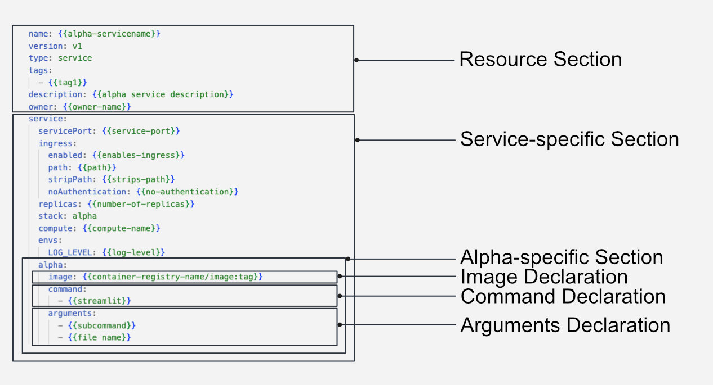

# Alpha

Alpha Stack is a declarative DevOps software development kit (SDK) to publish data-driven applications in production. As a cohesive stack, it seamlessly integrates with web-server-based application images constructed atop DataOS, empowering users to leverage DataOS's Compute Resource to execute external tools or applications. With Alpha Stack, application development is no longer bound by programming language constraints, as it enables the fluid deployment of diverse applications onto a robust, flexible infrastructure.

When deploying an application using Alpha Stack, the containerized image contains all the essential functionalities and logic required for the application, while execution of the image occurs within DataOS via the utilization of Alpha Stack, which can be invoked or called within a Service or a Workflow Resource.

## Syntax of Alpha YAML



<center><i>Alpha YAML Configuration Syntax</i></center>

## Getting Started with Alpha Stack

### **Deploying Images from a Public DockerHub Repository**

To begin the journey with Alpha Stack, let’s take an image already available on the public DockerHub repository and run it atop DataOS through Alpha Stack. To know more, navigate to the link below:

[Deploying Images on Public DockerHub ](./alpha/deploying_images_on_public_dockerhub.md)

### **Deploying Images from a Private DockerHub Repository**

You can also deploy custom-built images from a private DockerHub repository. To know more about this case scenario, navigate to the link below:

[Deploying images on a Private DockerHub ](./alpha/deploying_images_on_a_private_dockerhub.md)

## Components of Alpha

```yaml

# Resource Section
name: alpha-stack
version: v1
type: workflow/service
workflow/service: # Workflow/Service Specific Section
# ...
# ...
# ...
  stack: alpha # Stack (Here it's Alpha)
  secrets:
  	- newSecret # Secret (Resource) to be referred within Alpha
  envs:
  	LOG_LEVEL: info # Log Level
  alpha:

# Alpha Stack Specific Section
    image: swagger/swagger-ui # Path of the Docker Image
	command: # Command
	  - streamlit
    arguments: # Arguments
      - run
	  - app.py
```

### **Resource Section**

Alpha Stack can be implemented or executed via a Workflow or as a Service. Workflow/Service are DataOS Resources and are both provisioned as runnable. To know more about the YAML configurations for a Workflow/Service, refer to any of the below two sections:

[Workflow](../workflow.md)

[Service](../service.md)

### **Alpha Stack-specific Section**

**`alpha`**

All the configuration fields and values for the Alpha Stack are provided within the Alpha section.

```yaml
alpha:
  {} # All the fields and values for the Alpha stack are specified here
```

**`image`**

The path to the respective Docker Image within the DockerHub repository.

**Type:** string

**Default:** NA

```yaml
image: swagger/swagger-ui # Path of the Docker Image
```

**`command`**

This includes the commands that are mentioned within the CMD section of the Docker file.

For e.g., If the below is your Docker File, then the commands are provided within the CMD section:

```docker
# Dockerfile

FROM python:3.8-slim-buster

RUN pip install streamlit

WORKDIR /app
COPY app.py .

CMD ["streamlit", "run", "app.py"]
#     command      arguments 1 & 2
```

**Syntax:**

```yaml
command: 
  - streamlit
```

**`arguments`**

The arguments are the additional arguments apart form the primary command specified within the Dockerfile, as described above

```yaml
arguments:
  - run
  - app.py
```

## Recipes

[How to deploy a Streamlit App on DataOS](./alpha/build_a_streamlit_app_on_dataos.md)

[Alpha Stack within a Workflow](./alpha/alpha_stack_within_a_workflow.md)

[Creating shortcut for Alpha Stack based applications](./alpha/alpha_stack_based_app_shortcut.md)
