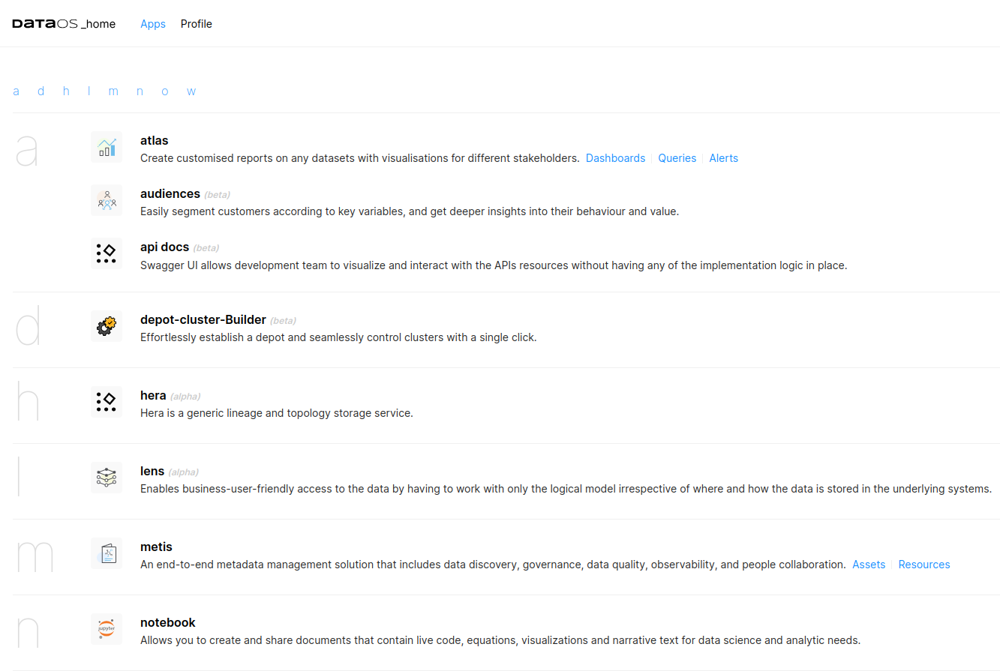

# Creating shortcuts for Alpha Stack based applications

In DataOS, the home page prominently showcases pre-built applications. Nevertheless, when a data developer hosts an application on the [Alpha Stack](../alpha.md), the responsibility for integrating a shortcut to their application and ensuring its accessibility to all users rests with them. 

This can be accomplished through the utilization of the `appDetailSpec` attribute. 

```yaml
appDetailSpec: {
    "name": {{name of application, e.g. "Depot-Cluster-Builder"}},
    "title": {{title of application, e.g. "Create your depot and cluster effortlessly"}},
    "releaseLevel": {{release level of application, e.g. "alpha", "beta"}},
    "description": {{description, e.g. "Empower your Depot management"}},
    "icon": {{icon of application in base64 format, else DataOS will provide a default image, e.g. "data:image/svg+xml;base64, abcdefghijklmnopqrstuvwxyz"}},
    "section": {{category or section of the application, e.g. "Business"}},
    "path": {{path or url associated with the application, e.g. "/depot-catalyst/"}},
    "keyword": {{keywords related to application, e.g. "Create Depot"}},
    "isInternal": {{true/false}},
    "disabled": {{true/false}},
    "navigation": {{additional navigation-related settings}}
}

```

## Structure of `appDetailSpec`

The `appDetailSpec` value is a JSON string containing the subsequent keys:

Certainly, here's the information for the JSON attributes presented in a table format with the requested columns:

<center>

| Attribute       | Data Type | Requirement | Default Value | Possible Value                  |
| --------------- | --------- | ----------- | ------------- | -------------------------------- |
| [`name`](#name)            | string    | mandatory          | none             | any valid string                 |
| [`title`](#title)           | string    | optional           | none             | any valid string                 |
| [`releaseLevel`](#releaselevel)    | string    | optional           | none             | "alpha", "beta", or any other valid string |
| [`description`](#description)     | string    | optional           | none             | any valid string                 |
| [`icon`](#icon)            | string    | optional           | default image identifier provided by DataOS             | Base64-encoded image |
| [`section`](#section)         | string    | optional           | none             | any valid string                 |
| [`path`](#path)            | string    | mandatory          | none             | any valid path                 |
| [`keyword`](#keyword)         | string    | optional           | none             | any valid string                 |
| [`isInternal`](#isinternal)      | boolean   | optional           | false             | true/false                |
| [`disabled`](#disabled)        | boolean   | optional           | false             | true/false                |
| [`navigation`](#navigation)      | mapping | optional         | none             | custom navigation settings |

</center>

### **Incorporating the Application Icon**

Should you possess a custom application icon, it is imperative that it be provided in SVG format for subsequent encoding as a Base64 string. 

**Procedure for Encoding Icon to Base64 Format** 

Two methods for converting an SVG image to a Base64 string are provided for your reference:

1. Employ the following **CLI** command to encode an SVG image as a Base64 string:

```bash
base64 -i {{file_path}}
```

2. Consult this [Link](https://base64.guru/converter/encode/image/svg) for base64 encoding.

Following the successful transformation of the SVG image to a Base64 encoded string, it can be introduced as the value of the `icon` key within the `appDetailSpec`.

### **Sample Alpha YAML**

The ensuing YAML example serves to illustrate the practical implementation of these directives.

```yaml
name: depot-catalyst
version: v1
type: service
service:
  title: depot-deployer
  replicas: 1
  servicePort: 8501
  ingress:
    appDetailSpec: '{ 
      "name": "Depot-Cluster-Builder",
      "title": "Create your depot and cluster effortlessly",
      "releaseLevel": "beta",
      "description": "Power your Depot management.",
      "icon": "data:image/svg+xml;base64,PHN2ZyBpZD0iTGF5ZXJfMSIgZGF0YS1uYW1lPSJMYXllciAxIiB4bWxucz0iaHR0cDovL3d3dy53My5vcmcvMjAwMC9zdmciIHZpZXdCb3g9IjAgMCA1MDAgNTAwIj48ZGVmcz48c3R5bGU+LmNscy0xe2ZpbGw6IzQ5NDk0YTt9LmNscy0ye2ZpbGw6I2ZmYzQzZDt9LmNscy0ze2ZpbGw6bm9uZTtzdHJva2U6IzAwMDtzdHJva2UtbGluZWNhcDpyb3VuZDtzdHJva2UtbGluZWpvaW46cm91bmQ7c3Ryb2tlLXdpZHRoOjIwcHg7fS5jbHMtNHtmaWxsOiNmYWFlMTc7fTwvc3R5bGU+PC9kZWZzPjx0aXRsZT5tYW5hZ2VtZW50PC90aXRsZT48cGF0aCBjbGFzcz0iY2xzLTEiIGQ9Ik0zNzAuMDgsMjc3LjY3LDM2Mi40NSwzMTNIMzE1LjIzbC03LjYzLTM1LjI5YTExOS4yNiwxMTkuMjYsMCwwLDEtMjguNTEtMTEuODJsLTkuODYsNi4zNUE4MCw4MCwwLDEsMSwyMjksMjMwLjg4bDUuOTMtOS4yMWExMTkuMjQsMTE5LjI0LDAsMCwxLTExLjgxLTI4LjUxbC0zNS4yOS03LjYzVjEzOC4zMWwzNS4yOS03LjYzYy43NS0yLjgsMS42MS01LjU0LDIuNTYtOC4yNWwtMS00LjQzaC01OGwtOS4zNyw0My4zNmExNDUuOTIsMTQ1LjkyLDAsMCwwLTM1LDE0LjUxTDg1LDE1MS44NCw2NS40NSwxNzEuMzdsLTIsMS45NUw0NCwxOTIuODZsMjQsMzcuMjlhMTQ2LjU3LDE0Ni41NywwLDAsMC0xNC41MSwzNWwtNDMuMzYsOS4zN3Y1OGw0My4zNiw5LjM3QTE0Ni43NCwxNDYuNzQsMCwwLDAsNjgsMzc3TDQ0LDQxNC4yNmwxOS41MywxOS41MywyLDJMODUsNDU1LjI4bDM3LjI5LTI0YTE0Ni4zMywxNDYuMzMsMCwwLDAsMzUsMTQuNTFsOS4zNyw0My4zNmg1OGw5LjM4LTQzLjM2YTE0Ni4yNiwxNDYuMjYsMCwwLDAsMzUtMTQuNTFsMzcuMjksMjQsMTkuNTQtMTkuNTMsMS45NS0yLDE5LjU0LTE5LjUzLTI0LTM3LjI5YTE0Ni4zNiwxNDYuMzYsMCwwLDAsMTQuNTItMzVsNDMuMzUtOS4zN3YtNThsLS44NC0uMThDMzc3LDI3NS42MSwzNzMuNTksMjc2LjcyLDM3MC4wOCwyNzcuNjdaIi8+PHBhdGggY2xhc3M9ImNscy0yIiBkPSJNNDU0LjU5LDEzMC42OGExMTkuMjQsMTE5LjI0LDAsMCwwLTExLjgxLTI4LjUxbDE5LjU2LTMwLjM2LTE1LjktMTUuOS0xLjU5LTEuNTktMTUuOTEtMTUuOUwzOTguNTksNThhMTE5LjI0LDExOS4yNCwwLDAsMC0yOC41MS0xMS44MWwtNy42My0zNS4yOUgzMTUuMjNMMzA3LjYsNDYuMTdBMTE5LjI0LDExOS4yNCwwLDAsMCwyNzkuMDksNThMMjQ4LjczLDM4LjQybC0xNS45LDE1LjktMS41OSwxLjU5LTE1LjksMTUuOSwxOS41NiwzMC4zNmExMTkuMjQsMTE5LjI0LDAsMCwwLTExLjgxLDI4LjUxbC0zNS4yOSw3LjYzdjQ3LjIybDM1LjI5LDcuNjNhMTE5LjI0LDExOS4yNCwwLDAsMCwxMS44MSwyOC41MUwyMTUuMzQsMjUybDE1LjksMTUuOSwxLjU5LDEuNTksMTUuOSwxNS45MSwzMC4zNi0xOS41N2ExMTkuMjYsMTE5LjI2LDAsMCwwLDI4LjUxLDExLjgyTDMxNS4yMywzMTNoNDcuMjJsNy42My0zNS4yOWExMTkuMjYsMTE5LjI2LDAsMCwwLDI4LjUxLTExLjgybDMwLjM1LDE5LjU3LDE1LjkxLTE1LjkxLDEuNTktMS41OSwxNS45LTE1LjktMTkuNTYtMzAuMzVhMTE5LjI0LDExOS4yNCwwLDAsMCwxMS44MS0yOC41MWwzNS4yOS03LjYzVjEzOC4zMVoiLz48cGF0aCBjbGFzcz0iY2xzLTMiIGQ9Ik00NTQuNTksMTMwLjY4YTExOS4yNCwxMTkuMjQsMCwwLDAtMTEuODEtMjguNTFsMTkuNTYtMzAuMzYtMTUuOS0xNS45LTEuNTktMS41OS0xNS45MS0xNS45TDM5OC41OSw1OGExMTkuMjQsMTE5LjI0LDAsMCwwLTI4LjUxLTExLjgxbC03LjYzLTM1LjI5SDMxNS4yM0wzMDcuNiw0Ni4xN0ExMTkuMjQsMTE5LjI0LDAsMCwwLDI3OS4wOSw1OEwyNDguNzMsMzguNDJsLTE1LjksMTUuOS0xLjU5LDEuNTktMTUuOSwxNS45LDE5LjU2LDMwLjM2YTExOS4yNCwxMTkuMjQsMCwwLDAtMTEuODEsMjguNTFsLTM1LjI5LDcuNjN2NDcuMjJsMzUuMjksNy42M2ExMTkuMjQsMTE5LjI0LDAsMCwwLDExLjgxLDI4LjUxTDIxNS4zNCwyNTJsMTUuOSwxNS45LDEuNTksMS41OSwxNS45LDE1LjkxLDMwLjM2LTE5LjU3YTExOS4yNiwxMTkuMjYsMCwwLDAsMjguNTEsMTEuODJMMzE1LjIzLDMxM2g0Ny4yMmw3LjYzLTM1LjI5YTExOS4yNiwxMTkuMjYsMCwwLDAsMjguNTEtMTEuODJsMzAuMzUsMTkuNTcsMTUuOTEtMTUuOTEsMS41OS0xLjU5LDE1LjktMTUuOS0xOS41Ni0zMC4zNWExMTkuMjQsMTE5LjI0LDAsMCwwLDExLjgxLTI4LjUxbDM1LjI5LTcuNjNWMTM4LjMxWiIvPjxwYXRoIGNsYXNzPSJjbHMtMyIgZD0iTTM3MC4wOCwyNzcuNjcsMzYyLjQ1LDMxM0gzMTUuMjNsLTcuNjMtMzUuMjlhMTE5LjI2LDExOS4yNiwwLDAsMS0yOC41MS0xMS44MmwtOS44Niw2LjM1QTgwLDgwLDAsMSwxLDIyOSwyMzAuODhsNS45My05LjIxYTExOS4yNCwxMTkuMjQsMCwwLDEtMTEuODEtMjguNTFsLTM1LjI5LTcuNjNWMTM4LjMxbDM1LjI5LTcuNjNjLjc1LTIuOCwxLjYxLTUuNTQsMi41Ni04LjI1bC0xLTQuNDNoLTU4bC05LjM3LDQzLjM2YTE0NS45MiwxNDUuOTIsMCwwLDAtMzUsMTQuNTFMODUsMTUxLjg0LDY1LjQ1LDE3MS4zN2wtMiwxLjk1TDQ0LDE5Mi44NmwyNCwzNy4yOWExNDYuNTcsMTQ2LjU3LDAsMCwwLTE0LjUxLDM1bC00My4zNiw5LjM3djU4bDQzLjM2LDkuMzdBMTQ2Ljc0LDE0Ni43NCwwLDAsMCw2OCwzNzdMNDQsNDE0LjI2bDE5LjUzLDE5LjUzLDIsMkw4NSw0NTUuMjhsMzcuMjktMjRhMTQ2LjMzLDE0Ni4zMywwLDAsMCwzNSwxNC41MWw5LjM3LDQzLjM2aDU4bDkuMzgtNDMuMzZhMTQ2LjI2LDE0Ni4yNiwwLDAsMCwzNS0xNC41MWwzNy4yOSwyNCwxOS41NC0xOS41MywxLjk1LTIsMTkuNTQtMTkuNTMtMjQtMzcuMjlhMTQ2LjM2LDE0Ni4zNiwwLDAsMCwxNC41Mi0zNWw0My4zNS05LjM3di01OGwtLjg0LS4xOEMzNzcsMjc1LjYxLDM3My41OSwyNzYuNzIsMzcwLjA4LDI3Ny42N1oiLz48Y2lyY2xlIGNsYXNzPSJjbHMtNCIgY3g9IjMzOC44NCIgY3k9IjE2MC41NSIgcj0iODMuOTciLz48cG9seWxpbmUgY2xhc3M9ImNscy0zIiBwb2ludHM9IjI5Ny4zNiAxNjUuNDcgMzI2LjE2IDE5MyAzODQuMTEgMTM1LjA1Ii8+PC9zdmc+",
      "section": "Business",
      "path": "/depot-catalyst/",
      "keyword": "Create Depot",
      "isInternal": false,
      "disabled": false,
      "navigation": []
}'
    enabled: true
    noAuthentication: true
    path: /depot-catalyst
    stripPath: true
  stack: alpha
  compute: runnable-default 
  resources:
    requests:
      cpu: 1
      memory: 500Mi
    limits:
      cpu: 2
      memory: 10Gi
  envs:
    LOG_LEVEL: info
    DATAOS_ENV: 'https://{{dataos-context}}.dataos.app' 
  alpha:
    command: 
      - streamlit
    arguments:
      - run
      - main.py
      - --server.port=8501
      - --server.address=0.0.0.0
    image: iamgroot/alphaapp:latest

```
### **Result**

Once you've successfully applied the YAML, your app icon will appear in the home page of the environment along with other apps as shown in the screenshot below.

<center>




<i> Alpha Stack application icon on DataOS Home Page </i>

</center>

## Attributes of `appDetailSpec`


### **`name`**

**Description:** the `name` attribute specifies the name of the application.

| **Data Type** | **Requirement** | **Default Value** | **Possible Value**  |
| ------------- | --------------- | ------------------ | ------------------- |
| string        | mandatory       | none     | any valid string     |

**Example Usage:**
```json
"name": "Depot-Cluster-Builder"
```

---

### **`title`**

**Description:** the `title` attribute specifies the title of the application.

| **Data Type** | **Requirement** | **Default Value** | **Possible Value**  |
| ------------- | --------------- | ------------------ | ------------------- |
| string        | optional              | none      | any valid string     |

**Example Usage:**
```json
"title": "Create your depot and cluster effortlessly"
```

---

### **`releaseLevel`**

**Description:** the `releaseLevel` attribute specifies the release level of the application.

| **Data Type** | **Requirement** | **Default Value** | **Possible Value**  |
| ------------- | --------------- | ------------------ | ------------------- |
| string        | optional             | none            | "alpha", "beta", or any other valid string |

**Example Usage:**
```json
"releaseLevel": "alpha"
```
---

### **`description`**

**Description:** the `description` attribute provides a brief description of the application.

| **Data Type** | **Requirement** | **Default Value** | **Possible Value**  |
| ------------- | --------------- | ------------------ | ------------------- |
| string        | optional               | none                  | any valid string    |

**Example Usage:**
```json
"description": "Empower your Depot management"
```
---

### **`icon`**

**Description:** the `icon` attribute specifies the icon of the application in base64 format. If not provided, DataOS will use a default image.

| **Data Type** | **Requirement** | **Default Value** | **Possible Value**  |
| ------------- | --------------- | ------------------ | ------------------- |
| string        | mandatory              | default image identifier provided by DataOS              | Base64-encoded image in <br> <code>data:image/svg+xml;base64,{{base64-encoded-image}}</code>|

**Example Usage:**
```json
"icon": "data:image/svg+xml;base64, abcdefghijklmnopqrstuvwxyz"
```
---

### **`section`**

**Description:** the `section` attribute categorizes the application into a specific section or category.

| **Data Type** | **Requirement** | **Default Value** | **Possible Value**  |
| ------------- | --------------- | ------------------ | ------------------- |
| string        | optional              | none                 | any valid string (like Business, Marketing)    |

**Example Usage:**
```json
"section": "Business"
```
---

### **`path`**

**Description:** the `path` attribute specifies the path or URL associated with the application.

| **Data Type** | **Requirement** | **Default Value** | **Possible Value**  |
| ------------- | --------------- | ------------------ | ------------------- |
| string        | mandatory             | none                  | valid path     |

**Example Usage:**
```json
"path": "/depot-catalyst/"
```
---

### **`keyword`**

**Description:** The `keyword` attribute provides keywords related to the application.

| **Data Type** | **Requirement** | **Default Value** | **Possible Value**  |
| ------------- | --------------- | ------------------ | ------------------- |
| string        | optional            | none               | any valid string     |

**Example Usage:**
```json
"keyword": "Create Depot"
```
---

### **`isInternal`**

**Description:** The `isInternal` attribute indicates whether the application is for internal use.

| **Data Type** | **Requirement** | **Default Value** | **Possible Value**  |
| ------------- | --------------- | ------------------ | ------------------- |
| boolean       | mandatory              | false                 | true/false    |

**Example Usage:**
```json
"isInternal": true
```
---

### **`disabled`**

**Description:** The `disabled` attribute specifies whether the application is currently disabled.

| **Data Type** | **Requirement** | **Default Value** | **Possible Value**  |
| ------------- | --------------- | ------------------ | ------------------- |
| boolean       | mandatory              | false              | true/false    |

**Example Usage:**
```json
"disabled": false
```
---

### **`navigation`**

**Description:** The `navigation` attribute may contain additional navigation-related settings for the application. The content and format of this attribute can vary depending on specific navigation needs.

| **Data Type** | **Requirement** | **Default Value** | **Possible Value**  |
| ------------- | --------------- | ------------------ | ------------------- |
| mapping   |       optional         | none               | none |

**Example Usage:**
```json
"navigation": {}
```