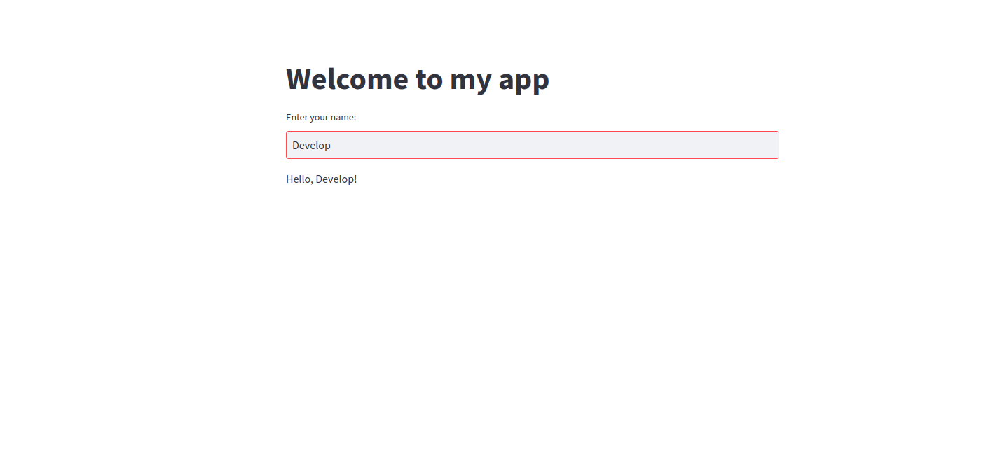

# Build a Streamlit App on DataOS

Here’s a step-by-step guide on how to create a simple streamlit application, dockerize it, and then run it on top of DataOS using Alpha stack.

## Create a Streamlit Application

First, we need to create a simple Streamlit application. Streamlit is a popular Python library that allows you to create interactive web applications quickly and easily.

For this example, we will create a simple application that allows you to enter your name and then displays a personalized message.

```python
# app.py

import streamlit as st

def main():
    st.title("Welcome to my app")
    name = st.text_input("Enter your name:")
    if name:
        st.write(f"Hello, {name}!")

if __name__ == "__main__":
    main()
```

You can run this application locally by running `streamlit run app.py` in the command line. The application will launch in your default web browser.

## Create a Docker Image

### **Build a Docker Image**

Next, we need to create a Docker image for our application. Docker is a containerization platform that allows you to package your application and its dependencies into a single image that can be run in any environment.

To create a Docker image, we need to create a `Dockerfile` that defines the build process.

```docker
# Dockerfile

FROM python:3.10-slim

RUN pip install streamlit

WORKDIR /app
COPY app.py .

CMD ["streamlit", "run", "app.py"]
```

This Dockerfile starts with a lightweight Python 3.10 base image, installs Streamlit, sets the working directory to `/app`, copies the `app.py` file into the container, and defines the command to run the application.

To build the Docker image, run the following command in the same directory as your `Dockerfile`:

```shell
docker build -t my-app:new .
```

This command builds a Docker image named `my-app` using the `Dockerfile` in the current directory.

### **Push the Docker Image to Container Registry**

Now that we have a Docker image for our application, we need to push it to a container registry. For this example, we will use Docker Hub, but you can use any container registry that you prefer.

First, you need to create a Docker Hub account and repository.

Next, log in to Docker Hub using the `docker login` command.

```shell
docker login --username=your-username
```

Replace `your-username` with your Docker Hub username, and input the password to login.

### **Tag the Docker Image**

To push an image to Docker Hub, your image needs to be tagged. In case it’s not tagged, you can use the below command.

```shell
docker image tag my-app:new your-username/my-app:new
```

Finally, push the Docker image to Docker Hub using the following command:

```shell
docker image push your-username/my-app:new
```

## Create an Alpha YAML

This command builds a Docker image named `my-app` using the `Dockerfile` in the current directory.

```yaml

version: v1 # Version 
type: service # Type of Resource
service: # Service Specific Section
  compute: runnable-default # Compute is Runnable-default (since its a service)
  replicas: 1 # Number of Service Replicas
  servicePort: 8080 # Service Port
  ingress: # Ingress Section
    enabled: true
    noAuthentication: true
    path: /stream # URL Path on which you wanna expose the application on
    stripPath: true
  stack: alpha # Here stack is Alpha (What else did you think? Beta, Gamma !!!)
  envs: # Environment Variables
    LOG_LEVEL: info # Log Level
  alpha: # Alpha Stack Specific Section
    image: your-username/my-app:new # Image Repository and Tag
    command:
      - streamlit
    arguments:
      - run 
      - app.py
```

## Apply the YAML file

Apply the YAML file using the `apply` command, as follows:

```shell
dataos-ctl apply -f <path-to-file> -w <workspace>
```

## Navigate over to the Web Browser

You can see the streamlit UI, on the web browser at the following address

`https://<dataos-context>/<path>` 



<center><i>Streamlit App on DataOS</i></center>