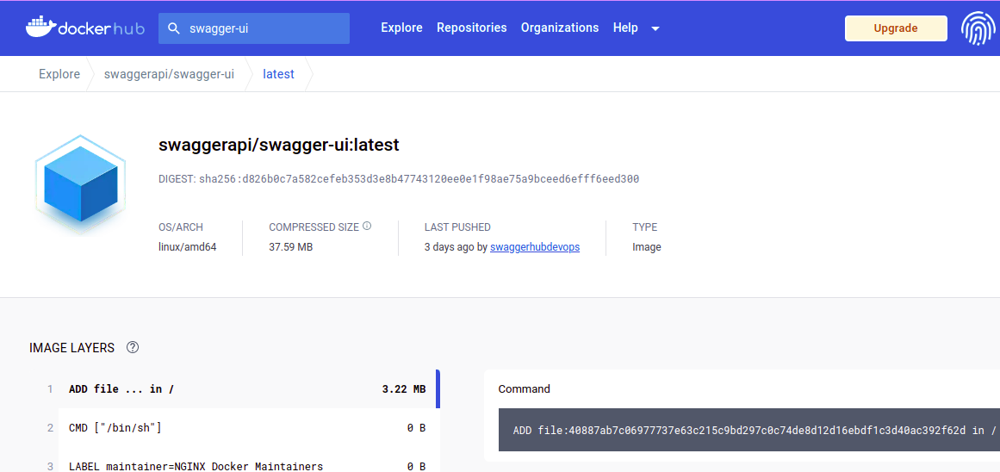
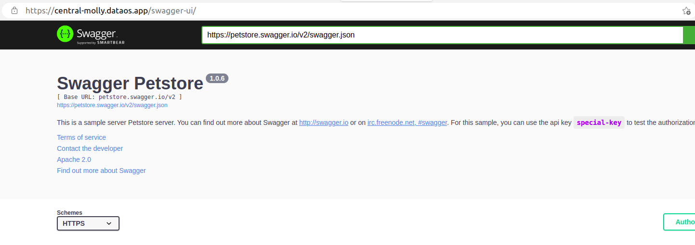

# Deploying Images on Public DockerHub

In this case scenario, you may not actually require Docker locally.

## Pre-requisites

### **Image available on Docker Hub**

The first and foremost step while dealing with Alpha Stack is to have a dockerized image available on the Docker Hub. Here will take a sample docker image of Swagger UI, available on the following link.

### **DataOS CLI Installed**

You need to have a runnable instance of DataOS CLI installed on your system. To know more click here.

## Procedure

### **Search for the Image on Docker Hub**

Search for swagger-ui on Docker Hub. 


If you need a specific build, navigate to the **Tags** section and choose the specific build you want.



<aside>
🗣️ In case you won’t provide the specific build version, it will automatically pick out the latest image from Docker Hub.

</aside>

### **Create a YAML file**

Once you have the image, you can create a YAML file. The syntax for the same is provided below:

```yaml
version: v1 # Version
name: swaggerui # Name of the Resource 
type: service # Type of Resource
service: # Service Specific Section
  title: Swagger UI Deployment on DataOS # Title of Service
  compute: runnable-default # Compute is Runnable-default (since its a service)
	replicas: 1 # Number of Service Replicas
  servicePort: 8701 # Service Port
  ingress: # Ingress Section
    enabled: true
    noAuthentication: true
    path: /swagger-ui # URL Path
    stripPath: true
  stack: alpha # Here stack is Alpha (What else did you think? Beta, Gamma !!!)
  envs: # Environment Variables
    LOG_LEVEL: info # Log Level
  alpha: # Alpha Stack Specific Section
    image: swaggerapi/swagger-ui:latest # Image Repository and Tag
```

### **Apply the resource YAML through CLI**

```bash
dataos-ctl apply -f <manifest-file-name> -w <workspace>
```

Since Service is a Workspace Resource, you can use the `get` command along with the type and workspace, to get details of the service. You can also use the `-r` command to regularly update the runtime status. 

```yaml
dataos-ctl -t service -w public get
# Expected Output
INFO[0000] 🔍 get...                                     
INFO[0000] 🔍 get...complete                             

    NAME   | VERSION |  TYPE   | WORKSPACE | STATUS |  RUNTIME  |  OWNER     
-----------|---------|---------|-----------|--------|-----------|-----------
 swaggerui | v1      | service | public    | active | running:1 | iamgroot
```

### **Create a Policy YAML**

By default, when you create a service using Alpha stack, it's open for everyone. But you can restrict access by creating a policy for the same. The syntax for the same is provided below:

```yaml
version: v1 # Version
name: swaggerui # Name of the Resource (Here its a policy)
type: policy # Type of Resource (Here its policy)
layer: system # System Layer
description: Allow user to access swagger-ui only to operator role # Description
policy: # Policy Specific Section
  access: # Access
    subjects: # User or Application (who is performing that predicate)
      tags: # Tags
        - - "roles:id:operator"                 
    predicates: # Predicate or Function            
      - "GET"
      - "POST"
      - "OPTIONS"
    objects: # Path on which access is required
      paths:
        - "/swagger-ui" # Path to access
    allow: true # Allow
```

<aside>
🗣️ In order to apply a policy YAML you will require operator-level access permission `roles:id:operator`.

</aside>

### **Apply the Policy YAML using CLI**

A policy is defined globally, and you don’t need to specify the workspace in this scenario.

```bash
dataos-ctl apply -f <manifest-file-name>
```

```yaml
dataos-ctl -t policy get
# Expected Output
INFO[0000] 🔍 get...                                     
INFO[0000] 🔍 get...complete                             

    NAME    | VERSION |  TYPE  | WORKSPACE | STATUS | RUNTIME |  OWNER     
------------|---------|--------|-----------|--------|---------|-----------
  swaggerui | v1      | policy |           | active |         | iamgroot
```

### **Navigate to the URL Address**

Once you have successfully applied the web-server application, you can go over to the web browser and use the dataos address along with the path mentioned in the YAML

Path : `https://<dataos-context>/<path-provided-in-yaml>/`

