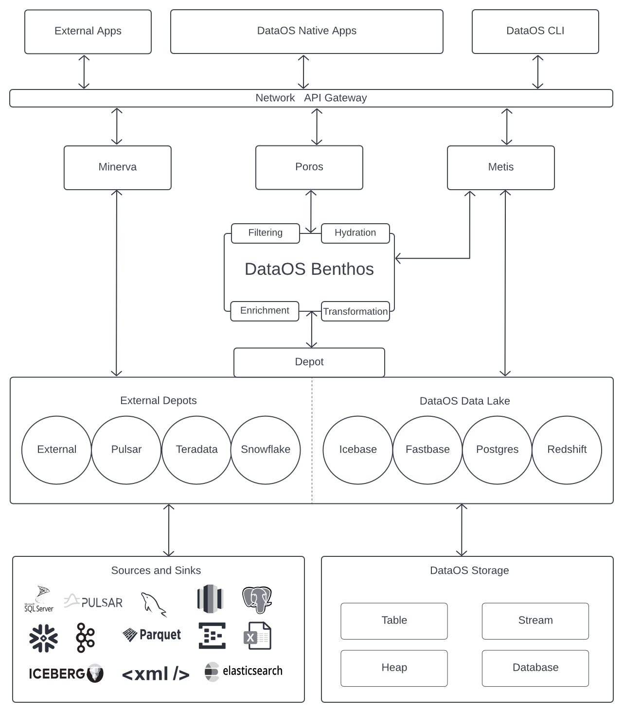

# Benthos

Benthos is a high-performance and resilient stream processing stack within DataOS that provides an easy-to-use declarative YAML programming paradigm for performing common data engineering tasks such as transformation, mapping, schema validation, filtering, hydrating, multiplexing, and enrichment with simple, chained, stateless processing steps. It allows users to quickly adapt their data pipelines as requirements change by interacting with other services and then can write to one or more sinks with the spectrum of connectors available out-of-the-box with it.

<i>Placement of Benthos stack within DataOS</i>

Benthos is designed to be reliable, with an in-process transaction model and no need for a disk-persisted state, and it’s easy to deploy and scale.  Additionally, with supports for a wide range of processors and a “lit mapping language,” Bloblang, built-in. It also offers a visual web application called Benthos Studio that allows users to create, edit, and test configs. 

## Why use Benthos

Benthos offers a wide range of features that make it an ideal solution for stream processing, including:

- **No Runtime Dependencies:** Its deployed static binaries have no runtime library dependencies.

- **Resilient:** Benthos implements transaction-based resiliency with back pressure, ensuring at-least-once delivery without persisting messages during transit. Additionally, it gracefully stops consuming stream data when the output target starts blocking traffic until the issue is resolved.

- **Scalability:** Benthos is designed to scale horizontally, allowing you to easily add more processing power as your data volume increases.

- **Declarative Configuration:** Don't have to compile or build the code.

- **Observability:** With Prometheus, matrix logs and metrics can be traced.

- **Cloud Native:** Benthos overlaps with integration frameworks, logs aggregators, and ETL workflow engines, making it cloud-native as heck and can complement traditional data engineering tools or act as a simpler alternative.

- **Extensible:** Benthos can be extended using plugins written in Go or by running them as subprocesses.

- **Stateless and Fast:** Benthos is totally stateless and can be horizontally scalable, but at the same, it can do stateful things by interacting with other services.

- **Flexibility:** With Benthos, users can connect to various sources and sinks in a range of brokering patterns and perform single message transformation, mapping, schema validation, filtering, hydrating, and enrichment by interacting with other services like caching.

- **Bloblang:** The built-in lit mapping language within Benthos. It can dig deep into nested structures and bring the information needed.

- **Payload Agnostic:** Payload can be structured data JSON, Avro, or even binary data if needed. No limitation on the type of data.

- **Real-time data processing:** Benthos is designed to process data in real time, making it well-suited for scenarios where data needs to be ingested and processed as it is generated.

- **High configurability:** Benthos is highly configurable, allowing you to build complex data processing pipelines that can transform and enrich data as it is ingested.

Enough with all the theory now; let’s get our hands dirty with code.

## Getting Started with Benthos

Whether you're a seasoned data wrangler or a curious beginner, Benthos has something for you. Ready to take the plunge? So let’s dive in and get started!

[Getting Started ](./benthos/getting_started.md)

## Setting Up Benthos on DataOS

Within DataOS, a Benthos streaming pipeline is implemented using the Service Primitive/resource. With Benthos Services, you can define your stream and event processing pipelines quickly. So why wait? Head on over to the link below to start your Benthos journey on DataOS today!

[Benthos on DataOS](./benthos/benthos_on_dataos.md)

## Components of Benthos Pipeline

Benthos operates in a declarative manner, where its stream pipelines are defined using a YAML configuration file. Think of this file as a recipe that outlines what ingredients (aka sources) to use and how to work your magic (aka transformation) with them. With Benthos, you can effortlessly specify connectors and processing stages without getting bogged down in the nitty-gritty details of procedural implementation. And let me tell you, there are a ton of components within a Benthos YAML file. Click on the link below to learn more about them.

[Components](./benthos/components.md)

## Configuration

Configuration is an essential aspect of using the Benthos stack effectively. With the right configuration, users can optimize their data processing pipelines, achieve maximum throughput, and handle errors efficiently. By fine-tuning these settings, users can create highly customized pipelines that meet their specific needs. To learn more about Benthos configuration, visit our comprehensive resource list, which covers everything from basic setup to advanced configuration techniques.

[Configurations](./benthos/configurations.md)

## Bloblang Guide

Are you tired of wrangling data? Do you dream of a world where you can transform your data with ease, without the need for complex scripts or convoluted pipelines? Look no further than Bloblang! Bloblang is the native mapping language of Benthos that simplifies data transformation by providing a straightforward syntax that is both expressive and powerful. If you're curious about what Bloblang can do for you, head on over to our tutorial to get started.

[Bloblang ](./benthos/bloblang.md)

## Recipes

With its modular architecture and extensive range of processors and inputs/outputs, Benthos is a great choice for quickly creating recipes that can be used to process data in real time. To get the most out of Benthos, check out our list of use cases and case scenarios on the below page that demonstrates how to use Benthos to solve common data processing challenges.

[Recipes](./benthos/recipes.md)