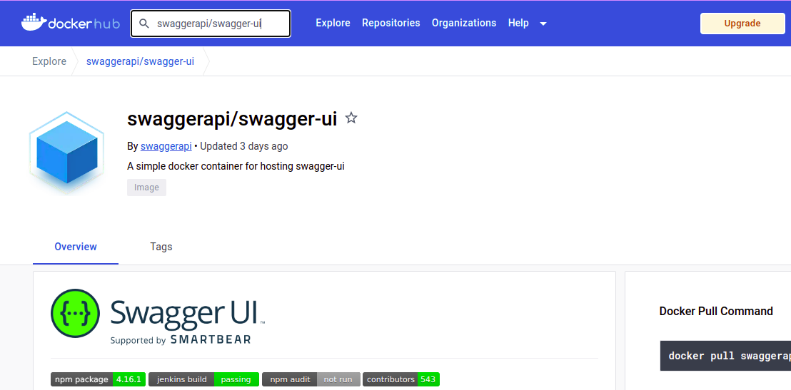
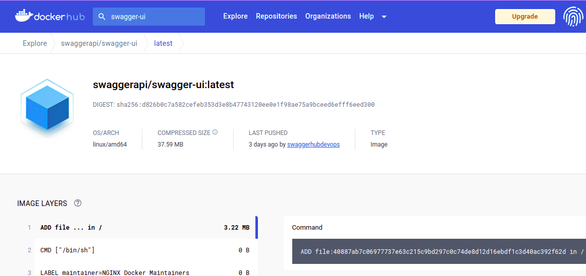
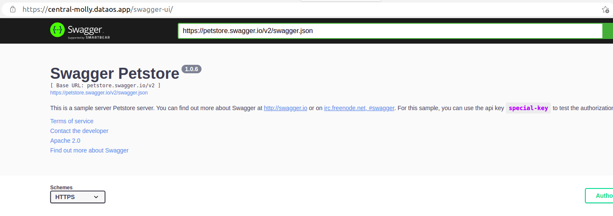

# Deploying Public Images Available on DockerHub

In this case scenario, you may not actually require Docker locally.

## Pre-requisites

### **Image available on Docker Hub**

The first and foremost step while dealing with Container Stack is to have a dockerized image available on the Docker Hub. Here will take a sample docker image of Swagger UI, available on the following link.

### **DataOS CLI Installed**

You need to have a runnable instance of DataOS CLI installed on your system. To know more click here.

## Procedure

### **Search for the Image on Docker Hub**

Search for swagger-ui on Docker Hub. 



If you need a specific build, navigate to the **Tags** section and choose the specific build you want.



<aside>
🗣️ In case you don’t provide the specific build version, it will automatically pick out the latest image from Docker Hub.

</aside>

### **Create a YAML file**

Once you have the image, you can create a YAML file. The syntax for the same is provided below:

```yaml
name: swaggerui # Name of the Resource 
version: v1 # Version
type: service # Type of Resource
service: # Service Specific Section
  title: Swagger UI Deployment on DataOS # Title of Service
  compute: runnable-default # Compute is Runnable-default (since its a service)
	replicas: 1 # Number of Service Replicas
  servicePort: 8601 # Service Port
  ingress: # Ingress Section
    enabled: true
    noAuthentication: true
    path: /swagger-ui # URL Path
    stripPath: true
  stack: container # Here stack is Container (What else did you think? Beta, Gamma !!!)
  envs: # Environment Variables
    LOG_LEVEL: info # Log Level
  container: # Container Stack Specific Section
    image: swaggerapi/swagger-ui:latest # Image Repository and Tag
```

### **Apply the Resource manifest through CLI**

```shell
dataos-ctl apply -f ${manifest-file-name} -w ${workspace}
```

Since Service is a Workspace Resource, you can use the `get` command along with the type and workspace, to get details of the service. You can also use the `-r` command to regularly update the runtime status. 

```shell
dataos-ctl -t service -w public get
# Expected Output
INFO[0000] 🔍 get...                                     
INFO[0000] 🔍 get...complete                             

    NAME   | VERSION |  TYPE   | WORKSPACE | STATUS |  RUNTIME  |  OWNER     
-----------|---------|---------|-----------|--------|-----------|-----------
 swaggerui | v1      | service | public    | active | running:1 | iamgroot
```

### **Navigate to the URL Address**

Once you have successfully applied the web-server application, you can go over to the web browser and use the dataos address along with the path mentioned in the YAML

Path : `https://<dataos-context>/<path-provided-in-yaml>/`
Example: `https://alpha-omega.dataos.app/swagger-ui`

