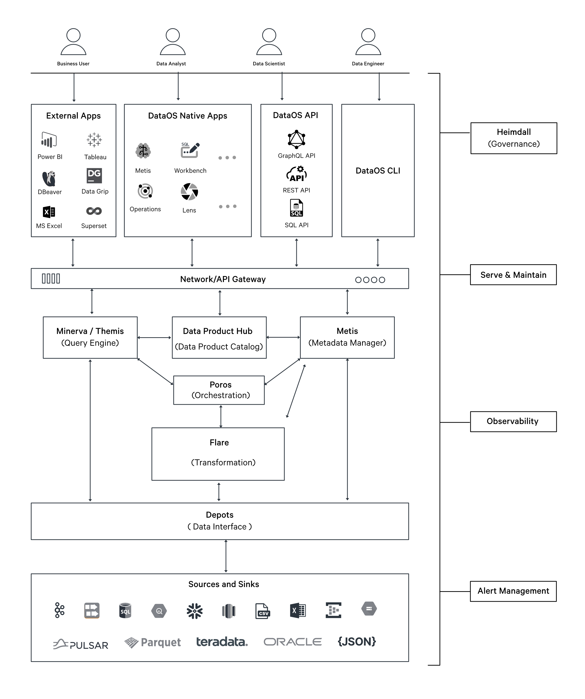

# Flare

Flare is a declarative stack for large-scale data processing within DataOS. It leverages a YAML-based declarative programming paradigm, built as an abstraction over Apache Spark, to provide a comprehensive solution for data ingestion, transformation, enrichment, profiling, quality assessment and syndication on both batch and streaming data.

<i>Placement of Flare stack within DataOS</i>

## Types of Flare Jobs

| Flare Job Type  | Description                                                                                                            |
|-----------------|------------------------------------------------------------------------------------------------------------------------|
| [Batch Job](./flare/job_types.md#batch-job)       | Recomputes all changed datasets on each run, providing consistent performance. Has high latency and is suitable for smaller data sizes.                                              |
| [Data Profiling Job](./flare/job_types.md#data-profiling-job) | Assesses data quality and structure, examining source data for accuracy, completeness, and validity.                    |
| [Data Quality Job](./flare/job_types.md#data-quality-job) | Evaluates data quality based on business-specific validation rules (assertions).                                                      |
| [Incremental Job](./flare/job_types.md#incremental-job) | Computes only the changed rows or files of data since the last build, reducing overall computation and latency.        |
| [Stream Job](./flare/job_types.md#stream-job)      | Processes new data continuously with low latency, but incurs high computing costs and requires constant resource availability. |
| [Action Job](./flare/job_types.md#action-job)      | Performs maintenance actions on data stored in Iceberg format in any depot (including Icebase) |

Further information regarding Flare Jobs can be accessed [here](./flare/job_types.md)

## Syntax of Flare YAML configuration

<i>Flare YAML Configuration Syntax</i>

## How to create jobs using Flare Stack

Whether you need to process data in batches or in a streaming fashion, Flare provides different job types to cater to your needs. You can explore the detailed documentation on creating Flare Jobs on the link below.

[Create Flare Jobs](./flare/creating_flare_jobs.md)

## Attributes in Flare Stack YAML configuration

The Flare Stack YAML consists of multitude of configuration settings tailored for different use cases. These settings govern data reading, writing, and transformation from diverse sources and destinations. 

[Flare Stack YAML Configurations](./flare/configurations.md)

[Flare Functions](./flare/functions.md)

## How to test Flare Jobs

Before deploying your logic into production, thorough testing is crucial. Flare Standalone provides a powerful and reliable testing interface, allowing you to test your Flare Jobs locally on your system. It helps identify and address potential issues before deployment. Further information regarding Flare Standalone can be accessed by clicking the link below.

[Flare Standalone](./flare/standalone.md)

## How to optimize jobs in Flare

To achieve peak performance tailored to your specific requirements, each job executed upon Flare stack requires fine-tuning and optimization. The link below provides comprehensive information on various optimization techniques.

[Flare Optimizations](./flare/optimizations.md)

## Pre-defined Flare YAML configuration templates

Refer to the following page for a comprehensive list of available connecting depots in Flare, along with detailed information pertaining to the configurations associated with each depot. 

[Flare Configuration Templates](./flare/configuration_templates.md)

## Case Scenarios

Explore practical case scenarios that exemplify the application of Flare stack in real-world data processing scenarios. Click on the link below, to know more.

[Case Scenario](./flare/case_scenario.md)