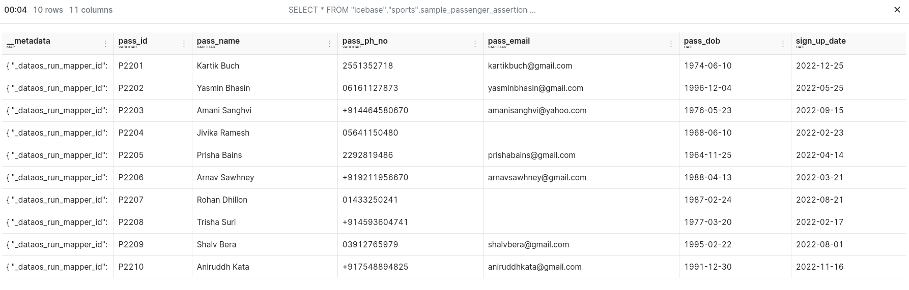

# Enhancing Data Integrity with Assertion Jobs
DataOS allows you to proactively ensure data quality by conducting comprehensive quality checks through assertions during ingestion of the data. These checks span various conditions, ranging from data completeness to business-specific rules. If the data doesn't meet these critera, Assertion Jobs halt the ingestion process, preventing potentially problematic data from entering the system.

## Data Validation Workflow Configuration
The following workflow defines a quality job using Flare stack to preemptively verify data quality based on assertions specified in a YAML file. 

### **Set up the Objective for Data Validation**

In this example scenario, our objective is to validate and maintain the data integrity of passenger registration records.

1. **Validate Missing Data:** Ensure that there are no blank or missing values in the "pass_id" and "sign_up_date" columns of the passenger registration records. A "missing count" of 0 is the target for these columns, indicating that there should be no empty fields.
2. **Prevent Duplicate Entries:** Verify that there are not more than 5 duplicate values in our dataset. The "distinct value" count should exceed 5, ensuring that there are no excessive duplications of registration records.
<details><summary>Assertion YAML</summary>
    
    ```yaml
    version: v1
    name: assertion-job-wf
    type: workflow
    title: assertions for a sample data ingestion
    description: assertions for a sample data ingestion
    workflow:
      dag:
        - name: wf-assertion-job
          title: sample data ingestion assertion job
          description: sample data ingestion assertion job
          spec:
            stack: flare:4.0
            compute: runnable-default
            flare:
              job:
                explain: true
                logLevel: INFO
                # showPreviewLines: 2
                inputs:
                  - name: sample_data
                    dataset: dataos://thirdparty001:uber_data/passenger_data/
                    format: csv
                    schemaType: sparkjson                     
                    schemaPath: dataos://thirdparty001:uber_data/schema/passenger_schema.json
    
                logLevel: INFO
    
                steps:              
                  - sequence:                  
                    - name: passenger                           
                      sql: > 
                        SELECT *
                        from sample_data   
                      functions: 
                          - name: cleanse_column_names
    
                          - name: change_column_case 
                            case: lower
    
                outputs:              
                  - name: passenger
                    dataset: dataos://icebase:sports/sample_passenger_assertion?acl=rw
                    format: Iceberg
                    title: data_uber
                    description: this dataset contains passenger csv from data_uber 
                    tags:                                                                     
                      - passenger
                    assertions:
                      - column: pass_id
                        tests:
                          - distinct_count > 5
                          - missing_count = 0
    
                      - column: sign_up_date
                        tests:
                          - distinct_count > 50
                          - missing_count < 10
    
                    options:                  
                      saveMode: overwrite
                      iceberg:
                        properties:
                          write.format.default: parquet
                          write.metadata.compression-codec: gzip
    
        
        - name: dataos-tool-uber-data-test-passenger
          spec:        
            stack: toolbox
            compute: runnable-default
            toolbox:          
              dataset: dataos://icebase:sports/sample_passenger_assertion?acl=rw
              action:            
                name: set_version
                value: latest
          dependencies:        
            - wf-assertion-job
    ```
</details>   

### **Workflow Execution**

In this process, it initially evaluates the assertion, and only if all the checks pass successfully, the data will be ingested.

1. Apply the job using the dataos-ctl command and then get the runtime information.
    
    ```bash
    dataos-ctl -i 'assertion-job-wf       | v1      | workflow | public' get runtime -r
    INFO[0000] 🔍 workflow...                                
    INFO[0000] 🔍 workflow...complete                        
    
            NAME       | VERSION |   TYPE   | WORKSPACE | TITLE |   OWNER     
    -------------------|---------|----------|-----------|-------|-------------
      assertion-job-wf | v1      | workflow | public    |       | shreyanegi  
    
            NAME       | VERSION |   TYPE   | WORKSPACE | TITLE |   OWNER     
    -------------------|---------|----------|-----------|-------|-------------
      assertion-job-wf | v1      | workflow | public    |       | shreyanegi  
    
            NAME       | VERSION |   TYPE   | WORKSPACE | TITLE |   OWNER     
    -------------------|---------|----------|-----------|-------|-------------
      assertion-job-wf | v1      | workflow | public    |       | shreyanegi  
    
                    JOB NAME               |   STACK    |           JOB TITLE            | JOB DEPENDENCIES  
    ---------------------------------------|------------|--------------------------------|-------------------
      dataos-tool-uber-data-test-passenger | toolbox    |                                | wf-assertion-job  
      system                               | dataos_cli | System Runnable Steps          |                   
      wf-assertion-job                     | flare:4.0  | sample data ingestion          |                   
                                           |            | assertion job                  |                   
    
       RUNTIME  | PROGRESS |          STARTED          |         FINISHED           
    ------------|----------|---------------------------|----------------------------
      succeeded | 2/2      | 2023-11-01T14:57:14+05:30 | 2023-11-01T14:58:57+05:30  
    
                       NODE NAME                   |               JOB NAME               |                                  POD NAME                                   | DATA PLANE |     TYPE     |       CONTAINERS        |   PHASE    
    -----------------------------------------------|--------------------------------------|-----------------------------------------------------------------------------|------------|--------------|-------------------------|------------
      dataos-tool-uber-data-test-passenger-execute | dataos-tool-uber-data-test-passenger | assertion-job-wf-uyqm-plr-dataos-tool-uber-data-test-passenger-t-3179012171 | hub        | pod-workflow | wait,main               | succeeded  
      wf-assertion-job-execute                     | wf-assertion-job                     | assertion-job-wf-uyqm-plr-wf-assertion-job-t-403567081                      | hub        | pod-workflow | main                    | succeeded  
      wf-assertion-job-uyqm-1101092714-driver      | wf-assertion-job                     | wf-assertion-job-uyqm-1101092714-driver                                     | hub        | pod-flare    | spark-kubernetes-driver | completed
    ```
    
2. Data is ingested successfully. Run the query on Workbench.
    
    
    

## Handling Quality Check Failures

**To address the question of what happens if the quality checks fail, the workflow example includes an assertion to check for missing values in the email column.**

The following example demonstrates this scenario. We will incorporate an assertion to check for missing values in the email column. 

<details><summary>Assertion YAML</summary>
    
    ```yaml
    version: v1
    name: assertion-job-wf
    type: workflow
    title: assertions for a sample data ingestion
    description: assertions for a sample data ingestion
    workflow:
      dag:
        - name: wf-assertion-job
          title: sample data ingestion assertion job
          description: sample data ingestion assertion job
          spec:
            stack: flare:4.0
            compute: runnable-default
            flare:
              job:
                explain: true
                logLevel: INFO
                # showPreviewLines: 2
                inputs:
                  - name: sample_data
                    dataset: dataos://thirdparty001:uber_data/passenger_data/
                    format: csv
                    schemaType: sparkjson                     
                    schemaPath: dataos://thirdparty001:uber_data/schema/passenger_schema.json
    
                logLevel: INFO
    
                steps:              
                  - sequence:                  
                    - name: passenger                           
                      sql: > 
                        SELECT *
                        from sample_data   
                      functions: 
                          - name: cleanse_column_names
    
                          - name: change_column_case 
                            case: lower
                outputs:              
                  - name: passenger
                    dataset: dataos://icebase:sports/sample_passenger_assertion?acl=rw
                    format: Iceberg
                    title: data_uber
                    description: this dataset contains passenger csv from data_uber 
                    tags:                                                                     
                      - passenger
                    assertions:
                      - column: pass_id
                        tests:
                          - distinct_count > 5
                          - missing_count > 5 
    
                      - column: pass_email
                        tests:
                          - distinct_count > 50
                          - missing_count = 0
    
                    options:                  
                      saveMode: overwrite
                      iceberg:
                        properties:
                          write.format.default: parquet
                          write.metadata.compression-codec: gzip
    
        
        - name: dataos-tool-uber-data-test-passenger
          spec:        
            stack: toolbox
            compute: runnable-default
            toolbox:          
              dataset: dataos://icebase:sports/sample_passenger_assertion?acl=rw
              action:            
                name: set_version
                value: latest
          dependencies:        
            - wf-assertion-job
    ```
</details>
 
1. Apply the job using the "dataos-ctl" command, and afterward, retrieve the runtime information. You'll quickly observe that the driver node has encountered a failure.
    
    ```bash
    dataos-ctl -i 'assertion-job-wf       | v1      | workflow | public' get runtime -r
    INFO[0000] 🔍 workflow...                                
    INFO[0001] 🔍 workflow...complete                        
    
            NAME       | VERSION |   TYPE   | WORKSPACE | TITLE |   OWNER     
    -------------------|---------|----------|-----------|-------|-------------
      assertion-job-wf | v1      | workflow | public    |       | shreyanegi  
    
                    JOB NAME               |   STACK    |           JOB TITLE            | JOB DEPENDENCIES  
    ---------------------------------------|------------|--------------------------------|-------------------
      dataos-tool-uber-data-test-passenger | toolbox    |                                | wf-assertion-job  
      system                               | dataos_cli | System Runnable Steps          |                   
      wf-assertion-job                     | flare:4.0  | sample data ingestion          |                   
                                           |            | assertion job                  |                   
    
      RUNTIME | PROGRESS |          STARTED          | FINISHED  
    ----------|----------|---------------------------|-----------
      running | 0/1      | 2023-11-01T15:01:48+05:30 |           
    
                     NODE NAME                |     JOB NAME     |                        POD NAME                         | DATA PLANE |     TYPE     |       CONTAINERS        |  PHASE   
    ------------------------------------------|------------------|---------------------------------------------------------|------------|--------------|-------------------------|----------
      wf-assertion-job-execute                | wf-assertion-job | assertion-job-wf-y69l-0vf-wf-assertion-job-t-4041865281 | hub        | pod-workflow | main                    | running  
      wf-assertion-job-y69l-1101093148-driver | wf-assertion-job | wf-assertion-job-y69l-1101093148-driver                 | hub        | pod-flare    | spark-kubernetes-driver | failed
    ```
2. Check the logs of the driver node, you will find the details of the error.
    
    ```bash
    dataos-ctl -i 'assertion-job-wf       | v1      | workflow | public' --node wf-assertion-job-y69l-1101093148-driver log 
    INFO[0000] 📃 log(public)...                             
    INFO[0001] 📃 log(public)...complete                     
    
                     NODE NAME                │     CONTAINER NAME      │ ERROR  
    ──────────────────────────────────────────┼─────────────────────────┼────────
      wf-assertion-job-y69l-1101093148-driver │ spark-kubernetes-driver │        
    
    -------------------LOGS-------------------
    2023-11-01 09:32:43,014 INFO  [dag-scheduler-event-loop] org.apache.spark.scheduler.TaskSchedulerImpl: Adding task set 29.0 with 2 tasks resource profile 0
    2023-11-01 09:32:43,015 INFO  [dispatcher-CoarseGrainedScheduler] org.apache.spark.scheduler.TaskSetManager: Starting task 0.0 in stage 29.0 (TID 27) (10.212.4.184, executor 1, partition 0, PROCESS_LOCAL, 5239 bytes) taskResourceAssignments Map()
    
    ..
    ..
    ..
    
    Exception in thread "shutdownHook1" io.dataos.flare.exceptions.FlareException: 1 out of 4 assertions failed for dataset dataos://icebase:sports/sample_passenger_assertion. For more details, please look into the assertion results table in logs.
    	at io.dataos.flare.contexts.ProcessingContext.error(ProcessingContext.scala:87)
    	at io.dataos.flare.Flare$.$anonfun$addShutdownHook$1(Flare.scala:90)
    	at scala.sys.ShutdownHookThread$$anon$1.run(ShutdownHookThread.scala:37)
    2023-11-01 09:32:56,708 INFO  [shutdown-hook-0] org.apache.spark.util.ShutdownHookManager: Shutdown hook called
    2023-11-01 09:32:56,709 INFO  [shutdown-hook-0] org.apache.spark.util.ShutdownHookManager: Deleting directory /var/data/spark-10bd9b8a-9e7a-4867-807c-a91493ee1eb6/spark-285e186a-2af2-4d4c-a4af-6ff88f063494
    2023-11-01 09:32:56,711 INFO  [shutdown-hook-0] org.apache.spark.util.ShutdownHookManager: Deleting directory /tmp/spark-7bf3b87c-e47a-4411-810d-6d6294435168
    2023-11-01 09:32:56,724 INFO  [shutdown-hook-0] org.apache.hadoop.metrics2.impl.MetricsSystemImpl: Stopping azure-file-system metrics system...
    2023-11-01 09:32:56,725 INFO  [shutdown-hook-0] org.apache.hadoop.metrics2.impl.MetricsSystemImpl: azure-file-system metrics system stopped.
    2023-11-01 09:32:56,725 INFO  [shutdown-hook-0] org.apache.hadoop.metrics2.impl.MetricsSystemImpl: azure-file-system metrics system shutdown complete.
    ```