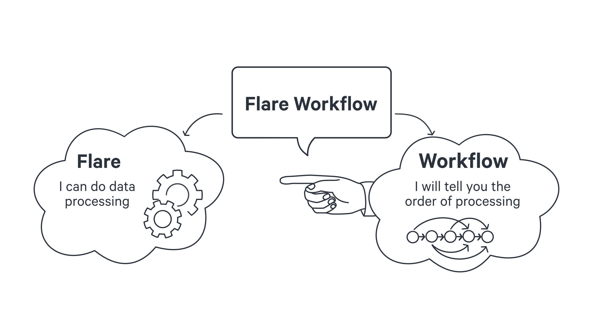

# Basic Concepts of Flare Workflow

## Flare Workflow

DataOS uses Flare workflows to carry out large-scale data transformation, ingestion, profiling, syndication, and even a combination of these tasks.

Flare is a declarative stack that can process large-scale data processing workflows using sequential YAML. On the other hand, a workflow is a primitive/Resource within DataOS that runs a sequence of jobs in a specific order. A workflow is a DAG (Directed Acyclic Graph) of jobs. To learn more about workflows, click [here](../../workflow.md). 

<aside style="background-color:#FAF3DD; padding:15px; border-radius:5px;">
🗣️ In this section and every subsequent one, when we say Flare workflow, we essentially imply a workflow containing a DAG with a job (or multiple jobs) that uses Flare stack. To submit a job that uses Flare stack (Flare Job), you need to write a Workflow.

</aside>

## Deep Diving into a Flare Job

A Job is a generalized way of defining a transformation task based on the scenario and use case; it requires the assistance of stacks to achieve the desired outcome. Any job is fully reliant on the completion of the job before it. E.g. A Flare Job represents a data processing workload which could be ingestion, transformation, profiling, syndication, etc., running on Flare stack, while in scenarios when the output dataset is to be stored in the Icebase depot, you also need the Toolbox stack along with the Flare Stack. If you would like to learn more about the Toolbox stack, click [here](../data_toolbox.md).

In terms of YAML structure how a Flare Job is declared within the DAG, it comprises three sections: The Input (read data from), the Output (write data to), and the Steps (transformation of data during transit). 

## Types of Flare Job

Based on the type of workload, Flare Jobs can be classified into two broad categories:- Batch Jobs and Stream Jobs.

### **Batch Job**

A Batch Job fully recomputes every dataset that has changed on each run, resulting in a consistent end-to-end performance over time. However, they have very high latency, as all data must be processed whenever it lands, even if it has not changed since the last sync. If large amounts of new data flow into a batch job, they will become unmanageably expensive and take too long to run. In most cases, running a batch job for various transformation tasks is recommended if your data size is small, but as the data size keeps on increasing and changing, it is best to go for an incremental job. A simple batch job is essentially used to read data from depot A, perform some transformations and write data to depot B. To explore the various case scenarios for a Batch Job, click [here](./case_scenario/batch_jobs.md).

Based on the purpose of the application, we have two special types of batch jobs, used for specific scenarios. They are Data Profiling Jobs and Data Quality Jobs.

#### **Data Profiling Job**

As the name is self-explanatory, is used for Data Profiling which is a process of assessing the quality and structure of the data in the dataset. It examines source data to determine the accuracy, completeness, and validity and summarizes information about that data. It is crucial to know the completeness and correctness of the data to take full advantage of the value and usefulness of the source data available. Inaccurate and incomplete data used for the analysis can lead to incorrect data-driven decisions for any organization.

You can assess your source data quality before using it in critical business scenarios and verify that data columns in your dataset are populated with the correct data. Data profiling jobs can be used to analyze the structure, content, and relationships within data to uncover patterns, rules, inconsistencies, anomalies, and redundancies to achieve higher data quality. In addition, it uses basic statistics to know about the validity of the data. To learn more about Data Profiling Jobs, click [here](./case_scenario/data_profiling_jobs.md).

#### **Data Quality Job**

Data Quality is essential and subjective as different consumers have different notions of it. Within DataOS, we define assertions, which are business-specific validation rules to test and evaluate the quality of specific datasets if they are appropriate for the intended purpose. On top of that, one can measure the data quality. If you want to look at which properties are required for defining the assertions, click [here](./building_blocks_of_flare_workflow/assertions.md). If you want to check out a case scenario related to Data Quality Jobs, click [here](./case_scenario/data_quality_jobs_(assertions).md).

#### **Incremental Job**

In an incremental job, only the rows or files of data that have changed since the last build are computed. This is suitable for processing event data and other datasets with large amounts of data changing over time. In addition to reducing the overall amount of computation, the end-to-end latency of the job can be reduced significantly compared to batch jobs. Compute costs for the incremental jobs can be lower than a batch job on high-scale datasets, as the amount of actual computation occurring can be minimized. Because only new data is processed, incremental jobs avoid needing to redo analysis on large datasets where most information is not changing. To learn more about case scenarios for Incremental Jobs, click [here](./case_scenario/incremental_jobs.md).

### **Stream Job**

Streaming Jobs run continuously and process new data as it arrives. Therefore, in a streaming job, the latency is very low. Still, it incurs the highest computing costs, requiring resources always to be available to process new input data. Therefore, it is best to avoid creating a streaming job in most cases unless your use case has low latency requirements, like less than a minute. To check out streaming-specific properties for a Stream Job, click [here](./building_blocks_of_flare_workflow/streaming.md). If you want to see a case scenario, of how a streaming job is declared within DataOS click [here](./case_scenario/stream_jobs.md).

