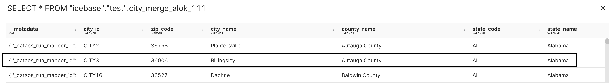
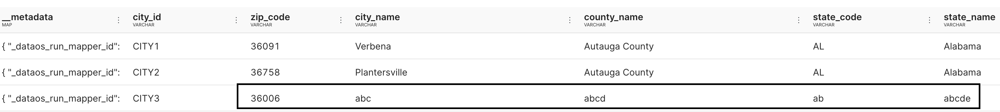

# Merge Into Functionality


## Objective

How can we update values in the existing table using flare for a certain condition.

## Description

**MERGE INTO FUNCTIONALITY**
It updates the target table using a source table using a set of conditions and updates records. This is a row-specific update where the row is found based on the **ON** clause.

> Spark 3 added support for **MERGE INTO** queries that can express row-level updates.
> 

## Case Scenario

Let’s say we have written a dataset of a city (i.e., `city_merge_alok_111`) and it has all the information about the city and now the city data has changed.

In the city data (Source table) information about  `zip_code = 36006` has changed.

| Column Name | Old Value | New Value |
| --- | --- | --- |
| city_name | Billingsley | abc |
| country_name | Autauga | abcd |
| state_code | AL | ab |
| state_name | Alabama | abcde |

> Now we want to update this on zip_code (i.e. 36006) records only.
> 

### Existing city table.



### City table with updated records (Using merge into the function)



## How to define merge in Flare.

**Syntax** 

```yaml
outputOptions:
  saveMode: overwrite
  iceberg:
    merge:
      onClause: "old.old_table_column_a = new.new_table_column_a"
      whenClause: "MATCHED THEN UPDATE SET old.old_table_column_b = new.old_table_column_b"
```

**`onClause`**: We can use multiple clauses for ON (the clauses should be separated using AND operator) We can’t use OR for multiple clauses.

**`whenClause`:**  This will be executed when `onClause` condition matches and **`whenClause`** conditions can be referred.

`**old**` : Refers to the existing dataset in icebase.

`**new**`: Refers to the data frame by you are updating existing dataset.

> Merge Into requires below sparkConf and this is mandatory for merge into function to work.
> 

```yaml
sparkConf:  # spark configuration 
    - spark.sql.extensions: org.apache.iceberg.spark.extensions.IcebergSparkSessionExtensions  # mandatory for merge into
```

> Merge option needs to be defined in **sink** for the dataset you are updating.
> 

```yaml
sink:
  - sequenceName: new_city # sequence name that you want to write in output location 
    datasetName: "icebase"."test".city_merge_alok_111 # dataset name shown in workbench 
    outputName: output01 
    outputType: Iceberg 
    outputOptions: 
      saveMode: overwrite 
      iceberg: 
        merge:   # Defining Merge Functions 
          onClause: "old.zip_code = new.zip_code"    
          whenClause: "MATCHED THEN UPDATE SET old.city_name = new.city_name,old.county_name = new.county_name,old.state_code = new.state_code,old.state_name = new.state_name" 
        properties: 
          write.format.default: parquet 
          write.metadata.compression-codec: gzip
```

> Below flare **sequence** is only to create updated sample data (which will have new ***city_name, country_name, state_code*** and ***state_name**)* for ***zip_code = 36006.***
> 

```yaml
# **Update set using multiple column** 
- sequence:     # data transformation steps using Spark SQL 
    - name: main 
      sql: select * from input where zip_code = "36006"   # Selecting only zip code (36006) 
    - name: new_city  # Updating table value for zip code (36006)  
      sql: select  city_id, zip_code, 'abc' as city_name, 'abcd' as county_name, 'ab' as state_code , 'abcde' as state_name from main
```

```yaml
# **Update set using single column** 
merge:
  onClause: "old.city_id = new.city_id"
  whenClause: "MATCHED THEN UPDATE SET old.state_name = new.state_name"
```

## Sample YAML using merge into functionality

```yaml
version: v1beta1 
name: city-connect # Workflow Name 
type: workflow  
tags: 
  - City_data             # Workflow Tag 
description: The job ingests city data # Workflow Description 
workflow: 
    title: Connect city   # Workflow Title 
    dag: 
      - name: city-merge # Job Name 
        title: connect city data # Job Title  
        spec:  
          tags: # Job Tag 
            - city 
          stack: flare:2.0 # Flare Version
          flare: 
            driver:         # cluster configuration definition 
              coreLimit: 1600m 
              cores: 2 
              memory: 2048m 
            executor: 
              coreLimit: 2500m 
              cores: 2 
              instances: 2 
              memory: 4000m 
            job: 
              explain: true 
              inputs:          # input details 
                - name: input 
                  dataset: dataos://thirdparty01:none/city 
                  format: csv 
              logLevel: INFO 
              outputs:     # location where the data is saved in DataOS: in the form dataos://catalog:schema 
                - name: output01 
                  depot: dataos://icebase:test?acl=rw 
              steps: 
                - sequence:     # Data transformation steps using Spark SQL 
                    - name: main 
                      sql: select * from input where zip_code = "36006"   # Selecting only zip code (36006) 
                    - name: new_city  # Updating table value for zip code (36006)  
                      sql: select city_id, zip_code, 'abc' as city_name, 'abcd' as county_name, 'ab' as state_code , 'abcde' as state_name from main 
                  sink: 
                    - sequenceName: new_city # sequence name that you want to write in output location 
                      datasetName: city_merge_alok_111 # Existing dataset 
                      outputName: output01 
                      outputType: Iceberg 
                      outputOptions: 
                        saveMode: overwrite 
                        iceberg: 
                          merge:   # Defining Merge Functions 
                            onClause: "old.zip_code = new.zip_code"    
                            whenClause: "MATCHED THEN UPDATE SET old.city_name = new.city_name,old.county_name = new.county_name,old.state_code = new.state_code,old.state_name = new.state_name" 
                          properties: 
                            write.format.default: parquet 
                            write.metadata.compression-codec: gzip             
            sparkConf:  # spark configuration 
              - spark.sql.extensions: org.apache.iceberg.spark.extensions.IcebergSparkSessionExtensions  # mandatory for merge into function to work 
      - name: dt-city  # datatool to update table metadata for Trino Query Engine 
        spec: 
          stack: toolbox 
          toolbox: 
              dataset: dataos://icebase:test/"icebase"."test".city_merge_alok_111?acl=rw 
              action: 
                name: set_version 
                value: latest   
        dependencies:  
          - city-merge
```