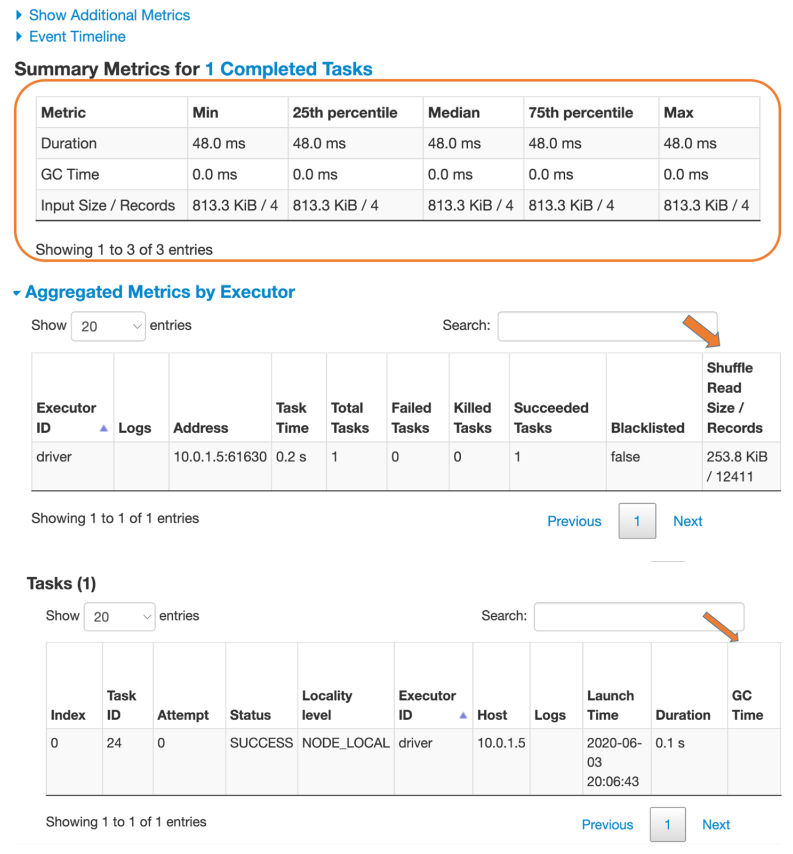
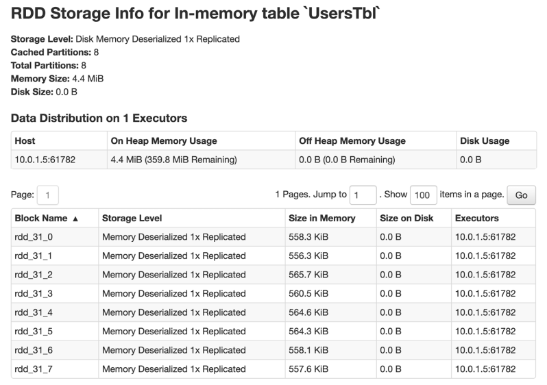
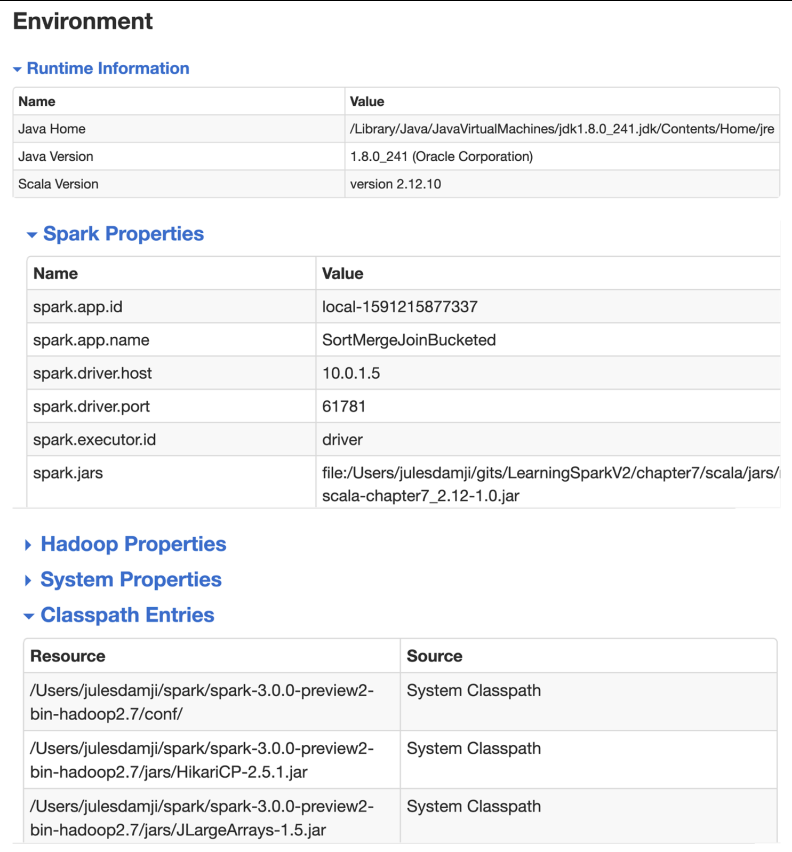
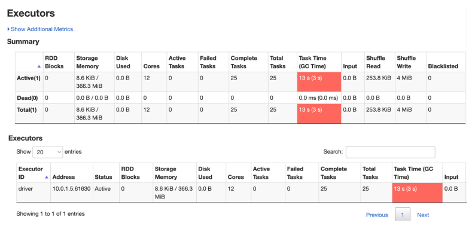
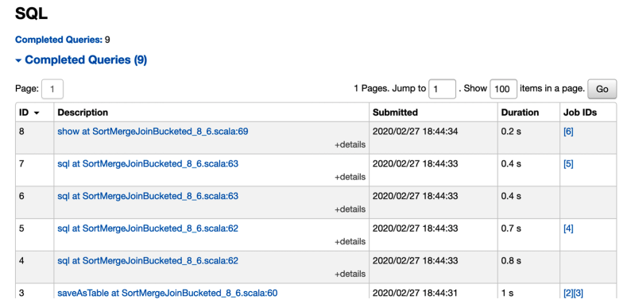
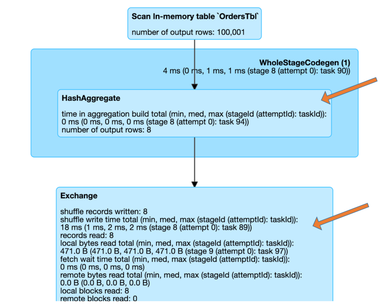
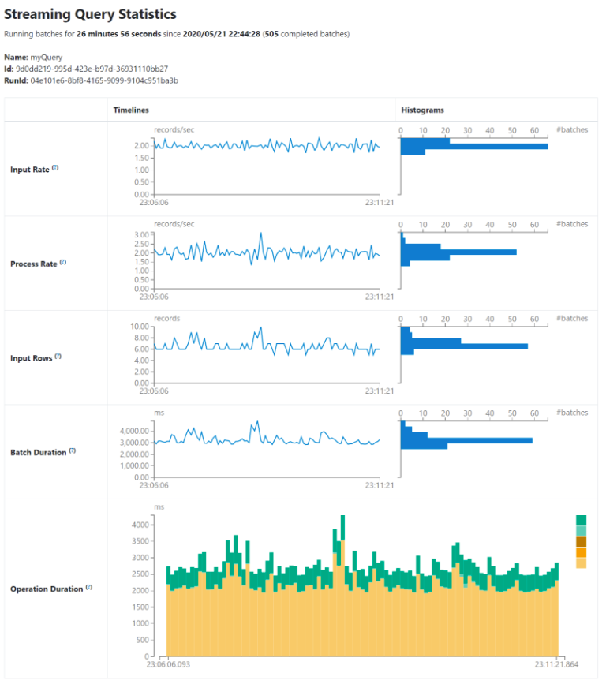

# Navigating through the Spark UI Tabs

Spark breaks down a Flare Job into jobs, stages, and tasks. The Jobs and Stages tabs allow you to navigate through these and drill down to a granular level to examine the details of individual tasks. You can view their completion status and review metrics related to I/O, memory consumption, duration of execution, etc.

The Spark UI has seven tabs, each providing opportunities for exploration.

## Jobs Tabs

The Jobs tab shows the expanded Event Timeline, showing when executors were added to or removed from the cluster. It also provides a tabular list of all completed jobs in the cluster. The Duration column indicates the time it took for each job (identified by the Job Id in the first column) to finish. If this time is high, it’s a good indication that you might want to investigate the stages in that job to see what tasks might be causing delays. From this summary page you can also access a details page for each job, including a DAG visualization and a list of completed stages.

The Jobs tab offers a view of the event timeline and a list of all completed jobs

## Stages Tab

The Stages tab provides a summary of the current state of all stages of all jobs in the application. You can also access a details page for each stage, providing a DAG and metrics on its tasks. As well as some other optional statistics, you can see the average duration of each task, time spent in garbage collection (GC), and the number of shuffle bytes/records read. If shuffle data is being read from remote executors, a high Shuffle Read Blocked Time can signal I/O issues. A high GC time signals too many objects on the heap (your executors may be memory-starved). If a stage’s max task time is much larger than the median, then you probably have data skew caused by uneven data distribution in your partitions. Look for these tell-tale signs. You can also see aggregated metrics for each executor and a breakdown of the individual tasks on this page.

The Stages tab provides details on stages and their tasks.

## Storage Tab

The Storage tab provides information on any tables or DataFrames cached by the job.

The Storage Tab shows details on memory usage

On a deeper level, it also displays how the table is cached in memory and on disk across executors and the number of buckets that were created

Cached table distribution across executor memory

## Environment Tab

The Environment tab is just as important as the others. Knowing about the environment in which your Flare Job is running reveals many clues that are useful for troubleshooting. In fact, it’s imperative to know what environment variables are set, what jars are included, what Spark properties are set (and their respective values, especially if you tweaked some of the configs, what system properties are set, what runtime environment (such as JVM or Java version) is used, etc. All these read-only details are a gold mine of information supplementing your investigative efforts should you notice any abnormal behavior in your Flare Job.

The Environment tab shows the runtime properties of your Spark cluster

## Executors Tab

The Executors tab provides information on the executors created for the application. As you can see in Figure 7-13, you can drill down into the minutiae of details about resource usage (disk, memory, cores), time spent in GC, amount of data written and read during shuffle, etc. In addition to the summary statistics, you can view how memory is used by each individual executor, and for what purpose.

The Executors tab shows granular statistics and metrics on the executors used by your Spark application

## SQL Tab

The effects of Spark SQL queries that are executed as part of your Spark application are traceable and viewable through the SQL tab. You can see when the queries were executed and by which jobs, and their duration. 

The SQL tab shows details on the completed SQL queries

Clicking on the description of a query displays details of the execution plan with all the physical operators. These metrics are useful when we want to inspect the details of a physical operator and discover what transpired: how many rows were scanned, how many shuffle bytes were written, etc.

Spark UI showing detailed statistics on a SQL query

## Structured Streaming Tab

When running Structured Streaming jobs in micro-batch mode, a Structured Streaming tab will be available on the Web UI. The overview page displays some brief statistics for running and completed queries. Also, you can check the latest exception of a failed query. 

To know more about the detailed metrics and statistics, visit the Web UI link in the official Spark Documentation. [Link](https://spark.apache.org/docs/latest/web-ui.html#structured-streaming-tab)