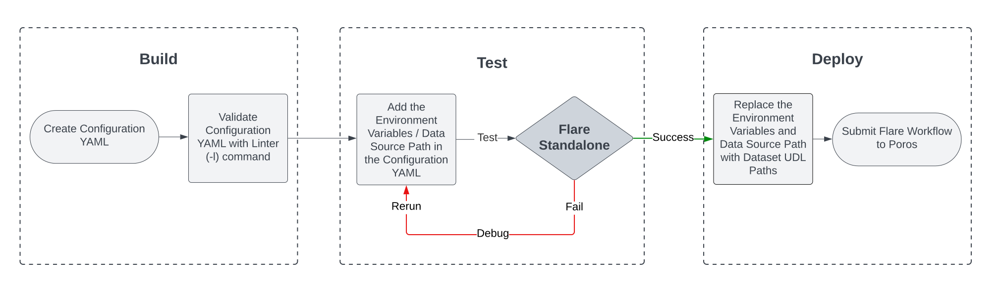

# Flare Standalone

> While developing a new Flare data processing workflow, it's a good idea to confirm that your transformations will work in production. Flare Standalone is the easiest way to achieve this.
> 

<aside>

🗣️ Across the documentation, wherever we mention Standalone, we imply the latest version, **Standalone 2.0**. For the older version, specifically, **Standalone 1.0** is mentioned.

</aside>

Flare Standalone is a helper stack to write Flare Jobs interactively on your local machine. It allows users to establish connections to data sources without needing to create a depot. With Standalone, users can quickly spin up Spark locally, read from one data source, and write to another. It also provides Spark Web UI to monitor the jobs running in the background. All in all, it's a great way to quickly test out jobs before deploying them to a cluster.

The execution of a Flare Job involves submission to Poros, the resource manager of DataOS, which in coordination with Kubernetes allocates resources to the various running jobs. While Flare Standalone, behind the scenes, follows the master and worker architecture to execute jobs, but, here both the master and worker nodes work on the local machine, unlike in clusters where they are present on separate machines.

<center>



<i>Flare Standalone: A testing interface for production-ready jobs</i>
</center>

> Check out what's new in the latest version of Standalone
> 
> 
> [Standalone 2.0](./flare_standalone/standalone_2.0.md)
> 

## Why Standalone?

Let's take a scenario where you write a Flare Workflow YAML to write terabytes of enriched data to a DataOS depot. With the allocated resources, you expect the job to finish in 5 hours. To your dismay, the job fails after 5 hours. On checking logs, it turns out the culprit is a minor mistake in the SQL code in the penultimate job. This results in the wastage of both compute resources and time. Flare Standalone becomes a savior in such a situation as it allows you to test your jobs before deploying into production, thus assisting you in detecting possible issues.

<aside>
📖 Best Practice: Like DevOps, it is a best practice in DataOps to test your locally using Flare Standalone before implementing it in production. By leveraging local compute resources, Standalone enables cost savings on cloud-based computational expenses that may be incurred during the formulation of Flare Jobs.

</aside>

## Getting Started with Flare Standalone

### **Anatomy of the Standalone command**

```bash
dataos-ctl develop start -s flare -i rubiklabs/flare3:6.0.93 -f sample/standalone-config/config.yaml -d standalone -P 14042
```

| dataos-ctl | develop | start | -s | flare | -i | rubiklabs/flare3:6.0.93 | -f | sampledata/standalone-config/config.yaml | -d | standalone | -P | 14042 |
| --- | --- | --- | --- | --- | --- | --- | --- | --- | --- | --- | --- | --- |
| Command to operate DataOS CLI (Command Line Interface). CTL stands for control. | Manage DataOS development. | Start development container | Stack flag  | Stack along with version as argument. You can also provide a specific version for flare, like flare:3.0, flare:4.0 | Image Flag
(Optional) | Custom Image
(Optional) | File path flag | File path as argument (can be either relative or absolute) | Directory Path flag | Path of the folder inside which the data folder is stored. (The content of this directory is mounted on the docker within /data/examples/) | Port Flag
(Optional) | Exposed port 
number
Spark UI can be accessed in browser by
https://localhost/<port-number>
(Optional) |

### **Let's Begin**

Enough with the theory! Let us now shift our focus from theoretical concepts and proceed toward practical implementation by executing a job on Flare Standalone. To achieve this, kindly navigate to the page provided below.

[Running Flare Standalone](./flare_standalone/running_flare_standalone.md)

### **From Standalone to Production**

After testing a job locally, it is time to deploy it in production. But before you do it, there are a couple of changes that you need to make. Check out the changes on the below page. 

[From Testing to Production](./flare_standalone/from_standalone_to_production.md)

## Case Scenarios

Getting the Flare Standalone up and running on your local machine is easy. All transformation in Flare Standalone happens locally on your system, but the data source can either be on your local system or somewhere in the cloud. You can have different permutations and combinations depending on what source you want to read from and what source you want to write to. If you'd like to know more, you can go ahead and navigate to the below page.

[Case Scenarios](./flare_standalone/case_scenarios.md)

# Supported Data Sources and Configurations

Flare Standalone extends support for all connectors available in Flare, thereby providing enhanced connectivity options for users. For additional information on the supported configurations, please refer to the below page.

[Standalone YAML Configurations](./flare_standalone/standalone_yaml_configurations/)