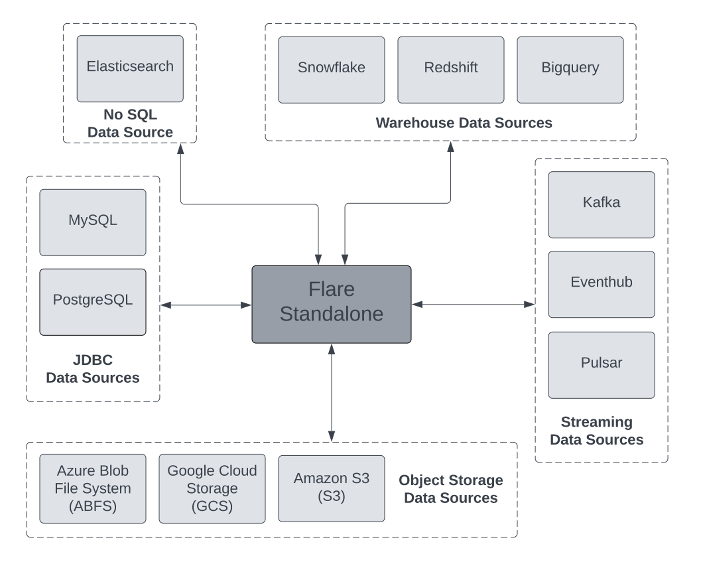

# Standalone YAML Configurations



Flare Standalone supports reading and writing data from any source which Flare supports. It could be Object Storage, Relational Databases, NoSQL Databases, Data Warehouses, and Streaming sources like Kafka.

> Depots are not allowed as Input/output locations in Flare Standalone. It's based on data sources. This arises an obvious question-

**Does the notion of using data sources in the Flare Standalone contradict the objective of creating a depot, whose whole idea was to make the connectivity uniform and avoid the exposition of secrets, and credentials?**
While in Standalone mode, you are running the job locally and not submitting it to Poros. Though the secret to the source is exposed, while development you work with sample data provided by the client and the development is within the limit of the person who is working on that use case. So the credentials that you pass are those of the storage spaces owned by you where you have kept the sample data and not the production environment ones.
> 

## Syntax for Inputs and Outputs

A Flare Standalone Job typically involves reading from a source, processing it locally, and writing to another source. The reading configurations are provided within the `inputs` section while the writing configurations and data source output is provided in the `outputs` section.

### **Configuration of Inputs Section (Read from)**

```yaml
inputs:
  - name: <view-name> # name of the input view which can be referred in steps
    inputType: <input> # datasourceinput type to read from
		# value of inputType could be file, elasticsearch, kafka, pulsar,
		# bigquery, eventhub, redshift, snowflake, bigquery, mysql, postgres
    <input>:
      {datasourceinput-specific-properties}
```

### **Configuration of Outputs Section (Write To)**

```yaml
outputs:
  - name: <view-name> # name of the output view
    outputType: <output> # datasourceoutput type to write into
		# value of outputType could be file, elasticsearch, kafka, pulsar,
		# bigquery, eventhub, redshift, snowflake, bigquery, mysql, postgres
    <output>:
      {datasourceoutput-specific-properties}
```

Apart from the `inputs` and `outputs` section configuration, the Spark Configurations for different data sources are provided within the `sparkConf` property in the form of key-value pairs, which are specific for a given data source. Let’s dive into each source type and look at how the source-specific properties are defined, along with some sample YAML configurations for each class.

## Reading and Writing from different data sources

### **Object Storages**

Flare Standalone currently supports the following Object Storage - Azure Blob File System (ABFS), Google Cloud Storage (GCS), and Amazon Simple Storage Service (S3). To know more about Flare Standalone YAML configurations for these data sources, please look at the below sections.

#### **Azure Blob Storage (ABFSS)**

Azure Blob Storage is a storage service by Microsoft. You can go to the page below to learn more about Flare Standalone YAML configurations for ABFSS Data Source.

[Azure Blob Storage (ABFSS)](./standalone_yaml_configurations/azure_blob_storage_(abfss).md)

#### **Google Cloud Storage (GCS)**

Google Cloud Storage is a service for storing your objects in Google Cloud. You can go to the page below to learn more about  Flare Standalone YAML configurations for GCS data sources.

[Google Cloud Storage (GCS)](./standalone_yaml_configurations/google_cloud_storage_(gcs).md)

#### **Amazon Simple Storage Service (S3)**

Amazon Simple Storage Service (S3) is an object storage service. To know more about Flare Standalone YAML configurations for the S3 data source, you can just go to the below page.

[Amazon Simple Storage Service (S3)](./standalone_yaml_configurations/amazon_simple_storage_service_(s3).md)

### **NoSQL Data Source**

#### **ElasticSearch**

Elasticsearch is an open-source, document-oriented, NoSQL database. To know more about Flare Standalone YAML configuration for Elasticsearch, you can go to the below page.

[Elasticsearch](./standalone_yaml_configurations/elasticsearch.md)

### **Streaming Data Sources**

Flare Standalone supports Kafka, Pulsar, and Eventhub Streaming data sources. Please go to the below sections if you would like to know more about executing jobs on these data sources.

#### **Kafka**

Apache Kafka is an open-source distributed event streaming platform. To know more about Flare Standalone YAML configuration for Kafka data source, you can just go to the below page.

[Kafka](./standalone_yaml_configurations/kafka.md)

#### **Pulsar**

Apache Pulsar is a cloud-native, distributed, open-source pub-sub messaging and streaming platform. If you would like to learn more about Flare Standalone YAML configuration for Pulsar, you can go to the page below.

[Pulsar](./standalone_yaml_configurations/pulsar.md)

#### **Eventhub**

Azure Event Hubs is a big data streaming platform and event ingestion service. To know more about Flare Standalone YAML configuration for Eventhub data sources, you can just go to the below page.

[EventHub](./standalone_yaml_configurations/eventhub.md)

### **Warehouse Data Sources**

Among warehouses, Flare Standalone currently supports Snowflake, Amazon Redshift, and Google Bigquery. 

#### **Redshift**

Amazon Redshift is a fully managed petabyte-scale Cloud-based Data Warehouse service designed by Amazon to handle extensive data. To know more about Flare Standalone YAML configuration for the Redshift data source, you can just go to the below page.

[Redshift](./standalone_yaml_configurations/redshift.md)

#### **Snowflake**

Snowflake is a data-warehousing platform for creating big data products. To know more about Flare Standalone YAML configuration for Snowflake data source, you can just go to the below page.

[Snowflake](./standalone_yaml_configurations/snowflake.md)

#### **Bigquery**

Google BigQuery is a Cloud-based Data Warehouse that offers a big data analytic web service for processing large datasets over petabytes of data. You can go to the page below to learn more about Flare Standalone configuration for Bigquery data sources.

[Bigquery](./standalone_yaml_configurations/bigquery.md)

### **JDBC Data Sources**

Among the JDBC-supported data sources, Standalone currently supports MySQL and Postgres. If you want to know more, you can navigate the below sections.

#### **MySQL**

MySQL is an open-source database. To know more about Flare Standalone YAML configuration for MySQL Data Source, you can go to the below page.

[MySQL](./standalone_yaml_configurations/mysql.md)

#### **Postgres**

Postgres is a robust, open-source relational database. You can go to the page below to learn more about Standalone configuration for Postgres Data Source.

[Postgres](./standalone_yaml_configurations/postgres.md)