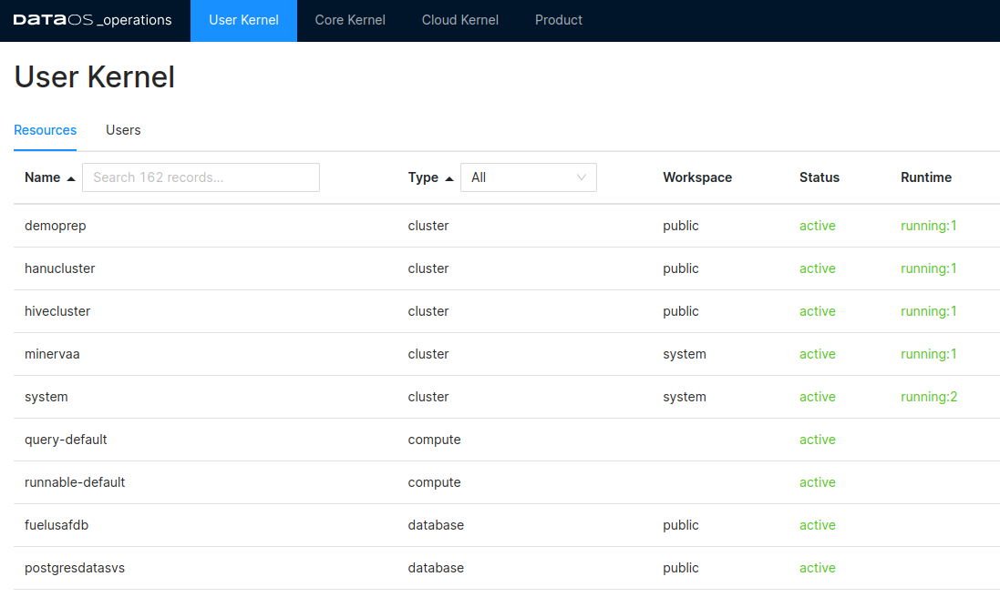
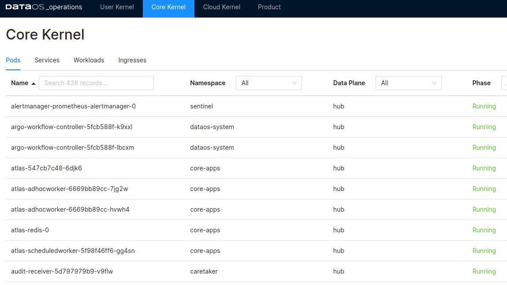
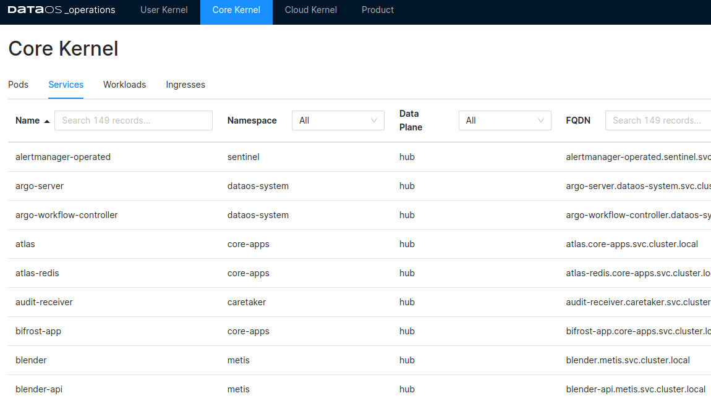
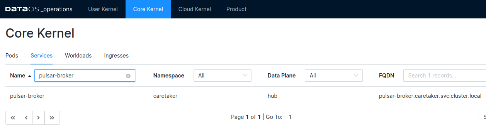
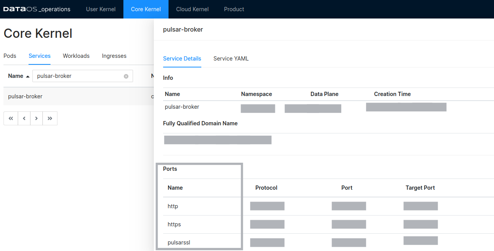

# Getting the Port of Service and AdminUrl

- Open the Operations App

- Click on the Core Kernel

- Click on the Services

- In the services search for `pulsar-broker`

- Click on the `pulsar-broker` service and navigate to the Service Details. Here you will find the Port section which gives the details of the name, protocol, and port

