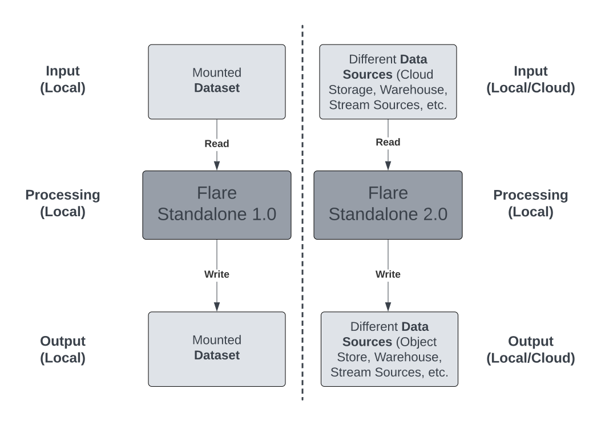

# Standalone 2.0


## What’s new in 2.0?

- Apple M1/M2 Chip Support for Flare Standalone.
- Datasource IO to read and write.
- Added support to expose SparkUI to localhost.
- Support for custom image tag to run Standalone.

<center>



<i>Diagram contrasting Flare Standalone 1.0 and 2.0</i>
</center>

## Contrasting Flare Standalone 1.0 and 2.0

| **Parameter** | **Standalone 1.0** | **Standalone 2.0** |
| --- | --- | --- |
| IO to Read/Write Data | Uses dataset | Uses Datasource |
| Source Support | Works on Local File system-mounted data | Works on Object storage, Warehouses, relational and NoSQL data sources, as well as local file system-mounted data. To check out the list of support sources click [here](./standalone_yaml_configurations.md) |
| Support to expose SparkUI to localhost | No | Yes |
| Support for configuring flare versions | Only supported the default version that came out of the box; no configuration permitted. | Flare stack version can be configured, e.g., flare:4.0, flare:5.0 |
| Support for custom flare image hosted in docker registry | No custom image support | Supports all custom image tags to run Standalone |
| Support for Apple M1/M2 Chip | The intermediate transformation required for M1/M2 support | Native M1/M2 chip support |

## Features of Standalone 2.0

### **An effort towards making Flare independent from DataOS**

By independence, we imply that Flare no longer has a dependency on DataOS. In Standalone 1.0, its functionality was limited to just mounting the local directory; the data either had to be downloaded from the object store or downloaded after running a query on Workbench. Now with Standalone 2.0, Flare can be used natively as any other application. 

<aside>

🗣️ **CAUTION:** Standalone 2.0 can read and write data from any **data source** supported by it. It reads the data from location A, processes it locally, and writes it to place B. If that place, let’s say, is a production environment and already has a table by that name, it will overwrite it, and you may face issues.

</aside>

### **Simplifying the YAML declarations around Flare Jobs**

Standalone 2.0 is more declarative; there is native support for data sources like file systems, object storage, databases, streaming sources, etc., whose credentials can be declared in sequential YAML. For this purpose, new properties like `envs` which are environment variables specific for a source,  `inputType`, which contains the input file, and source-specific properties for the `outputType`, have been introduced to make this declarative paradigm possible. Also, the `sink` section within the sequence has been removed, and the properties have been added to the `outputs` section. 

### **Ability to support custom images and stack versions**

Standalone 2.0 brings in the functionality of supporting custom stack images. Earlier, you had to utilize only the default stack images that came out of the box. But in the new release, you can utilize the  `-s` flag to configure the stack version and an optional `-i` flag for custom images available in the docker registry. The command now looks like this

```bash
dataos-ctl develop start -s \
<stack-version> -i <custom-images> -f <manifest-file-path> \
-d <data-directory-path>
```

**Sample Command**

```bash
dataos-ctl develop start -s \
flare:3.0 -i rubiklabs/flare3:6.0.93 -f ./standalone/flare-config/read-local-write-gcs/config.yaml \
-d standalone
```

**For Apple M1/M2 Chip Systems**

With the custom image functionality, Standalone 2.0 adds cross-build support for Apple M1/M2 Chips. Use the `rubiklabs/flare3:6.0.93-xp.01` image for the same.

```bash
dataos-ctl develop start -s \
flare:3.0 -i rubiklabs/flare3:6.0.93-xp.01 -f ./standalone/flare-config/read-local-write-gcs/config.yaml \
-d standalone
```

<aside>

🗣️ You can also use any custom build image for your use case.

</aside>

### **Shift from datasets to the data source IO**

With Standalone 1.0 to read/write, you required **datasets** for IO. E.g., if you had to use data present in Pulsar, you first need to bring that data to the local system, mount it on docker and then do the processing on Standalone. But with Standalone 2.0, you can use **data sources** like Pulsar directly without bringing them locally, do the processing and get the data. The potential to utilize the environment storage now saves the extra effort of taking that data from stream or storage to local first and then mounting it as a local file. With the various data sources supported within Standalone 2.0, the entire development work can be confined to the local system, reducing the redundant noise created in the environment while formulating logic and queries for jobs in production.

### **Exposing SparkUI**

Standalone 2.0 supports exposing SparkUI to localhost, which was absent in the earlier version. This adds to the ability to test your SQL queries locally before running your job in production, saving compute resources during optimization.

The new version also brings the `-P` flag that allows the end user to expose SparkUI to a specific port, which is especially useful in scenarios when you have a job already running on the default port. The command is as follows

```yaml
dataos-ctl develop start -s \
flare -i rubiklabs/flare3:6.0.93-xp.01 -f ./standalone/flare-config/read-local-write-gcs/config.yaml \
-d standalone -P 14041 # --port by default is 14040
```