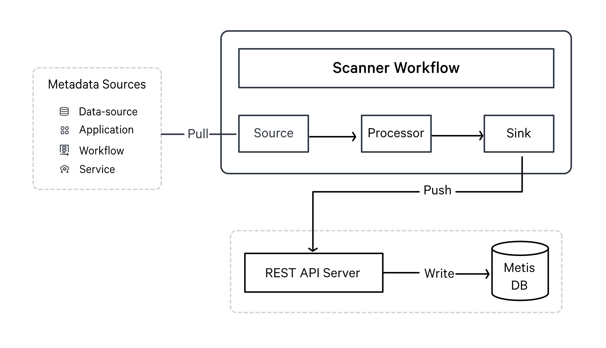
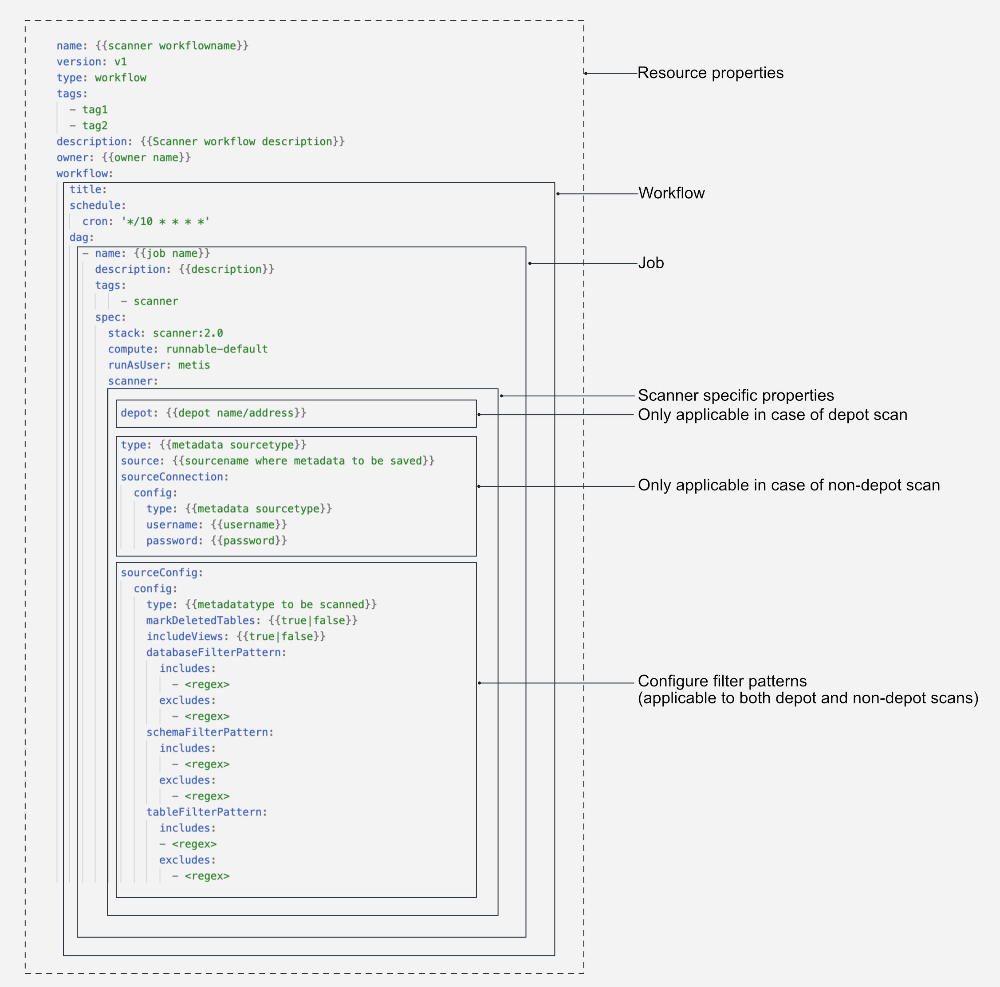

# Scanner
The Scanner stack in DataOS is a Python-based framework designed for developers to extract metadata from external source systems (such as RDBMS, Data Warehouses, Messaging services, etc.) and the components/services within the DataOS environment. 

With the DataOS Scanner stack, you can extract both general information about datasets/tables, such as their names, owners, and tags, as well as more detailed metadata like table schemas, column names, and descriptions. Additionally, the Scanner stack can help you retrieve metadata related to data quality and profiling, query usage, pipelines (workflows), and user information associated with your data assets.

## How Does Scanner Stack Work?

In DataOS, metadata extraction is treated as a job, which is accomplished using a DataOS resource called Workflow. This stack provides the ability to write workflows that extract metadata from various sources and store it in a metadata store. The Scanner workflow typically includes a source, transformations, and a sink.

Similar to an ETL (Extract, Transform, Load) job, the Scanner workflow connects to the metadata source, extracts the metadata, and applies transformations to convert it into a standardized format. The transformed metadata is then pushed to a REST API server, which is backed by a centralized metadata store or database such as MySQL or Postgres. This process can be performed in either a batch or scheduled manner, depending on the requirements.

<aside style="background-color:#FFE5CC; padding:15px; border-radius:5px;">
🗣 The default metadata store in DataOS is MetisDB which is a Postgres database.

</aside>

The stored metadata is used by various DataOS components for discoverability, governance, and observability. External apps running on top of DataOS can also fetch this metadata via Metis server APIs.

<aside style="background-color:#FFE5CC; padding:15px; border-radius:5px;">
🗣 In DataOS, all the metadata entities are defined and consumed in JSON format.

</aside>

<figcaption align = "center">DataOS Scanner stack for metadata extraction</figcaption>

Apart from the external applications, the Scanner stack can also extract metadata from various applications & services of DataOS. The scanner job reads related metadata and pushes it to the metadata store through the Metis REST API server. You can then explore this information through the Metis UI.

The Scanner job connects with the following DataOS components and stores the extracted metadata to Metis DB:

- **Poros**: To scan and publish data-pipeline metadata (workflow-related information, execution history, and execution states).
- **Icebase**: To retrieve information from data profiles (descriptive statistics for datasets) and data quality tables (quality checks for your data along with their pass/fail status).
- **Gateway service:** To scan query usage-related data and harvests required insights such as (heavy datasets, popular datasets, datasets most associated together, etc.).
- **Heimdall:** To scan information about the users present in the DataOS environment, their descriptions, and images. All this user information will be available on Metis UI.

A continuous running service within the DataOS environment keeps track of newly created or updated datasets/topics/pipelines(workflows). With this information about the changed entity, it creates a reconciliation Scanner YAML with filters to include only the affected entity. This Scanner workflow will extract the metadata about the entity and update the target metastore.
<aside style="background-color:#FFE5CC; padding:15px; border-radius:5px;">
🗣 DataOS Scanner is a flexible and extensible framework; you can easily integrate it with new sources

</aside>

## Creating and Scheduling Scanner Workflows

Within DataOS, different workflows can be deployed and scheduled, which will connect to the data sources to extract metadata. 

- **Depot Scan Workflow**: With this type of Scanner workflow, depots are used to get connected to the metadata source to extract Entities’ metadata. It enables you to scan all the datasets referred by a depot. You need to provide the depot name or address, which will connect to the data source. 

- **Non-Depot Scan Workflow**: With this type of scanner workflow, you must provide the connection details and credentials for the underlying metadata source in the YAML file. These connection details depend on the underlying source and may include details such as host URL, project ID, email, etc.

<aside style="background-color:#FFE5CC; padding:15px; border-radius:5px;">
🗣 The non-Depot scan can help extract metadata from sources where depot creation is not supported or when you do not have an already created depot.

</aside>

You can write Scanner workflows in the form of a sequential YAML for a pull-based metadata extraction system built into DataOS for a wide variety of sources in your data stack. These workflows can be scheduled to run automatically at a specified frequency.

<figcaption align = "center">Scanner YAML Components</figcaption>

Learn about the source connection and configuration options to create depot scan/non-depot scan workflow DAGs to scan entity metadata.

[Creating Scanner Workflows](scanner/creating_scanner_workflows.md)

### Supported Data Sources

Here you can find templates for the depot/non-depot Scanner workflows. 

[Databases and Warehouses](scanner/databases_and_warehouses.md)

[Messaging Services](scanner/messaging_services.md)

<aside style="background-color:#FFE5CC; padding:15px; border-radius:5px;">
🗣 You can perform both depot scans and non-depot scans on all the data sources where you have established depots. The distinction lies in the fact that non-depot scans require you to furnish connection information and credentials within the Scanner YAML file. Whereas, for depot scans, you only need to provide the depot name or address.
</aside>

## System Scanner Workflows

The following workflows are running as system workflows to periodically scan the related metadata and save it to Metis DB to reflect the updated metadata state. They are scheduled to run at a set interval.

### **Data Profiling and Quality**

DataOS can leverage Scanner workflows to write jobs that could pull information from data profiles (descriptive statistics for the datasets) and data quality tables on an incremental basis and publish it to Metis DB.

[Data Profile Scan](scanner/data_profile_scan.md)

[Data Quality Scan](scanner/data_quality_scan.md)

### **Pipelines/Workflows Data**

For metadata extraction related to data about workflows and resource consumption, the following workflow is scheduled.

[Workflows Data Scan](scanner/workflows_data_scan.md)

### **Query History**

This Scanner workflow will ingest metadata related to query history. It scans information about queries, users, dates, and completion times. It connects with the Gateway service on a given cadence to fetch information about queries.

[Query Usage](scanner/query_usage_data_scan.md)

### **Users’ Information**

This workflow will scan the information about the users in DataOS. This is a scheduled workflow that connects with Heimdall on a given cadence to fetch information about users.

## Common Errors

[Common Scanner Errors](scanner/common_scanner_errors.md)