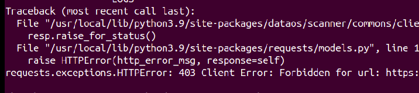
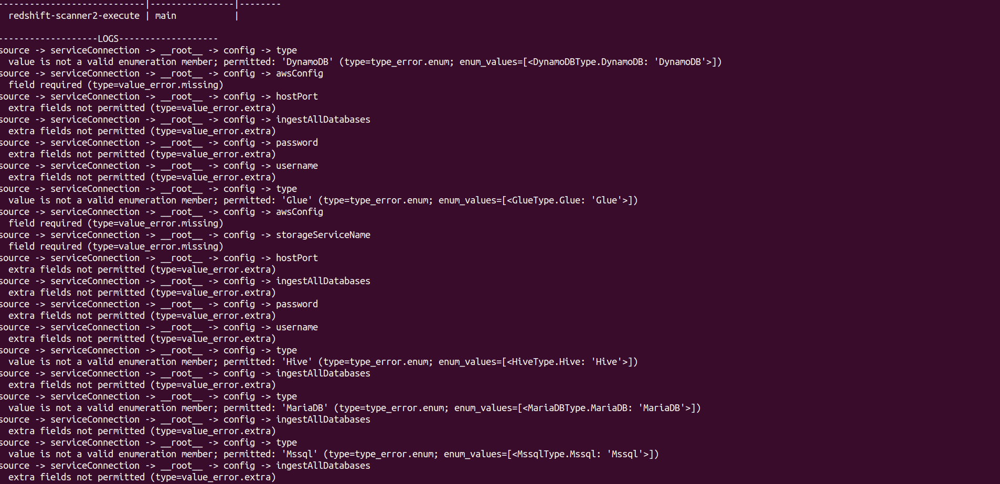
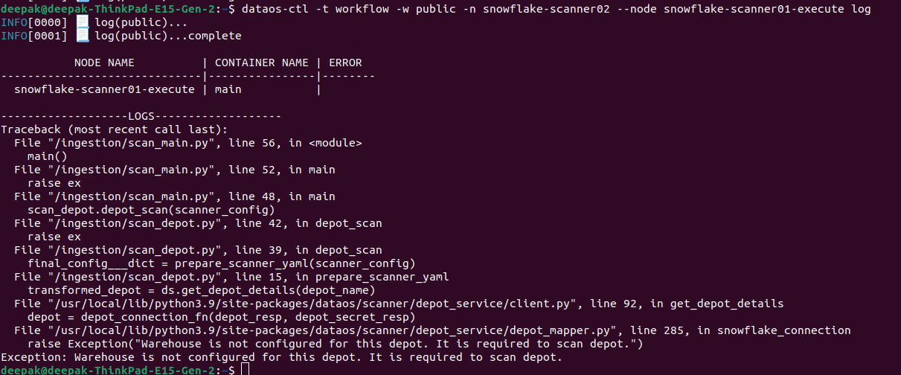
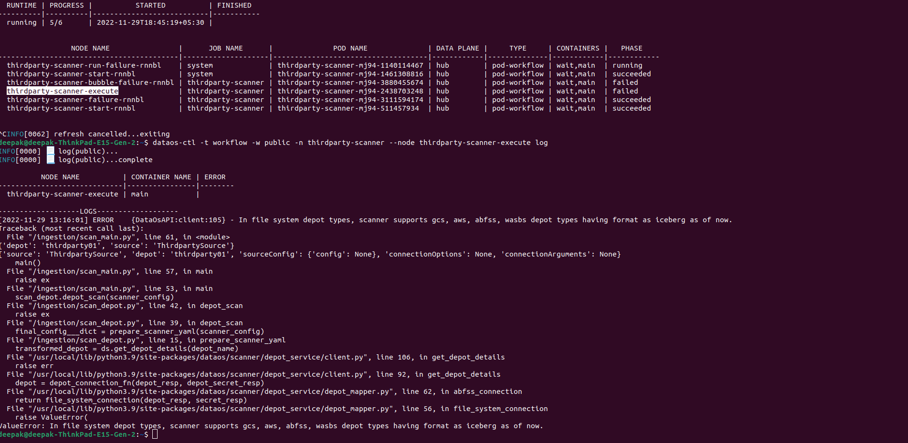

# Common Scanner Errors

When you run a Scanner workflow, you may see errors that can affect the metadata scan. Here is a list of commonly encountered errors and solutions.****

## Error #1

Sometimes a user might get an ERROR 403 (Example Below) while running the Scanner Jobs.



### Suggested Solution

To overcome this issue, we need to run the job as Metis user  `runAsUser: metis`

The following YAML displays the section where you need to add this information.

```yaml
spec:
  tags:
    - scanner
  stack: scanner:2.0
  compute: runnable-default
  runAsUser: metis                #run as Metis user
  scanner:
    depot: demoprepbq
          
```

## Error #2

While scanning PostgreSQL database metadata, If the user doesn't have login access for the underlying database, this error will be shown.

```bash

psycopg2.OperationalError: connection to server at "mebash.postgres.database.azure.com" (20.81.106.165), port 5432 failed: FATAL:  password authentication failed for user "ashish"
connection to server at "mebash.postgres.database.azure.com" (20.81.106.165), port 5432 failed: FATAL:  no pg_hba.conf entry for host "20.219.178.198", user "ashish", database "postgres", no encryption
```

### Suggested Solution

The user needs to have both `CONNECT` and `SELECT`  privileges on the database. These privileges allow the user to establish a connection to the database and retrieve the necessary metadata from tables, views, or other database objects.

To check privileges:

```sql
SELECT table_catalog, table_schema, table_name, privilege_type
FROM   information_schema.table_privileges 
WHERE  grantee = 'MY_USER_Name'
```

<aside style="background-color:#FFE5CC; padding:15px; border-radius:5px;">
🗣 The errors thrown in the case of Redshift and PostgresSQL databases are mostly the same. Please check if you have enough permissions to scan the metadata from the underlying sources.

</aside>

To learn more, click here.

<pgre, redshift pages>

## Error #3

You may get the following error for value is not a valid enumeration member or extra fields not permitted.



### Suggested Solution

Check the `scanner` section of your YAML file. You have mistyped the property name or mentioned a property that does not exist. For example, if you enter `service` for the property `source`, you will get this error. Similarly, if you type depo instead of  `depot`, your Scanner workflow will not run and throw this error.

## Error #4

In case of Snowflake, you may get the following error while scanning data for warehouse is not configured for this depot.



### Suggested Solution

If you encounter the error mentioned above, it indicates that the Snowflake depot is configured with a database name instead of a warehouse name. To resolve this issue and enable the scanning of metadata, you should reach out to the DataOS administrator. They will need to make the necessary changes in the Depot configuration YAML file by specifying the correct warehouse name.

## Error #5

You will encounter this error when you try to scan unstructured data stored in File/blob storage.



> **Note:** At present, scanning the metadata of File Systems/Blob storage(Unstructured data) is not supported.
>