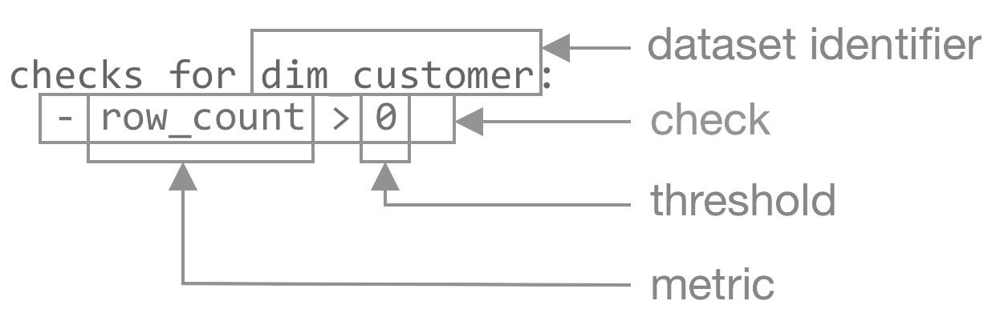

# Soda

Soda is a declarative [Stack](../stacks.md) for data quality testing within and beyond data pipelines, extending its capabilities, enhancing data observability and reliability across one or more datasets. It enables you to use the [Soda Checks Language (SodaCL)](https://docs.soda.io/soda-cl/soda-cl-overview.html) to turn user-defined inputs into aggregated SQL queries.

## How to run Soda checks?


### **Create a Workflow/Worker manifest**

Soda operates as a Stack that can be orchestrated through various [Resources](../../resources.md), such as a [Workflow](../workflow.md), or a [Worker](../worker.md) Resource. The choice of orchestrator-type is contingent upon the specific use case being addressed.

- When dealing with batch workloads for executing quality checks and profiling, opt for the [Workflow](../workflow.md) Resource.
- For long-running, continuous workloads, the recommended choice is the [Worker](../worker.md) Resource.

For detailed insights into the selection and utilization of the appropriate Resource, please refer to the dedicated documentation for [Workflow](../workflow.md) and [Worker](../worker.md) Resources.

<details><summary>Code Snippet for Workflow and Worker manifest</summary>

<h3><b>Code Snippet for Workflow</b></h3>

```yaml
# Configuration for Resource meta section

name: soda-workflow         # Resource name (mandatory, default: none, possible: any string confirming the regex [a-z0-9]([-a-z0-9]*[a-z0-9]) and length less than or equal to 48 characters)
version: v1                 # Manifest version (mandatory, default: none, possible: v1)
type: workflow              # Resource-type (mandatory, default: none, possible: workflow)
tags:                       # Tags (optional, default: none, possible: list of strings)
  - workflow
  - soda-checks
description: Soda workflow  # Resource description (optional, default: none, possible: any string)
workspace: public           # Workspace name (optional, default: public, possible: any DataOS Workspace name)

# Configuration for Workflow-specific section

workflow:
  dag:
    - name: soda-job-v1           # Job name (mandatory, default: none, possible: any string confirming the regex [a-z0-9]([-a-z0-9]*[a-z0-9]) and length less than or equal to 48 characters)
      title: Soda checks job      # Job title (optional, default: none, possible: any string)
      description: Soda job       # Job description (optional, default: none, possible: any string)
      spec:                       # Job spec (mandatory)
        stack: soda+python:1.0    # Stack name, flavor, and version (mandatory, default: none, value: for soda use soda+python:1.0. Here soda is the stack, python is flavor, and 1.0 is version)
        compute: runnable-default # Compute name (mandatory, default: none, possible: runnable-default or any other runnable-type Compute Resource name)
        resources:                # CPU and memory resources (optional)
          requests:               # Requested resources (optional)
            cpu: 1000m            # Requested CPU resources (optional, default: 100m, possible: cpu units in milliCPU(m) or cpu core)
            memory: 100Mi         # Requested memory resources (optional, default: 100Mi, possible: memory in Mebibytes(Mi) or Gibibytes(Gi))
          limits:                 # Resource limits (optional)
            cpu: 400m             # CPU resource limits (optional, default: 400m, possible: cpu units in milliCPU(m) or cpu core)
            memory: 400Mi         # Memory resource limits (optional, default: 400Mi, possible: cpu units in milliCPU(m) or cpu core)
        logLevel: INFO            # Logging level (optional, default: INFO, possible: INFO / WARNING / ERROR / DEBUG)

# Configuration for Soda Stack-specific section
        stackSpec:
          # ... attributes specific to Soda Stack are specified here.
```
<center><i>Configuration for a Workflow YAML manifest</i></center>

To learn more about the attributes of <a href="/resources/workflow/">Workflow</a> Resource, refer to the link: <a href="/resources/workflow/yaml_configuration_attributes/">Attributes of Workflow YAML</a>.

<h3><b>Code Snippet for Worker</b></h3>

```yaml

# Configuration for Resource meta section

name: soda-worker           # Resource name (mandatory, default: none, possible: any string confirming the regex [a-z0-9]([-a-z0-9]*[a-z0-9]) and length less than or equal to 48 characters)
version: v1beta             # Manifest version (mandatory, default: none, possible: v1beta)
type: worker                # Resource-type (mandatory, default: none, possible: worker)
tags:                       # Tags (optional, default: none, possible: list of strings)
  - worker
  - soda-checks
description: Soda worker    # Resource description (optional, default: none, possible: any string)
workspace: public           # Workspace name (optional, default: public, possible: any DataOS Workspace name)

# Configuration for Worker-specific section

worker:
  replicas: 1                        # Number of worker replicas (optional, default: 1, possible: any positive integer)
  tags:                              # Tags (optional, default: none, possible: list of strings)
    - sodaworker
  stack: soda+python:1.0             # Stack name, flavor, and version (mandatory, default: none, value: for soda use sodaworker+python:1.0. Here sodaworker is the stack, python is flavor, and 1.0 is version)
  logLevel: INFO                     # Logging level (optional, default: INFO, possible: INFO / WARNING / ERROR / DEBUG)
  compute: runnable-default          # Compute name (mandatory, default: none, possible: runnable-default or any other runnable-type Compute Resource name)
  resources:                # CPU and memory resources (optional)
    requests:               # Requested resources (optional)
      cpu: 1000m            # Requested CPU resources (optional, default: 100m, possible: cpu units in milliCPU(m) or cpu core)
      memory: 100Mi         # Requested memory resources (optional, default: 100Mi, possible: memory in Mebibytes(Mi) or Gibibytes(Gi))
    limits:                 # Resource limits (optional)
      cpu: 400m             # CPU resource limits (optional, default: 400m, possible: cpu units in milliCPU(m) or cpu core)
      memory: 400Mi         # Memory resource limits (optional, default: 400Mi, possible: cpu units in milliCPU(m) or cpu core)

# Configuration for Soda Stack-specific section

  stackSpec: 
    # ... attributes specific to Soda Stack are specified here.
```
<center><i>Configuration for a Worker YAML manifest</i></center>

To learn more about the attributes of <a href="/resources/worker/">Worker</a> Resource, refer to the link: <a href="/resources/worker/yaml_configuration_attributes/">Attributes of Worker YAML</a>.

</details>


### **Declare the configuration for Soda `stackSpec` section**

The [Workflow](../workflow.md) and [Worker](../worker.md) Resouce comprise of a [`stackSpec`](./soda/yaml_attributes.md#stackspec) section (or a mapping) that comprises the attributes of the Stack to be orchestrated. In the context of Soda Stack, the StackSpec defines diverse datasets and their associated Soda checks. 

The YAML snippet below shows a sample structure of the Soda [`stackSpec`](./soda/yaml_attributes.md#stackspec) section:

```yaml
stackSpec:
  inputs:
    - dataset: dataos://icebase:retail/customer
      options:
        engine: minerva
        clusterName: miniature
      filter:
        name: filter_on_age
        where: age > 50
      checks:
        - row_count between 10 and 1000
      profile:
        columns:
          - "*"
```

This involves the declaration of following parts:

1. [Declare Input Dataset Address](#declaring-input-dataset-address)
2. [Define columns to be profiled (optional)](#defining-columns-to-be-profiled-optional)
3. [Define filters](#define-filters)
4. [Define Soda Checks](#defining-soda-checks)
5. [Define Optional configuration](#define-optional-configuration)

#### **Declaring Input Dataset Address**

The [`dataset`](./soda/yaml_attributes.md#dataset) attribute allows data developer to specify the data source or dataset that requires data quality evaluations. It is declared in the form of a [Uniform Data Link [UDL]](../depot.md), in the following format: `dataos://[depot]:[collection]/[dataset]`.

```yaml
stackSpec:
  inputs:
    - dataset: dataos://icebase:retail/customer
      # ...other input attributes
    - dataset: dataos://postgresdb:state/city
      # ...other input attributes
```


#### **Defining Soda Checks**

Soda Stack utilzies SodaCL, a YAML-based, low-code, human-readable, domain-specific language for data reliability and data quality management. SodaCL enables data developers to write checks for data quality, then run a scan of the data in the data source to execute those checks.

<center>



<i>Anatomy of a regular check in Soda. The dataset identifier is the name of the dataset on which you want to run the check. A metric is a property of the dataset that you wish to evaluate. The threshold is the metric value you want to check for during a scan. </i>

</center>

The [`checks`](./soda/yaml_attributes.md#checks) section allows users to specify a list of specific data quality checks or tests that will be performed on the designated dataset. These checks can be tailored to suit the unique requirements of the dataset and the data quality objectives.

```yaml
# Checks for basic validations

stackSpec:
  inputs:
    - dataset: dataos://icebase:retail/customer
      checks:
        - row_count between 10 and 1000
        - missing_count(birth_date) = 0
        - invalid_percent(phone) < 1 %:
            valid format: phone number
        - invalid_count(number_cars_owned) = 0:
            valid min: 1
            valid max: 6
        - duplicate_count(phone) = 0
      # ...other inputs attributes

stackSpec:
  inputs:
    - dataset: dataos://icebase:retail/customer
      checks:
      - avg(safety_stock_level) > 50
      # ...other inputs attributes

---

# Check for freshness 

stackSpec:
  inputs:
    - checks:
      - freshness (start_date) < 1d
      # ...other inputs attributes

---

# Check for referential integrity

stackSpec:
  inputs:
    - dataset: dataos://icebase:retail/customer
      checks:
        - values in (department_group_name) must exist in dim_employee (department_name)
      # ...other inputs attributes
```

<details>

<summary>Sample Soda checks</summary>

```yaml
stackSpec:
  inputs:
    - dataset: dataos://icebase:retail/customer
      checks:
        - row_count between 10 and 1000
        - row_count between (10 and 55)
        - missing_count(birthdate) = 0
        - invalid_percent(phone_number) < 1 %:
            valid format: phone number
        - invalid_count(number_of_children) < 0:
            valid min: 0
            valid max: 6
        - min(age) > 30:
            filter: marital_status = 'Married'
        - duplicate_count(phone_number) = 0
        - row_count same as city
        - duplicate_count(customer_index) > 10
        - duplicate_percent(customer_index) < 0.10
        - failed rows:
            samples limit: 70
            fail condition: age < 18  and age >= 50
        - failed rows:
            fail query: |
              SELECT DISTINCT customer_index
              FROM customer as customer
        - freshness(ts_customer) < 1d
        - freshness(ts_customer) < 5d
        - max(age) <= 100
        - max_length(first_name) = 8
        - values in (occupation) must exist in city (city_name)
        - schema:
            name: Confirm that required columns are present
            warn:
              when required column missing: [first_name, last_name]
            fail:
              when required column missing:
                - age
                - no_phone
        - schema:
            warn:
              when forbidden column present: [Voldemort]
              when wrong column type:
                first_name: int
            fail:
              when forbidden column present: [Pii*]
              when wrong column type:
                number_of_children: DOUBLE
    # ...other inputs attributes
```

</details>

You can refer to the Soda documentation for the grammar of check definitions: [Soda CL Reference](https://docs.soda.io/soda-cl/soda-cl-overview.html).

#### **Defining Columns to be Profiled (Optional)**

The [`profile`](./soda/yaml_attributes.md#profile) section enables you to specify a list of columns that require profiling. Profiling involves analysing and collecting information about the characteristics and data distribution in these columns. The profile section is especially beneficial for gaining insights into the data and comprehending it’s patterns.

```yaml
stackSpec:
  inputs:
    - dataset: dataos://distribution:distribution/dc_info
      profile:
        columns:
          - "*"
```

**Columns Specification**

The [`columns`](./soda/yaml_attributes.md#columns) attribute under the profile section is where you specify the list of columns you want to profile. Each column is represented as a string item in the list. 

You can provide the exact column name, or you can use special patterns to match multiple columns. The column matching patterns are provided in the list below:

<table>
    <tr>
        <th>Column Patterns</th>
        <th>Description</th>
        <th>Example</th>
    </tr>
    <tr>
        <td>Exact Column Matching</td>
        <td>If you provide an exact column name, the profiling will focus only on that specific column.</td>
        <td>
            <pre>profile:<br>  columns:<br>    - customer_index</pre>
        </td>
    </tr>
    <tr>
        <td>Wildcard Matching</td>
        <td>If you want to profile multiple columns that share a common pattern, you can use the "*" wildcard character. This wildcard matches any sequence of characters within a column name.</td>
        <td>
            <pre>profile:<br>  columns:<br>    - include d*</pre>
        </td>
    </tr>
    <tr>
        <td>Wildcard for all Columns</td>
        <td>To profile all columns in the dataset, you can use the "*" wildcard without any prefix.</td>
        <td>
            <pre>profile:<br>  columns:<br>    - "*"</pre>
        </td>
    </tr>
    <tr>
        <td>Excluding Columns</td>
        <td>To exclude specific columns from the profiling process, you can use the "exclude" keyword followed by the column names.</td>
        <td>
            <pre>profile:<br>  columns:<br>    - "*"<br>    - exclude email_id</pre>
        </td>
    </tr>
    <tr>
        <td>Combining Patterns</td>
        <td>You can combine different patterns to create more refined selections.</td>
        <td>
            <pre>profile:<br>  columns:<br>   - customer_index<br>   - exclude email_id<br>   - include d*<br>   - e*</pre>
        </td>
    </tr>
</table>

#### **Define Filters**

The [`filter`](./soda/yaml_attributes.md#filter) attribute or section works as a global filter for all checks specified within a dataset. 

<aside class="callout">

🗣️ This global filter functionality differs from the filter applied within the <a href="/resources/stacks/soda#defining-soda-checks"><code>checks</code></a> section.

</aside>

The following YAML sample demonstrates how the [`filter`](./soda/yaml_attributes.md#filter) section can be employed to apply a global filter on all checks specified within the <a href="/resources/stacks/soda/yaml_attributes#checks"><code>checks</code></a> section.

```yaml
stackSpec:
  inputs:
    - dataset: dataos://icebase:retail/customer
      filter:
        name: filter_on_age
        where: age > 50
```


#### **Define Optional configuration**

The [`options`](./soda/yaml_attributes.md#options) section provides users with the flexibility to configure various attributes for connecting to data sources or data source options. These options encompass:

**Engine**

The [`engine`](./soda/yaml_attributes.md#engine) attribute can assume two values: `minerva` and `default`. 

- The `default` value executes queries on the data source.
- The `minerva` option utilizes the DataOS query engine (Minerva) to execute queries on the depot connected to the cluster. When opting for `minerva`, specifying the [`clusterName`](./soda/yaml_attributes.md#clustername) becomes mandatory.

<aside class="callout">
🗣 For sources like <b>Icebase</b>, engine must be <code>minerva</code>. For more information, refer to the list of sources and supported engines provided below.

<details>
<summary>List of Sources and Supported Engine</summary>

<center>

<table>
    <tr>
        <th><strong>Source Name/Engine</strong></th>
        <th><strong>Default</strong></th>
        <th><strong>Minerva</strong></th>
    </tr>
    <tr>
        <td>Snowflake</td>
        <td>Yes</td>
        <td>Yes</td>
    </tr>
    <tr>
        <td>Oracle</td>
        <td>Yes</td>
        <td>Yes</td>
    </tr>
    <tr>
        <td>Trino</td>
        <td>Yes</td>
        <td>Yes</td>
    </tr>
    <tr>
        <td>Minerva</td>
        <td>No</td>
        <td>Yes</td>
    </tr>
    <tr>
        <td>BigQuery</td>
        <td>Yes</td>
        <td>Yes</td>
    </tr>
    <tr>
        <td>Postgres</td>
        <td>Yes</td>
        <td>Yes</td>
    </tr>
    <tr>
        <td>MySQL</td>
        <td>Yes</td>
        <td>Yes</td>
    </tr>
    <tr>
        <td>MSSQL</td>
        <td>Yes</td>
        <td>Yes</td>
    </tr>
    <tr>
        <td>Redshift</td>
        <td>Yes</td>
        <td>Yes</td>
    </tr>
    <tr>
        <td>Elastic Search</td>
        <td>No</td>
        <td>Yes</td>
    </tr>
    <tr>
        <td>MongoDB</td>
        <td>No</td>
        <td>Yes</td>
    </tr>
    <tr>
        <td>Kafka</td>
        <td>No</td>
        <td>Yes</td>
    </tr>
    <tr>
        <td>Azure File System</td>
        <td>No</td>
        <td>No</td>
    </tr>
    <tr>
        <td>Eventhub</td>
        <td>No</td>
        <td>No</td>
    </tr>
    <tr>
        <td>GCS</td>
        <td>No</td>
        <td>No</td>
    </tr>
    <tr>
        <td>OpenSearch</td>
        <td>No</td>
        <td>No</td>
    </tr>
    <tr>
        <td>S3</td>
        <td>No</td>
        <td>No</td>
    </tr>
</table>

</center>

</details>

</aside>

**Cluster Name**

If applicable, users can provide the [`clusterName`](./soda/yaml_attributes.md#clustername) on which queries will run. This is a mandatory field in the case of the Minerva engine. You can check the cluster on which your depot is mounted in Workbench or check the cluster definition in the [Operations](../../interfaces/operations.md) App.

<aside class="callout">

🗣 You can use all source-supported properties that the <a href="https://github.com/sodadata/soda-core/blob/main/docs/overview-main.md">Soda Core</a> library supports as well.

</aside>

```yaml
stackSpec:
  inputs:
    - dataset: dataos://icebase:retail/customer
      options:
        engine: minerva
        clusterName: miniature
```

The following table provides a comprehensive overview of the various attributes within the Soda-specific Section:

| Attribute | Data Type | Default Value | Possible Values | Requirement |
| --- | --- | --- | --- | --- |
| [`stackSpec`](./soda/yaml_attributes.md#stackspec) | mapping | none | none | mandatory |
| [`inputs`](./soda/yaml_attributes.md#inputs) | list of mappings | none | any valid iceberg<br>dataset UDL address | mandatory |
| [`dataset`](./soda/yaml_attributes.md#dataset) | string | none | none | mandatory |
| [`options`](./soda/yaml_attributes.md#options) | mapping | none | set_version | optional |
| [`engine`](./soda/yaml_attributes.md#engine) | string | none | default / minerva | optional |
| [`clusterName`](./soda/yaml_attributes.md#clustername) | string | none | valid cluster name | optional |
| [`filter`](./soda/yaml_attributes.md#filter) | mapping | none | none | optional |
| [`name`](./soda/yaml_attributeSodaCLs.md#name) | string | none | valid filter name | optional |
| [`where`](./soda/yaml_attributes.md#where) | string | none | valid filter condition | optional |
| [`profile`](./soda/yaml_attributes.md#profile) | mapping | none | none | optional |
| [`columns`](./soda/yaml_attributes.md#columns) | list of strings | none | dataset column names | optional |
| [`checks`](./soda/yaml_attributes.md#checks) | list of mappings | none | valid SodaCL checks | mandatory |

For further details regarding the Soda Stack-specific attributes, you can refer to the link: [Attributes of Soda Stack YAML](./soda/yaml_attributes.md).

### **Code Samples**

<details>
<summary>Sample manifest for Soda Stack orchestrated using a Workflow</summary>

```yaml
name: soda-workflow-v01
version: v1
type: workflow
tags:
  - workflow
  - soda-checks
description: Random User Console
workspace: public
workflow:
  dag:
    - name: soda-job-v1
      title: soda Sample Test Job
      description: This is sample job for soda dataos sdk
      spec:
        stack: soda:1.0
        compute: runnable-default
        resources:
          requests:
            cpu: 1000m
            memory: 250Mi
          limits:
            cpu: 1000m
            memory: 250Mi
        logLevel: INFO # WARNING, ERROR, DEBUG
        stackSpec:
          inputs:
            # Redshift
            - dataset: dataos://sanityredshift:public/redshift_write_12
              checks:
                - row_count between 10 and 1000
            # Oracle
            - dataset: dataos://sanityoracle:dev/oracle_write_12
              checks:
                - row_count between 10 and 1000
            # MySql
            - dataset: dataos://sanitymysql:tmdc/mysql_write_csv_12
              checks:
                - row_count between 10 and 1000
            # MSSQL
            - dataset: dataos://sanitymssql:tmdc/mssql_write_csv_12
              checks:
                - row_count between 10 and 1000
            # Minerva
            - dataset: dataos://icebase:retail/customer
              options:
                engine: minerva
                clusterName: miniature
              profile:
                columns:
                  - customer_index
                  - exclude email_id
                  - include d*
                  - e*
              checks:
                - row_count between 10 and 1000
                - row_count between (10 and 55)
                - missing_count(birthdate) = 0
                - invalid_percent(phone_number) < 1 %:
                    valid format: phone number
                - invalid_count(number_of_children) < 0:
                    valid min: 0
                    valid max: 6
                - min(age) > 30:
                    filter: marital_status = 'Married'
                - duplicate_count(phone_number) = 0
                - row_count same as city
                - duplicate_count(customer_index) > 10
                - duplicate_percent(customer_index) < 0.10
                - failed rows:
                    samples limit: 70
                    fail condition: age < 18  and age >= 50
                - failed rows:
                    fail query: |
                      SELECT DISTINCT customer_index
                      FROM customer as customer
                - freshness(ts_customer) < 1d
                - freshness(ts_customer) < 5d
                - max(age) <= 100
                - max_length(first_name) = 8
                - values in (occupation) must exist in city (city_name)
                - schema:
                    name: Confirm that required columns are present
                    warn:
                      when required column missing: [first_name, last_name]
                    fail:
                      when required column missing:
                        - age
                        - no_phone
                - schema:
                    warn:
                      when forbidden column present: [Voldemort]
                      when wrong column type:
                        first_name: int
                    fail:
                      when forbidden column present: [Pii*]
                      when wrong column type:
                        number_of_children: DOUBLE
            # Postgres
            - dataset: dataos://metisdb:public/classification
              checks:
                - row_count between 0 and 1000
            # Big Query
            - dataset: dataos://distribution:distribution/dc_info
              checks:
              - row_count between 0 and 1000
            # Snowflake
            - dataset: dataos://sodasnowflake:TPCH_SF10/CUSTOMER
              options: # this option is default no need to set, added for example.
                engine: default
              checks:
                - row_count between 10 and 1000
```
</details>

<details>
<summary>Sample manifest for Soda Stack orchestrated using a Worker</summary>

```yaml
name: soda-worker-sample-v01
version: v1beta
type: worker
tags:
  - worker
  - soda-checks
description: Soda Sample Worker
workspace: public
worker:
  replicas: 1
  tags:
    - worker
    - soda-checks
  stack: sodaworker+python:1.0
  logLevel: INFO
  compute: runnable-default
  resources:
    requests:
      cpu: 100m
      memory: 128Mi
    limits:
      cpu: 1000m
      memory: 1024Mi
  stackSpec:
    inputs:
      # Minerva
      - dataset: dataos://icebase:retail/customer
        options:
          engine: minerva
          clusterName: miniature
        profile:
          columns:
            - customer_index
            - exclude email_id
            - include d*
            - e*
        checks:
          - row_count between 10 and 1000
          - row_count between (10 and 55)
          - missing_count(birthdate) = 0
          - invalid_percent(phone_number) < 1 %:
              valid format: phone number
          - invalid_count(number_of_children) < 0:
              valid min: 0
              valid max: 6
          - min(age) > 30:
              filter: marital_status = 'Married'
          - duplicate_count(phone_number) = 0
          - row_count same as city
          - duplicate_count(customer_index) > 10
          - duplicate_percent(customer_index) < 0.10
          - failed rows:
              samples limit: 70
              fail condition: age < 18  and age >= 50
          - failed rows:
              fail query: |
                SELECT DISTINCT customer_index
                FROM customer as customer
          - freshness(ts_customer) < 1d
          - freshness(ts_customer) < 5d
          - max(age) <= 100
          - max_length(first_name) = 8
          - values in (occupation) must exist in city (city_name)
          - schema:
              name: Confirm that required columns are present
              warn:
                when required column missing: [first_name, last_name]
              fail:
                when required column missing:
                  - age
                  - no_phone
          - schema:
              warn:
                when forbidden column present: [Voldemort]
                when wrong column type:
                  first_name: int
```
</details>


### **Apply the manifest using CLI**

Use the apply command to apply the workflow using CLI.

```shell
dataos-ctl apply -f {{path/file-name}} -w {{workspace}} # By default the workspace is public
```

## Querying Profiling and Checks data

Soda check results and profiling information are stored in Iceberg tables, and querying this information can be accomplished through [Workbench](../../interfaces/workbench/) App. 

To do so, Workflows can be executed to sink the information related to Checks and Profiles into the [Icebase](../depot.md#icebase) depot. The YAML for both Workflows is provided below.

<details>
<summary>Workflow for sinking Soda Check information</summary>

```yaml
name: soda-check-metrics-data
version: v1
type: workflow
workflow:
  dag:
    - name: soda-cm-data
      spec:
        stack: flare:4.0
        compute: runnable-default
        stackSpec:
          job:
            explain: true
            inputs:
              - name: soda
                dataset: dataos://systemstreams:soda/quality_profile_results_01
                isStream: false
                options:
                  startingOffsets: earliest
            logLevel: INFO
            outputs:
              - name: joined_checks_metrics
                dataset: dataos://icebase:soda/soda_check_metrics_01?acl=rw
                format: Iceberg
                options:
                  saveMode: append
                  checkpointLocation: dataos://icebase:sys01/checkpoints/soda-checks-data/v001?acl=rw
                  sort:
                    mode: partition
                    columns:
                        - name: depot
                          order: desc
                        - name: collection
                          order: desc
                        - name: dataset
                          order: desc
                  iceberg:
                    partitionSpec:
                      - type: identity
                        column: depot
                      - type: identity
                        column: collection
                      - type: identity
                        column: dataset
            steps:
              - sequence:
                  - name: dropped_columns
                    sql: SELECT * from soda
                    functions:
                      - name: drop
                        columns:
                          - __eventTime
                          - __key
                          - __producer_name
                          - __messageProperties
                          - __publishTime
                          - __topic
                          - automatedMonitoringChecks
                          - clusterName
                          - dataosResourceId
                          - defaultDataSource
                          - definitionName
                          - engine
                          - hasFailures
                          - hasErrors
                          - hasWarnings
                          - logs
                          - metadata
                          - profiling
                          - queries
                          - runId
                      - name: cleanse_column_names
                  - name: checks_extracted
                    sql: select * from dropped_columns
                    functions:
                      - name: unfurl 
                        expression: explode(checks) as checks_
                      - name: drop
                        columns:
                          - checks
                      - name: rename_all
                        columns:
                          metrics: metrics_value
                      - name: unfurl 
                        expression: checks_.*
                      - name: drop
                        columns:
                          - checks_
                      - name: unfurl
                        expression: explode(metrics) as metrics_
                      - name: drop
                        columns:
                          - metrics
                  - name: metrics_extracted
                    sql: select dataos_run_id, metrics_value from checks_extracted
                    functions:
                      - name: unfurl 
                        expression: explode(metrics_value) as metrics_value_
                      - name: drop
                        columns:
                          - metrics_value
                      - name: unfurl 
                        expression: metrics_value_.*
                      - name: drop
                        columns:
                          - metrics_value_

                  - name: joined_checks_metrics
                    sql: select 
                          ce.dataos_run_id, ce.job_name, ce.scan_start_timestamp as timestamp, ce.user_name, ce.depot, ce.collection, ce.dataset, ce.column, ce.name as check_definition, me.metric_name, me.value as metric_value, ce.outcome as check_outcome
                          from checks_extracted ce
                          left join metrics_extracted me on ce.dataos_run_id = me.dataos_run_id and ce.metrics_ = me.identity

    - name: soda-check-data
      spec:
        stack: toolbox
        compute: runnable-default
        stackSpec:
          dataset: dataos://icebase:soda/soda_check_metrics_01?acl=rw
          action:
            name: set_version
            value: latest
      dependencies:
        - soda-cm-data
```
</details>

<details>
<summary>Workflow for sinking Soda Profiling information</summary>

```yaml
version: v1
name: soda-profile-data
type: workflow
workflow:
  dag:
    - name: soda-prf-data
      spec:
        stack: flare:4.0
        compute: runnable-default
        stackSpec:
          job:
            explain: true
            inputs:
              - name: soda
                dataset: dataos://systemstreams:soda/quality_profile_results_01
                isStream: false
                options:
                  startingOffsets: earliest
            logLevel: INFO
            outputs:
              - name: changed_datatype
                dataset: dataos://icebase:soda/soda_profiles_01?acl=rw
                format: Iceberg
                options:
                  saveMode: append
                  checkpointLocation: dataos://icebase:sys01/checkpoints/soda-profiles-data/v001?acl=rw
                  sort:
                    mode: partition
                    columns:
                        - name: depot
                          order: desc
                        - name: collection
                          order: desc
                        - name: dataset
                          order: desc
                  iceberg:
                    partitionSpec:
                      - type: identity
                        column: depot
                      - type: identity
                        column: collection
                      - type: identity
                        column: dataset
            steps:
              - sequence:
                  - name: dropped_columns
                    sql: SELECT * from soda
                    functions:
                      - name: drop
                        columns:
                          - __eventTime
                          - __key
                          - __producer_name
                          - __messageProperties
                          - __publishTime
                          - __topic
                          - automatedMonitoringChecks
                          - clusterName
                          - dataosResourceId
                          - defaultDataSource
                          - definitionName
                          - engine
                          - hasFailures
                          - hasErrors
                          - hasWarnings
                          - logs
                          - metadata
                          - checks
                          - queries
                          - metrics
                      - name: cleanse_column_names
                      - name: unfurl
                        expression: explode(profiling) as profiling_
                      - name: unfurl
                        expression: profiling_.*
                      - name: drop
                        columns:
                          - profiling
                          - profiling_
                      - name: unfurl
                        expression: explode(column_profiles) as column_profiles_
                      - name: unfurl
                        expression: column_profiles_.*
                      - name: unfurl
                        expression: profile.*
                      - name: drop
                        columns:
                          - column_profiles
                          - column_profiles_
                          - profile
                      - name: cleanse_column_names
                  - name: changed_datatype
                    sql: |
                      SELECT
                        collection,
                        dataset,
                        depot,
                        job_name,
                        user_name,
                        scan_end_timestamp as created_at,
                        row_count,
                        table,
                        column_name,
                        run_id,
                        cast(avg AS STRING) AS avg,
                        cast(avg_length AS STRING) AS avg_length,
                        cast(distinct AS STRING) AS distinct,
                        cast(frequent_values AS STRING) AS frequent_values,
                        cast(histogram AS STRING) AS histogram,
                        cast(max AS STRING) AS max,
                        cast(max_length AS STRING) AS max_length,
                        cast(maxs AS STRING) maxs,
                        cast(min AS STRING) AS min,
                        cast(min_length AS STRING) AS min_length,
                        cast(mins AS STRING) AS mins,
                        cast(missing_count AS STRING) AS missing_count,
                        cast(stddev AS STRING) AS stddev,
                        cast(sum AS STRING) AS sum,
                        cast(variance AS STRING) AS variance
                      FROM
                        dropped_columns
                    functions:
                      - name: unpivot 
                        columns:
                          - avg
                          - avg_length
                          - distinct
                          - frequent_values
                          - histogram
                          - max
                          - max_length
                          - maxs
                          - min
                          - min_length
                          - mins
                          - missing_count
                          - stddev
                          - sum
                          - variance
                        pivotColumns:
                          - run_id
                          - created_at
                          - depot
                          - collection
                          - dataset
                          - user_name
                          - job_name
                          - row_count
                          - table
                          - column_name
                        keyColumnName: analyzer_name
                        valueColumnName: result

    - name: soda-prf-tool
      spec:
        stack: toolbox
        compute: runnable-default
        stackSpec:
          dataset: dataos://icebase:soda/soda_profiles_01?acl=rw
          action:
            name: set_version
            value: latest
      dependencies:
        - soda-prf-data
```
</details>

Once executed, the information can be queried from the Icebase tables using the Workbench App.

- For checks information, query the `dataos://icebase:soda/soda_check_metrics_01` table.
- For profiling information, query the `dataos://icebase:soda/soda_profiles_01` table.

**Sample Query**

```sql
SELECT * FROM icebase.soda.soda_check_metrics_01 LIMIT 10
```

## Case Scenarios

- [How to run Soda checks for data quality evaluation using Soda Stack in DataOS?](./soda/how_to_run_soda_checks_using_soda_stack.md)

- [How to run profiling using Soda Stack in DataOS?](./soda/how_to_run_profiling_using_soda_stack.md)


