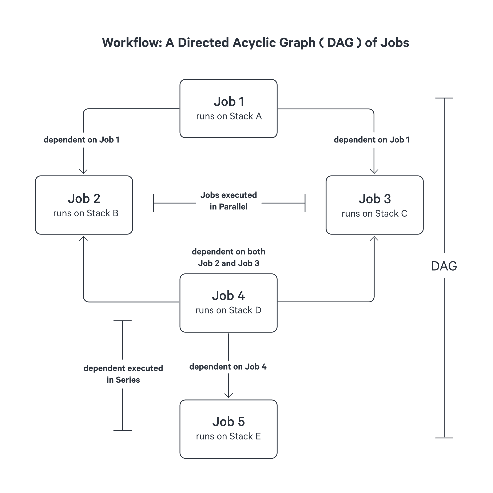
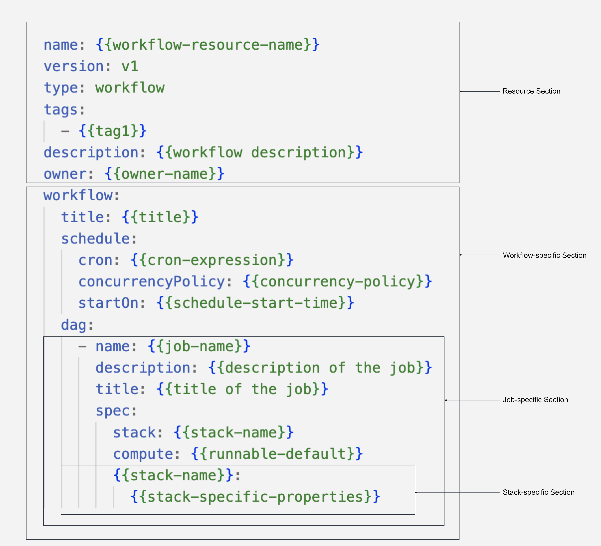

# Workflow

The Workflow resource in DataOS serves as a fundamental building block for orchestrating data processing tasks with dependencies. It enables the creation of complex data workflows by defining a hierarchy based on a dependency mechanism.

## Workflows and Directed Acyclic Graphs (DAGs)

In DataOS, a Workflow represents a directed acyclic graph (DAG), where jobs are represented as nodes, and dependencies between jobs are represented as directed edges. The DAG structure provides a visual representation of the sequence and interdependencies of jobs within a Workflow. This facilitates efficient job execution by enabling parallel and sequential processing based on job dependencies.

Within a workflow, a job encompasses a series of processing tasks, each executed within its dedicated Kubernetes pod. This architectural design ensures that the computational workload of one job does not hinder the performance of others, effectively avoiding bottlenecks.

Furthermore, every job within a Directed Acyclic Graph (DAG) is associated with a specific Stack. A Stack serves as an extension point within a job, offering users the ability to leverage different programming paradigms based on their specific requirements. For instance, if your objective involves data transformation, ingestion, or syndication, utilizing the Flare stack is recommended. DataOS provides a diverse range of pre-built stacks, including Flare, Scanner, Alpha, and more, enabling developers to seamlessly adopt various programming environments to suit their needs.

<i>Diagrammatic representation of a workflow</i>

In the depicted example, **Job 1** is the first job to be executed as it has no dependencies. Once **Job 1** completes, both **Job 2** and **Job 3** can run concurrently or parallely. Only after the successful completion of both **Job 2** and **Job 3**, **Job 4** becomes eligible for execution. Finally, **Job 5** can be executed after **Job 4** successfully finishes. This hierarchical structure ensures optimal job execution without creating bottlenecks.

It is important to note that a Directed Acyclic Graph may have multiple root nodes, which means that a Workflow can contain both jobs and other workflows stored in different locations. This feature allows for the decomposition of complex workflows into manageable components. For more information on this scenario, refer to [Executing Multiple Workflow from a Single One.](./workflow/executing_multiple_workflow_yamls_from_single_one.md)

## Types of Workflows

Workflows in DataOS can be categorized as either single-time run or schedulable workflows.

### **Single-time run Workflows**

Single-time run workflows represent a one-time execution of a sequence of jobs. These workflows do not include scheduling capabilities and rely solely on the defined DAG structure and job dependencies.

### **Schedulable workflows** 
Schedulable Workflows enable the automated and recurring execution of jobs based on specified intervals or predetermined times. To schedule a workflow, the `schedule` section must be added, allowing the configuration of scheduling parameters. Scheduled workflows provide a powerful mechanism for automating job execution based on a cron expression. To explore case scenarios for scheduled workflows, refer to the [Scheduled or Cron Workflow](./workflow/scheduled_or_cron_workflow.md)

## Syntax of a workflow

The Workflow resource is defined using a YAML configuration file. The following example illustrates the syntax for defining a single-time run workflow:

<i>
YAML Syntax of a Workflow Resource</i>

In this syntax, each job within the DAG is defined with a unique name, specifications, stack configuration, compute settings, and any stack-specific configurations. Job dependencies are specified to ensure the correct execution order.

For a comprehensive reference of available fields and their configurations, please consult the [Workflow YAML Field Reference](./workflow/workflow_yaml_field_reference.md)

## Creating a Workflow
As you've familiarized yourself with the fundamentals of Workflow syntax, it's time to delve deeper into coding, and craft your initial workflow. To begin your journey, please refer to the following guide by clicking on the link provided [here.](./workflow/creating_a_workflow.md)

## Workflow YAML Field Configuration

The below table summarizes various properties within a Workflow YAML

| Field | Data Type | Default Value | Possible Value | Requirement |
| --- | --- | --- | --- | --- |
| `workflow` | object | None | None | Mandatory |
| `schedule` | object | None | None | Optional**  |
| `cron` | string | None | Any valid cron expression. | Optional**  |
| `concurrencyPolicy` | string | Allow | Allow/Forbid/Replace | Optional |
| `startOn` | string | None | Any time provided in ISO 8601 format. | Optional |
| `endOn` | string | None | Any time provided in ISO 8601 format. | Optional |
| `completeOn` | string | None | Any time provided in ISO 8601 format. | Optional |
| `title` | string | None | Any valid string | Optional |
| `name` | string | None | Any string confirming the regex   [a-z0-9]\([-a-z0-9]*[a-z0-9]) and length less than or equal to 48 | Mandatory |
| `title` | string | None | Any string | Optional |
| `description` | string | None | Any string | Optional |
| `spec` | object | None | None | Mandatory |
| `runAsUser` | string | None | UserID of the Use Case  Assignee | Optional |
| `compute` | string | None | runnable-default or any   other custom compute resource | Mandatory |
| `stack` | string | None | flare/toolbox/scanner/ alpha | Mandatory |
| `retry` | object | None | None | Optional |
| `count` | integer | None | Any positive integer | Optional |
| `strategy` | string | None | Always/OnFailure/ OnError/OnTransientError | Optional |
| `dependency` | string | None | Any job name within the workflow | Optional |

<i>Optional**:</i> Fields optional for single-run workflows, but Mandatory for Scheduled workflows.

To know more about the various fields, click [here.](./workflow/workflow_yaml_field_reference.md)

<aside style="background-color:#FFE5CC; padding:15px; border-radius:5px;">
📖 <i>Best Practice:</i> It is part of the best practice to add relevant `description` and `tags` for your workflow. While `description` helps to determine what the workflow will help you accomplish, `tags` can help in faster searching in Metis and Operations.
</aside>

## Case Scenarios

To deepen your understanding and expand your knowledge of Workflows, explore the following case scenarios that cover different aspects and functionalities:

- [Implementing Single Run Workflow](./workflow/single_run_workflow.md)

- [Scheduled or Cron Workflow](./workflow/scheduled_or_cron_workflow.md)

- [Executing Multiple Workflow YAMLs from a Single One](./workflow/executing_multiple_workflow_yamls_from_single_one.md)

