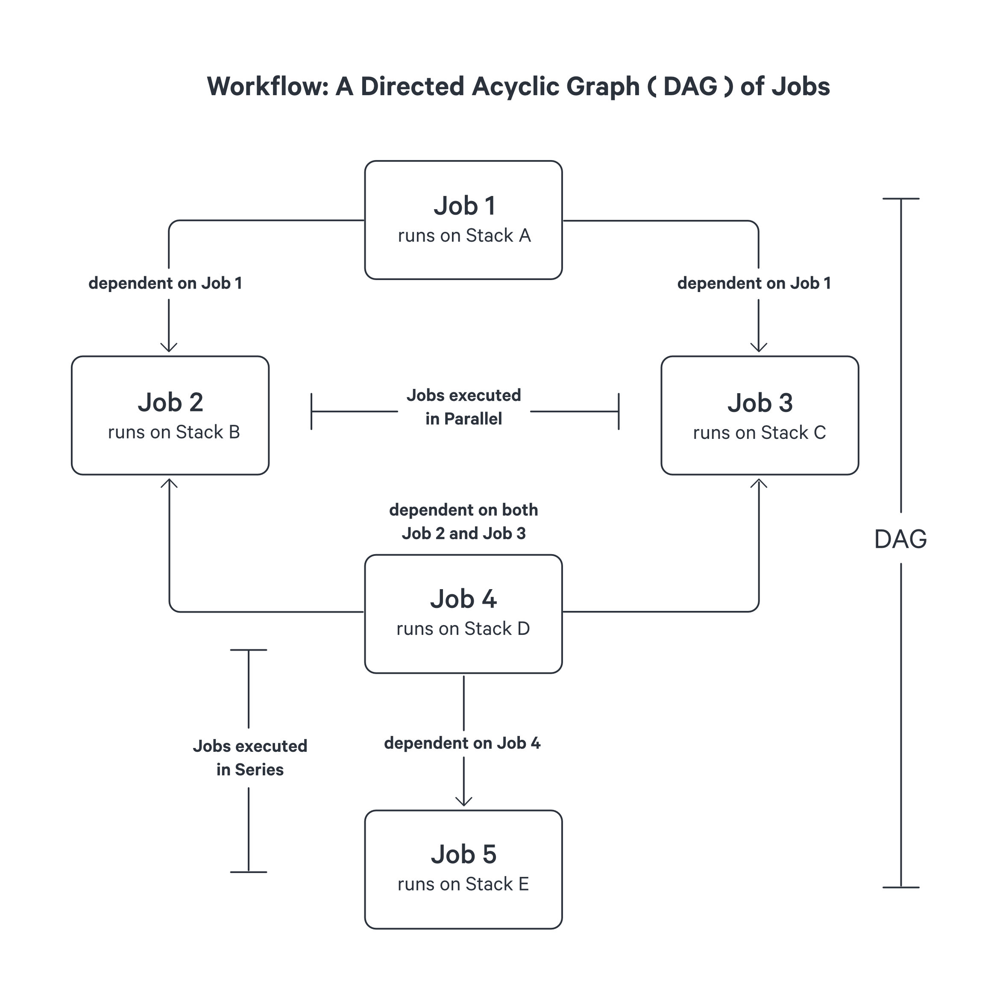
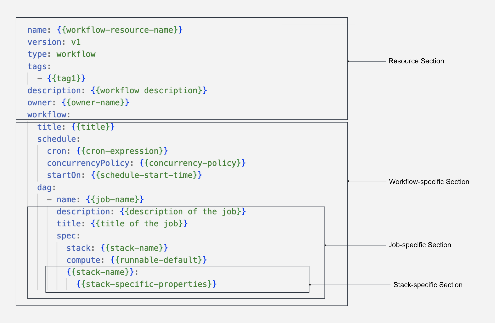

# Workflow

The Workflow in DataOS serves as a fundamental [Resource](../resources.md) for orchestrating data processing tasks with dependencies. It enables the creation of complex data workflows by defining a hierarchy based on a dependency mechanism.

## Workflows and Directed Acyclic Graphs (DAGs)

In DataOS, a Workflow represents a **Directed Acyclic Graph (DAG)**, where jobs are represented as nodes, and dependencies between jobs are represented as directed edges. The DAG structure provides a visual representation of the sequence and interdependencies of jobs within a Workflow. This facilitates efficient job execution by enabling parallel and sequential processing based on job dependencies.

Within a Workflow, a **job** encompasses a series of processing tasks, each executed within its dedicated Kubernetes Pod. This architectural design ensures that the computational workload of one job does not hinder the performance of others, effectively avoiding bottlenecks.

Furthermore, every job within a Directed Acyclic Graph (DAG) is associated with a specific [Stack](./stacks.md). A Stack serves as an extension point within a job, offering users the ability to leverage different programming paradigms based on their specific requirements. For instance, if your objective involves data transformation, ingestion, or syndication, utilizing the [Flare](./stacks/flare.md) Stack is recommended. DataOS provides a diverse range of pre-built stacks, including [Flare](./stacks/flare.md), [Scanner](./stacks/scanner.md), [Alpha](./stacks/alpha.md), and more, enabling developers to seamlessly adopt various programming environments to suit their needs.




<center><i>Illustration of Workflow Resource</i></center>

In the depicted example, **Job 1** is the first job to be executed as it has no dependencies. Once **Job 1** completes, both **Job 2** and **Job 3** can run concurrently or parallely. Only after the successful completion of both **Job 2** and **Job 3**, **Job 4** becomes eligible for execution. Finally, **Job 5** can be executed after **Job 4** successfully finishes. This hierarchical structure ensures optimal job execution without creating bottlenecks.

It is important to note that a Directed Acyclic Graph may have multiple root nodes, which means that a Workflow can contain both jobs and other Workflows stored in different locations. This feature allows for the decomposition of complex workflows into manageable components. For more information on this scenario, refer to [Orchestrating Multiple Workflows from a Single Workflow](./workflow/orchestrating_multiple_workflows_from_a_single_workflow.md)


## Types of Workflows

Workflows in DataOS can be categorized as either [single-time run](#single-time-run-workflows) or [scheduled workflows](#scheduled-workflows).

### **Single-time run Workflows**

Single-time run Workflows represent a one-time execution of a sequence of jobs. These workflows do not include scheduling attributes and rely solely on the defined DAG structure and job dependencies.

### **Scheduled Workflows** 
Scheduled Workflows enable the automated and recurring execution of jobs based on specified intervals or predetermined times. To schedule a Workflow, the `schedule` section must be added to the Workflow YAML configuration, allowing the configuration of scheduling attributes. Scheduled Workflows provide a powerful mechanism for automating job execution based on a cron expression. To explore case scenarios for scheduled workflows, refer to the [Scheduled or Cron Workflow](./workflow/scheduled_or_cron_workflow.md)

## Structure of a Workflow YAML

The Workflow Resource is defined using a YAML configuration file. The following example illustrates the structure for defining a single-time run workflow:



<center><i>Workflow Resource YAML configuration structure</i></center>

In the above YAML, each job within the DAG is defined with a unique name, specifications, Stack configuration, Compute settings, and any Stack-specific configurations. Job dependencies are specified to ensure the correct execution order.

For a comprehensive reference of various attributes and their configurations, please consult the [Attributes in Workflow YAML configuration](./workflow/workflow_yaml_attributes_configuration.md)

## How to Create a Workflow?

To create a Workflow Resource, you need to configure the YAML file with the appropriate attributes. The following sections explain the necessary configurations.

### **Workflow YAML Configuration**

#### **Configuring the Resource Section**

A Workflow is a type of Resource in DataOS.The Resource section of the YAML configuration file consists of attributes that are common across all Resource-types. The following YAML snippet demonstrates the key-value properties that need to be declared in this section:

```yaml
name: {{my-workflow}}
version: v1 
type: workflow 
tags: 
  - {{dataos:type:resource}}
  - {{dataos:type:workspace-resource}}
  - {{dataos:resource:workflow}}
description: {{This is a sample workflow YAML configuration}}
owner: {{iamgroot}}
```
<center><i>Resource section configuration</i></center>

For detailed customization options and additional attributes within the Resource section, refer to the [Attributes in Resource YAML configuration](../resources.md#configuration-of-resources).

#### **Configuring the Workflow-specific Section**

The Workflow-specific section contains configurations specific to the Workflow Resource. DataOS supports two types of workflows: scheduled and single-run workflows, each with its own YAML syntax.

**Scheduled Workflow**

A [Scheduled Workflow](#scheduled-workflows) triggers a series of jobs or tasks at particular intervals or predetermined times. To create a scheduled workflow, specify the scheduling [attributes](./workflow/workflow_yaml_attributes_configuration.md#schedule) in the schedule section:
```yaml
workflow:
  schedule:
    cron: {{'/10 * * * *'}}
  dag:
    {{collection-of-jobs}}
```
<center><i>Scheduled Workflow configuration</i></center>

**Single-Run Workflow**

A Single-run Workflow executes only once. A Workflow without a schedule section is considered a single-run workflow. The YAML syntax for a single-run workflow is as follows:
```yaml
workflow:
  dag:
    {{collection-of-jobs}}
```
<center><i>Single-run Workflow configuration</i></center>

Choose the appropriate workflow type based on your requirements. The below table summarizes various attributes within the Workflow-specific section.

<center>

| Attribute | Data Type | Default Value | Possible Value | Requirement |
| --- | --- | --- | --- | --- |
| [`workflow`](./workflow/workflow_yaml_attributes_configuration.md#workflow) | object | none | none | mandatory |
| [`schedule`](./workflow/workflow_yaml_attributes_configuration.md#schedule) | object | none | none | optional**  |
| [`cron`](./workflow/workflow_yaml_attributes_configuration.md#cron) | string | none | any valid cron expression. | optional**  |
| [`concurrencyPolicy`](./workflow/workflow_yaml_attributes_configuration.md#concurrencypolicy) | string | Allow | Allow/Forbid/Replace | optional |
| [`startOn`](./workflow/workflow_yaml_attributes_configuration.md#starton) | string | none | any time provided in ISO 8601 format. | optional |
| [`endOn`](./workflow/workflow_yaml_attributes_configuration.md#endon) | string | none | any time provided in ISO 8601 format. | optional |
| [`completeOn`](./workflow/workflow_yaml_attributes_configuration.md#completeon) | string | none | any time provided in ISO 8601 format. | optional |
| [`title`](./workflow/workflow_yaml_attributes_configuration.md#title) | string | none | any valid string | optional |

</center>

<i>optional**:</i> Fields optional for single-run workflows, but mandatory for Scheduled workflows.

For additional details about the attributes within the Workflow-specific section, refer to the link: [Attributes of Workflow-specific section](./workflow/workflow_yaml_attributes_configuration.md#workflow)

#### **Configuring the Job-specific Section**

A Directed Acyclic Graph (DAG) represents the sequence and dependencies between various jobs within the Workflow. A DAG must contain at least one job.

**Job**

A Job denotes a single processing task. Multiple jobs within a DAG can be linked sequentially or concurrently to achieve a specific result through `dependencies`. Here is an example YAML syntax for two jobs linked by dependencies:
```yaml
  dag: 
    - name: {{job1-name}}
      spec: 
        stack: {{stack1:version}}
        compute: {{compute-name}}
        stack1: 
          {{stack1-specific-configuration}}
    - name: {{job2-name}}
      spec: 
        stack: {{stack2:version}}
        compute: {{compute-name}}
        stack2: 
          {{stack2-specific-configuration}}
      dependencies: 
       - {{job1-name}}
```
<center><i>Job-specific section YAML Configuration</i></center>

<aside class=callout>

🗣️ Please be aware that the code block above outlines only the general configuration for a job. The actual attributes and configuration may differ based on the specific <a href="./stacks.md">Stack</a> utilized.

</aside>

The below table summarizes various attributes within the Job-specific section.

<center>

| Attribute | Data Type | Default Value | Possible Value | Requirement |
| --- | --- | --- | --- | --- |
| [`name`](./workflow/workflow_yaml_attributes_configuration.md#name) | string | none | any string confirming the regex <br> [a-z0-9]\([-a-z0-9]*[a-z0-9]) and length<br>less than or equal to 48 | mandatory |
| [`title`](./workflow/workflow_yaml_attributes_configuration.md#title) | string | none | any string | optional |
| [`description`](./workflow/workflow_yaml_attributes_configuration.md#description) | string | none | any string | optional |
| [`spec`](./workflow/workflow_yaml_attributes_configuration.md#spec) | object | none | none | mandatory |
| [`runAsUser`](./workflow/workflow_yaml_attributes_configuration.md#runasuser) | string | none | userID of the Use Case <br>Assignee | optional |
| [`compute`](./workflow/workflow_yaml_attributes_configuration.md#compute) | string | none | runnable-default or any <br> other custom Compute Resource | mandatory |
| [`stack`](./workflow/workflow_yaml_attributes_configuration.md#stack) | string | none | flare/toolbox/scanner/<br>alpha | mandatory |
| [`retry`](./workflow/workflow_yaml_attributes_configuration.md#retry) | object | none | none | optional |
| [`count`](./workflow/workflow_yaml_attributes_configuration.md#count) | integer | none | any positive integer | optional |
| [`strategy`](./workflow/workflow_yaml_attributes_configuration.md#strategy) | string | none | Always/OnFailure/<br>OnError/OnTransientError | optional |
| [`dependency`](./workflow/workflow_yaml_attributes_configuration.md#dependency) | string | none | any job name within the workflow | optional |

</center>

For additional configuration attributes within the Job-specific section, refer to the [Attributes in Job-specific section YAML configuration.](./workflow/workflow_yaml_attributes_configuration.md#name)

#### **Configuring the Stack-specific Section**

The Stack-specific Section allows you to specify the desired [Stack](./stacks.md) for executing your Workflow. Depending on your requirements, you can choose from the following supported Stacks:

- [Flare Stack](./stacks/flare.md): The Flare stack provides advanced capabilities for data processing and analysis.

- [Alpha Stack](./stacks/alpha.md): The Alpha stack offers a powerful environment for hosting web-application, and custom Docker images atop DataOS.

- [Data Toolbox Stack](./stacks/data_toolbox.md): The Data Toolbox stack provides a comprehensive set of tools and utilities for data manipulation and transformation.

- [Scanner Stack](./stacks/scanner.md): The Scanner Stack provides metadata ingestion capabilities from a source.

To configure the Stack-specific Section, refer to the appropriate Stack documentation for detailed instructions on setting up and customizing the Stack according to your needs. Each Stack has its unique attributes that can enhance the functionality of your Workflow.


<details>
<summary>
Click here to view a sample Workflow
</summary>
The sample Workflow ingests product data from the <code>thirdparty01</code> depot and store it in the icebase Depot. This Workflow leverages the Flare Stack to efficiently execute the necessary data ingestion tasks. The provided YAML code snippet outlines the configuration and specifications of this Workflow.

```yaml
# Resource Section
version: v1
name: cnt-product-demo-01
type: workflow
tags:
- Connect
- Product
description: The workflow ingests product data from dropzone into raw zone

# Workflow-specific Section (Single-run)
workflow:
  title: Connect Product
  dag: # DAG of Jobs
  - name: product-01
    title: Product Dimension Ingester
    description: The job ingests product data from dropzone into raw zone
    spec:
      tags:
      - Connect
      - Product
      stack: flare:3.0
      compute: runnable-default
      envs:
        FLARE_AUDIT_MODE: LOG
# Stack-specific Section (Flare)
      flare:
        job:
          explain: true
          inputs:
           - name: product_connect
             dataset: dataos://thirdparty01:none/product
             format: csv
             schemaPath: dataos://thirdparty01:none/schemas/avsc/product.avsc
          logLevel: INFO
          outputs:
            - name: products
              dataset: dataos://icebase:retail/product?acl=rw
              format: Iceberg
              description: Customer data ingested from external csv
              options:
                saveMode: append
                sort:
                  mode: partition
                  columns:
                    - name: version
                      order: desc                            
                iceberg:
                  properties:
                    write.format.default: parquet
                    write.metadata.compression-codec: gzip
                  partitionSpec:
                    - type: identity
                      column: version
              tags:
                - Connect
                - Product
              title: Product Source Data
          steps:
          - sequence:
              - name: products
                doc: Pick all columns from products and add version as yyyyMMddHHmm formatted
                  timestamp.
                sql: SELECT *, date_format(now(), 'yyyyMMddHHmm') as version, now() as
                  ts_product FROM product_connect LIMIT 10
```
</details>


### **Applying the Workflow YAML**

Once you have constructed the Workflow YAML file, it's time to apply it and create the Workflow Resource within the DataOS environment. Use the following `apply` command:

```shell
dataos-ctl apply -f {{yaml-file-path}} -w {{workspace}}
```

**Create Your Workspace (Optional)**

This optional step allows you to create a new Workspace for specific workflows. By default, you can always run your workflows in the `public` Workspace. To create a new Workspace, execute the following command:

```shell
dataos-ctl workspace create -n {{name of your workspace}}
```

### **How to Monitor a Workflow?**

#### **Get Status of the Workflow**

To retrieve information about the Workflow, use the `get` command in the CLI. This command lists the workflows created by you. To check this information for all users, add the `-a` flag to the command.

Command:

```shell
dataos-ctl -t workflow -w public get
```

Output:

```shell
INFO[0000] 🔍 get...
INFO[0001] 🔍 get...complete

        NAME        | VERSION |   TYPE   | WORKSPACE | STATUS | RUNTIME |   OWNER
--------------------|---------|----------|-----------|--------|---------|-------------
  cnt-product-demo-01 | v1      | workflow | public    | active | running |   tmdc
```

To view workflows created by everyone:

```shell
dataos-ctl -t workflow -w public get -a
```

Output:

```shell
INFO[0000] 🔍 get...
INFO[0001] 🔍 get...complete

                 NAME                | VERSION |   TYPE   | WORKSPACE | STATUS |  RUNTIME  |       OWNER
-------------------------------------|---------|----------|-----------|--------|-----------|--------------------
  checks-sports-data                 | v1      | workflow | public    | active | succeeded | user01
  cnt-product-demo-01                  | v1      | workflow | public    | active | running   | tmdc
  cnt-product-demo-01-01               | v1      | workflow | public    | active | succeeded | otheruser
  cnt-city-demo-01001                | v1      | workflow | public    | active | succeeded | user03
```

#### **Get Runtime Information**

To obtain the runtime status of the Workflow, use the following command:

```shell
dataos-ctl get runtime -w {{workspace-name}} -t workflow -n {{name-of-workflow}}
```

Example:

```shell
dataos-ctl get runtime -w public -t workflow -n cnt-product-demo-01
```

Alternatively, you can extract the Workflow information from the output of the `get` command and pass it as a string to the runtime command. Look for the relevant information (highlighted) in the `get` command output:

```shell
dataos-ctl -t workflow -w public get
# the output is shown below
        NAME        | VERSION |   TYPE   | WORKSPACE | STATUS | RUNTIME |   OWNER     
--------------------|---------|----------|-----------|--------|---------|-------------
  <b>cnt-product-demo-01 | v1      | workflow | public</b>    | active | running |   tmdc
```

Select from Name to Workspace, for example `cnt-product-demo-01 | v1 | workflow | public`.

```shell
dataos-ctl -i " cnt-product-demo-01 | v1      | workflow | public" get runtime
```

<details>

<summary>Output</summary>

```shell
INFO[0000] 🔍 workflow...
INFO[0001] 🔍 workflow...complete

        NAME        | VERSION |   TYPE   | WORKSPACE |    TITLE     |   OWNER
--------------------|---------|----------|-----------|--------------|-------------
  cnt-product-demo-01 | v1      | workflow | public    | Connect City |   tmdc

  JOB NAME |   STACK    |        JOB TITLE        | JOB DEPENDENCIES
-----------|------------|-------------------------|-------------------
  city-001 | flare:3.0  | City Dimension Ingester |                   
  system   | dataos_cli | System Runnable Steps   |                   

  RUNTIME | PROGRESS |          STARTED          |         FINISHED
----------|----------|---------------------------|----------------------------
  failed  | 6/6      | 2022-06-24T17:11:55+05:30 | 2022-06-24T17:13:23+05:30

                NODE NAME              | JOB NAME |             POD NAME              |     TYPE     |       CONTAINERS        |   PHASE
--------------------------------------|----------|-----------------------------------|--------------|-------------------------|------------
  city-001-bubble-failure-rnnbl       | city-001 | cnt-product-demo-01-c5dq-2803083439 | pod-workflow | wait,main               | failed
  city-001-c5dq-0624114155-driver     | city-001 | city-001-c5dq-0624114155-driver   | pod-flare    | spark-kubernetes-driver | failed
  city-001-execute                    | city-001 | cnt-product-demo-01-c5dq-3254930726 | pod-workflow | main                    | failed
  city-001-failure-rnnbl              | city-001 | cnt-product-demo-01-c5dq-3875756933 | pod-workflow | wait,main               | succeeded
  city-001-start-rnnbl                | city-001 | cnt-product-demo-01-c5dq-843482008  | pod-workflow | wait,main               | succeeded
  cnt-product-demo-01-run-failure-rnnbl | system   | cnt-product-demo-01-c5dq-620000540  | pod-workflow | wait,main               | succeeded
  cnt-product-demo-01-start-rnnbl       | system   | cnt-product-demo-01-c5dq-169925113  | pod-workflow | wait,main               | succeeded
```
</details>

#### **Get Runtime Refresh**

To see updates on the Workflow progress, execute the following command:

```shell
dataos-ctl -i " cnt-product-demo-01 | v1     | workflow | public" get runtime -r
```

Press `Ctrl + C` to exit.

### **Troubleshooting Workflow Errors**

#### **Check Logs for Errors**

To check the logs for errors, use the following command. Retrieve the node name from the output of the `get runtime` command for the failed node.

Command:

```shell
dataos-ctl -i "{{copy the name-to-workspace in the output table from get command}}" --node {{failed-node-name-from-get-runtime-command}} log
```

Example:

```shell
dataos-ctl -i " cnt-product-demo-01 | v1 | workflow | public" --node city-001-c5dq-0624114155-driver log
```

<details>
<summary>Output</summary>
    
```bash
INFO[0000] 📃 log(public)...                             
INFO[0001] 📃 log(public)...complete                     

              NODE NAME            |     CONTAINER NAME      | ERROR  
----------------------------------|-------------------------|--------
  city-001-c5dq-0624114155-driver | spark-kubernetes-driver |        

-------------------LOGS-------------------
++ id -u
+ myuid=0
++ id -g
+ mygid=0
+ set +e
++ getent passwd 0
+ uidentry=root:x:0:0:root:/root:/bin/bash
+ set -e
+ '[' -z root:x:0:0:root:/root:/bin/bash ']'
+ SPARK_CLASSPATH=':/opt/spark/jars/*'
+ env
+ grep SPARK_JAVA_OPT_
+ sort -t_ -k4 -n
+ sed 's/[^=]*=\(.*\)/\1/g'
+ readarray -t SPARK_EXECUTOR_JAVA_OPTS
+ '[' -n '' ']'
+ '[' -z ']'
+ '[' -z ']'
+ '[' -n '' ']'
+ '[' -z ']'
+ '[' -z x ']'
+ SPARK_CLASSPATH='/opt/spark/conf::/opt/spark/jars/*'
+ case "$1" in
+ shift 1
+ CMD=("$SPARK_HOME/bin/spark-submit" --conf "spark.driver.bindAddress=$SPARK_DRIVER_BIND_ADDRESS" --deploy-mode client "$@")
+ exec /usr/bin/tini -s -- /opt/spark/bin/spark-submit --conf spark.driver.bindAddress=10.212.6.129 --deploy-mode client --properties-file /opt/spark/conf/spark.properties --class io.dataos.flare.Flare local:///opt/spark/jars/flare.jar -c /etc/dataos/config/jobconfig.yaml
2022-06-24 11:42:37,146 WARN  [main] o.a.h.u.NativeCodeLoader: Unable to load native-hadoop library for your platform... using builtin-java classes where applicable
build version: 5.9.16-dev; workspace name: public; workflow name: cnt-city-demo-001; workflow run id: 761eea3b-693b-4863-a83d-9382aa078ad1; run as user: mebinmoncy; job name: city-001; job run id: 03b60c0e-ea75-4d08-84e1-cd0ff2138a4e; 
found configuration: Map(explain -> true, appName -> city-001, outputs -> List(Map(depot -> dataos://icebase:retailsample?acl=rw, name -> output01)), inputs -> List(Map(dataset -> dataos://thirdparty01:none/city, format -> csv, name -> city_connect, schemaPath -> dataos://thirdparty01:none/schemas/avsc/city.avsc)), steps -> List(/etc/dataos/config/step-0.yaml), logLevel -> INFO)
22/06/24 11:42:41 INFO Flare$: context is io.dataos.flare.contexts.ProcessingContext@49f40c00
22/06/24 11:42:41 ERROR Flare$: =>Flare: Job finished with error build version: 5.9.16-dev; workspace name: public; workflow name: cnt-city-demo-001; workflow run id: 761eea3b-693b-4863-a83d-9382aa078ad1; run as user: mebinmoncy; job name: city-001; job run id: 03b60c0e-ea75-4d08-84e1-cd0ff2138a4e; 
io.dataos.flare.exceptions.FlareInvalidConfigException: Could not alter output datasets for workspace: public, job: city-001. There is an existing job with same workspace: public and name: city-001 writing into below datasets
  1. dataos://aswathama:retail/city
  You should use a different job name for your job as you cannot change output datasets for any job.
        at io.dataos.flare.configurations.mapper.StepConfigMapper$.$anonfun$validateSinkWithPreviousJob$3(StepConfigMapper.scala:180)
        at io.dataos.flare.configurations.mapper.StepConfigMapper$.$anonfun$validateSinkWithPreviousJob$3$adapted(StepConfigMapper.scala:178)
        at scala.collection.immutable.List.foreach(List.scala:431)
        at scala.collection.generic.TraversableForwarder.foreach(TraversableForwarder.scala:38)
        at scala.collection.generic.TraversableForwarder.foreach$(TraversableForwarder.scala:38)
        at scala.collection.mutable.ListBuffer.foreach(ListBuffer.scala:47)
        at io.dataos.flare.configurations.mapper.StepConfigMapper$.validateSinkWithPreviousJob(StepConfigMapper.scala:178)
        at io.dataos.flare.configurations.mapper.StepConfigMapper$.validate(StepConfigMapper.scala:38)
        at io.dataos.flare.contexts.ProcessingContext.setup(ProcessingContext.scala:37)
        at io.dataos.flare.Flare$.main(Flare.scala:61)
        at io.dataos.flare.Flare.main(Flare.scala)
        at sun.reflect.NativeMethodAccessorImpl.invoke0(Native Method)
        at sun.reflect.NativeMethodAccessorImpl.invoke(NativeMethodAccessorImpl.java:62)
        at sun.reflect.DelegatingMethodAccessorImpl.invoke(DelegatingMethodAccessorImpl.java:43)
        at java.lang.reflect.Method.invoke(Method.java:498)
        at org.apache.spark.deploy.JavaMainApplication.start(SparkApplication.scala:52)
        at org.apache.spark.deploy.SparkSubmit.org$apache$spark$deploy$SparkSubmit$$runMain(SparkSubmit.scala:958)
        at org.apache.spark.deploy.SparkSubmit.doRunMain$1(SparkSubmit.scala:183)
        at org.apache.spark.deploy.SparkSubmit.submit(SparkSubmit.scala:206)
        at org.apache.spark.deploy.SparkSubmit.doSubmit(SparkSubmit.scala:90)
        at org.apache.spark.deploy.SparkSubmit$$anon$2.doSubmit(SparkSubmit.scala:1046)
        at org.apache.spark.deploy.SparkSubmit$.main(SparkSubmit.scala:1055)
        at org.apache.spark.deploy.SparkSubmit.main(SparkSubmit.scala)

Exception in thread "main" io.dataos.flare.exceptions.FlareInvalidConfigException: Could not alter output datasets for workspace: public, job: city-001. There is an existing job with same workspace: public and name: city-001 writing into below datasets
  1. dataos://aswathama:retail/city
  You should use a different job name for your job as you cannot change output datasets for any job.
    
22/06/24 11:42:42 INFO Flare$: Gracefully stopping Spark Application
22/06/24 11:42:42 **ERROR** ProcessingContext: =>Flare: Job finished with error=Could not alter output datasets for workspace: public, job: city-001. **There is an existing job with same workspace**: public and name: city-001 writing into below datasets
  1. dataos://aswathama:retail/city
  **You should use a different job name for your job as you cannot change output datasets for any job.**
Exception in thread "shutdownHook1" io.dataos.flare.exceptions.FlareException: Could not alter output datasets for workspace: public, job: city-001. There is an existing job with same workspace: public and name: city-001 writing into below datasets
  1. dataos://aswathama:retail/city
  You should use a different job name for your job as you cannot change output datasets for any job.
        at io.dataos.flare.contexts.ProcessingContext.error(ProcessingContext.scala:87)
        at io.dataos.flare.Flare$.$anonfun$addShutdownHook$1(Flare.scala:84)
        at scala.sys.ShutdownHookThread$$anon$1.run(ShutdownHookThread.scala:37)
2022-06-24 11:42:42,456 INFO  [shutdown-hook-0] o.a.s.u.ShutdownHookManager: Shutdown hook called
2022-06-24 11:42:42,457 INFO  [shutdown-hook-0] o.a.s.u.ShutdownHookManager: Deleting directory /tmp/spark-bb4892c9-0236-4569-97c7-0b610e82ff52
```
</details>

You will notice an error message: "*There is an existing job with the same workspace. You should use a different job name for your job as you cannot change output datasets for any job.*"

#### **Fix the Errors**

Modify the YAML configuration by changing the name of the Workflow. For example, rename it from `cnt-product-demo-01` to `cnt-city-demo-999`.

#### **Delete the Workflows**

Before re-running the Workflow, delete the previous version from the environment. There are two ways to delete the Workflow as shown below.

**Method 1:** Copy the name-to-workspace from the output table of the `get` command and use it as a string in the delete command.

Command

```shell
dataos-ctl -i "{{name-to-workspace in the output table from get status command}}" delete
```

Example:

```shell
dataos-ctl -i " cnt-product-demo-01 | v1 | workflow | public" delete
```

Output:

```shell
INFO[0000] 🗑 delete...
INFO[0001] 🗑 deleting(public) cnt-product-demo-01:v1:workflow...
INFO[0003] 🗑 deleting(public) cnt-product-demo-01:v1:workflow...deleted
INFO[0003] 🗑 delete...complete
```

**Method 2:** Specify the path of the YAML file and use the `delete` command.

Command:

```shell
dataos-ctl delete -f {{file-path}}
```

Example:

```shell
dataos-ctl delete -f /home/desktop/flare/connect-city/config_v2beta1.yaml
```

Output:

```shell
INFO[0000] 🗑 delete...
INFO[0000] 🗑 deleting(public) cnt-city-demo-010:v1:workflow...
INFO[0001] 🗑 deleting(public) cnt-city-demo-010:v1:workflow...deleted
INFO[0001] 🗑 delete...complete
```

**Method 3:** Specify the Workspace, Workflow-type, and Workflow name in the `delete` command.

Command:

```shell
dataos-ctl -w {{workspace}} -t workflow -n {{workflow-name}} delete
```

Example:

```shell
dataos-ctl -w public -t workflow -n cnt-product-demo-01 delete
```

Output:

```shell
INFO[0000] 🗑 delete...
INFO[0000] 🗑 deleting(public) cnt-city-demo-010:v1:workflow...
INFO[0001] 🗑 deleting(public) cnt-city-demo-010:v1:workflow...deleted
INFO[0001] 🗑 delete...complete
```

#### **Rerun the Workflow**

Run the Workflow again using the `apply` command. Check the runtime for its success. Scroll to the right to see the status, as shown in the previous steps.

Command:

```shell
dataos-ctl -i "{{copy the name-to-workspace in the output table from get status command}}" get runtime -r
```

Example:

```shell
dataos-ctl -i " cnt-city-demo-999 | v1 | workflow | public" get runtime -r
```

Output:

```shell
INFO[0000] 🔍 workflow...
INFO[0002] 🔍 workflow...complete

        NAME        | VERSION |   TYPE   | WORKSPACE |    TITLE     |   OWNER
--------------------|---------|----------|-----------|--------------|-------------
  cnt-city-demo-999 | v1 | workflow | public    | Connect City | mebinmoncy

  JOB NAME |   STACK    |        JOB TITLE        | JOB DEPENDENCIES
-----------|------------|-------------------------|-------------------
  city-999 | flare:2.0  | City Dimension Ingester |                   
  system   | dataos_cli | System Runnable Steps   |                   

    RUNTIME  | PROGRESS |          STARTED          |         FINISHED
------------|----------|---------------------------|----------------------------
  succeeded | 5/5      | 2022-06-24T17:29:37+05:30 | 2022-06-24T17:31:50+05:30

                NODE NAME              | JOB NAME |             POD NAME              |     TYPE     |       CONTAINERS        |   PHASE
--------------------------------------|----------|-----------------------------------|--------------|-------------------------|------------
  city-999-execute                    | city-999 | cnt-city-demo-999-lork-1125088085 | pod-workflow | main                    | succeeded
  city-999-lork-0624115937-driver     | city-999 | city-999-lork-0624115937-driver   | pod-flare    | spark-kubernetes-driver | completed
  city-999-start-rnnbl                | city-999 | cnt-city-demo-999-lork-1790287599 | pod-workflow | wait,main               | succeeded
  city-999-success-rnnbl              | city-999 | cnt-city-demo-999-lork-2939697963 | pod-workflow | wait,main               | succeeded
  cnt-city-demo-999-run-success-rnnbl | system   | cnt-city-demo-999-lork-2544494600 | pod-workflow | wait,main               | succeeded
  cnt-city-demo-999-start-rnnbl       | system   | cnt-city-demo-999-lork-2374735668 | pod-workflow | wait,main               | succeeded
```

Make sure to replace `{{name-to-workspace in the output table from get status command}}` and `{{file-path}}` with the actual values according to your Workflow.

</details>


<aside class="best-practice">

📖 <i>Best Practice:</i><br> It is part of the best practice to add relevant <code>description</code>, <code>title</code> and <code>tags</code> for your Workflow. <code>description</code> helps to determine what the workflow will help you accomplish, <code>title</code> and <code>tags</code> can help in faster searching in Metis and Operations.
</aside>

## How to setup alerts on Workflows?

Workflow alerts play a vital role in the effective management of extensive Workflows and Jobs, enabling streamlined monitoring and prompt notifications in the event of failures. For detailed instructions on configuring Workflow alerts, refer to the documentation link: [Setting Up Workflow Alerts](../dataos_alerts/workflow_alerts.md)


## Case Scenarios

To deepen your understanding and expand your knowledge of Workflows, explore the following case scenarios that cover different aspects and functionalities:

- [How to implement Single-run Workflow?](./workflow/single_run_workflow.md)

- [How to run a Cron Workflow or a Scheduled Workflow?](./workflow/scheduled_or_cron_workflow.md)

- [How to orchestrate multiple Workflows from a single Workflow?](./workflow/orchestrating_multiple_workflows_from_a_single_workflow.md)

- [How to retry a job in the Workflow?](./workflow/retry_jobs.md)


