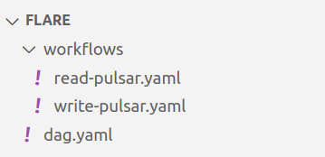

# Executing Multiple Workflow YAMLs from a Single One

This section demonstrates how to execute multiple workflows by combining separate YAML files into a single master file. By following this approach, you can streamline complex data processing tasks that involve reading data from one depot, writing it to another depot, and subsequently performing additional processing steps. 

## Implementation Flow

1. Save the below code snippets into separate YAML files, and store them in the following format

<center>



</center>

2. Once you do that mention the path (relative or absolute) of the `read-pulsar.yaml` and `write-pulsar.yaml` in the file property of the master file `dag.yaml`. 
3. Apply the `dag.yaml` command from the CLI.

## Outcome

When you apply the `dag.yaml` file, using CLI, it calls in the `write-pulsar.yaml` file first and the `read-pulsar.yaml` file second as the second file is dependent upon the first. The workflow within the `write-pulsar.yaml` writes the data from `thirdparty` depot to `sanitypulsar01` depot. Once that is done the second workflow is executed which writes the same data from `sanitypulsar01` depot to the `icebase` depot. This finishes the two processing tasks by applying just one file.

## Code Snippets

### **dag.yaml**

```yaml
version: v1
name: wf-sample-dag
type: workflow
tags:
  - read
  - write
description: This jobs reads data from thirdparty and writes to pulsar
workflow:
  dag:
    - name: write
      file: workflows/write-pulsar.yaml

    - name: read
      file: workflows/read-pulsar.yaml
      dependencies:
        - write
```

### **write-pulsar.yaml**

```yaml
version: v1
name: write-pulsar-01
type: workflow
tags:
  - pulsar
  - read
description: this jobs reads data from thirdparty and writes to pulsar
workflow:
  dag:
    - name: write-pulsar
      title: write avro data to pulsar
      description: write avro data to pulsar
      spec:
        tags:
          - Connect
        stack: flare:3.0
        compute: runnable-default
        flare:
          job:
            explain: true

            inputs:
              - name: input
                dataset: dataos://thirdparty01:none/city
                format: csv
                isStream: false
            logLevel: INFO

            outputs:
              - name: finalDf
                dataset: dataos://sanitypulsar01:default/city_pulsar_01?acl=rw
                format: pulsar
                tags:
                  - Connect
                title: City Data Pulsar

            steps:
              - sequence:
                  - name: finalDf
                    sql: SELECT * FROM input
```

### **read-pulsar.yaml**

```yaml
version: v1
name: read-pulsar-01
type: workflow
tags:
  - pulsar
  - read
description: this jobs reads data from thirdparty and writes to pulsar
workflow:
  dag:
    - name: read-pulsar-001
      title: write avro data to pulsar
      description: write avro data to pulsar
      spec:
        tags:
          - Connect
        stack: flare:3.0
        compute: runnable-default
        flare:
          job:
            explain: true
            logLevel: INFO

            inputs:
              - name: input
                dataset: dataos://sanitypulsar:default/city_pulsar_01
                isStream: false
                options:
                  startingOffsets: earliest

            outputs:
              - name: output
                dataset: dataos://icebase:sanity/sanity_pulsar?acl=rw
                format: Iceberg
                options:
                  saveMode: overwrite

            steps:
              - sequence:
                  - name: finalDf
                    sql: SELECT * FROM input

    - name: dataos-tool-pulsar
      spec:
        stack: toolbox
        compute: runnable-default
        toolbox:
          dataset: dataos://icebase:sample/sanity_pulsar?acl=rw
          action:
            name: set_version
            value: latest
      dependencies:
        - read-pulsar-001
```