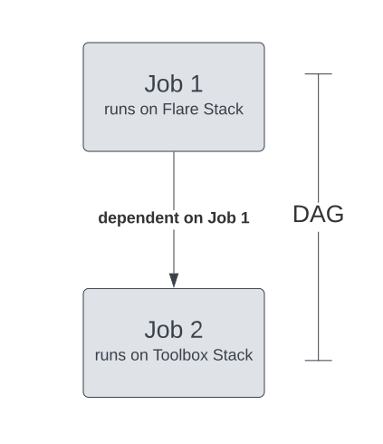

# Single Run Workflow

<center>



</center>

<center>

*Illustration of a Single-run Workflow*

</center>


### **Sample Workflow YAML**   

```yaml
# Resource Section
version: v1 
name: wf-tmdc-01 
type: workflow 
tags:
- Connect
- City
description: The job ingests city data from dropzone into raw zone
# Workflow-specific Section
workflow:
  title: Connect City
  dag: 
# Job 1 Specific Section
    - name: wf-job1 # Job 1 name
      title: City Dimension Ingester
      description: The job ingests city data from dropzone into raw zone
      spec:
        tags:
        - Connect
        - City
        stack: flare:3.0 # The job gets executed upon the Flare Stack, so its a Flare Job
        compute: runnable-default
        # Flare Stack-specific Section
        flare:
          job:
            explain: true
            logLevel: INFO
            inputs:
              - name: city_connect
                  dataset: dataos://thirdparty01:none/city
                  format: csv
                  schemaPath: dataos://thirdparty01:none/schemas/avsc/city.avsc
            
            outputs:
              - name: cities
                dataset: dataos://icebase:retail/city01?acl=rw
                format: Iceberg
                description: City data ingested from external csv
                options:
                saveMode: append
                sort:
                  mode: partition
                  columns:
                  - name: version
                      order: desc
                iceberg:
                    properties:
                    write.format.default: parquet
                    write.metadata.compression-codec: gzip
                    partitionSpec:
                    - type: identity
                        column: version
            steps:
              - sequence:
                - name: cities
                  doc: Pick all columns from cities and add version as yyyyMMddHHmm formatted
                      timestamp.
                  sql: |
                      SELECT
                          *,
                          date_format (now(), 'yyyyMMddHHmm') AS version,
                          now() AS ts_city
                      FROM
                          city_connect
# Job 2 Specific Section
    - name: datatool-1 # Job 2 name
      spec:
        stack: toolbox # The Job gets executed upon Toolbox Stack, so its a Toolbox Job 
        compute: runnable-default
        # Toolbox Stack-specific Section
        toolbox:
        dataset: dataos://icebase:retail/city01
        action:
            name: set_version
            value: latest
    # Job 2 Dependent on Job 1 for the start of execution
      dependencies: wf-job1
```