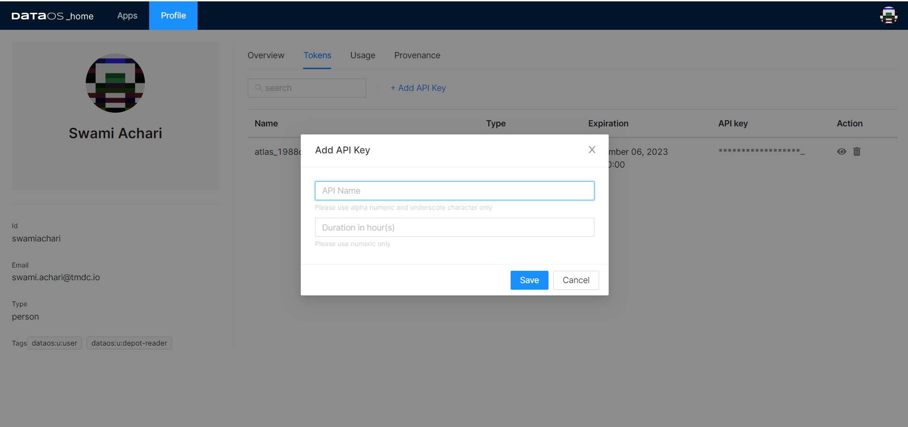

# **Airbyte**

Airbyte is an open-source data integration platform that runs in the safety of your cloud and ingests data from applications, APIs & databases to data warehouses, lakes, and other destinations.

It allows businesses to easily create resilient ELT (extract, load and transform) pipelines by either using the company’s pre-built connectors or by building their own. For example, while airbyte’s native pulsar connector doesn't support normalization, DataOS Airbyte Stack has pulsar connector that writes normalized data to Pulsar.

> 🗣️ To access Airbyte connectors in DataOS, insert “/airbyte” in the URL(domain name) of your DataOS. This launches Airbyte app where you can add, edit, and remove connections. We are currently working on a GUI alternative to make access to your Airbyte connectors more convenient.

## **Setting up source**

DataOS connects a lot of disparate sources to destinations. Developing and maintaining custom pipelines for every other source is not really practical. Airbyte solves this problem for us by providing an interface and making data pipelining easier and faster.

To configure a source on Airbyte, head to the sources tab in the sidebar click new source button in the top right corner which will lead you to the source configuration page.

Here you will name your source. Something that is self-explanatory and defines what kind of data is being fetched.

Selecting the Source Type will open configuration fields. Here you need to configure the option to limit what data will be synced to the destination. Such as the start date and the window for the data chunk.

Now all you need to do is to authenticate the connector. Choose your authentication option then click on Authenticate button and follow the authentication workflow instructions to finish configuring your source.

The source will now try to validate that you can successfully retrieve data from the source using the credentials you just fed in the configuration screen.

After successfully setting up the source you’ll be redirected to the source’s dedicated page. Here you can connect the source with your desired destination by configuring the destination which is similar to how you configured the source.

## **Setting up destination**

As we previously mentioned, the destination configuration process is similar to source set up. On the dedicated source screen you can find the add destination button in the top right corner.

Click on the add destination button to start configuring a connection between this source to a new or a preexisting destination. Subsequently, Airbyte performs a check to ensure that we can successfully connect to our source before we move ahead with the destination configuration.

Now that the source is validated you will be directed to the destination configuration screen.

Populate the name field and choose your destination. Then select a destination type from the dropdown.

Now you’ll be asked to add connection information like credentials. Credentials are unique to every connector.

Finally, at this stage Airbyte again runs a test to ensure that the destination credentials are correct and you can write data into the destination. After the verification you can proceed with the configuration.

## **Building your own connectors**

Although Airbyte has an ever growing library of connectors, if you can’t find what you’re looking for, you can build your own connectors. 

DataOS team has also built several connectors via the provided SDKs. It’s fairly straight forward. Our ecosystem is huge and relies on connectors of all kinds, big and small. We cannot always submit a request for a connector and wait for Airbyte to release it based on their priorities. Hence we’re constantly developing new connectors that we release for our clients to use.

If you require any connectors pertaining to DataOS which might make your job easier. You can let us know, we’re always happy to help.

## **Connection Configuration**

On the Connection screen you need to choose your configured source and destination to establish a connection. After the selection, you will see the connection between your source and the destination and another field asking you for the frequency of sync. Select the desired frequency from the drop down. The frequency will determine how often you want to fetch the new information.

Select what data you’re looking to replicate from the source. Check the boxes for desired datapoints from the rows. Now that you have selected what data you want and how frequently you want to fetch it, the next step is to select a sync mode. Sync mode determines how you want to write the fetched data to the destination. Choose one from the four available in the dropdown.

The data you fetch from varied sources might not follow the same format or type that is required to be query-possible at the destination. Hence the next step.

Normalization provides you with two options that lets you transform data. **Raw Data** option keeps the data as it is, in its raw form and the **Basic** option normalizes data to make the format and type native to the destination.

- **Note:** *Some of the native connectors like Pulsar does not support Normalization by default. We built that transformation in the Pulsar connector for use in DataOS platform.*

We have also built authentication into our connectors via an authentication plugin, here you need to feed in authentication parameters and API key which you can generate from your DataOS profile, under Tokens tab.

 

This modification ensures that no data is written without authentication. This whole thing is managed by Heimdall component of the DataOS, which looks over the governance and security for DataOS.

## **Verifying the Connection**

Lastly, when you land on the connection page you can see the status of your first sync. On the sync page you can see sync logs and update the settings of your connections as well.

The next and the final check is to ensure that you have correctly fetched the data to your destination. Go to your destination. Here, you should now be able to see the data from your source project in the destination under the schema that you specified in your destination connection configuration.

**And just like that you’re done setting up the connection. That is all you need to do to quickly fetch data from your sources and load it into your destination or staging environments in DataOS.**

To learn more about Airbyte, refer to
[How Airbyte Works](Airbyte/How%20Airbyte%20Works.md).