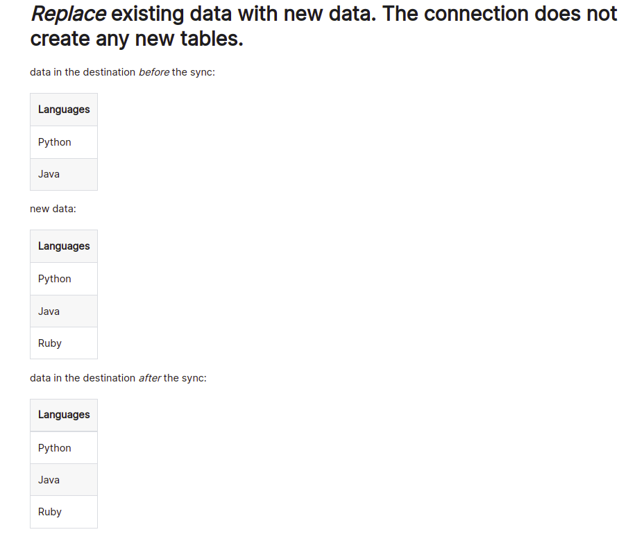

# How Airbyte Works

An Airbyte connector runs its own docker container, which at first glance may appear to be a subtle feature, however, there is a major architecture advantage here. Each Source is an individual container that Each Connector is effectively a self-contained data migration program, that you can monitor, refresh, and schedule.

Airbyte uses a system that is architected as a CLI. The Airbyte application interface is web-based and build UI atop the CLI. The CLI is a powerful yet familiar framework for data streams. When you are running a job, the input source and output of data is structured in a standard messaging stream.


> 🗣️  Airbyte is new and it's in alpha (as of July 2022)


## Airbyte Sync Modes

A sync mode governs how Airbyte reads from a source and writes to a destination.

1. Source Mode (Read):
    1. Incremental: Read records added to the source since the last sync job. (The first sync using Incremental is equivalent to a Full Refresh)
    2. Full Refresh: Read everything in the source.
2. Destination Mode (Write):
    1. Overwrite: Overwrite by first deleting existing data in the destination.
    2. Append: Write by adding data to existing tables in the destination.
    3. Deduped History: Write by first adding data to existing tables in the destination to keep a history of changes. The final table is produced by de-duplicating the intermediate ones using a primary key.

Sync Mode is a combination of a source and destination mode together. The UI exposes the following options, whenever both source and destination connectors are capable to support it for the corresponding stream:

- [Full Refresh Overwrite](https://docs.airbyte.com/understanding-airbyte/connections/full-refresh-overwrite): Sync the whole stream and replace data in destination by overwriting it.
- [Full Refresh Append](https://docs.airbyte.com/understanding-airbyte/connections/full-refresh-append): Sync the whole stream and append data in destination.
- [Incremental Append](https://docs.airbyte.com/understanding-airbyte/connections/incremental-append): Sync new records from stream and append data in destination.
- [Incremental Deduped History](https://docs.airbyte.com/understanding-airbyte/connections/incremental-deduped-history): Sync new records from stream and append data in destination, also provides a de-duplicated view mirroring the state of the stream in the source.
    
    This connector syncs data incrementally, which means that only new or modified data will be synced. In contrast with the Incremental Append mode, this mode updates rows that have been modified instead of adding a new version of the row with the updated data. Simply put, if you've synced a row before and it has since been updated, this mode will combine the two rows in the destination and use the updated data. On the other hand, the Incremental Append mode would just add a new row with the updated data.
    

Examples:

- Full Refresh - Overwrite
     
  <center>

  

  </center>
    
- Full Refresh - Append
     
  <center>

  

  </center>
    
- Incremental Sync - Append
     
  <center>

  

  </center>
    
- Incremental Sync - Deduped History
     
  <center>

  

  </center>

  <br>

  <center>

  

  </center>


## Normalization

Normalization is the process of structuring data from the source into a format appropriate for consumption in the destination. For example, when writing data from a nested, dynamically typed source like a JSON API to a relational destination like Postgres, normalization is the process that un-nests JSON from the source into a relational table format that uses the appropriate column types in the destination.

In the example below, we send salesforce `Account` data to Pulsar topic.

- Data From Source
    
    ```
    {
      "attributes": {
        "type": "Account",
        "url": "/services/data/v52.0/sobjects/Account/0015i0000081hvkAAA"
      },
      "Id": "0015i0000081hvkAAA",
      "IsDeleted": false,
      "MasterRecordId": null,
      "Name": "United Oil & Gas, UK",
      "Type": "Customer - Direct",
      "ParentId": null,
      "BillingStreet": "Kings Park, 17th Avenue, Team Valley Trading Estate,\\nGateshead, Tyne and Wear NE26 3HS\\nUnited Kingdom",
      "BillingCity": null,
      "BillingState": "UK",
      "BillingPostalCode": null,
      "BillingCountry": null,
      "BillingLatitude": null,
      "BillingLongitude": null,
      "BillingGeocodeAccuracy": null,
      "BillingAddress": {
        "city": null,
        "country": null,
        "geocodeAccuracy": null,
        "latitude": null,
        "longitude": null,
        "postalCode": null,
        "state": "UK",
        "street": "Kings Park, 17th Avenue, Team Valley Trading Estate,\\nGateshead, Tyne and Wear NE26 3HS\\nUnited Kingdom"
      },
      "ShippingStreet": "Kings Park, 17th Avenue, Team Valley Trading Estate,\\nGateshead, Tyne and Wear NE26 3HS\\nUnited Kingdom",
      "ShippingCity": null,
      "ShippingState": null,
      "ShippingPostalCode": null,
      "ShippingCountry": null,
      "ShippingLatitude": null,
      "ShippingLongitude": null,
      "ShippingGeocodeAccuracy": null,
      "ShippingAddress": {
        "city": null,
        "country": null,
        "geocodeAccuracy": null,
        "latitude": null,
        "longitude": null,
        "postalCode": null,
        "state": null,
        "street": "Kings Park, 17th Avenue, Team Valley Trading Estate,\\nGateshead, Tyne and Wear NE26 3HS\\nUnited Kingdom"
      },
      "Phone": "+44 191 4956203",
      "Fax": "+44 191 4956620",
      "AccountNumber": "CD355119-A",
      "Website": "<http://www.uos.com>",
      "PhotoUrl": "/services/images/photo/0015i0000081hvkAAA",
      "Sic": "4437",
      "Industry": "Energy",
      "AnnualRevenue": null,
      "NumberOfEmployees": 24000,
      "Ownership": "Public",
      "TickerSymbol": "UOS",
      "Description": null,
      "Rating": null,
      "Site": null,
      "OwnerId": "0055i0000024xriAAA",
      "CreatedDate": "2022-05-25T10:16:26.000+0000",
      "CreatedById": "0055i0000024xriAAA",
      "LastModifiedDate": "2022-05-25T10:16:26.000+0000",
      "LastModifiedById": "0055i0000024xriAAA",
      "SystemModstamp": "2022-05-25T10:16:26.000+0000",
      "LastActivityDate": null,
      "LastViewedDate": null,
      "LastReferencedDate": null,
      "Jigsaw": null,
      "JigsawCompanyId": null,
      "CleanStatus": "Pending",
      "AccountSource": null,
      "DunsNumber": null,
      "Tradestyle": null,
      "NaicsCode": null,
      "NaicsDesc": null,
      "YearStarted": null,
      "SicDesc": null,
      "DandbCompanyId": null,
      "OperatingHoursId": null,
      "CustomerPriority__c": "High",
      "SLA__c": "Platinum",
      "Active__c": "Yes",
      "NumberofLocations__c": 34,
      "UpsellOpportunity__c": "No",
      "SLASerialNumber__c": "3479",
      "SLAExpirationDate__c": "2022-06-19"
    }
    
    ```
    
- Raw table produced by destination connector
    
    ```
    {
        "_airbyte_ab_id": "f27dc10c-fa93-4159-b7f7-7b2b728e8f99",
        "_airbyte_data": "{\\"attributes\\":{\\"type\\":\\"Account\\",\\"url\\":\\"/services/data/v52.0/sobjects/Account/0015i0000081hvkAAA\\"},\\"Id\\":\\"0015i0000081hvkAAA\\",\\"IsDeleted\\":false,\\"MasterRecordId\\":null,\\"Name\\":\\"United Oil & Gas, UK\\",\\"Type\\":\\"Customer - Direct\\",\\"ParentId\\":null,\\"BillingStreet\\":\\"Kings Park, 17th Avenue, Team Valley Trading Estate,\\\\nGateshead, Tyne and Wear NE26 3HS\\\\nUnited Kingdom\\",\\"BillingCity\\":null,\\"BillingState\\":\\"UK\\",\\"BillingPostalCode\\":null,\\"BillingCountry\\":null,\\"BillingLatitude\\":null,\\"BillingLongitude\\":null,\\"BillingGeocodeAccuracy\\":null,\\"BillingAddress\\":{\\"city\\":null,\\"country\\":null,\\"geocodeAccuracy\\":null,\\"latitude\\":null,\\"longitude\\":null,\\"postalCode\\":null,\\"state\\":\\"UK\\",\\"street\\":\\"Kings Park, 17th Avenue, Team Valley Trading Estate,\\\\nGateshead, Tyne and Wear NE26 3HS\\\\nUnited Kingdom\\"},\\"ShippingStreet\\":\\"Kings Park, 17th Avenue, Team Valley Trading Estate,\\\\nGateshead, Tyne and Wear NE26 3HS\\\\nUnited Kingdom\\",\\"ShippingCity\\":null,\\"ShippingState\\":null,\\"ShippingPostalCode\\":null,\\"ShippingCountry\\":null,\\"ShippingLatitude\\":null,\\"ShippingLongitude\\":null,\\"ShippingGeocodeAccuracy\\":null,\\"ShippingAddress\\":{\\"city\\":null,\\"country\\":null,\\"geocodeAccuracy\\":null,\\"latitude\\":null,\\"longitude\\":null,\\"postalCode\\":null,\\"state\\":null,\\"street\\":\\"Kings Park, 17th Avenue, Team Valley Trading Estate,\\\\nGateshead, Tyne and Wear NE26 3HS\\\\nUnited Kingdom\\"},\\"Phone\\":\\"+44 191 4956203\\",\\"Fax\\":\\"+44 191 4956620\\",\\"AccountNumber\\":\\"CD355119-A\\",\\"Website\\":\\"<http://www.uos.com>\\",\\"PhotoUrl\\":\\"/services/images/photo/0015i0000081hvkAAA\\",\\"Sic\\":\\"4437\\",\\"Industry\\":\\"Energy\\",\\"AnnualRevenue\\":null,\\"NumberOfEmployees\\":24000,\\"Ownership\\":\\"Public\\",\\"TickerSymbol\\":\\"UOS\\",\\"Description\\":null,\\"Rating\\":null,\\"Site\\":null,\\"OwnerId\\":\\"0055i0000024xriAAA\\",\\"CreatedDate\\":\\"2022-05-25T10:16:26.000+0000\\",\\"CreatedById\\":\\"0055i0000024xriAAA\\",\\"LastModifiedDate\\":\\"2022-05-25T10:16:26.000+0000\\",\\"LastModifiedById\\":\\"0055i0000024xriAAA\\",\\"SystemModstamp\\":\\"2022-05-25T10:16:26.000+0000\\",\\"LastActivityDate\\":null,\\"LastViewedDate\\":null,\\"LastReferencedDate\\":null,\\"Jigsaw\\":null,\\"JigsawCompanyId\\":null,\\"CleanStatus\\":\\"Pending\\",\\"AccountSource\\":null,\\"DunsNumber\\":null,\\"Tradestyle\\":null,\\"NaicsCode\\":null,\\"NaicsDesc\\":null,\\"YearStarted\\":null,\\"SicDesc\\":null,\\"DandbCompanyId\\":null,\\"OperatingHoursId\\":null,\\"CustomerPriority__c\\":\\"High\\",\\"SLA__c\\":\\"Platinum\\",\\"Active__c\\":\\"Yes\\",\\"NumberofLocations__c\\":34.0,\\"UpsellOpportunity__c\\":\\"No\\",\\"SLASerialNumber__c\\":\\"3479\\",\\"SLAExpirationDate__c\\":\\"2022-06-19\\"}",
        "_airbyte_emitted_at": 1658318502577,
        "_airbyte_stream": "Account"
      }
    
    ```
    
- Normalized table for the same payload
    
    It has additional columns:
    
    - _airbyte_ab_id
    - _airbyte_emitted_at
    - _airbyte_cars_hashid
    - _airbyte_normalized_at
    
    ```
    {
      "AccountNumber": {
        "string": "CD355119-A"
      },
      "AccountSource": null,
      "Active__c": {
        "string": "Yes"
      },
      "AnnualRevenue": null,
      "BillingAddress": {
        "defaultNamespace.BillingAddress": {
          "_airbyte_additional_properties": null,
          "city": null,
          "country": null,
          "geocodeAccuracy": null,
          "latitude": null,
          "longitude": null,
          "postalCode": null,
          "state": {
            "string": "UK"
          },
          "street": {
            "string": "Kings Park, 17th Avenue, Team Valley Trading Estate,\\nGateshead, Tyne and Wear NE26 3HS\\nUnited Kingdom"
          }
        }
      },
      "BillingCity": null,
      "BillingCountry": null,
      "BillingGeocodeAccuracy": null,
      "BillingLatitude": null,
      "BillingLongitude": null,
      "BillingPostalCode": null,
      "BillingState": {
        "string": "UK"
      },
      "BillingStreet": {
        "string": "Kings Park, 17th Avenue, Team Valley Trading Estate,\\nGateshead, Tyne and Wear NE26 3HS\\nUnited Kingdom"
      },
      "CleanStatus": {
        "string": "Pending"
      },
      "CreatedById": {
        "string": "0055i0000024xriAAA"
      },
      "CreatedDate": {
        "long.timestamp-micros": 1653473786000000
      },
      "CustomerPriority__c": {
        "string": "High"
      },
      "DandbCompanyId": null,
      "Description": null,
      "DunsNumber": null,
      "Fax": {
        "string": "+44 191 4956620"
      },
      "Id": {
        "string": "0015i0000081hvkAAA"
      },
      "Industry": {
        "string": "Energy"
      },
      "IsDeleted": {
        "boolean": false
      },
      "Jigsaw": null,
      "JigsawCompanyId": null,
      "LastActivityDate": null,
      "LastModifiedById": {
        "string": "0055i0000024xriAAA"
      },
      "LastModifiedDate": {
        "long.timestamp-micros": 1653473786000000
      },
      "LastReferencedDate": null,
      "LastViewedDate": null,
      "MasterRecordId": null,
      "NaicsCode": null,
      "NaicsDesc": null,
      "Name": {
        "string": "United Oil & Gas, UK"
      },
      "NumberOfEmployees": {
        "int": 24000
      },
      "NumberofLocations__c": {
        "double": 34
      },
      "OperatingHoursId": null,
      "OwnerId": {
        "string": "0055i0000024xriAAA"
      },
      "Ownership": {
        "string": "Public"
      },
      "ParentId": null,
      "Phone": {
        "string": "+44 191 4956203"
      },
      "PhotoUrl": {
        "string": "/services/images/photo/0015i0000081hvkAAA"
      },
      "Rating": null,
      "SLAExpirationDate__c": {
        "string": "2022-06-19"
      },
      "SLASerialNumber__c": {
        "string": "3479"
      },
      "SLA__c": {
        "string": "Platinum"
      },
      "ShippingAddress": {
        "defaultNamespace.ShippingAddress": {
          "_airbyte_additional_properties": null,
          "city": null,
          "country": null,
          "geocodeAccuracy": null,
          "latitude": null,
          "longitude": null,
          "postalCode": null,
          "state": null,
          "street": {
            "string": "Kings Park, 17th Avenue, Team Valley Trading Estate,\\nGateshead, Tyne and Wear NE26 3HS\\nUnited Kingdom"
          }
        }
      },
      "ShippingCity": null,
      "ShippingCountry": null,
      "ShippingGeocodeAccuracy": null,
      "ShippingLatitude": null,
      "ShippingLongitude": null,
      "ShippingPostalCode": null,
      "ShippingState": null,
      "ShippingStreet": {
        "string": "Kings Park, 17th Avenue, Team Valley Trading Estate,\\nGateshead, Tyne and Wear NE26 3HS\\nUnited Kingdom"
      },
      "Sic": {
        "string": "4437"
      },
      "SicDesc": null,
      "Site": null,
      "SystemModstamp": {
        "long.timestamp-micros": 1653473786000000
      },
      "TickerSymbol": {
        "string": "UOS"
      },
      "Tradestyle": null,
      "Type": {
        "string": "Customer - Direct"
      },
      "UpsellOpportunity__c": {
        "string": "No"
      },
      "Website": {
        "string": "<http://www.uos.com>"
      },
      "YearStarted": null,
      "_airbyte_ab_id": "d9630bc5-e238-4b7b-b2bb-23c856b22d78",
      "_airbyte_additional_properties": {
        "map": {
          "attributes": "{\\"type\\":\\"Account\\",\\"url\\":\\"/services/data/v52.0/sobjects/Account/0015i0000081hvkAAA\\"}"
        }
      },
      "_airbyte_emitted_at": 1658318507625
    }
    
    ```
    

Note that normalization is only relevant for the following relational database & warehouse destinations:

- BigQuery
- Snowflake
- Redshift
- Postgres
- Oracle
- MySQL
- MSSQL

DataOS Airbyte Stack does however support normalization for pulsar.

If your curiosity is still unstatisfied, check out the [Airbyte documentation](https://docs.airbyte.com/connector-development/).