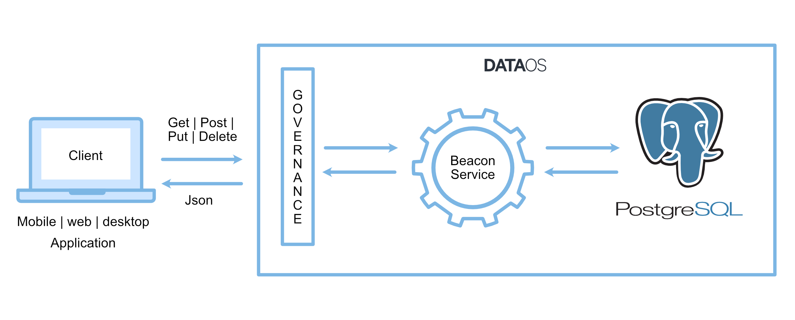

# **Beacon**

Beacon stack in DataOS is used to create a service that enables you to access the PostgreSQL database. PostgreSQL REST API connection allows web and application platforms to utilize PostgreSQL as a destination.

Through the Beacon stack, REST API is exposed to provide an interface for seamless and secure usage of PostgreSQL with the client applications.



You can create a Beacon service using declarative YAML and you do not need to write extra code to enable database access. You can also enforce governance policies for secure access to PostgreSQL data. For example, using policies, you can restrict users to perform Delete/Update operations and allow only reading the data.

Beacon services are also built to scale. As per the data growth, you can create a required number of replicas for the service.

Once you create the Beacon service, you can perform the following operations:

## **CRUD Operations**

- **Create** — HTTP POST method to create a resource in a REST environment
- **Read** — GET method to read a resource
- **Update** — PUT method to update a resource
- **Delete** — DELETE method To remove a resource from the system

## **Other Capabilities**

- **Search-** Full-Text Search on the data stored in PostgreSQL
- **Filtering-** Filter result rows by adding conditions on columns
- **Rename-** Rename the columns

> **Note:** To understand more about the PostgreSQL API options, refer to [PostgREST](https://postgrest.org/en/stable/api.html).
> 

# **Create a Beacon Service**

This article describes the steps to create a Beacon service in DataOS to access tables in PostgreSQL.

## **Step 1: Create SQL Files**

1. Create a migration folder.

2. Create Up and Down SQL files.

    - In up.sql, write the code to create tables, alter tables, and create functions & triggers.

    - In down.sql, we drop tables, functions & triggers.

3. Test your SQL commands on local Postgre instance.0001_initial.up.sql

> 📌 **Note**: Naming of SQL files must be 00001_initial.up.sql & 00001_initial.down.sql format.
> 

## **Step 2: Create Database YAML**

1. Provide the database name and the full path of the migration folder containing SQL files.

    ```yaml
    version: v1beta1
    name: citybase                                         **# database name** 
    type: database
    description: citybase database for storing city sample data.
    tags:
      - database
    database:
      migrate:
        includes:
          - /home/user/postgres_beacon/migrations         **# all up & down sql files.**
        command: up                                       **# in case of drop table, write down.**
    ```

2. After creating database YAML, run the **apply** command on DataOS CLI to create database resource in DataOS.

    ```yaml
    dataos-ctl apply -f database.yaml
    ```

To learn more about `apply` command, refer to [CLI](../Getting%20Started%20-%20DataOS%20Documentation/Data%20Management%20Capabilities/CLI.md) section.

## **Step 3: Create Beacon Service YAML**

While defining a service, you have to define the following properties:

- **Replicas**: Create multiple replicated services.
- **Ingress**: Configure the incoming port for the service to allow access to DataOS resources from external links.

  Provide the following properties. 
    
    - enable ingress port.
    - enable the `stripPath` to strip the specified path and then forward the request to the upstream service.
    - provide path. How your URL going to appear.
    - set `noAuthentication` to false if authentication is needed.

- **Environment**: configure destination URL and path.
- **Source**: about the data source.
- **Topology**: provide objects and their input/output types.

    ```yaml
    version: v1beta1
    name: scitydatabase-rest    # service name
    type: service
    tags:
      - syndicate
      - segments
      - service
    service:
      replicas: 2
      ingress:
        enabled: true
        stripPath: true
        path: /citybase/api/v1   # how your URL going to appear.
        noAuthentication: true
      stack: beacon+rest
      envs:
        PGRST_OPENAPI_SERVER_PROXY_URI: https://lively-neutral-akita.dataos.io/citybase/api/v1
                                        # environment URL + path: /citybase/api/v1
      beacon:
        source:
          type: database
          name: citybase
          workspace: public
      topology:
      - name: database
        type: input
        doc: citybase database connection
      - name: rest-api
        type: output
        doc: serves up the citybase database as a RESTful API
        dependencies:
        - database
    ```

2. Run the `apply` command on DataOS CLI to create the service resource for the database.

To learn more about `apply` command, refer to [CLI](../Getting%20Started%20-%20DataOS%20Documentation/Data%20Management%20Capabilities/CLI.md) section.

## **Step 4: Create Policy YAML**

A policy in DataOS should be created against which a CRUD operation will be performed by authorized users.

1. Define policy for allowing users to access the database resource and perform specified operations.

    ```yaml
    name: "city-search-app-demo"
    version: v1beta1
    type: policy
    layer: system
    description: "Allow user to access citybase app rest apis"
    policy:
      access:
        subjects:
          tags:
            - - "dataos:u:user"    # user operator can access API
        predicates:
          - "GET"
          - "POST"
          - "PUT"
          - "OPTIONS"              # user can use all CRUD operation if we allow them.
        objects:
          paths:
            - "/citybase/api/v1"   
        allow: true
    ```

2. Run the ‘apply’ command on DataOS CLI to create the policy resource for the database.

To learn more about `apply` command, refer to [CLI](../Getting%20Started%20-%20DataOS%20Documentation/Data%20Management%20Capabilities/CLI.md) section.

> 📌 **Note**: The user who has an operator tag can only apply the policy.
> 

Now you are ready to access the PostgreSQL database with the exposed API.

For example, the following URL is to carry out a full-text search on a column link.

| Property | Value |
| --- | --- |
| environment name | https://lively-neutral-akita.dataos.io/ |
| database path | citybase/api/v1/ |
| table name | place_search_ts |
| column name on which you created ts vector | document_with_weights |