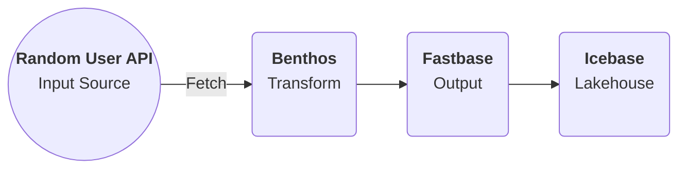

# Benthos on DataOS

When dealing with never-ending streams of data within DataOS - for e.g. IoT, real-time stock trades, server logs, and event data - the Service primitive is the answer to your prayers. But let's face it, stream data can be a tough nut to crack, and that's where Benthos comes in as your trusty sidekick. It's the perfect stack to help you process your stream data quickly and efficiently without breaking a sweat.

With Benthos Service, you can enjoy the best of both worlds: the inherent benefits of the Service primitive, which effortlessly enables you to create scalable and robust pipelines enriched with features such as built-in orchestration, cataloging, and governance capabilities, while the Benthos stack takes care of all the heavy lifting when it comes to your stream data. 

And the best part? You can do it all with ease thanks to YAML declarative programming, which lets you focus on what really matters - processing your data and getting those precious insights - rather than worrying about the nitty-gritty details of how to fit the pieces of the puzzle together.

## Processing Stream Data Using Benthos Pipeline

## Prerequisites

### Get the DataOS API Key

For writing data to Fastbase depots, you need the user API key, which you can acquire by executing the below command

```bash
dataos-ctl user apikey get
```

### Get the Pulsar-admin tag

Since we would be dealing with Pulsar format, you will need the `pulsar-admin` tag to write the data to the environment pulsar. To check the available tags that you have, execute the command:

```bash
dataos-ctl user get
# Output
			NAME     |     ID      |  TYPE  |        EMAIL         |              TAGS               
---------------|-------------|--------|----------------------|---------------------------------
	  IamGroot   |   iamgroot  | person |  iamgroot@tmdc.io    | roles:direct:collated,                                          
               |             |        |                      | roles:id:data-dev,              
               |             |        |                      | roles:id:depot-manager,         
               |             |        |                      | roles:id:depot-reader,          
               |             |        |                      | roles:id:pulsar-admin,    # this is the required Pulsar-admin tag     
               |             |        |                      | roles:id:system-dev,            
               |             |        |                      | roles:id:user,                  
               |             |        |                      | users:id:iamgroot

```


> 🗣️ In the case where you don’t have the `pulsar-admin` tag contact the system administrator.


## Let’s Begin!

As we commence our exciting new venture, we will be acquiring the data from the Random User API, a remarkably user-friendly and easily accessible API. To transform this API data, we will be leveraging the capabilities of the Benthos stack by applying some Bloblang transformation, followed by writing the data to the DataOS Fastbase depot.

Upon successfully writing the data to Fastbase, we can proceed to further write it into the Icebase depot using Flare stack, which is the DataOS’ Lakehouse implementation. Once we have accomplished this, a vast array of opportunities awaits us. We can delve into exploratory analysis using Workbench, create Lenses, or even develop sophisticated Machine Learning models using Alpha Stack. The possibilities are boundless, so let's dive in and get the show on the road, shall we?

The mermaid diagram given below depicts a bird's-eye view of the entire process. 



### Step 1: Create a Benthos Service YAML

To commence the process, we will be creating a Benthos Service YAML that will encompass several essential components. Each of these sections has been elaborated in detail on the [components](Components.md) page. The YAML Configuration is provided below:

```yaml
version: v1
name: randomusertest
type: service
service:
  compute: runnable-default
  replicas: 1
  servicePort: 8080  # DataOS port
  resources:
    requests:
      cpu: 100m
      memory: 128Mi
    limits:
      cpu: 1000m
      memory: 1024Mi
  ingress:
    enabled: true
    path: /test007   # URL for DataOS (topic name)
    noAuthentication: true
    annotations:
      konghq.com/strip-path: "false"
      kubernetes.io/ingress.class: kong
  stack: benthos   # dataos stack
  logLevel: DEBUG
  tags:
    - service
    - random-user
  benthos:
    input:
        http_client:
          url: https://randomuser.me/api/
          verb: GET
          headers:
            Content-Type: application/JSON
    pipeline:
      processors:
        - label: my_blobl
          bloblang: |
            page = this.info.page
            age = this.results.0.dob.age
            dob = this.results.0.dob.date
            page = this.info.page
            seed = this.info.seed
            email = this.results.0.email
            gender = this.results.0.gender
            name = this.results.0.id.name
            city = this.results.0.location.city
    output: 
      broker: 
        outputs:
        - broker:
            pattern: fan_out
            outputs:
            - plugin:
                address: dataos://fastbase:default/test007
                metadata:
                  auth:
                    token:
                      enabled: true
                      token: <DataOS-User-API-Key>
                  description: Random users data
                  format: AVRO
                  schema: "{\"name\":\"default\",\"type\":\"record\",\"namespace\":\"defaultNamespace\",\"fields\":[{\"name\":\"age\",\"type\":\"int\"},{\"name\":\"city\",\"type\":\"string\"},{\"name\":\"dob\",\"type\":\"string\"},{\"name\":\"email\",\"type\":\"string\"},{\"name\":\"gender\",\"type\":\"string\"},{\"name\":\"name\",\"type\":\"string\"},{\"name\":\"page\",\"type\":\"int\"},{\"name\":\"seed\",\"type\":\"string\"}]}"
                  schemaLocation: http://registry.url/schemas/ids/12 
                  title: Random Uses Info
                  type: STREAM
              type: dataos_depot
            - stdout: {}
```

## Step 2: Apply the YAML file

You can apply the YAML file, to create a Service resource within the DataOS environment using the command given below:

```bash
dataos-ctl apply -f <path-of-the-config-file> -w <workspace>
```

## Step 3: Check Topic Consume in Fastbase Depot

### Check Run time

```bash
dataos-ctl -t service -w <workspace> -n <service-name>  get runtime -r
# Sample
dataos-ctl -t service -w public -n pulsar-random  get runtime -r
```

### List all tenants

```bash
dataos-ctl fastbase tenant list
```

### List all Namespaces within the Public Tenant

```bash
dataos-ctl fastbase namespace list -t <tenant> 
```

### List all topics in public/default namespace

```bash
dataos-ctl fastbase topic list -n <namespace>
# Sample
dataos-ctl fastbase topic list -n public/default
```

### Check Topic Consume

```bash
dataos-ctl fastbase topic consume -p -s -t persistent://<tenant>/<namespace>/<topic>
# Sample
dataos-ctl fastbase topic consume -p -s -t persistent://public/default/test12
```

## Step 4: Read from Fastbase and write to Icebase

```yaml
version: v1
name: pulsar-fb-av-007
type: workflow
tags:
  - json-api
  - random-ip
description: This jobs ingest Data from pulsar to icebase
workflow:
  dag:
    - name: test09
      title: Data from fp 
      description: Picking fp detailes
      spec:
        tags:
          - test    
        stack: flare:3.0  
        compute: runnable-default
        flare:
          driver:
            coreLimit: 2000m
            cores: 1
            memory: 2000m
          executor:
            coreLimit: 2000m
            cores: 1
            instances: 1
            memory: 2000m
          job:
            explain: true
            inputs:
            - name: randomip
              dataset: dataos://fastbase:default/test007
              options:
                  startingOffsets: earliest
              isStream: false               
            logLevel: INFO
            outputs:
              - name: test007 # http client data
                depot: dataos://icebase:sample?acl=rw
            steps:
              - sink: 
                  - sequenceName: randomip
                    datasetName: test007
                    outputName: test007
                    outputType: Iceberg
                    outputOptions:
                      saveMode: overwrite
                      iceberg:
                        properties:
                          write.format.default: parquet
                          write.metadata.compression-codec: gzip                     

    - name: dt-test09
      spec:
        stack: toolbox
        compute: runnable-default
        toolbox:
          dataset: dataos://icebase:sample/test007?acl=rw
          action:
            name: set_version
            value: latest
      dependencies:
        - test09
```