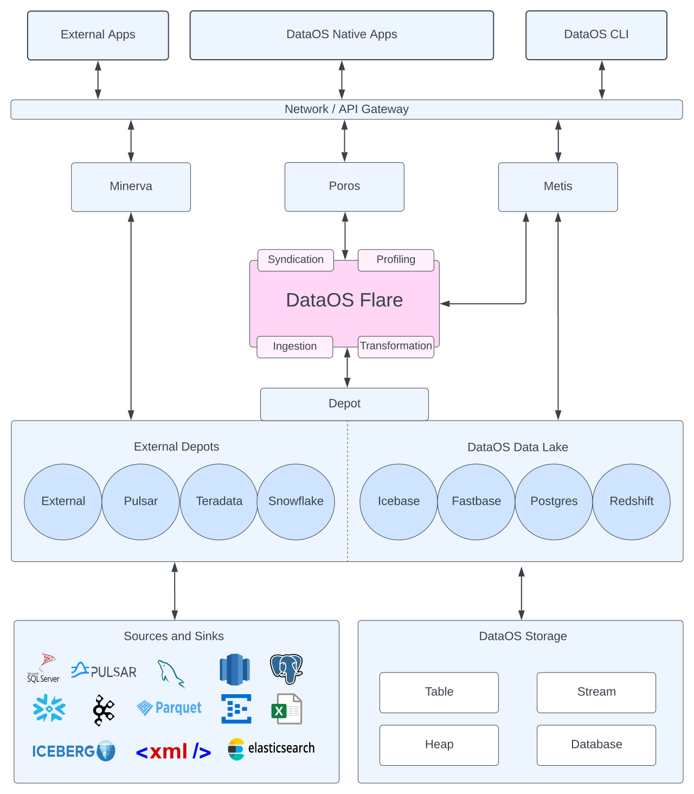

# **Flare**

Flare is a stack used for building end-to-end data pipelines within DataOS. Utilizing a YAML-based declarative programming paradigm built as an abstraction over Apache Spark, Flare offers an all-in-one solution for performing diverse data ingestion, transformation, enrichment, and syndication processes on both batch and streaming data.

[Basic concepts of Flare Workflow](Flare/Basic%20concepts%20of%20Flare%20Workflow.md)

# **Getting Started with Flare**

### **Elements of Flare Workflow**

A Flare Workflow comprises various configuration settings tailored to suit different use cases. These settings govern the reading, writing, and transformation of data from a wide range of sources and destinations. At its core, a Flare Workflow comprises of two key components: the building blocks, which comprise the configuration settings that underpin the Flare Workflow YAML, and the Flare Functions, which allow users to execute complex tasks with minimal coding requirements by leveraging pre-defined functions. 

- [Building Blocks of Flare Workflow](Flare/Building%20Blocks%20of%20Flare%20Workflow.md)

- [Flare Functions](Flare/Flare%20Functions.md)

### **Create a Flare Workflow**

Embark on a hands-on experience in crafting your first Workflow using Flare. This tutorial will guide you through the process of creating a Flare workflow from start to finish. For further information, please refer to
[Create your first Flare Workflow](Flare/Create%20your%20first%20Flare%20Workflow.md).

### **Testing the Workflow**

Before deploying your logic into production, it is considered a best practice to thoroughly test it. Flare Standalone provides a convenient, powerful, and reliable testing interface, that enables you to test your code locally on your system, allowing you to identify and address any potential issues before deployment. Further information regarding Flare Standalone can be accessed by
[Flare Standalone](Flare/Flare%20Standalone.md).

# **Flare Optimizations**

In the present scenario, the conventional "one size fits all" approach is no longer sufficient. Given the diverse nature of data and the multitude of variations within the data landscape, each Flare Job necessitates fine-tuning and optimization to achieve peak performance in accordance with the user's specifications. For a comprehensive understanding of the numerous optimization techniques, kindly refer to
[Flare Optimizations](Flare/Flare%20Optimizations.md).

# **Flare Config Templates**

To check out the list of all the connecting depots available in Flare, you can refer to the 
[Flare Read/Write Config](Flare/Flare%20Read%20Write%20Config.md) page to learn more about their configurations.

# **Case Scenarios**

[Case Scenario](Flare/Case%20Scenario.md)