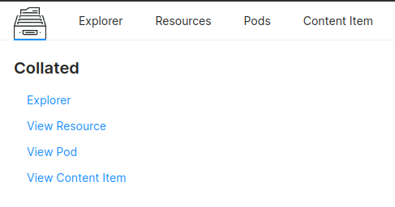

# **Collated**

Collated continuously captures checks for the deployment of any workflows, and service job run, following this, what all resources are being used, what is the log, and what is the state of the job. the information related to deployments like workflows, services, etc., and stores all this information within Blob storage.

 It continuously  Collated continuously captures and stores all this information in the blob storage.

> 🗣️ The difference between Collated and Operations is that Collated shows all the information about events with a delay while Operations shows live actions. Operations does not store any information and once the workflow is deleted, all the information is lost, but Collated stores all the information about workflows.

Collate is a service that runs behind the scenes and is powered by Poros and is tightly integrated into it. 

# **Introspecting the Details of Historical Workflows**

1. Go over to the Collated App, 

    

1. Within Collated, navigate to the Explorer Section, which has two sections resources and pods

    

1. The resources section consists of all the DataOS resources. Since we are looking for Flare Workflows, navigate to the workflow, within resources and from over there go v1, and public which is our workspace

    

1. As soon as you click on public a matrix of all the available workflows will pop up on the screen, since the name of our workflow is `wf-sample-002`, search it within the matrix and click on it.

    

1. A page containing all the information related to the workflow will pop-up, that includes, all its runtime details, when it was created when it was deleted, etc. 

    