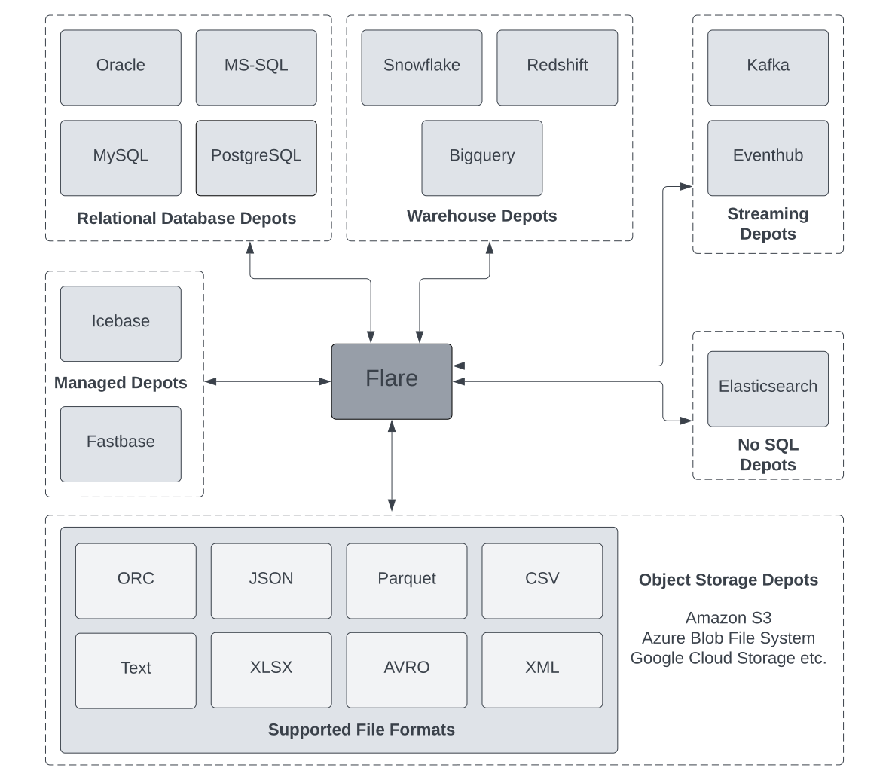

# Flare Read/Write Config
  

Flare supports reading and writing data from any source on which a depot can be created, this could be on Object Storage, Relational Databases, NoSQL Databases, Data Warehouses, and Streaming sources like Kafka. At the same time, it can write to DataOS internal Managed Depots like Icebase and Fastbase, etc.

> 🗣️ The Depot Paradigm  
 Depots within the DataOS provide access to the data source instead of worrying about the underlying source credentials and storage patterns. Once a depot is connected on top of a source doesn’t matter if it's a data lake, database or a warehouse the connection with the source becomes uniform and is represented as a UDL (Universal Data Link) which is of the form `dataos://[depot]:[collection]/[dataset]`.  
A Flare Job can only be run on data sources that have established depots on top of them. To know more about Depots, refer to
[Depot](../../../Primitives/Depot/Depot.md). 

## Reading and Writing from different data sources

### Object Storage Depots

Flare currently supports the following Object Storage Depots- Azure Blob File System (ABFSS), Google Cloud Storage (GCS), and Amazon S3. To know more about Flare YAML configurations for these object storage depots, refer to
[Object Storage Depots](./Object%20Storage%20Depots.md).

### NoSQL Database Depots

#### ElasticSearch

Elasticsearch is an open-source, document-oriented, NoSQL database. To know more about Flare YAML configuration for Elasticsearh Depots, refer to
[Elasticsearch Depots](./Elasticsearch%20Depots.md).

### Streaming Depots

Flare supports Kafka and Eventhub Streaming Depots. To know more about executing jobs on these depots navigate to the below sections

#### Kafka

Apache Kafka is an open-source distributed event streaming platform. To know more about Flare YAML configuration for Kafka depots, refer to
[Kafka Depots](./Kafka%20Depots.md).

#### Eventhub

Azure Event Hubs is a big data streaming platform and event ingestion service. To know more about Flare YAML configuration for Eventhub depots, refer to
[Eventhub Depots](./Eventhub%20Depots.md).

### Warehouse Depots

Currently, Flare Jobs can be run on depots built on top of Snowflake, Amazon Redshift, and Google Bigquery. 

### Redshift

Amazon Redshift is a fully managed petabyte-scale Cloud-based Data Warehouse service designed by Amazon to handle large data. To know more about Flare YAML configuration for Redshift depots, refer to
[Redshift Depots](./Redshift%20Depots.md).

### Snowflake

Snowflake is a data-warehousing platform to create big data products. To know more about Flare YAML configuration for Snowflake depots, refer to
[Snowflake Depots](./Snowflake%20Depots.md).

### Bigquery

Google BigQuery is a Cloud-based Data Warehouse that offers a big data analytic web service for processing very large datasets over petabytes of data. To know more about Flare YAML configuration for Bigquery depots, refer to
[Bigquery Depots](Flare%20Read%20Write%20Config/Bigquery%20Depots.md).