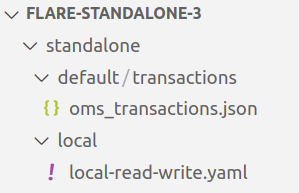

# Local to Local using Standalone 2.0

Let’s take a case scenario, where we read data from the Local system and write it back locally.

But before diving right into the programming stuff, let’s make sure that we have the required prerequisites.

## Pre-Requisites

## Install/Update DataOS CLI with the latest version

DataOS CLI should be installed on your system with the latest version. To get the details of the CLI version, run the command, after logging into DataOS.

```bash
dataos-ctl version
```

> Note: Make sure you are logged into DataOS before executing the above command. In case you haven’t logged in, execute `dataos-ctl login` in the terminal.
> 

If CLI is not updated to the latest version, refer to
[CLI](../../../../../CLI//CLI.md).

### Operationalize Docker, if you wanna Read/Write IO Locally

Docker should be installed and running on the system. If Docker is installed on your system, move to the next step in case it's not installed, visit the official Docker installation page for the same by clicking the [Docker](https://docs.docker.com/get-docker/).

### Basics of Scala Programming

Flare Standalone uses Scala Programming Language. In case you don’t have any idea about Scala, no worries we have got you covered with some basic commands that will help you make the most of Standalone.

## Getting started

### Step 1: Download and Unzip Sample Data

1. Download the `flare-standalone-3.zip` folder provided below.
  [flare-standalone-3.zip](./flare-standalone-3.zip).

1. Extract the downloaded `flare-standalone-3.zip` file. It contains only one folder by the name `standalone`. Open the code editor inside the `flare-standalone-3` folder.
2. Now the scenario looks like the image below, where you have opened the code-editor inside the `flare-standalone-3` folder which contains the `standalone` folder which further contains one folder by the name `default` directory having the `transactions` data and another file by the name `local-read-write.yaml`.
 
  <center>

  

  </center>


### Step 2: Adding details to the Flare Standalone Workflow YAML

1. Open `local-read-write.yaml` file using the code editor. The YAML looks like the one given below

    ```yaml
    version: v1 # Manifest Version
    name: local-read-write # Workflow Name
    type: workflow # Resource/primitive (here its workflow)
    tags: # Tags   
      - standalone
      - read
      - write
    description: Sample job # Description
    workflow: # Workflow Section
      dag: # Directed Acyclic Graph of Jobs (it has only one job at present can be more than one also)    
      - name: customer # Job Name       
        title: Sample Transaction Data Ingester # Title       
        description: The job ingests customer data from pulsar topic to file source # Job Description 
        spec: # Specs for the job        
          tags: # Tags          
            - standalone
            - read
            - pulsar
          stack: flare:3.0 # Stack Version         
          compute: runnable-default # Compute Type         
          flare:
            job:
              explain: true
              logLevel: INFO #logLevel for the Job
              inputs:
                - name: oms_transactions_data
                  inputType: file
                  file:
                    path: /data/examples/transactions/
                    format: json
              outputs: # Output Data Source Section
                - name: finalDf # Name of the output data source
                  outputType: file # Datasource output type (here's its file)                
                  file: # Datasource outputs specific section                  
                    path: /data/examples/dataout/
                    format: parquet
              steps: # Transformation Steps Section              
                - sequence: # Sequence                  
                  - name: finalDf # Step Name                    
                    sql: SELECT * FROM oms_transactions_data # SQL
    ```

1. Naming convention for local read/write IO
The paths given in the sample `pulsar-write.yaml` for local read/write are the docker container paths where the data will be mounted.
If your data is located at the path let’s say `standalone/default/transactions/`, your data is present inside the `transactions` and you have opened the terminal inside the `standalone` folder the input file path in YAML will be `/data/examples/data/transactions/` But if you have opened the terminal outside the `standalone` folder, `the` path will be `/data/examples/standalone/data/transactions/` 
You can store the data directory and the `pulsar-write.yaml` anywhere you want you just have to configure the paths accordingly.

### Step 3: Running the Flare Workflow YAML

1. Use the below command to run the `local-read-write.yaml`.

    ```bash
    dataos-ctl develop start -s <flare-version> -i <custom-image> -f <path-of-config.yaml> -d <path-of-data-directory> -P <port-number>
    ```

    Example

    ```bash
    dataos-ctl develop start -s flare:3.0 -i rubiklabs/flare3:6.0.93 -f standalone/local/local-read-write.yaml -d standalone -P 14044
    ```

    > Note: The path of `local-read-write.yaml` and `default` directory could either be absolute or relative path. The port number by default is set at 14040, but if you have a job already running on 14040 you can configure it to a different port e.g. 14044.
    > 

    
    > 🗣️ Note: In case when you don’t have the above-mentioned version or image of the flare stack downloaded, it will download it first from the docker registry, and then the execution will start. If you have it installed already, it will jump onto running the job directly. If you have an Apple M1/M2 Chip system, use the `rubiklabs/flare3:6.0.93-xp.01`  docker image.

1. Since we have exposed the Spark Web UI on port 14042, we can type [localhost:14042](http://localhost:14042) in any web browser to check the status of the job
 
    <center>

    

    </center>


    To know more about the various sections of the Spark UI and what each one of them signifies, navigate to the [Inspecting the Spark UI](../../../Flare%20Optimizations/Inspecting%20the%20Spark%20UI/Inspecting%20the%20Spark%20UI.md) 

1. On successful execution, the Scala command line shell will open as below:

    ```bash
    2022-12-05 05:28:10,854 INFO  [main] i.d.f.c.ProcessingContext: run complete.
    # When you see this run complete message, then only your job has successfully executed
    2022-12-05 05:28:10,865 INFO  [dispatcher-BlockManagerMaster] o.a.s.s.BlockManagerInfo: Removed broadcast_1_piece0 on a1a833f1a4b1:38377 in memory (size: 38.9 KiB, free: 366.3 MiB)
    Flare session is available as flare.
        Welcome to
            ______   _                       
            |  ____| | |                      
            | |__    | |   __ _   _ __    ___ 
            |  __|   | |  / _` | | '__|  / _ \
            | |      | | | (_| | | |    |  __/
            |_|      |_|  \__,_| |_|     \___|  version 1.2.0
            
        Powered by Apache Spark 3.3.0
    Using Scala version 2.12.15 (OpenJDK 64-Bit Server VM, Java 1.8.0_262)
    Type in expressions to have them evaluated.
    Type :help for more information.
    ```

1. You can check the `dataout` folder under which the data is written.
 
    <center>

    

    </center>


### Step 4: Exploring Spark Commands in Scala Interactive Shell

After successful job execution, you can run various Spark commands in Scala interactive shell. 

1.  `tables` command will give you the list of all tables in the current directory. You should see the `finaldf` and `transactions_connect` tables listed, which are created after the given YAML is successfully run.

    ```bash
    scala> tables
    # Expected Output
    +---------+--------------------+-----------+
    |namespace|tableName           |isTemporary|
    +---------+--------------------+-----------+
    |         |finaldf             |true       |
    |         |transactions_connect|true       |
    +---------+--------------------+-----------+
    ```

    You must debug your code if you still need to get the required output or find the above table empty.

1. You can also run a Spark SQL query to verify the data, as follows:

    ```bash
    scala> spark.sql("SELECT * FROM customers_final").show(false)
    ```

1. You can also run a Spark SQL query to print schema to verify the data, as follows:

    ```bash
    scala> spark.sql("SELECT * FROM finaldf").printSchema
    # Expected Output
    root
    |-- customer: struct (nullable = true)
    |    |-- customer_index: long (nullable = true)
    |    |-- email: string (nullable = true)
    |    |-- phone: string (nullable = true)
    |    |-- type: string (nullable = true)
    |-- order: struct (nullable = true)
    |    |-- created_on: string (nullable = true)
    |    |-- id: string (nullable = true)
    |    |-- parent_order_id: string (nullable = true)
    |    |-- type: string (nullable = true)
    |-- order_items: array (nullable = true)
    |    |-- element: struct (containsNull = true)
    |    |    |-- id: long (nullable = true)
    |    |    |-- pricing: struct (nullable = true)
    |    |    |    |-- actualprice: long (nullable = true)
    |    |    |    |-- listprice: long (nullable = true)
    |    |    |    |-- saleprice: long (nullable = true)
    |    |    |-- promotion: struct (nullable = true)
    |    |    |    |-- amount: long (nullable = true)
    |    |    |    |-- percent: long (nullable = true)
    |    |    |    |-- type: string (nullable = true)
    |    |    |-- quantity: long (nullable = true)
    |    |    |-- sku_id: string (nullable = true)
    |    |    |-- tax: struct (nullable = true)
    |    |    |    |-- amount: long (nullable = true)
    |    |    |    |-- percent: long (nullable = true)
    |-- payments: struct (nullable = true)
    |    |-- amount: long (nullable = true)
    |    |-- credit_card_number: string (nullable = true)
    |-- shipment: struct (nullable = true)
    |    |-- carrier: string (nullable = true)
    |    |-- charges: long (nullable = true)
    |    |-- city_id: string (nullable = true)
    |    |-- mailing_street: string (nullable = true)
    |-- user_client: struct (nullable = true)
    |    |-- ip_address: string (nullable = true)
    |    |-- mac_address: string (nullable = true)
    |    |-- session_id: string (nullable = true)
    |    |-- type: string (nullable = true)
    |    |-- user_agent: string (nullable = true)
    |-- __key: binary (nullable = true)
    |-- __topic: string (nullable = true)
    |-- __messageId: binary (nullable = true)
    |-- __publishTime: timestamp (nullable = true)
    |-- __eventTime: timestamp (nullable = true)
    |-- __messageProperties: map (nullable = true)
    |    |-- key: string
    |    |-- value: string (valueContainsNull = true
    ```